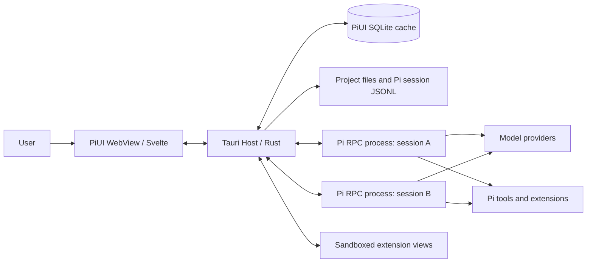
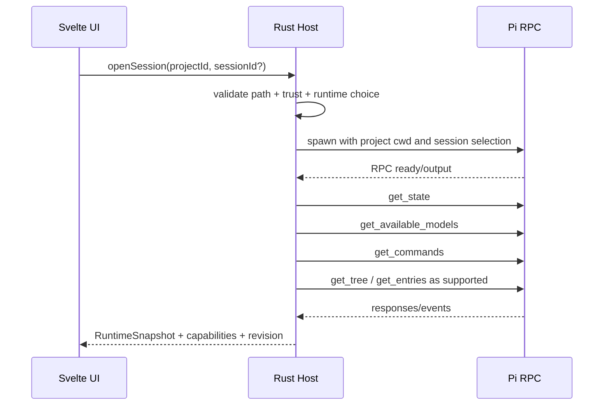

# PiUI — unified product and technical specification

**Status:** developer preview; production release gates remain open.

**Purpose:** a single self-contained document for product, UX, runtime, frontend, security, QA, and release agents. Machine-readable files in `contracts/` remain normative where they differ from textual examples.

> This file is generated from modular documents. Make changes in the source files, then rebuild the master specification with `python tools/build_master.py`.

## Contents

- [Overview and invariants](#overview)
- [Rules for coding agents](#agents)
- [01. Product specification](#product)
- [02. UX and information architecture](#ux)
- [03. Architecture](#architecture)
- [04. Pi integration](#pi-integration)
- [05. PiUI Extension SDK](#extension-sdk)
- [06. Data and sessions](#data)
- [07. Security](#security)
- [08. Testing and performance](#testing)
- [09. Roadmap and engineering tasks](#roadmap)
- [10. Architecture decisions](#adr)
- [11. Reuse analysis](#reuse)
- [12. Open risks and spikes](#risks)
- [Release readiness checklist](#release-checklist)
- [Handoff prompt for a new team](#handoff)
- [Contracts: guide](#contracts-readme)
- [Sources](#sources)
- [Manifest schema](#manifest-schema)
- [Runtime protocol](#runtime-protocol)
- [PiUI Host API](#host-api)
- [Reference dual package](#reference-package)

---

<a id="overview"></a>

## Overview and invariants

_Source file: `README.md`._

## PiUI

<p align="center">
  A fast, local desktop interface for browsing and continuing <a href="https://pi.dev/">Pi</a> sessions.
</p>

<p align="center">
  <a href="README.md"><strong>English</strong></a> ·
  <a href="README.ru.md">Русский</a>
</p>

<p align="center">
  <a href="https://github.com/CrazyAngelm/PiUI/actions/workflows/ci.yml"></a>
  <a href="https://github.com/CrazyAngelm/PiUI/releases"></a>
  <a href="LICENSE"></a>
</p>

> [!IMPORTANT]
> PiUI is an early developer preview. The current Windows build is unsigned, does not auto-update, and is not a managed Pi distribution or an OS sandbox. Read the [current limitations](#current-limitations) before using it with important sessions.

### Install

#### Windows 10/11 (recommended)

1. Install the official [Pi CLI](https://pi.dev/) and confirm that `pi --version` works in a new terminal.
2. Open the [PiUI v0.1.1 release](https://github.com/CrazyAngelm/PiUI/releases/tag/v0.1.1).
3. Download `PiUI_0.1.1_x64-setup.exe` and the matching `SHA256SUMS.txt`.
4. Verify the checksum, run the installer, and open **PiUI** from the Start menu.
5. Choose **New chat** for a personal session or **Add project** to register an existing folder.

Verify the installer after downloading both files:

```powershell
Get-FileHash .\PiUI_0.1.1_x64-setup.exe -Algorithm SHA256
Get-Content .\SHA256SUMS.txt
```

The hash printed by `Get-FileHash` must match the installer entry in `SHA256SUMS.txt`.

Because this developer-preview build is not code-signed, Windows may show an unknown-publisher warning. Verify the checksum before running it. If you do not want to run an unsigned binary, [build from source](#build-from-source).

The portable `PiUI_0.1.1_windows_x86_64.exe` asset can be used without an installer. It has the same preview limitations.

#### Linux and macOS

Prebuilt Linux and macOS packages are not published yet. Use the [source build](#build-from-source). Platform packaging, signing, and the complete release matrix remain open work.

#### Updating

PiUI does not silently update itself. Download a newer release from GitHub and install it over the previous version. Pi sessions remain owned by Pi; PiUI's local SQLite database is only a rebuildable cache and UI metadata.

### First run

1. Start PiUI.
2. Use **New chat** to start without adding a project, or use **Add project** and explicitly review the folder trust prompt.
3. Select an existing session or create a new one.
4. Start the local Pi runtime, choose a model, and send a prompt.

Do not write to the same session from PiUI and the Pi CLI at the same time. Concurrent-writer semantics are not yet supported.

### What PiUI does

- discovers existing Pi JSONL sessions without introducing another chat format;
- renders a safe, bounded transcript with Markdown, reasoning, and grouped tool activity;
- continues indexed sessions or creates Pi-owned personal chats;
- starts a locally installed Pi CLI in RPC mode only after an explicit user action;
- streams typed runtime events through a narrow Rust/Tauri host API;
- keeps a rebuildable SQLite catalog separate from Pi's session files;
- provides project trust controls and local appearance preferences;
- supports keyboard navigation, safe generic fallbacks, and reduced motion.

PiUI wraps Pi. It does not replace Pi's agent loop, providers, tools, compaction, authentication store, or session branching.

### Current limitations

- The local live-RPC path is a preview, not a managed-runtime provenance guarantee.
- The Windows artifacts are unsigned and the application has no automatic updater.
- Concurrent Pi CLI/PiUI writes to one session are unsupported.
- Authentication stays in Pi's standard flow; PiUI does not read or expose `auth.json`.
- Packaged browser/Tauri E2E, managed-runtime acquisition, updater, and the full Windows/Linux platform matrix remain release gates.
- Project-local extension JavaScript stays disabled until its trust and isolation design is complete.

See [Foundation status](docs/13_FOUNDATION_STATUS.md), [open risks](#risks), and the [release checklist](#release-checklist) for the exact status.

### Build from source

#### Prerequisites

- Git
- Node.js 22+
- pnpm 10.23+
- Rust 1.94.1 with `rustfmt` and `clippy`
- the [Tauri 2 platform prerequisites](https://v2.tauri.app/start/prerequisites/)
- a local Pi CLI for the live-runtime preview

#### Development build

```bash
git clone https://github.com/CrazyAngelm/PiUI.git
cd PiUI
pnpm install --frozen-lockfile
pnpm tauri dev
```

#### Release build

```bash
pnpm install --frozen-lockfile
pnpm repo:check
pnpm check
pnpm test
pnpm contract:test
cargo test --workspace
pnpm tauri build --no-bundle
```

The executable is written to `target/release/`. On Windows, maintainers can create the NSIS installer with:

```powershell
pnpm tauri build --bundles nsis --ci
```

### Quality checks

```bash
pnpm repo:check
python tools/validate_spec.py
pnpm check
pnpm test
pnpm contract:test
pnpm build
pnpm test:e2e
pnpm perf:smoke
cargo fmt --all -- --check
cargo clippy --workspace --all-targets -- -D warnings
cargo test --workspace
```

`pnpm test:e2e` is currently a static UI smoke check rather than a packaged desktop E2E suite.

### Repository layout

```text
apps/desktop/           Tauri 2 host and Svelte 5 interface
crates/piui-contracts/  Safe host/UI DTOs and fixtures
crates/piui-index/      Rebuildable SQLite index and LF-only session scanner
crates/piui-runtime/    Pi RPC adapter, lifecycle, and stream projection
crates/piui-platform/   Native identity and process-containment primitives
crates/piui-extensions/ Extension manifest validation
contracts/              Versioned TypeScript contracts
docs/                   Product, architecture, security, and release documentation
spikes/                 Isolated evidence and experiments, not runtime dependencies
```

### Documentation

- [Product scope](#product)
- [UX and information architecture](#ux)
- [Architecture](#architecture)
- [Pi integration](#pi-integration)
- [Extension SDK](#extension-sdk)
- [Data and sessions](#data)
- [Security model](#security)
- [Testing and performance](#testing)
- [Roadmap](#roadmap)
- [Architecture decisions](#adr)

### Contributing and security

Contributions are welcome. Read [CONTRIBUTING.md](CONTRIBUTING.md) and [AGENTS.md](#agents) before opening a pull request. Changes to IPC contracts require a version bump, compatibility coverage, and an update under `contracts/`.

Report vulnerabilities privately according to [SECURITY.md](SECURITY.md). Never publish credentials, prompts, session files, or local filesystem paths in an issue.

### License

PiUI is licensed under the [MIT License](LICENSE). Third-party dependencies and referenced external materials remain subject to their own licenses and terms.

---

<a id="agents"></a>

## Rules for coding agents

_Source file: `AGENTS.md`._

## AGENTS.md — mandatory PiUI development rules

This file is intended for coding agents and engineers working on the PiUI repository. The requirements below take precedence over the local convenience of any particular task.

### Goal

Create a minimal, fast, and extensible desktop shell on top of Pi. Do not create another agent harness.

### Non-negotiable rules

- Do not implement an agent loop, provider clients, compaction, tools, or session branching inside PiUI when Pi already provides them.
- Send every active-session command through the typed runtime adapter. Do not write to session JSONL directly.
- Treat Pi JSONL as the source of truth. The PiUI database is only cache/index/UI metadata and must be fully rebuildable.
- Do not read or modify `auth.json` in the frontend. Do not emit keys, OAuth tokens, the full environment, or prompt content in ordinary logs.
- Do not give the WebView general shell/filesystem access. The frontend invokes only allowlisted Tauri commands with validated arguments.
- Do not load project-local PiUI JavaScript before an explicit trust decision.
- Evaluate every new core feature against this principle first: “could this be an extension contribution?” If so, keep it out of core.
- Every custom renderer must have a generic fallback. The session must remain readable when its extension is disabled.
- Do not use Electron. Do not add SSR, a cloud backend, telemetry, or an account system without a separate ADR.
- Do not introduce a second chat format.
- Do not block first paint on network checks, model-catalog checks, or package updates.

### Architectural layers

1. `ui` — Svelte components and local presentation state.
2. `host-api` — generated TypeScript bindings to Rust commands/events.
3. `application` — use cases: projects, sessions, attachments, extensions.
4. `runtime` — Pi process supervisor and RPC adapter.
5. `index` — read-only session scanner and rebuildable SQLite index.
6. `platform` — process groups, filesystem watch, trash, notifications, updates.

The UI does not access the `runtime`, `index`, or OS layers directly.

### Coding conventions

- Rust: stable toolchain, edition 2024, `cargo fmt`, `clippy -D warnings`, errors through typed enums; `unwrap()` is prohibited outside tests and provable startup invariants.
- TypeScript: `strict: true`, no `any` in public contracts; discriminated unions for events; exhaustive `switch` with `never`.
- Svelte: local state in the component, cross-screen state in small domain stores; do not create a global store “for the whole application”.
- CSS: design tokens through custom properties, component-scoped CSS; no utility-class DSL in core UI.
- IPC: schema-first. Changing an event/command contract requires a version bump, compatibility test, and an update to `contracts/`.
- Logs: structured fields; no messages such as `console.log(object)` for RPC payloads in production.

### Definition of Done for every task

- A happy path and at least one failure path are implemented.
- Unit tests are added; a user flow has an integration/E2E test.
- No regression in safe mode or the generic fallback.
- Keyboard-only operation and screen-reader labels are verified for each new interactive element.
- The impact on startup/RSS/rendering is measured if a hot path is affected.
- The specification or ADR is updated if behavior changes.
- No platform-specific assumption is made on Windows or Linux without a separate branch and test.

### Prohibited shortcuts

- Parse stdout with a normal general-purpose line reader that splits on Unicode line separators. Pi RPC requires LF-only framing.
- Kill only the parent PID while leaving child tool processes.
- Hide project trust behind a generic “Continue” button.
- Automatically copy external files into a project without a user-visible decision.
- Render raw HTML from Markdown, tool output, or an extension payload.
- Load an extension bundle into the main DOM with full permissions by default.
- Treat `ctx.hasUI === true` as evidence of full TUI support in RPC.
- Rename or move session files for UI sorting.

### Priorities when requirements conflict

1. Preservation of user files and sessions.
2. An explicit trust model and no false promise of a sandbox.
3. Compatibility with the Pi CLI.
4. Correctness of the runtime protocol.
5. UI responsiveness.
6. Extensibility.
7. Visual polish.

### Quality commands the repository must provide

```bash
pnpm check          # TypeScript/Svelte formatting, lint, typecheck
pnpm test           # unit tests
pnpm test:e2e       # Playwright against packaged/dev Tauri harness
cargo test --workspace
cargo clippy --workspace --all-targets -- -D warnings
pnpm contract:test  # schema fixtures and backward compatibility
pnpm perf:smoke     # startup, idle RSS, long-session scroll, stream batching
```

### Before implementation begins

The first task is to complete the spikes in `docs/12_OPEN_RISKS.md`. Do not build UI on assumptions about RPC-process termination, initial session creation, OAuth, or tree navigation.

---

<a id="product"></a>

## 01. Product specification

_Source file: `docs/01_PRODUCT.md`._

## 01. Product Requirements Document

### 1. Purpose

PiUI is a local desktop shell on top of the Pi agent harness. It organizes existing working folders as projects, shows their associated Pi sessions, and provides a chat-first interface for continuing work. The product core is deliberately small: project and session management, chat, agent activity display, basic settings, and an extension point.

PiUI does not compete with Pi and does not create an alternative ecosystem. A single Pi package can contain standard Pi extensions/skills/prompts/themes and an additional UI description for PiUI.

### 2. Product formula

> **Existing Pi + existing user files + a minimal graphical shell + versioned UI contributions.**

#### 2.1 Why this aligns with the Pi philosophy

Pi explicitly positions itself as a set of primitives rather than a predefined workflow. Sessions have a tree-based history, and extensions can register tools, commands, events, and TUI components. Therefore, PiUI must add interface primitives rather than build specific methodologies such as plan mode, subagents, worktrees, or an approval framework into the core.

#### 2.2 Product principles

1. **Local first.** Sessions, settings, and projects remain local. Model providers may be remote, but PiUI has no cloud backend of its own.
2. **Same Pi everywhere.** The CLI and PiUI share configuration and sessions.
3. **Progressive disclosure.** Only actions for the current work are visible on the main screen; complex information is revealed on demand.
4. **Fast path first.** Add a folder → open a chat → send a message must take the fewest possible actions.
5. **Extension over accumulation.** A specialized capability is designed first as an extension contribution.
6. **Honest security.** Trust is not called a sandbox; the user sees that Pi and backend extensions run with their OS permissions.
7. **Graceful degradation.** Unknown tool calls, custom messages, and disabled UI extensions remain readable.
8. **Keyboard and mouse parity.** Primary flows are fully accessible by keyboard but do not require memorizing commands.

### 3. Target users

#### 3.1 Primary: developer already using Pi

Needs a visual manager for multiple projects and sessions without losing CLI configuration, tools, extensions, or history.

#### 3.2 Secondary: user who prefers a GUI

Wants to use Pi without constantly navigating the terminal TUI, see images and structured tool activity, and easily return to chats.

#### 3.3 Extension author

Wants to extend Pi behavior and add UI with one package: a renderer for their tool, a composer button, settings, a sidebar view, or even an alternative shell.

#### 3.4 Maintainer

Needs a narrow core, stable contracts, reproducible bugs, safe mode, and the ability to update Pi independently of the UI.

### 4. Jobs to be done

- When I have several working folders, I want to quickly see active Pi sessions and their status.
- When I continue a session from the CLI, I want to find it in PiUI without import or conversion.
- When the agent runs for a long time, I want to switch to another chat and see the result later.
- When an extension requests confirmation or input, I want to respond through a normal GUI dialog.
- When a tool returns a complex result, I want to see a convenient renderer without losing raw data.
- When a project is unfamiliar, I want to explicitly decide whether to load its extensions/settings.
- When a UI extension crashes, I want to continue the chat without losing the session.

### 5. Terms

- **Project** — a canonical path to an existing folder registered in PiUI.
- **Session** — the original Pi JSONL file and its tree of entries.
- **Active branch** — the path from the session tree root to the current `leafId`.
- **Runtime** — a running Pi RPC process serving one open/running session.
- **Dormant session** — a session without a running process; its metadata is available from the index.
- **Pi extension** — a TypeScript module loaded by Pi itself.
- **PiUI extension** — a UI contribution from the same or a separate package, loaded by PiUI.
- **Package** — a Pi package distributed through npm/git/local sources with `pi` and, optionally, `piui` keys.
- **Generic fallback** — a safe standard display for an unknown payload.
- **Managed Pi** — a pinned compatible Pi distribution shipped with PiUI or its runtime installer.
- **System Pi** — the user-installed `pi` command.

### 6. Product scope

#### 6.1 Core 1.0

- A registry of project folders.
- Pi session list by project.
- New chat; open and continue an existing chat.
- Simultaneous work in several sessions with a concurrency limit.
- Streaming text/thinking/tool activity.
- Stop, steer, follow-up, and queue.
- Provider/model and thinking-level selection from Pi data.
- Image input and inline image display.
- A file-attachment adapter without inventing a binary protocol.
- Session rename, export, fork/clone; branch tree — read-only, navigation after the RPC gap is closed.
- Settings and runtime diagnostics.
- Project trust.
- Tier 0 and Tier 1/Tier 2 PiUI extensions.
- Search over a local rebuildable index.
- Safe mode and crash recovery.
- Windows/Linux packaging; a macOS-ready codebase.

#### 6.2 Intentionally outside core 1.0

- Git status, diffs, commits, worktrees.
- An IDE or full file explorer.
- Embedded terminal.
- Subagent orchestration dashboard.
- Plan mode.
- Permissions framework for model actions.
- MCP registry.
- Remote SSH/containers UI.
- Cloud sync/accounts/teams.
- Extension marketplace and automatic package publishing.
- Voice mode.

These capabilities are allowed as extensions; the core provides slots and host capabilities.

### 7. Functional requirements

#### 7.1 Project registry

| ID | Requirement | Priority |
|---|---|---|
| PRJ-001 | The user adds an existing folder through the system folder picker. | Must |
| PRJ-002 | The path is canonicalized with platform symlink/case rules; duplicates are not created. | Must |
| PRJ-003 | A project can be renamed only in the UI registry; the folder name on disk is not changed. | Must |
| PRJ-004 | A project can be pinned/unpinned and hidden from the registry without deleting the folder or Pi sessions. | Must |
| PRJ-005 | An unavailable path is shown as offline/missing; the record is not removed automatically. | Must |
| PRJ-006 | Dragging a folder onto the sidebar offers to add it as a project. | Should |
| PRJ-007 | Project-level Pi resources are loaded only after trust resolution. | Must |
| PRJ-008 | The user can open the folder in the system file manager and copy its path. | Should |
| PRJ-009 | Nested projects are allowed as separate entries; PiUI warns about overlapping trust scope. | Should |

#### 7.2 Session discovery and lifecycle

| ID | Requirement | Priority |
|---|---|---|
| SES-001 | PiUI discovers existing Pi session JSONL files for the canonical project path. | Must |
| SES-002 | A session created/modified by the CLI appears after a filesystem event or manual refresh without import. | Must |
| SES-003 | The list contains display name, fallback title, last activity, runtime status, and branch indicator. | Must |
| SES-004 | A new chat is created through the Pi runtime, not by manually creating JSONL. | Must |
| SES-005 | Opening a dormant session starts the runtime on demand and loads the required session file. | Must |
| SES-006 | Switching the UI does not stop a running session; an idle inactive runtime can be unloaded by TTL. | Must |
| SES-007 | Session rename uses Pi RPC `set_session_name`. | Must |
| SES-008 | Delete uses the OS trash, after confirmation and only for the selected `.jsonl`; permanent delete is hidden under Advanced. | Must |
| SES-009 | Export uses Pi `export_html`; raw JSONL copy is available as a separate action. | Must |
| SES-010 | Fork/clone use Pi RPC and are reflected in the sidebar. | Must |
| SES-011 | Full tree view displays all branches and labels; navigation to an arbitrary node is enabled only with a supported runtime capability. | Should/blocked |
| SES-012 | A runtime crash does not corrupt the session file; the user sees restart/resume. | Must |
| SES-013 | Header-only/empty sessions do not clutter the list: they are grouped or removed only by a provable ownership rule. | Should |
| SES-014 | The session list does not require starting a runtime for every session. | Must |

#### 7.3 Chat timeline

| ID | Requirement | Priority |
|---|---|---|
| CHT-001 | User, assistant, thinking, tool call/result, bash, compaction, retry, error, and custom messages are displayed. | Must |
| CHT-002 | Streaming updates are batched; the UI does not rebuild all Markdown for every token delta. | Must |
| CHT-003 | Thinking is collapsed by default; the user can expand a specific block. | Must |
| CHT-004 | Tool call and result are visually combined into one card with running/success/error/cancelled state. | Must |
| CHT-005 | The generic tool card shows tool name, arguments, result summary, and raw JSON/text on expansion. | Must |
| CHT-006 | Tool output does not execute HTML/JS or open links automatically. | Must |
| CHT-007 | A custom renderer cannot hide access to the raw payload. | Must |
| CHT-008 | The user can copy message text, a code block, tool output, and a permalink/entry ID. | Should |
| CHT-009 | Long conversations virtualize off-screen content without jumping the scroll anchor. | Must |
| CHT-010 | While reading history, new streaming events do not forcibly scroll down; “New activity” is shown. | Must |
| CHT-011 | A provider/retry error is displayed inline with clear state, not as a disappearing toast. | Must |
| CHT-012 | Compaction is shown as an unobtrusive divider; details are available on expansion. | Should |
| CHT-013 | Images from message content render inline with fit/zoom/open/copy path where applicable. | Must |
| CHT-014 | An unknown message/entry type is shown in a generic inspector rather than lost. | Must |

#### 7.4 Composer and queues

| ID | Requirement | Priority |
|---|---|---|
| CMP-001 | The multiline composer supports regular text, slash commands, path suggestions, and attachments. | Must |
| CMP-002 | In idle state, `Enter` sends and `Shift+Enter` creates a line; hotkeys are configurable. | Must |
| CMP-003 | During a run, the user explicitly chooses `Steer` or `Follow up`; the selected behavior is visible before sending. | Must |
| CMP-004 | The Send button becomes Stop only for an active run; the queued composer remains available. | Must |
| CMP-005 | The pending queue is shown as chips/list; items can be removed before delivery if Pi capability permits it; otherwise the UI honestly reports the limitation. | Should |
| CMP-006 | `get_commands` powers autocomplete for extension commands, prompts, and skills. | Must |
| CMP-007 | Built-in TUI commands unavailable through RPC are not offered as executable. | Must |
| CMP-008 | `set_editor_text` from an extension replaces/inserts composer content with protection against accidental loss of unsaved text. | Must |
| CMP-009 | A draft is saved locally per session and cleared only after an accepted prompt. | Must |
| CMP-010 | The composer does not send an empty prompt without an attachment/command. | Must |

#### 7.5 Models and thinking

| ID | Requirement | Priority |
|---|---|---|
| MOD-001 | The model picker is populated through `get_available_models`, not from a hardcoded list. | Must |
| MOD-002 | Current model/thinking state is taken from `get_state`. | Must |
| MOD-003 | Switching uses `set_model`; errors are shown next to the picker. | Must |
| MOD-004 | Thinking options are taken through `get_available_thinking_levels`. | Must |
| MOD-005 | The picker shows provider, display name, input modalities, and context window when available. | Should |
| MOD-006 | Changing model during an incompatible state is blocked or queued according to Pi's actual response. | Must |
| MOD-007 | PiUI does not create its own price list; it shows only cost metadata received from Pi, marked as an estimate. | Must |
| MOD-008 | An unauthorized provider leads to the Settings/Auth flow, not manual JSON editing in the main UI. | Must |
| MOD-009 | The model picker is theme-owned, searchable by provider/id/name, and does not repeat equivalent technical and display labels. | Must |

#### 7.6 Attachments

| ID | Requirement | Priority |
|---|---|---|
| ATT-001 | PNG/JPEG/WebP/GIF, when supported by the selected model, are encoded and passed through RPC `images`. | Must |
| ATT-002 | An image has preview, MIME/size validation, and a remove action before sending. | Must |
| ATT-003 | A file inside the project root is passed to the agent as a canonical relative path in a structured text preamble; its content is not duplicated automatically. | Must |
| ATT-004 | An external file requires an explicit choice: reference the original path or copy into the managed project attachment area. | Must |
| ATT-005 | Copy uses a content hash, collision-safe filename, and provenance metadata; the source is not removed. | Must |
| ATT-006 | PDF/doc/archive files are not promised as “understood” by the model: PiUI passes the path and allows Pi/tool/extension to read or convert the file. | Must |
| ATT-007 | Directories are not attached as binary objects; a path reference is inserted. | Must |
| ATT-008 | Attachment size limits are configurable; an oversized image offers downscale/cancel without silently changing the original. | Should |
| ATT-009 | For a model without image input, Send is blocked for an image-only prompt and offers changing the model or using a path reference. | Must |
| ATT-010 | Attachment history in the UI is restored from message image blocks and PiUI metadata, but session validity does not depend on metadata. | Must |

#### 7.7 Extension compatibility

| ID | Requirement | Priority |
|---|---|---|
| EXT-001 | A standard Pi extension is loaded by Pi itself without rewriting it for PiUI. | Must |
| EXT-002 | `select/confirm/input/editor` are displayed as modal UI and return a matching response. | Must |
| EXT-003 | `notify`, `setStatus`, `setWidget`, `setTitle`, and `set_editor_text` have defined displays. | Must |
| EXT-004 | TUI-only APIs are not simulated with false promises; extension diagnostics indicate degradation. | Must |
| EXT-005 | A Pi package can declare `piui.manifest.json` with contributions and permissions. | Must for 1.0 |
| EXT-006 | An unknown/missing UI extension does not break a backend Pi extension. | Must |
| EXT-007 | Declarative contributions do not execute arbitrary JS. | Must |
| EXT-008 | Rich views run in a sandboxed frame/worker and communicate only through the capability host API. | Must |
| EXT-009 | Full shell replacement is allowed only for an explicitly trusted global package after restart. | Should for 1.0 |
| EXT-010 | Safe mode disables all PiUI packages and project-local Pi resources. | Must |
| EXT-011 | The extension API has semantic version/capability negotiation and compatibility errors. | Must |
| EXT-012 | An extension can contribute settings, commands, status items, composer actions, sidebar/panel views, tool/message/preview renderers, and an optional shell. | Must |
| EXT-013 | A project UI package never receives network/workspace-write/session-command capability without manifest permission and user grant. | Must |
| EXT-014 | Development mode supports reloading a UI package without restarting the entire app, except shell replacement. | Should |

#### 7.8 Settings and authentication

| ID | Requirement | Priority |
|---|---|---|
| SET-001 | Settings are available via a button at the top of the sidebar and the command palette. | Must |
| SET-002 | Sections: General, Runtime, Models & Auth, Extensions, Appearance, Keybindings, Security, Advanced/Diagnostics. | Must |
| SET-003 | PiUI settings are stored separately; Pi settings are changed only through a supported adapter with atomic write/validation. | Must |
| SET-004 | OAuth/subscription login, until a headless API exists, is launched through a controlled interactive Pi flow; the result remains in the standard Pi auth store. | Must |
| SET-005 | The API key field masks the value, never reads an existing secret back into the UI, and writes it through a trusted backend flow. | Must |
| SET-006 | The Runtime page shows selected mode, path, version, capabilities, stderr diagnostics, and “Test runtime”. | Must |
| SET-007 | The Extensions page distinguishes global/project, Pi backend/PiUI frontend, trusted/disabled/error states. | Must |
| SET-008 | Advanced settings are hidden by default and include reset-to-default. | Must |
| SET-009 | The default theme follows the OS; light/dark and density are available without restart. | Should |
| SET-010 | Keybindings detect conflicts before saving. | Should |

#### 7.9 Search and navigation

| ID | Requirement | Priority |
|---|---|---|
| NAV-001 | Search finds projects, session names, first user text, and message text from the local index. | Must for 1.0 |
| NAV-002 | A search result opens the session and scrolls to the entry if the entry is available on the active branch; otherwise it opens tree context. | Should |
| NAV-003 | The command palette opens project/session/settings/actions. | Must |
| NAV-004 | Back/forward navigation restores project/session/panel state but does not control runtime history. | Should |

#### 7.10 Notifications and lifecycle

| ID | Requirement | Priority |
|---|---|---|
| LIF-001 | Background session completion is marked with a badge; OS notification is optional. | Must |
| LIF-002 | Closing the window with running sessions offers leaving the app in the tray, stopping tasks, or cancelling close. | Should |
| LIF-003 | App exit correctly terminates owned idle runtimes; running processes do not remain orphaned without an explicit policy. | Must |
| LIF-004 | After a PiUI crash, project/session selection is restored and the session source of truth is reread. | Must |
| LIF-005 | An app update never starts during an unfinished write/migration without a safe restart flow. | Must |

### 8. Non-functional requirements

#### 8.1 Performance

Target budgets are given in the testing document. Key requirements:

- first paint does not wait for network/auth/model refresh;
- dormant sessions have no processes;
- idle app CPU is close to zero;
- timeline is virtualized;
- streaming is batched;
- extension sandbox is lazy-loaded;
- the search index updates incrementally and has backpressure.

#### 8.2 Reliability

- append-only Pi sessions are not modified by the indexer;
- a partial JSONL line is not considered corruption;
- process crash and extension crash are isolated from the WebView;
- IPC requests have IDs, timeout, and cancellation;
- migrations are transactional, rollbackable, and backed up;
- capability mismatch yields an actionable error.

#### 8.3 Accessibility

- WCAG 2.2 AA as the target level;
- full keyboard flow;
- semantic landmarks, focus management, reduced motion, screen-reader live regions for streaming without spam;
- minimum 44×44 CSS px for touch targets where applicable, while desktop density permits compact visual sizes with a sufficient hit area;
- status is not conveyed by color alone.

#### 8.4 Privacy

- telemetry is off and absent by default;
- a crash report is created locally and sent only after preview/consent;
- logs are redacted;
- extensions declare network domains;
- external links open in the system browser.

#### 8.5 Compatibility

- Windows and Linux are release blockers;
- macOS code path is in CI from an early stage;
- Pi protocol compatibility matrix, not “latest only” without verification;
- unknown RPC events are retained in diagnostics and do not crash the parser.

### 9. Success metrics

A public release is successful when:

1. 95% of CLI→PiUI→CLI test fixtures retain the same active branch and readable history.
2. Crash-free sessions are >99.5% in opt-in aggregate, or equivalent local test telemetry for pre-release.
3. Median time from add project → first accepted prompt is less than 60 seconds for a new user and less than 15 seconds for configured Pi.
4. Idle RSS and startup meet budgets on both Tier-1 platforms.
5. At least three fixture packages demonstrate: a generic Pi extension, a declarative UI package, and a sandboxed rich renderer.
6. Safe mode opens after an intentionally broken shell extension.
7. No test requires conversion of session JSONL into a proprietary chat file.

### 10. Release gates

- All Must requirements have a test or a documented manual acceptance procedure.
- No open P0/P1 data-loss/security bugs.
- Runtime compatibility tested with minimum, pinned, and latest-supported Pi versions.
- Windows/Linux installers are signed where infrastructure permits and verified for clean-machine install/update/uninstall.
- Third-party licenses/NOTICE are collected automatically.
- Threat model reviewed after implementing the extension host.
- Accessibility audit performed keyboard-only and with at least one screen reader on each Tier-1 OS family.

---

<a id="ux"></a>

## 02. UX and information architecture

_Source file: `docs/02_UX.md`._

## 02. UX and Information Architecture

### 1. Basic window composition

PiUI is a chat-first application with two persistent areas and one conditional area:

```text
┌──────────────────────┬──────────────────────────────────────────────┬───────────────┐
│  Settings            │                                              │ Optional panel│
│  + New chat          │               CHAT TIMELINE                  │ tree / preview│
│                      │                         [ Branch tree ]     │               │
│  PROJECTS            │  user                                        │               │
│  ▾ alpha             │  assistant · thinking · tools                │               │
│    ● auth refactor   │                                              │               │
│    ◌ tests           │                                              │               │
│  ▸ notes             ├──────────────────────────────────────────────┤               │
│                      │ [ model ▾ ][ thinking ▾ ]   Composer   [→]   │               │
│  running 1           │                                              │               │
└──────────────────────┴──────────────────────────────────────────────┴───────────────┘
```

- **Sidebar** is persistent, collapsible, and 272 px by default.
- **Workspace/chat** occupies all remaining space.
- **Context panel** is absent by default and opens only for the tree, artifact/preview, diagnostics, or an extension view.
- On a narrow window, the panel is an overlay and the sidebar can become a drawer.

### 2. Visual character

Codex App and Hermes Desktop provide inspiration only at the pattern level: projects with threads, a chat-first sidebar, background status, structured tools, and an optional preview. Visual imitation is not required.

#### 2.1 Design principles

- Flat hierarchy, with few decorative containers.
- One accent color; statuses use an icon plus text/shape, not color alone.
- Messages do not become an array of identical bubbles. A user message may have a compact surface; assistant content reads like a document.
- Tool cards are compact and collapsed by default after completion.
- Maximum text width is 760–880 px, but wide code/tool output may expand.
- Monospace font is used only for code/path/IDs/tool payload.
- Animations are short; streaming does not move content that has already been read.

#### 2.2 Design tokens

Core UI uses CSS custom properties:

```css
--piui-bg;
--piui-surface-1;
--piui-surface-2;
--piui-text;
--piui-text-muted;
--piui-border;
--piui-accent;
--piui-danger;
--piui-warning;
--piui-success;
--piui-focus;
--piui-radius-sm;
--piui-radius-md;
--piui-space-1 ... --piui-space-8;
--piui-font-ui;
--piui-font-mono;
```

Extensions receive only documented semantic tokens; internal class names are not an API.

### 3. Sidebar

#### 3.1 Top area

The order is fixed:

1. **Settings** — icon + label, always available.
2. **New chat** — primary compact action. When a project is selected, it opens an empty chat in that project by default; otherwise it opens a personal chat. The new-chat composer is anchored to the bottom of the workspace, including while an empty-session state is visible, so it does not jump when history appears. It includes a Project picker next to Model and Thinking so the user can choose any available project or `No project` before sending. A projectless chat receives a host-owned neutral CWD that is not exposed to the WebView and is not shown as a project. Chats shows a selected, presentation-only `New chat` row while the session still exists only in Pi memory. After the first assistant response writes JSONL, that row is replaced by and automatically selects the indexed session; the user never has to select the newly created chat manually.
3. **Add project** — secondary action for registering an existing user folder.
4. Optional command palette/search icon.

Settings is located at the upper left, as required by the original requirement. New chat is separate so that settings does not appear to be a project action.

Settings is not a modal overlay. It replaces the main workspace while retaining the global sidebar, and has its own vertical navigation:

- **Appearance** — system/light/dark theme, density, reduced motion, chat text size and a persistent centered conversation-width choice; the default is `Wide`, so the timeline uses the workspace instead of leaving large unused side gutters;
- **Extensions** — a bounded list of global Pi extensions and real enable/disable switches.

Extension inventory and toggles are performed through Pi `SettingsManager`/`DefaultPackageManager`, not by parsing `settings.json` in the frontend. The WebView receives only an opaque id, display name, source class, and enabled state; native paths remain in the host. Changes take effect on the next chat runtime launch. Project-local extensions are not managed here and remain behind the project trust boundary.

Developer-only fake runtime, legacy probe, and foundation disclaimers are not shown in product settings.

#### 3.2 Chats and projects

Above Projects is a separate system group, **Chats**, containing personal sessions. It is not a project row: it has no path, trust toggle, rename/pin/remove controls, or project-local resource claims. The selected chat is indicated in the sidebar. Projectless state is communicated once by the `No project` composer control and concise empty-state copy rather than a repeated technical persistence notice; this is not a promise of an OS sandbox.

A project row contains:

- disclosure chevron;
- user-defined name or folder basename;
- runtime aggregate badge: running/error/unread completion;
- context menu.

Clicking a project row toggles its expanded state without losing the currently open timeline. On the first/manual refresh, the list immediately shows `Scanning local Pi sessions…` until the bounded host scan completes; a late response must not arbitrarily expand a group that the user closed.

An expanded project initially shows the five newest catalog sessions. If more exist, keyboard-accessible `Show 5 more` and `Show all (N)` controls reveal the next page or the complete already-indexed list; they do not initiate a filesystem scan. Default sorting:

1. running/waiting-for-input;
2. pinned;
3. last activity descending.

Session row:

- status glyph;
- display name or deterministic fallback title;
- relative last activity when there is sufficient width;
- branch glyph only if the session has >1 leaf/path;
- unread completion dot.

Do not show model, token count, and cost in every row: this overloads the sidebar. Model/thinking are available next to the composer; details are in the corresponding panel.

#### 3.3 Session title fallback

Priority:

1. Pi `sessionName`;
2. the first user message, cleaned to one line and length-limited;
3. creation date/time;
4. short session ID.

Do not call an additional LLM just for a title. Rename is available inline/in the context menu.

#### 3.4 Project context menu

- New chat
- Open folder
- Copy path
- Pin/unpin
- Refresh sessions
- Trust settings
- Project settings
- Remove from PiUI

“Remove” does not delete the folder/sessions.

#### 3.5 Session context menu

- Open
- Rename
- Pin/unpin
- Clone current branch
- Export HTML
- Reveal session file
- Copy session ID/path
- Move to trash

The dangerous action is separated by a separator and requires confirmation with the session name.

### 4. Workspace management

There is no persistent top header/breadcrumb: the selected session name is already visible in the sidebar, so repetition does not take height from a long timeline.

- The timeline has no persistent toolbar: history and composer occupy the available height without duplicate controls.
- Model and thinking are next to the composer, where the user makes a decision before the next prompt.
- For a restricted project, the lower chat surface contains an explicit `Review trust`; the runtime does not start until a separate trust decision.
- Runtime status is shown at the active chat surface, not in a separate duplicate row.

### 5. Timeline

#### 5.1 Message anatomy

##### User

- compact tinted surface;
- timestamp hidden until hover/focus;
- attachment thumbnails/chips;
- actions: copy, fork from here, edit-and-fork when supported.

##### Assistant

- document layout without bubble;
- optional provider/model metadata hidden in details;
- text/thinking/tool blocks preserve original ordering;
- streaming caret only in active content block.

##### Thinking

- collapsed disclosure: `Reasoning · 12 s` or `Thinking`;
- no automatic expansion;
- while streaming, one-line live indicator can show last short fragment only if user enabled it;
- copied separately, never mixed silently into final answer.

##### Tool activity

Tool calls do not become separate chat bubbles. The host semantic projector links Pi `toolCall` and `toolResult` by internal call ID and gives the WebView one compact row without the original ID and raw JSON. Consecutive `tool`/`thinking` blocks are visually combined into one activity group:

```text
⌄ 8 actions completed · 3 tools · 5 reasoning steps
```

When expanded, the group shows dense rows approximately 28–30 px high:

```text
  ✓ Read file
  ✓ bash
  ✓ Reasoning
```

- the title is built from an allowlisted tool name/verb; command, arguments, and native path are not copied into the DTO;
- a completed activity group is collapsed by default;
- a running/failed/stopped group and its corresponding rows expand automatically;
- manually closing a group does not reset on a live update of that same group;
- the expanded body shows only bounded plain-text output in monospace, with long-line wrapping;
- tool output can be copied, and truncation is indicated by a neutral message, not an error;
- absolute project/home/session paths are replaced by host-side display tokens (`<workspace>`, `<external-path>/<leaf>`);
- an unknown or unmatched result remains readable through the generic fallback;
- a specialized renderer can replace the summary, but must have the same host-controlled fallback.

##### Retry/error

Inline status surface with retry attempt and user actions (`Retry now`, `Stop retry`) only when runtime supports them. A toast alone is prohibited.

##### Compaction

Thin divider:

```text
──────── Context compacted · details ────────
```

##### Custom message/entry

- `custom_message` with `display: true` receives a generic extension disclosure;
- `display: false` and state-only `custom` do not clutter the conversation timeline;
- a renderer matching `customType` can replace the disclosure, but when it is disabled a bounded plain-text fallback remains;
- raw extension JSON is not passed to the WebView.

#### 5.2 Streaming and scroll

- When a session is first opened, the viewport is positioned at the latest messages.
- On reaching the top 96 px, the previous bounded page is loaded automatically; after prepend, the visual scroll anchor is preserved.
- There is no separate `Load older entries` button.
- If viewport is within 80 px of bottom, follow streaming.
- Otherwise keep anchor and show floating `↓ New activity`.
- Persisted history and live runtime blocks are rendered by one `Timeline` inside one scroll container; there is no separate live-output scroller.
- Token deltas coalesce through `requestAnimationFrame`, so Markdown parsing/layout occurs no more than once per paint.
- After `turnCompleted`, PiUI rereads the bounded JSONL page and replaces only blocks from the completed turn; newly queued activity that arrived during synchronization is not erased.
- Markdown is built through AST and Svelte nodes without `{@html}`; raw HTML is displayed as escaped code.
- Very long tool output has an internal bounded preview with a copy action; expanding does not remove the host byte limit.
- Activity grouping and path redaction are presentation/projection concerns: Pi JSONL remains unchanged and live/persisted blocks share the same Timeline scroll.

#### 5.3 Empty states

##### No projects

Title: `Start a new chat`
Primary: `New chat` (personal chat without a user folder)
Secondary: `Add project` remains visible in the sidebar; runtime diagnostics remain available in Settings.

##### Project without sessions

Title: project name
Body: `No Pi sessions in this folder`
Primary: `New chat`.

##### New empty session

Centered minimal prompt suggestions, sourced only from static copy or extension contributions. No carousel/news/content feed.

##### Missing runtime

Clear diagnostic: expected command/path, tested paths, install/select action. Chat composer disabled, project browsing remains available.

### 6. Composer

#### 6.1 Layout

```text
╭──────────────────────────────────────────────────────────────╮
│ Message Pi…                                                  │
│                                                              │
│ model ▾   thinking ▾   ready                            [ ↑ ] │
╰──────────────────────────────────────────────────────────────╯
```

- Composer is one quiet rounded surface at the bottom of the workspace; history receives the remaining height and scrolls independently.
- Model and thinking selectors are in the composer's bottom row, not in a separate top panel.
- The latest display-safe Pi catalog is stored in a bounded frontend cache. Switching sessions does not start the agent runtime or reset controls to `Unavailable`.
- On the absolute first launch, the selector offers explicit `Load available models…`: only this user action starts the current session through the typed runtime adapter and fills the cache. Afterwards, model/thinking are available on later switches and restarts without a new process.
- A selection made in a dormant composer is applied to the runtime before the first prompt.
- The round `↑` control sends the prompt; it has an accessible name and tooltip.
- Attachment, slash autocomplete, and recording controls are not shown until the corresponding host feature is implemented: the UI does not create decorative non-working actions.

#### 6.2 Idle state

- `Enter`: Send.
- `Shift+Enter`: newline.
- `Ctrl/Cmd+Enter`: configurable alternative Send.
- `Escape`: close autocomplete/popup, then blur only on the second press.

#### 6.3 Running state

The round primary control replaces `↑` with square `Stop`, but the composer remains active. After stopping, the runtime returns to ready state and the control sends prompts again.

- **Steer** appears next to the control when there is a draft during streaming.
- `Enter` sends a follow-up through Pi's atomic streaming behavior; the placeholder explicitly states this rule.
- Queue status is shown next to the bottom model/thinking selectors.

An extension command is sent through normal `prompt`, because Pi executes it immediately even during streaming; the UI warns that it will not enter the queue.

#### 6.4 Draft rules

- draft is saved per session after debounce;
- an accepted prompt clears the draft;
- a rejected prompt preserves text/attachments;
- extension `set_editor_text` with a non-empty draft opens a non-blocking choice: Replace / Insert / Cancel, unless the request is marked as a safe replacement;
- session switching does not lose the draft.

### 7. Attachments UX

#### 7.1 Image

- thumbnail;
- filename/size;
- remove;
- click opens lightbox;
- unsupported MIME/size gives inline error.

#### 7.2 Project file

Chip displays relative path and icon. Hover shows canonical path. The prompt preamble is generated deterministically by the host, for example:

```text
Attached project files:
- @src/api.ts
- @docs/spec.pdf
```

The exact syntax is an internal adapter contract; the user sees a preview before send.

#### 7.3 External file

Dialog:

- **Reference original path** — Pi receives the absolute path; the file remains external.
- **Copy into project attachments** — a copy in the managed area, with visible destination.
- Cancel.

The default depends on the security setting; there is no silent copy.

#### 7.4 Model without image support

Inline banner over composer:

`Selected model accepts text only. Remove image, send it as a file path, or choose an image-capable model.`

### 8. Model picker

Groups by provider. Search by provider/model name/ID.

Row:

```text
Claude Sonnet …        Anthropic
200k context · text/image · reasoning
```

Current selection checkmark. Auth issue or unavailable model disabled with reason. No “best/fastest” badges without data.

Thinking picker shows only levels returned by Pi. Unsupported levels are not rendered.

### 9. Branch/tree UX

Tree is a secondary workflow and opens in the right panel.

#### 9.1 Default

Timeline shows the active path. In the current minimal shell, the separate tree button is hidden; reading the generic active path does not depend on a tree renderer.

#### 9.2 Tree panel

Each node: role/type icon, short text, timestamp, optional label. Current leaf highlighted. Actions:

- View context
- Fork from user message
- Clone active path
- Navigate here — only if runtime capability available
- Set label — only if capability available
- Copy entry ID

When the navigate command is unavailable, the action is disabled with an explanation rather than emulating it by rewriting the file.

#### 9.3 Edit previous prompt

Implemented as fork, not mutation. Dialog preloads original text, then creates fork and sends changed prompt.

### 10. Extension UI mapping

#### 10.1 Standard RPC dialogs

- `select` → searchable modal/listbox if >8 options; simple radio list otherwise.
- `confirm` → modal with explicit primary/secondary labels; destructive style only from host policy, not arbitrary extension HTML.
- `input` → single-line field.
- `editor` → multiline editor with submit/cancel.
- timeout → visible countdown only when >1 s; host lets Pi auto-resolve.

Multiple requests queue per runtime; only one modal active per window. Closing a session does not silently answer “yes”; it returns cancellation where the protocol permits.

#### 10.2 Fire-and-forget

- `notify` → toast + notification log.
- `setStatus` → session status line / extension status collection.
- `setWidget` above/below editor → compact text widget in composer zone, keyed and replaceable.
- `setTitle` → window title suffix, sanitized/truncated.
- `set_editor_text` → composer adapter.

#### 10.3 Rich contributions

Default slots:

- `sidebar.project.beforeSessions`
- `sidebar.project.afterSessions`
- `workspace.header.actions`
- `workspace.panel`
- `timeline.message.renderer`
- `timeline.tool.renderer`
- `composer.actions.leading`
- `composer.actions.trailing`
- `composer.widget.above`
- `composer.widget.below`
- `status.left`
- `status.right`
- `settings.section`
- `preview.provider`
- `shell`

Extension UI must not assume pixel coordinates. Placement is semantic slot + order/group.

### 11. Settings UX

Settings replaces workspace, sidebar stays.

#### 11.1 General

- launch behavior;
- close behavior/tray;
- language;
- update channel;
- notifications.

#### 11.1a Implemented Appearance

- system/light/dark;
- compact/comfortable density and reduced motion;
- small/medium/large chat text size;
- `Wide` / `Centered` / `Focused` conversation lane. `Wide` is the default and reduces unused side space; the latter two retain a progressively narrower centered reading column.

These values are PiUI-only local index metadata and never change Pi configuration, session JSONL, authentication, or project trust.

#### 11.2 Runtime

- Managed/System/Custom Pi mode;
- path/version/capabilities;
- Test runtime;
- supported range warning;
- concurrency and idle TTL;
- open logs.

#### 11.3 Models & Auth

- detected providers;
- login/logout/API key actions;
- configured models;
- default model is Pi setting, not PiUI-only shadow;
- interactive login fallback clearly marked.

#### 11.4 Extensions

Two aligned columns/statuses:

```text
Package             Pi backend          PiUI frontend
my-review           enabled             enabled · sandboxed
legacy-tool         enabled             no UI manifest
broken-ui           enabled             disabled · crash
```

Actions: enable/disable frontend, permissions, trust source, reload, reveal package, diagnostics. Backend enablement follows Pi package/settings semantics.

#### 11.5 Appearance

- system/light/dark;
- density compact/comfortable;
- font size;
- conversation width / side gutters;
- code font;
- reduce motion;
- extension theme contributions.

#### 11.6 Security

- trusted projects;
- UI extension grants;
- external file default;
- link opening;
- sandbox runtime profiles when later available;
- clear trust decision.

#### 11.7 Advanced/Diagnostics

- paths;
- session index rebuild;
- protocol trace toggle with redaction warning;
- safe mode restart;
- export diagnostic bundle preview;
- reset UI state.

### 12. Project trust flow

Before first RPC start in a project with protected resources:

```text
This folder contains Pi settings or executable extensions.

Trusting it allows Pi to load project-local settings, packages and TypeScript
extensions. Pi then runs with your user account permissions. This is not a sandbox.

[Open without project resources] [Cancel] [Trust this folder]
```

Details list exact detected resources and canonical path. Choices:

- Trust folder persistently via Pi-compatible trust store/official API.
- Trust once (`--approve`) for this runtime only.
- Open without project resources (`--no-approve`).
- Cancel.

`AGENTS.md`/context-file behavior should be explained in details because Pi may load context independently of protected extension trust according to its settings. PiUI must not state that “nothing from the repo is read”.

### 13. Runtime states and visible behavior

| State | Sidebar | Header | Composer |
|---|---|---|---|
| Dormant | neutral | “Not running” only in details | enabled after activation |
| Starting | spinner | Starting Pi… | disabled |
| Idle | hollow dot | Idle | Send |
| Running | animated glyph | Running / tool name | Stop + queue mode |
| WaitingForUI | alert dot | Needs input | modal owns focus |
| Retrying | warning glyph | Retrying attempt n | Stop retry/queue |
| Compacting | progress | Compacting context | queue allowed per capability |
| Crashed | error glyph | Runtime crashed | Restart |
| MissingPath | muted error | Project unavailable | disabled |
| TrustRequired | shield | Trust required | disabled |

### 14. Keyboard map defaults

| Action | Windows/Linux | macOS |
|---|---|---|
| Command palette | Ctrl+K | Cmd+K |
| New chat | Ctrl+N | Cmd+N |
| Search sessions | Ctrl+Shift+F | Cmd+Shift+F |
| Settings | Ctrl+, | Cmd+, |
| Toggle sidebar | Ctrl+B | Cmd+B |
| Toggle panel | Ctrl+Alt+B | Cmd+Option+B |
| Send | Enter | Enter |
| Newline | Shift+Enter | Shift+Enter |
| Stop | Esc twice / Ctrl+. | Esc twice / Cmd+. |
| Next session | Ctrl+Tab | Ctrl+Tab |
| Previous session | Ctrl+Shift+Tab | Ctrl+Shift+Tab |
| Focus composer | Ctrl+L (configurable) | Cmd+L |
| Rename session | F2 | Return/F2 |

Conflicts with OS/WebView shortcuts are resolved by a platform-specific keymap. All shortcuts are rebindable except the emergency safe-mode startup modifier.

### 15. Accessibility details

- Sidebar is a tree with correct `aria-expanded` and roving tabindex.
- Timeline uses feed/log semantics carefully; streaming delta is not announced token-by-token. Announce message completion and critical tool/permission requests.
- Modal focus trapped and restored to invoking element.
- Tool state conveyed by icon + label.
- Thinking disclosure and raw tabs keyboard operable.
- Color contrast AA in both themes.
- Reduced motion disables status pulse and smooth scroll.
- Extension views must declare accessible name; host rejects unnamed contribution in development validation.

### 16. Responsive behavior

- ≥1200 px: sidebar + chat + optional panel.
- 800–1199 px: panel overlays or narrows chat; sidebar collapsible.
- 600–799 px: sidebar drawer; header actions in overflow.
- <600 px: unsupported as primary target, but UI remains usable for narrow desktop windows; no mobile promise.

### 17. Copywriting rules

- Use Pi terminology: session, project, model, thinking, extension.
- Do not call tool execution “sandboxed” unless an actual OS/container adapter is active.
- Error copy contains action and diagnostic detail toggle.
- Avoid anthropomorphic status text.
- Confirmations name the affected session/folder.
- Never show raw access tokens or full environment values.

---

<a id="architecture"></a>

## 03. Architecture

_Source file: `docs/03_ARCHITECTURE.md`._

## 03. PiUI Architecture

### 1. Architectural goal

PiUI must be a thin desktop shell that:

- launches the official Pi runtime without rewriting the agent loop;
- withstands the crash, hang, or incompatibility of an individual session;
- does not keep a runtime process for every historical chat;
- provides extensions with stable semantic integration points;
- remains responsive with long sessions and streaming output;
- is designed consistently for Windows, Linux, and macOS;
- can update the Pi runtime independently of the UI without silently breaking compatibility.

The architecture must be **local by default**. Pi itself may use external model providers, but PiUI does not require its own server, account, or cloud database.

### 2. Adopted stack decision

| Layer | Choice | Purpose |
|---|---|---|
| Desktop host | Tauri 2 / Rust | windows, IPC, processes, file operations, system integration, updater |
| UI | Svelte 5 + TypeScript + Vite | chat timeline, sidebar, settings, extension surfaces |
| UI primitives | custom tokens + selected Bits UI primitives | accessible dialog/menu/select/tooltip without a prebuilt visual theme |
| Runtime transport | Pi RPC over JSONL through stdin/stdout | session commands and event streaming |
| Process runtime | `tokio::process::Command` | precise control of framing, stderr, process group/job object, and shutdown |
| Metadata/index | SQLite through `rusqlite`, FTS5 optional | projects, UI metadata, and rebuildable search |
| File watching | `notify` | incremental discovery of session files and package changes |
| Trash | system recycle bin through a Rust crate/platform adapter | reversible deletion of session files |
| Tests | Rust tests, Vitest, Playwright + packaged smoke tests | contracts, UI, runtime, and platforms |

#### Why not Electron

Electron simplifies Node integration, but includes a separate Chromium/Node runtime for each application window. This is a poor baseline choice for the minimum idle-footprint requirement. PiUI does not need the Node API in the frontend: the trusted host must own processes and files regardless.

#### Why not Flutter

Flutter can provide a fast native-like UI; however, the Pi ecosystem and its extensions are TypeScript-oriented. Svelte/TypeScript enables reuse of manifest and host API types, while sandboxed extension views fit naturally in a WebView/iframe.

#### Why not Qt

Qt provides a mature desktop stack, but complicates the TypeScript-oriented extension SDK and delivery of web-based isolated views. It remains a fallback alternative if measurements show an unacceptable divergence in system WebViews across platforms.

#### Why Svelte without SvelteKit

PiUI is a single-window local application without SSR, server routes, or web deployment. A regular Vite build reduces the configuration surface. Screen routing is implemented as a local state machine rather than a URL-first framework.

### 3. System context



The primary trust boundary runs between WebView/extension views and the Rust host. Pi processes run as local child processes with user privileges; this is not a sandbox.

### 4. Process topology

#### 4.1 One process per genuinely active session

Runtime-slot states:

```text
Dormant -> Starting -> Ready -> Running -> Ready
                    \-> Failed -> Recovering -> Ready|Dormant
Ready|Running -> Stopping -> Dormant
```

- **Dormant:** history is available from the indexer; no Pi process exists.
- **Starting:** the runtime is selected, its version checked, RPC launched, and the handshake completed.
- **Ready:** the process keeps the session open and accepts commands.
- **Running:** an assistant turn/tool execution is in progress.
- **Recovering:** PiUI restores the view from JSONL and offers to reopen the runtime.
- **Stopping:** graceful termination, followed by a platform-specific termination fallback.

A historical list of hundreds of sessions must not mean hundreds of processes.

#### 4.2 Pool policy

Default parameters:

- `maxLiveRuntimes = 3`;
- the active tab is not evicted;
- a session with an unfinished turn is not evicted;
- an idle ready process is closed after 10 minutes;
- when the limit is exceeded, the longest-unused idle runtime is closed;
- values are available in Advanced settings, but the core UX does not promote parallelism as a separate feature.

For the MVP, `maxLiveRuntimes = 1` is acceptable if the multi-session supervisor is not ready. Contracts must nevertheless support multiple runtime IDs from the outset.

#### 4.3 Child-process management

The host must:

- launch Pi with an explicit project `cwd`;
- set a controlled environment and not log secrets;
- read stdout byte-by-byte/in chunks and split only on `0x0A`;
- limit the maximum size of a single protocol frame;
- read stderr separately and place it in a redactable diagnostic ring buffer;
- create a separate process group on Unix;
- use a Job Object or equivalent on Windows to terminate the process tree;
- distinguish normal EOF from a crash and protocol corruption;
- not treat a stderr line as an RPC event;
- serialize commands for which Pi requires ordering, and support correlation IDs at the PiUI adapter level.

The Tauri sidecar is used to package a managed runtime, but the supervisor itself is built on `tokio::process`, not a frontend shell plugin.

### 5. Runtime modes

PiUI supports three modes, all through a single `RuntimeAdapter`:

#### Managed Pi

PiUI ships a verified version of Pi as a sidecar or installs it in an app-managed directory. The preferred candidate is the official standalone Pi executable with its runtime assets from a versioned upstream release; PiUI does not run `npm install` at application startup and does not require Node/Bun on the user's system. If a ready upstream artifact is unavailable for the required platform, a reproducible build from versioned release source using the same upstream build path is permitted, but only after license/provenance review.

- recommended mode for public releases;
- version, target triple, upstream source URL/hash, and PiUI compatibility range are pinned in a signed release manifest;
- the upstream checksum is verified before PiUI artifact re-signing/packaging;
- runtime updates are separate from UI updates and can be rolled back;
- the user's package manager is not affected;
- the host shows the actual version, origin, hash, and path;
- the absence of a managed artifact does not block system/custom modes.

#### System Pi

Uses `pi` from `PATH`.

- convenient for developers and internal alpha;
- PiUI performs a version/capability probe before launch;
- on incompatibility, it does not attempt to continue silently;
- the user sees which executable was found.

#### Custom executable

The user selects a binary/launcher manually.

- required for forks, development builds, and Nix-like environments;
- the path is stored as a setting, but a project cannot replace it itself;
- this runtime is marked as custom and is not updated by PiUI.

#### Adapter requirement

```rust
trait RuntimeAdapter {
    async fn probe(&self) -> Result<RuntimeCapabilities, RuntimeError>;
    async fn open(&self, request: OpenRuntimeRequest) -> Result<RuntimeHandle, RuntimeError>;
    async fn command(&self, handle: RuntimeId, command: RuntimeCommand) -> Result<(), RuntimeError>;
    async fn stop(&self, handle: RuntimeId, mode: StopMode) -> Result<(), RuntimeError>;
    fn subscribe(&self, handle: RuntimeId) -> RuntimeEventStream;
}
```

The UI does not know whether the executable is managed or system Pi.

### 6. Capability negotiation

The Pi version alone is insufficient. At startup, the host forms a capability set based on:

1. the executable version;
2. successful responses to safe RPC probes;
3. available commands;
4. an opt-in bridge extension, if installed;
5. the PiUI runtime protocol version.

Example capabilities:

```json
{
  "rpc": true,
  "images": true,
  "models.list": true,
  "session.switch": true,
  "session.tree.read": true,
  "session.tree.navigate": false,
  "session.shutdown": false,
  "auth.headless": false,
  "ui.standardDialogs": true,
  "ui.customTui": false,
  "piuiBridge": null
}
```

The frontend shows or disables an action based on a capability, not a version name. Any missing capability must result in a clear fallback, not a UI exception.

### 7. Rust host components

```text
src-tauri/src/
  app/                 use cases and orchestration
  runtime/
    supervisor.rs
    rpc_codec.rs
    pi_rpc_adapter.rs
    capability_probe.rs
    process_tree.rs
  sessions/
    scanner.rs
    jsonl_reader.rs
    indexer.rs
    repository.rs
  projects/
    registry.rs
    trust.rs
  attachments/
    resolver.rs
    managed_store.rs
  extensions/
    discovery.rs
    manifest.rs
    grants.rs
    view_broker.rs
  ipc/
    commands.rs
    events.rs
    dto.rs
  platform/
    windows.rs
    linux.rs
    macos.rs
  security/
    redaction.rs
    path_policy.rs
  db/
    migrations.rs
    repositories.rs
  diagnostics/
    logging.rs
    bundle.rs
```

#### Core services

- `ProjectRegistry`: canonical path, display name, ordering, trust state.
- `SessionScanner`: read-only Pi JSONL discovery, incremental metadata extraction.
- `SessionIndex`: rebuildable SQLite/FTS index.
- `RuntimeSupervisor`: Pi process lifecycle, command queues, crash recovery.
- `AttachmentResolver`: image encoding, file-reference policy, managed copies.
- `ExtensionRegistry`: discovery, validation, enablement, and permission grants.
- `ViewBroker`: isolated message channel between the extension iframe/worker and host.
- `DiagnosticsService`: redacted logs and support bundle.

### 8. Frontend components

```text
src/
  app/                 shell and screen state machine
  features/
    projects/
    sessions/
    chat/
    composer/
    settings/
    extensions/
    trust/
  components/          PiUI-owned presentation components
  primitives/          thin wrappers over accessible headless primitives
  stores/              small domain stores
  host-api/            generated bindings/events
  renderers/
    markdown/
    tool/
    message/
    extension/
  styles/
    tokens.css
    reset.css
  workers/
    search-client.ts
```

#### State ownership

- Rust owns process state, project trust, filesystem state, and extension grants.
- The frontend owns selection, scroll anchor, expanded/collapsed blocks, and transient menus.
- Text drafts are stored in SQLite with debounce, but the current line remains local for immediate input.
- The frontend timeline cache is bounded; older blocks may be unloaded and requested in pages.

A single global mutable store containing the entire application is not allowed.

### 9. Typed IPC between Svelte and Rust

#### Commands

The frontend calls only commands of the form:

```ts
openProject(path)
listProjects()
listSessions(projectId, cursor)
openSession(projectId, sessionId)
createSession(projectId, options)
sendTurn(runtimeId, input, attachments, mode)
abortTurn(runtimeId)
setModel(runtimeId, modelRef)
setThinking(runtimeId, level)
renameSession(sessionId, name)
exportSession(sessionId, target)
trashSession(sessionId)
respondToUiRequest(requestId, value)
setExtensionGrant(extensionId, permission, decision)
```

Each command:

- validates IDs and paths on the Rust side;
- returns a typed result with a stable error code;
- does not accept a shell string;
- does not return secrets;
- has maximum payload limits.

#### Events

Rust publishes discriminated unions:

```ts
type HostEvent =
  | { type: 'runtime.state'; runtimeId: string; state: RuntimeState }
  | { type: 'session.delta'; runtimeId: string; delta: SessionDelta }
  | { type: 'session.reindexed'; sessionId: string; revision: number }
  | { type: 'ui.request'; runtimeId: string; request: UiRequest }
  | { type: 'notification'; level: NoticeLevel; message: string }
  | { type: 'extension.changed'; extensionId: string }
  | { type: 'diagnostic'; code: string; safeSummary: string };
```

High-frequency token events are batched by the host or frontend scheduler into 16–33 ms frames. One token must not mean one full-tree render.

### 10. Timeline representation

Pipeline:

```text
Pi RPC event / JSONL entry
  -> normalized SessionDelta
  -> immutable block model
  -> renderer registry
  -> virtualized timeline
```

A normalized block does not lose the raw payload or source entry ID:

```ts
interface TimelineBlock {
  id: string;
  parentId?: string;
  kind: 'user' | 'assistant' | 'thinking' | 'tool' | 'custom' | 'error' | 'compaction';
  status: 'pending' | 'streaming' | 'complete' | 'failed';
  source: { sessionId: string; entryId?: string; extensionId?: string };
  content: unknown;
  raw?: unknown;
}
```

The renderer registry always ends with a generic JSON/text fallback. No renderer can make an entry invisible without an explicit user filter.

### 11. Extension architecture

The extension host consists of three independent mechanisms:

1. **Backend compatibility:** Pi itself loads standard Pi extensions.
2. **Declarative contributions:** PiUI reads the manifest as data and renders it with its own components.
3. **Sandboxed rich views:** an isolated iframe/worker communicating through a versioned broker.

Trusted shell replacement is a separate mode, not part of the normal extension loading path.

A project-local UI package is not loaded before trust. Backend Pi resources also must not start before trust in a PiUI-controlled workflow.

### 12. Storage and index

- Pi session JSONL is authoritative.
- PiUI SQLite is cache and metadata.
- The scanner does not keep all messages from all sessions in memory.
- At startup, project/session headers and recent metadata are read; full indexing runs after the usable shell with I/O throttling.
- FTS may be disabled.
- The index has a schema version and generation ID.
- On incompatibility, the database is renamed to a backup and rebuilt rather than migrating session content.

### 13. Handling long sessions

Required techniques:

- block virtualization after 200 timeline blocks;
- height measurement and scroll-anchor preservation;
- windowed loading backward/forward;
- memoized Markdown AST for completed messages;
- code highlighting in a worker or lazily after viewport entry;
- collapsed tool output with an initial-render limit;
- streaming plaintext/minimal Markdown, final parse after block completion;
- blob/object URLs for local images instead of repeated base64 in the DOM;
- release preview resources on close.

### 14. Startup pipeline

1. Show the window and shell from local settings.
2. Open SQLite and the project registry.
3. Check the crash marker/safe mode.
4. Quickly scan session headers for the selected project.
5. Show the list and most recently selected session from read-only data.
6. Start the runtime only when an interactive session is created or continued.
7. In the background after the first usable state: FTS indexing, update check, package validation.

Network, providers, and the model list do not block steps 1–5.

### 15. Error containment

| Error | Behavior |
|---|---|
| One Pi process crashes | other sessions and the shell continue working; the chat enters a recoverable state |
| Invalid JSON frame | retain redacted diagnostics; stop only this runtime |
| Extension renderer crashes | replace with generic fallback; disable the renderer after a crash loop |
| SQLite is corrupted | close/rename the cache; rebuild from JSONL |
| Session JSONL has an incomplete final line | do not consider the file lost; wait for a change or open through the last complete LF |
| Project path disappears | retain the registry; show missing state and Locate/Remove |
| Managed Pi is incompatible | roll back the runtime or explicitly repair; do not change JSONL |
| WebView reload | the host continues controlling the process; the UI requests snapshot and revision |

### 16. Packaging and updates

Release artifacts:

- Windows: signed installer, WebView2 bootstrap policy, x64 mandatory; ARM64 after the matrix.
- Linux: AppImage and/or deb/rpm after the distro matrix; system WebKit dependency explicitly documented.
- macOS: signed/notarized universal or separate arm64/x64 builds.

UI updates and managed Pi updates have separate versions and a compatibility matrix. Auto-update is not applied during a running turn; downloading may proceed, while installation follows an explicit restart.

### 17. Observability without telemetry

By default, data remains local:

- structured rotating logs with redaction;
- in-memory runtime lifecycle metrics;
- user-facing “Export diagnostics” command;
- the diagnostic bundle lists versions, capabilities, platform, crash codes, and recent safe stderr lines;
- prompts, tool arguments, paths, and environment are excluded by default or require a separate opt-in preview.

There is no remote telemetry in 1.0.

### 18. Repository

Recommended monorepo:

```text
piui/
  apps/desktop/              Svelte frontend + Tauri shell
  crates/piui-runtime/       process supervisor/RPC codec
  crates/piui-index/         JSONL scanner/SQLite index
  crates/piui-extensions/    manifest/grants/view broker
  packages/contracts/        TS types + generated schemas
  packages/extension-sdk/    author-facing helpers
  packages/ui-nodes/         declarative node validation
  examples/extensions/
  tests/fixtures/
  docs/
```

`packages/contracts` is published independently only after stabilization. Within the repository, Rust and TS types are generated from one schema source or verified with golden fixtures to prevent drift.

### 19. Architectural acceptance criteria

The architecture is considered validated when:

- the same session file opens and continues in PiUI and the CLI;
- closing an idle runtime does not change history;
- a runtime crash does not crash the desktop shell with it;
- deleting SQLite does not delete or corrupt any Pi session;
- the WebView cannot execute an arbitrary command or read a path without host policy;
- an extension without a PiUI manifest works backend-only;
- disabling an extension leaves all entries readable by the generic renderer;
- the long-session fixture remains scrollable within the performance budget;
- Windows/Linux process-tree tests leave no orphaned tool processes.

---

<a id="pi-integration"></a>

## 04. Pi integration

_Source file: `docs/04_PI_INTEGRATION.md`._

## 04. Pi Integration

### 1. Integration principle

PiUI uses Pi as the sole source of agent behavior. It does not call model providers directly or interpret tools in place of Pi. The primary transport is the official RPC mode:

```text
PiUI Rust host <-> stdin/stdout JSONL <-> pi --mode rpc
```

Each launch is bound to a specific project `cwd` and, when supported by the selected launch method, to an existing or new Pi session.

### 2. What belongs to Pi and what belongs to PiUI

| Area | Owner |
|---|---|
| provider authentication and model requests | Pi |
| agent loop, tools, compaction, steering queue | Pi |
| Pi extensions and their backend lifecycle | Pi |
| session entries and branching | Pi session format/API |
| project/session navigation GUI | PiUI |
| process lifecycle, recovery, diagnostics | PiUI host |
| visual timeline and composer | PiUI |
| project registry and UI drafts | PiUI SQLite |
| generic file-reference UX | PiUI adapter, then Pi prompt/tools |
| PiUI-specific extension surfaces | PiUI Extension SDK |

No PiUI feature must become a second canonical representation of agent state.

#### Global extension configuration

PiUI does not parse or write Pi `settings.json`. Extension settings invoke a small typed host adapter which, in offline mode, imports upstream `SettingsManager` and `DefaultPackageManager`, skips installation of missing packages, and uses the same setters as `pi config`. Only global user resources are projected into the UI; filesystem paths and package source strings do not cross IPC. A toggle applies to future runtime starts. Project-local resources remain outside this surface and require a separate trusted-project flow.

### 3. Protocol framing

#### 3.1 Codec requirements

- one JSON command per line, terminated by LF (`0x0A`);
- one JSON response/event per LF-framed stdout line;
- CR before LF is allowed only if confirmed by a fixture; the codec does not use universal Unicode `lines()` behavior;
- empty lines are ignored with a diagnostic counter;
- a frame larger than the configurable limit, for example 32 MiB, stops the runtime as a protocol violation;
- invalid UTF-8 and JSON are not substituted with replacement characters without recording the reason;
- stderr is not mixed with stdout;
- an incomplete frame at EOF is recorded separately;
- the parser is fuzz-tested on chunk boundaries.

#### 3.2 Correlation

PiUI wraps RPC calls with an internal `commandId`, even if the specific Pi request/response already has its own ID. This is needed for:

- timeout/cancellation;
- linking a UI action to a response;
- diagnostics without logging payloads;
- repeating a snapshot after WebView reload.

An unknown event type is retained as `runtime.unknown` and does not crash the process. This ensures forward compatibility.

### 4. Startup handshake



The probe order must be tolerant: the absence of one command does not cancel basic chat if `prompt` and state are available.

### 5. Mapping core capabilities

Exact payloads are taken from the current Pi RPC schema and pinned in contract fixtures. The table defines product semantics; it does not replace upstream documentation.

| Pi capability/command | PiUI action | Fallback |
|---|---|---|
| `prompt` | send a new user turn | block the composer with a diagnostic error |
| `steer` | intervene in the current turn | queue a follow-up if steer is unavailable |
| `follow_up` | add the next turn to the queue | local draft until the current turn completes |
| `abort` | Stop | terminate the runtime only after timeout and warning |
| `get_state` | runtime/session snapshot | read-only JSONL snapshot + reconnect |
| `get_available_models` | model picker | current model + link in settings/diagnostics |
| model switch command | change model | unavailable action with a reason |
| thinking level commands | thinking picker | hide the picker; do not emulate prompt text |
| queue mode commands | Steer/Follow-up semantics | fixed safe mode |
| `new_session` | new chat | new process/bootstrap path |
| `switch_session` | open an existing session in the process | new process with session selector |
| `fork` / `clone` | create a branch/copy | hide advanced action |
| `get_entries` | page the timeline | read-only scanner for history, RPC for live state |
| `get_tree` | show the tree | read-only tree without a navigation action |
| set session name | Rename | UI alias in cache only as a temporary fallback, explicitly marked |
| export | export transcript | host-side generic export only if output is identical/explicitly different |
| `get_commands` | slash autocomplete | PiUI core commands + discovered extension commands |
| Extension UI Protocol | dialogs/status/widgets | generic native surfaces |

### 6. Message/event normalization

PiUI does not render upstream JSON directly. The adapter transforms it into stable internal events; the raw source remains only in Pi JSONL/host and does not cross WebView IPC:

```ts
type SessionDelta =
  | { kind: 'turn.started'; turnId: string }
  | { kind: 'message.started'; block: TimelineBlock }
  | { kind: 'message.text.delta'; blockId: string; text: string }
  | { kind: 'message.thinking.delta'; blockId: string; text: string }
  | { kind: 'tool.started'; blockId: string; tool: ToolInvocation }
  | { kind: 'tool.updated'; blockId: string; safeSummary?: string }
  | { kind: 'tool.completed'; blockId: string; toolName: string; isError: boolean; safeSummary?: string }
  | { kind: 'entry.appended'; blockId: string; entryKind: string; text?: string }
  | { kind: 'turn.completed'; turnId: string; stopReason?: string }
  | { kind: 'runtime.error'; code: string; recoverable: boolean };
```

Rules:

- event order is preserved within one runtime;
- the host assigns a monotonically increasing `revision`;
- the UI applies a delta only to the expected revision, or requests a snapshot;
- a duplicate event after reconnect must be idempotent by entry/block ID;
- persisted projection v2 knows Pi v3 `user`, `assistant`, `thinking`, `toolCall`, `toolResult`, `bashExecution`, `custom_message`, and `compaction`;
- tool call/result are correlated host-side; a tool-only assistant entry does not create an empty Pi message;
- tool result is never executed as HTML;
- Markdown is converted into allowlisted AST nodes and never uses raw `{@html}`;
- unknown entries are shown as a compact generic compatibility disclosure without the raw payload;
- live blocks and persisted blocks use one renderer; after a turn, a host rescan replaces completed ephemeral blocks.

### 7. Streaming and queue

#### Composer modes

The user sees explicit semantics:

- **Send** in Ready — regular `prompt`;
- **Steer** during Running — the message directs the current turn;
- **Queue next** — a follow-up after the current turn;
- **Stop** — `abort`.

Enter must not silently change semantics based on timing. Recommended default:

- Enter sends `prompt` in Ready;
- during Running, Enter queues a follow-up;
- a separate button/shortcut performs Steer;
- a tooltip and queue badge show the selected mode.

The queue-mode setting is synchronized through Pi RPC if the capability is available.

#### Abort escalation

1. send `abort`;
2. wait for confirmation/state within the timeout;
3. show “Agent does not respond”;
4. allow `Force stop runtime`;
5. terminate the process tree;
6. reread JSONL through the last complete entry and offer reopen.

Force stop must not automatically repeat the prompt.

### 8. Models and thinking level

Model picker:

- is loaded from `get_available_models`, not a hardcoded registry;
- shows the provider/model ID and available traits actually returned by Pi;
- supports search and recent models;
- marks the current model even if it disappears from the list;
- displays a provider/auth error adjacent to it and does not block history viewing;
- switching occurs before sending the next prompt and is confirmed by state/event.

Thinking picker:

- is built from capabilities/current state;
- does not promise levels unavailable to the selected model/runtime;
- is hidden if Pi does not report a controllable thinking level;
- the value is saved by Pi, not only as a UI preference.

### 9. Sessions

#### 9.1 Discovery

For the list, PiUI reads session files through a separate read-only scanner. This is necessary to avoid starting Pi for every sidebar row. The scanner extracts:

- session identifier/path;
- project/cwd metadata;
- session name;
- created/updated time;
- first user text preview;
- last complete entry;
- branch/tree summary;
- runtime/model metadata, if present;
- parse health.

PiUI does not invent a new session ID or rename a file for sorting.

#### 9.2 Opening

The preferred path is a documented Pi startup/session selector or RPC `switch_session`. Before implementation, it is mandatory to verify whether bare RPC startup creates an empty session entry/file. If it does, the host must use a launch option/bridge that prevents ghost sessions.

#### 9.3 Creation

`New chat` immediately opens an empty composer in the currently selected project, or in the system Chats scope when no project is selected. Before Send, a Project picker beside Model and Thinking can switch the new chat to any available project or to `No project`. A projectless runtime uses a host-owned neutral CWD; a contextual project chat starts Pi in the selected project `cwd`. Both start lazily on the first Send. Opening and rapidly switching history sessions does not create an agent process: the UI reuses a bounded display-safe provider/model cache. Model and thinking selections are remembered per opaque session for presentation, while the state returned by Pi when that session starts remains authoritative and is never overwritten by a global selection from another session. On first launch, the user may explicitly choose `Load available models…`; this action activates the current session through the same typed runtime adapter, not a separate catalog subprocess. The model control is a host-themed, searchable list grouped by provider; it displays the human label once while retaining provider and model id as search/provenance data. In all cases, Pi remains the only writer: an empty session may be in memory until the first assistant response. Before persistence the sidebar may show a selected presentation-only `New chat` row with no session id. Once durable Pi JSONL appears, catalog reconciliation identifies the single session absent from the captured baseline (with a bounded creation-time fallback for an incompletely hydrated baseline), loads its page, and selects its real opaque indexed id automatically.

#### 9.4 Rename

Renaming proceeds through a Pi command. Until confirmation, the UI shows a pending state. A local display alias must not present itself as a Pi session name; it is permitted only as a temporary internal workaround and is removed after upstream support.

#### 9.5 Tree, fork, and clone

- `get_tree` is used to read the branch graph;
- `fork`/`clone` are called through Pi, and the scanner refreshes the list after the response;
- PiUI does not change `parentId` in JSONL;
- navigation to an arbitrary old branch is enabled only when a documented capability is available;
- until then, the tree panel is read-only with actions Pi actually supports.

#### 9.6 Trash

For an inactive session, the host moves the entire session file to the system recycle bin. For an active session:

1. warns about the running state;
2. aborts/stops the runtime;
3. closes file handles;
4. moves the file to the recycle bin;
5. deletes only rebuildable index rows.

PiUI does not implement permanent delete in the primary 1.0 UX.

### 10. Standard Pi Extension UI Protocol

Pi RPC conveys some `ctx.ui` interactions. PiUI maps them as follows:

| Extension request/effect | PiUI renderer |
|---|---|
| select | searchable native modal/listbox |
| confirm | modal with exact text and safe default |
| input | single-line dialog |
| editor | multi-line dialog with monospaced option |
| notify | toast + notification center |
| status | runtime/session status strip |
| widget | standard RPC: safe text lines; PiUI SDK: separate validated UI nodes |
| title | session/window title hint, not full OS-title control without policy |
| editor text | composer draft update with visible source indicator |

Requirements:

- every request has an ID, timeout policy, and cancel response;
- the modal queue belongs to a specific runtime;
- closing the window/session responds with cancellation rather than leaving Pi waiting forever;
- the extension name/source is visible to the user;
- rich/unknown payload has a fallback;
- a request cannot open an arbitrary URL/path without host permission.

#### Unsupported TUI parity

RPC does not mean full support for all TUI customizations. PiUI 1.0 does not emulate by guesswork:

- `ctx.ui.custom()`;
- custom header/footer;
- TUI editor replacement;
- TUI themes;
- direct terminal-cell control.

PiUI Extension SDK is used for these, as described separately.

### 11. Slash commands

Autocomplete combines:

1. PiUI-owned commands: `/new`, `/open`, `/settings`, `/extensions`, `/diagnostics`;
2. commands from `get_commands`;
3. declarative PiUI commands from enabled extension manifests.

Namespace and collision rules:

- PiUI core commands are reserved;
- a backend extension command retains the Pi name;
- a UI-only command is recommended to be declared as `extensionId.command` and may have a label;
- a collision is not resolved by installation order: the UI shows qualified choices;
- built-in TUI commands absent from RPC must not be faked as Pi commands.

### 12. Attachments

#### 12.1 Images

Images are the only attachment type PiUI may pass through an image-aware RPC payload without an additional tool convention.

Flow:

1. the user selects/pastes/drops an image;
2. the host validates MIME by content and size;
3. creates a safe preview URL;
4. at send time, encodes it in the format expected by the current Pi RPC;
5. saves a provenance reference in PiUI metadata but does not duplicate base64 in SQLite;
6. the timeline displays a thumbnail and open preview;
7. if the model does not support image input, Send is blocked with an exact explanation or the attachment is removed by the user.

Limits are required for quantity, individual size, and total size.

#### 12.2 File inside the project

By default, PiUI attaches a **structured reference to a relative path**, rather than reading the entire file into the prompt:

```text
Attachment: project://src/lib/parser.ts
Resolved path: <project root>/src/lib/parser.ts
```

The actual prompt encoding must be stable and documented, for example human-readable fenced attachment references. Pi/tools decide when to read the file. The UI shows that this is a path reference, not an upload of contents to the model.

#### 12.3 External file

The user selects one of the modes:

- **Reference original:** the absolute path is passed as a controlled file reference; it may cease to exist.
- **Copy to managed attachments:** the host copies the file to app-managed storage, computes a hash, and retains provenance. It does not put the file in the repository without a separate action.

No automatic copying to the project root.

#### 12.4 PDF and office documents

PiUI shows name/type/size and passes a path reference. It does not promise built-in understanding of PDF/DOCX. Processing is performed by a Pi tool/extension/skill. Preview may be a separate extension.

#### 12.5 Drag-and-drop text and directories

- selected text is inserted into the composer;
- a directory becomes a path reference only after confirmation;
- recursive attachment of directory contents is prohibited by default;
- symlink resolution is performed by the host and checked against path policy.

### 13. Authentication and provider setup

Pi owns auth. PiUI must not parse `auth.json` for its own provider client.

MVP options in order of preference:

1. an official headless auth API, if it becomes available;
2. a controlled interactive Pi subprocess in a dedicated terminal-like modal for `/login`;
3. instructions to run `pi` in the system terminal and automatic detection of updated auth state;
4. API key environment/config flow only through the officially supported Pi mechanism.

Dedicated auth subprocess:

- is not a general terminal emulator;
- launches only for an allowlisted auth action;
- displays stdin/stdout interactively;
- does not record the transcript in ordinary logs;
- runs a capability/model refresh after completion.

Before the spike, seamless OAuth GUI must not be promised.

### 14. Settings mapping

PiUI settings are divided into:

- **Pi-owned:** runtime config, models/providers, queue/thinking settings, extension/package behavior;
- **PiUI-owned:** layout, fonts, notifications, project registry, runtime executable choice, performance, UI extensions;
- **Derived:** actual capabilities and resolved paths.

Pi-owned settings are changed only through an official API/CLI or an atomic config adapter documented by Pi. The frontend does not edit arbitrary JSON text. If a headless API is absent, show read-only state + controlled action.

### 15. History and CLI ↔ PiUI compatibility

Required round-trip tests:

1. create a session in the CLI, continue it in PiUI, then reopen it in the CLI;
2. create in PiUI, branch/fork in the CLI, see the tree in PiUI;
3. run a backend extension command in both interfaces;
4. disable the PiUI custom renderer and read the custom entry as a generic card;
5. compaction/history entries do not change meaning after UI indexing;
6. Unicode, large tool output, image entries, and interrupted turns are preserved.

PiUI never “fixes” upstream JSONL without a separate recovery copy and explicit user action.

### 16. Recovery

After a crash or protocol error:

- the runtime slot is marked Failed;
- the UI stops optimistic streaming;
- the scanner reads the session through the last complete line;
- unfinished blocks are marked Interrupted, not Complete;
- the user can open diagnostics, Reopen runtime, or leave history read-only;
- Reopen does not repeat the last user message;
- if Pi adds system/session events on reopen, they are accepted as authoritative.

### 17. Required upstream/bridge gaps

Before public 1.0, an official Pi capability must be obtained or a minimal versioned bridge extension implemented for:

| Gap | Why it is needed | Acceptable temporary fallback |
|---|---|---|
| explicit open of an existing session without a ghost session | clean history and sidebar | confirmed CLI launch selector |
| basic RPC command for graceful shutdown | integrity and absence of orphan processes; `ctx.shutdown()` exists inside the Pi extension context, but not as a standalone RPC command | bridge command to `ctx.shutdown()`; otherwise EOF + timeout + process group termination |
| navigate to an arbitrary tree node | complete branch UX | read-only tree + fork/clone only |
| headless provider login/status | normal settings flow | controlled interactive auth subprocess |
| richer attachment descriptors | typed file references | stable textual path convention |
| capability/version endpoint | forward compatibility | probe matrix + executable version |
| full extension UI parity | TUI custom views are not conveyed | PiUI SDK + generic fallback |

The bridge must not override the agent loop. Its role is to expose narrow missing operations through official Pi extension/SDK primitives.

### 18. Integration acceptance criteria

- The RPC codec passes fragmented-frame/fuzz fixtures and does not split on Unicode separators.
- A real session is round-trip compatible with the CLI.
- The model list and thinking are not hardcoded.
- Standard Extension UI requests do not hang when the window closes.
- Images are passed and displayed; generic files are honestly identified as references.
- Tree actions are enabled only by capabilities.
- Force stop terminates the process tree on Windows/Linux.
- Crash recovery does not repeat the prompt or write JSONL.
- An unknown RPC event does not break the UI.
- The auth flow does not expose secrets in logs/frontend state.

---

<a id="extension-sdk"></a>

## 05. PiUI Extension SDK

_Source file: `docs/05_EXTENSION_SDK.md`._

## 05. PiUI Extension SDK

### 1. Goal

PiUI must continue Pi's philosophy: a minimal core, extended through packages. At the same time, TUI components must not be assumed to transfer automatically to a desktop GUI. Therefore, one package may contain two independent, compatible parts:

- `pi` — backend extensions/resources loaded by Pi;
- `piui` — an optional description of GUI contributions loaded by PiUI.

The absence of `piui` must never prevent a backend extension from working.

#### v0.1 implementation status

The current implementation deliberately exposes only the first narrow slices of this target contract:

- **Tier 0:** Pi remains the only extension runtime. PiUI discovers `get_commands`, provides slash autocomplete and a provenance-labelled command palette, and projects the standard RPC Extension UI methods `select`, `confirm`, `input`, `editor`, `notify`, `setStatus`, `setWidget`, `setTitle`, and `set_editor_text` through a bounded host-owned mailbox. Absolute paths, ANSI/control sequences, raw RPC IDs, and arbitrary payload fields do not cross into the WebView. Awaited dialogs received during the startup handshake are cancelled rather than deadlocking Pi; active-session dialogs are interactive. TUI-only `ctx.ui.custom()` remains unsupported.
- **Tier 1A:** for enabled, globally installed Pi packages, PiUI checks the package-root `piui.manifest.json` without executing package JavaScript. It currently projects only `pi-command:` command declarations and composer actions that reference them. Clicking an action prepares the slash command for user review; it does not execute silently. Unsupported handlers/contributions stay backend-only, and an absent or invalid manifest does not disable the Pi extension.
- **Not implemented yet:** project-local manifest discovery, independent UI enablement/grants, `when` expressions (conditioned items are not activated), Pi/Host API engine probing and required-feature negotiation (such manifests remain backend-only), custom manifest paths, workers, UiNode renderers/views, rich views, shells, renderer ownership, and package UI diagnostics.

The remaining sections define the intended SDK contract, not a claim that every surface already ships.

### 2. Extensibility tiers

#### Tier 0 — Backend-only compatibility

The package contains only a standard Pi extension.

PiUI must:

- allow Pi to load the extension under its standard rules;
- display registered tools and commands if Pi reports them through RPC;
- handle the standard Extension UI Protocol;
- render tool/custom entries using a generic card;
- require no package changes.

This is the default compatibility tier.

#### Tier 1 — Declarative contributions

The package contains `piui.manifest.json` but does not execute its own UI JavaScript. The manifest may add:

- commands and command palette entries;
- composer actions;
- status items;
- settings schema;
- project/session context menu actions;
- sidebar or right-panel views from a safe UI node tree;
- tool/message/custom-entry renderers from a UI node tree;
- preview providers returning a safe preview model;
- themes/design tokens in a restricted schema;
- default keybindings.

PiUI creates all elements using its own components. This is the primary and recommended extension path.

#### Tier 2 — Sandboxed rich views

The package provides a static web bundle for a complex view. It runs:

- in a sandboxed iframe/WebView without direct Tauri API access;
- with a separate origin or opaque origin;
- without network access by default;
- through a versioned `postMessage` broker;
- with a capability-based host API;
- with a CSP that prohibits inline/eval, except under an explicitly agreed development policy;
- with limits on bundle size, memory, message rate, and payload size.

A rich view is suitable for graphs, specialized inspectors, canvas-based previews, and complex interactive tools.

#### Tier 3 — Trusted shell replacement

A package may fully replace the standard PiUI layout if the user explicitly trusts a **globally installed** package as a shell.

Constraints:

- a project-local package cannot become a shell;
- the shell runs in a separate isolated surface and communicates through the same broker;
- it receives no raw Tauri `invoke`, shell, or filesystem API;
- selecting a shell requires a restart and a separate warning;
- an immutable recovery layer remains with the host: safe-mode shortcut/menu, crash screen, permission dialogs, and update integrity prompts;
- on a crash loop, PiUI automatically returns to the core shell;
- only one shell can be active at a time;
- the shell does not change the session format or replace the Pi runtime.

This preserves the requirement for a completely changed interface without granting the extension unrestricted desktop-host privileges.

### 3. Package layout

```text
my-package/
  package.json
  pi/
    extension.ts
  piui.manifest.json
  piui/
    worker.js              # optional
    views/
      graph/index.html     # Tier 2, optional
      graph/assets/*
    icons/*
```

Example `package.json`:

```json
{
  "name": "@example/pi-project-health",
  "version": "1.2.0",
  "type": "module",
  "pi": {
    "extensions": ["./pi/extension.ts"]
  },
  "piui": {
    "manifest": "./piui.manifest.json"
  }
}
```

PiUI first applies Pi package discovery rules, then looks for the optional `piui.manifest.json`. It does not run `postinstall` or execute package code to read the manifest. In v0.1, only the default package-root filename is discovered; the optional `package.json#piui.manifest` override is reserved for a later compatibility slice.

### 4. Manifest

Minimal manifest:

```json
{
  "$schema": "https://schemas.piui.dev/extension-manifest/v1.json",
  "schemaVersion": 1,
  "id": "example.project-health",
  "name": "Project Health",
  "version": "1.2.0",
  "engines": {
    "piui": ">=1.0.0 <2",
    "pi": ">=0.0.0"
  },
  "contributes": {
    "commands": [
      {
        "id": "example.project-health.refresh",
        "title": "Refresh project health",
        "handler": "worker:refresh"
      }
    ],
    "composerActions": [
      {
        "id": "example.project-health.attachSummary",
        "title": "Attach health summary",
        "icon": "pulse",
        "command": "example.project-health.refresh",
        "when": "project.trusted && runtime.ready"
      }
    ]
  },
  "permissions": ["session.read", "project.read"]
}
```

The complete JSON Schema is in `contracts/piui-extension-manifest.schema.json`. Manifest validation consists of two mandatory passes:

1. JSON Schema validates shape, types, size constraints, and structural security invariants: an explicit `permissions` array, `ui.shell` matching its shell entrypoint, the `network` origin allowlist, and the `ui.richView` views entrypoint.
2. The host semantic validator validates that contribution IDs belong to the extension namespace, IDs are unique, command/handler/view targets exist, dependency cycles, permitted slots, trust scope, and that actual Host API calls match granted capabilities.

Passing JSON Schema alone does not mean that a package is permitted to activate. A failure in the second pass moves the UI portion to a disabled/backend-only state with diagnostics, without granting it partial access.

#### Required fields

- `schemaVersion`: integer major schema number;
- `id`: stable reverse-domain-like ID that does not change between versions;
- `name`: user-facing label;
- `version`: SemVer package version;
- `engines.piui`: compatible PiUI range;
- `contributes`: declarative contributions;
- `permissions`: minimum required capabilities.

#### Entry points

```json
{
  "entrypoints": {
    "worker": "./piui/worker.js",
    "views": {
      "graph": "./piui/views/graph/index.html"
    },
    "shell": "./piui/shell/index.html"
  }
}
```

Entry points resolve only within the package root after canonicalization. `..`, symlink escapes, and remote URLs are prohibited.

### 5. Semantic slots

Extensions specify **meaning**, not pixel coordinates. Supported v1 slots:

- `sidebar.project.beforeSessions`
- `sidebar.project.afterSessions`
- `sidebar.footer`
- `header.session.leading`
- `header.session.trailing`
- `timeline.block.actions`
- `composer.leading`
- `composer.actions`
- `composer.footer`
- `rightPanel.primary`
- `settings.extensions`
- `status.runtime`

A manifest does not specify `top: 12px` or a direct selector for the core DOM. The host determines responsive layout, accessibility, and compact mode.

Ordering:

```json
{
  "slot": "composer.actions",
  "order": 200,
  "group": "attachments"
}
```

- lower `order` comes first;
- core reserves the `0–99` range;
- extensions normally use `100–999`;
- equal order is sorted by extension ID;
- an extension cannot hide another extension's contribution.

### 6. Declarative UI node vocabulary

A Tier 1 renderer returns a serializable tree of allowlisted nodes:

```ts
type UiNode =
  | { type: 'text'; value: string; tone?: Tone; selectable?: boolean }
  | { type: 'markdown'; value: string; trusted: false }
  | { type: 'code'; value: string; language?: string; maxLines?: number }
  | { type: 'icon'; name: BuiltInIconName; label?: string }
  | { type: 'badge'; label: string; tone?: Tone }
  | { type: 'image'; source: ResourceRef; alt: string; fit?: 'contain' | 'cover' }
  | { type: 'row'; children: UiNode[]; gap?: 'xs' | 'sm' | 'md'; wrap?: boolean }
  | { type: 'column'; children: UiNode[]; gap?: 'xs' | 'sm' | 'md' }
  | { type: 'separator' }
  | { type: 'button'; label: string; command: string; args?: JsonValue; disabled?: boolean }
  | { type: 'link'; label: string; target: ResourceRef }
  | { type: 'progress'; value?: number; label: string }
  | { type: 'table'; columns: TableColumn[]; rows: JsonValue[][]; maxRows?: number }
  | { type: 'tree'; items: TreeItem[] }
  | { type: 'details'; summary: UiNode[]; children: UiNode[]; open?: boolean }
  | { type: 'empty'; title: string; description?: string; action?: UiAction };
```

Raw HTML, arbitrary CSS, inline scripts, DOM event strings, and external image URLs without permission are prohibited. Markdown passes through the PiUI sanitizer; `trusted: true` does not exist in v1.

Limits v1:

- depth ≤ 20;
- nodes ≤ 2,000 per render result;
- total text ≤ 2 MiB;
- table ≤ 1,000 rows before pagination;
- update rate ≤ 30 messages/s per view;
- payloads exceeding the limit are rejected and replaced with a fallback.

### 7. Contributions

#### 7.1 Commands

```json
{
  "id": "example.explainSelection",
  "title": "Explain selected text",
  "category": "Example",
  "icon": "sparkles",
  "handler": "worker:explainSelection",
  "when": "selection.text && runtime.ready",
  "enablement": "project.trusted",
  "defaultKeybinding": "CtrlOrMeta+Shift+E"
}
```

Handler types:

- `pi-command:<name>` — invokes a command already registered by the backend extension (the only handler projected by Tier 1A in v0.1);
- `host:<allowlisted-action>` — only actions explicitly exposed by the SDK;
- `worker:<handler>` — invokes a sandboxed extension worker;
- `view:<viewId>:<message>` — sends an event to a rich view.

A command cannot contain a shell command string.

#### 7.2 Composer actions

An action may:

- insert text;
- add a structured attachment reference;
- open a dialog/view;
- invoke a command;
- transform a draft through a worker after `composer.read/write` is granted.

It does not receive draft contents without permission.

#### 7.3 Status items

A status item has a short label, tooltip, and command. The host constrains width and moves overflow into a menu. An extension cannot create persistent animation without a running state.

#### 7.4 Settings

An extension declares a JSON-like schema with supported controls:

- boolean;
- string/password reference;
- number with min/max;
- enum;
- path picker with a specific access mode;
- keybinding;
- secret reference.

Secrets are stored in the platform credential store and passed to a worker only through an opaque token/approved request. They do not enter regular settings JSON.

#### 7.5 Tool renderers

Matcher:

```json
{
  "id": "example.build-renderer",
  "for": {
    "toolName": "build_project",
    "extensionId": "example.backend"
  },
  "kind": "declarative",
  "handler": "worker:renderBuild",
  "priority": 100
}
```

Rules:

- exact extension ID + tool name is stronger than a wildcard;
- the user can disable a renderer independently from the backend extension;
- a generic raw view is always available;
- the renderer receives a redacted payload according to permissions;
- the renderer does not change the tool execution result.

#### 7.6 Message/custom-entry renderers

The matcher uses a stable type/namespace, not arbitrary text heuristics. If two renderers have the same priority, PiUI chooses the most specific matcher and shows a diagnosable conflict on a tie.

#### 7.7 Sidebar/right-panel views

A Tier 1 view returns a UiNode and updates through explicit subscriptions. A Tier 2 view is specified through `viewId`. The right panel may be opened by command; an extension must not force it to remain open after every launch without a user preference.

#### 7.8 Preview providers

A provider declares supported URI/MIME and returns:

- text/code preview;
- image resource;
- declarative nodes;
- sandboxed rich view.

It does not associate an executable previewer without separate permission and user action.

#### 7.9 Themes

A theme contribution may override only documented semantic tokens:

```json
{
  "id": "example.dim",
  "label": "Example Dim",
  "tokens": {
    "surface.canvas": "#101114",
    "text.primary": "#f2f3f5",
    "accent.primary": "#8ba7ff"
  }
}
```

PiUI validates contrast for critical pairs before publication. A theme cannot embed CSS/JS in Tier 1. The user can always return to System/Light/Dark in safe mode.

### 8. Context keys and `when`

PiUI provides a restricted expression language without `eval`:

```text
project.trusted && runtime.ready && editor.hasText
session.running || session.queuedCount > 0
resource.mime == "image/png"
```

`&&`, `||`, `!`, `==`, `!=`, `<`, `>`, parentheses, and membership in a literal list are supported. An unknown key evaluates to false.

Core keys:

- `platform`: `windows|linux|macos`;
- `project.open`, `project.trusted`, `project.hasGit`;
- `session.open`, `session.running`, `session.hasBranches`;
- `runtime.ready`, `runtime.capability.<name>`;
- `composer.hasText`, `composer.hasAttachments`;
- `selection.text` as a boolean, not its contents;
- `view.<id>.visible`;
- `safeMode`.

An extension cannot create a global key under another namespace.

### 9. Host API and permissions

The complete TypeScript contract is `contracts/piui-host-api.d.ts`.

#### Permission groups

| Permission | Capabilities |
|---|---|
| `session.read` | metadata/timeline blocks for the current session |
| `session.command` | sending allowlisted Pi/PiUI commands |
| `session.prompt` | send/steer/follow-up after a user-visible action |
| `composer.read` | reading the draft |
| `composer.write` | changing the draft/attachments |
| `project.read` | reading files through a scoped API |
| `project.write` | writing through a scoped API and conflict checks |
| `externalFiles.read` | user-picked external handles |
| `network` | fetch through the host proxy for approved origins |
| `clipboard.read` | only after a user gesture |
| `clipboard.write` | writing to the clipboard |
| `notifications` | system notifications |
| `storage` | namespaced extension storage |
| `secrets` | opaque credential references |
| `ui.richView` | launching a Tier 2 view |
| `ui.shell` | requesting trusted shell activation |

#### Permission decisions

Decision scope:

- deny;
- allow once;
- allow for this project;
- allow globally.

Not all permissions allow every scope. `ui.shell` is global only; `externalFiles.read` is normally per handle; `clipboard.read` is per gesture.

A prompt must explain the specific action and extension source. It must not request “full access” as a single indivisible grant.

#### Host API principles

- structured inputs/outputs;
- cancellable requests;
- resource handles instead of arbitrary paths;
- origin allowlist for network;
- max payload and rate limits;
- permissions are checked by the host on every call, not only by the UI;
- a view/worker cannot see grants for other extensions;
- the API version is passed during the handshake.

### 10. Worker model

Tier 1 dynamic handlers do not execute in the main UI realm. An extension worker:

- loads as a module worker in an isolated context;
- has no Tauri globals;
- receives `initialize(apiVersion, extensionId, grantedCapabilities)`;
- registers named handlers;
- returns JSON-serializable results;
- may be terminated by the host on timeout/crash loop;
- must not store authoritative state only in memory.

Recommended handler lifecycle:

```ts
export function activate(ctx: PiUiExtensionContext) {
  ctx.commands.register('refresh', async (args, signal) => { /* ... */ });
  ctx.renderers.register('renderBuild', async (input, signal) => { /* ... */ });
}
```

The actual loading may be implemented through a bootstrap worker, but the public semantics remain the same.

### 11. Rich view protocol

Handshake:

```text
view -> host: piui.view.ready { apiVersion, viewId }
host -> view: piui.view.initialize { theme, locale, capabilities, state }
view -> host: piui.request { id, method, params }
host -> view: piui.response { id, result|error }
host -> view: piui.event { subscriptionId, event }
```

Security:

- exact `event.source`/channel token validation;
- opaque per-instance channel secret;
- no wildcard `postMessage` target where avoidable;
- iframe sandbox without `allow-same-origin` unless an isolated custom scheme requires it and a security review approves it;
- navigation blocked; external link requests go to host confirmation/policy;
- downloads blocked by default;
- popups blocked;
- CSP generated host-side;
- clipboard, fullscreen, camera, microphone, and geolocation are prohibited without a future ADR.

Lifecycle:

- `mount`, `visibilityChanged`, `themeChanged`, `dispose`;
- hidden views may be suspended;
- crash/timeout is replaced with a diagnostic fallback;
- state persistence goes through the extension storage API.

### 12. Full shell contract

The shell receives a high-level application model and commands:

- project/session listing and selection;
- timeline paging and subscriptions;
- composer state/actions;
- settings navigation;
- extension surfaces;
- window-safe commands.

The shell **does not receive**:

- raw process handles;
- unrestricted filesystem;
- secret material;
- updater signing controls;
- permission dialog suppression;
- the ability to disable safe mode;
- direct session JSONL writing.

Host overlays/shortcuts:

- launch safe mode;
- return to the core shell;
- crash recovery;
- permission prompt;
- app quit/force runtime stop;
- critical update integrity error.

Activation flow:

1. package installed globally;
2. manifest validates `ui.shell` and shell entrypoint;
3. user opens Settings → Appearance → Application shell;
4. warning names publisher/source/permissions;
5. host writes trusted shell selection;
6. restart;
7. shell handshake within timeout;
8. on failure, core shell opens with an incident banner.

### 13. Discovery and precedence

Sources:

1. Pi global packages/extensions;
2. Pi project-local packages/extensions, only after trust;
3. PiUI built-in packages;
4. optional user-added development package paths.

Precedence does not mean silent override. Duplicate extension IDs:

- an exact same resolved package/version is deduplicated;
- different packages with the same ID create a conflict state;
- the user selects a source or disables one;
- a project package cannot impersonate a trusted global shell by ID.

Manifest parsing never executes JavaScript. Icons/resources are verified as files inside the package root.

### 14. Enablement and dependency

An extension may specify optional dependencies:

```json
{
  "extensionDependencies": {
    "example.backend": ">=2 <3"
  }
}
```

PiUI verifies presence/version but does not install them automatically. There is no marketplace resolver in v1. Backend and UI enablement are displayed separately:

- Backend enabled by Pi;
- PiUI contributions enabled;
- Rich views permission granted;
- Renderer enabled;
- Shell selected.

Disabling a UI renderer does not have to disable the backend tool.

### 15. Versioning

- Manifest `schemaVersion` is a major integer; the host supports a limited set.
- The Host API uses SemVer-like `apiVersion` and capability negotiation.
- An unknown optional contribution is ignored with a warning.
- An unknown required feature in `requires` disables the UI part entirely; the backend remains available.
- Contracts are backwards-compatible within a PiUI major version.
- A deprecated API reports a warning for at least one minor release before removal in the next major version.
- An extension must check capabilities rather than parse the PiUI version for behavior.

### 16. Development experience

Future SDK commands:

```bash
piui extension init
piui extension validate ./piui.manifest.json
piui extension dev ./
piui extension pack
piui extension inspect-permissions
```

Dev mode:

- requires explicit activation in Advanced settings;
- displays a persistent banner;
- allows a local package path and hot reload of a declarative manifest;
- rich view reload must not restart the Pi runtime;
- shell hot reload is available only in a separate development window;
- production permission rules remain in force by default.

### 17. Generic fallback

PiUI has a fallback for every contribution/render type:

- tool invocation → name, args, status, text/JSON result;
- custom entry → namespace/type + JSON inspector;
- missing sidebar view → disabled placeholder in extension diagnostics;
- rich view crash → error card + Open raw data;
- unsupported UiNode → omitted node + validation notice, not an entire timeline crash;
- missing command handler → disabled action;
- incompatible manifest → backend-only mode.

Raw payload may contain sensitive data, so the inspector opens on action and uses redaction/notice.

### 18. Accessibility and localization

- extension label/description must have a plain-text fallback;
- an icon-only action requires a label;
- declarative nodes automatically receive core focus/navigation semantics;
- a rich view is responsible for internal accessibility and passes an audit for featured packages;
- extension strings may specify locale bundles, but a default locale is mandatory;
- host permission prompts are not localized by extension HTML — only by structured strings;
- directionality and reduced motion are passed during view initialization.

### 19. SDK acceptance criteria

- A backend-only Pi extension works without a manifest.
- One package registers both a Pi tool and a PiUI renderer.
- A project-local rich view does not execute before trust.
- A Tier 1 manifest does not execute JavaScript during discovery.
- A rich view cannot invoke the Tauri API directly.
- A network request is blocked without a grant and approved origin.
- Disabling a renderer restores a generic readable card.
- Duplicate IDs produce a conflict, not silent precedence.
- A shell crash returns to the core shell.
- Safe mode launches even with a broken shell/theme.
- API/schema compatibility is checked by fixtures in CI.

---

<a id="data"></a>

## 06. Data and sessions

_Source file: `docs/06_DATA_AND_SESSIONS.md`._

## 06. Data, projects, and sessions

### 1. Sources of truth

PiUI uses a strict hierarchy:

1. **Pi session JSONL** — canonical history, tree, persistent extension entries.
2. **Pi configuration/package locations** — canonical backend runtime configuration.
3. **Project folder filesystem** — canonical project resources.
4. **PiUI SQLite** — UI metadata, registry, and rebuildable index only.
5. **Frontend memory** — transient presentation state.

Deleting items 4–5 must not destroy items 1–3.

### 2. Project model

A project is a registered existing directory.

```ts
interface ProjectRecord {
  id: string;                    // PiUI UUID, not a filesystem-derived public ID
  canonicalPath: string;
  displayPath: string;
  name: string;
  addedAt: string;
  lastOpenedAt?: string;
  orderKey: string;
  trustState: 'unknown' | 'trusted' | 'restricted';
  missingSince?: string;
  runtimeProfileId?: string;
}
```

#### Path identity

The host canonicalizes paths using platform rules:

- Windows drive letter/case and UNC are handled without string-only comparison;
- symlinks/junctions are resolved for identity, but the display path is retained;
- trailing separators are normalized;
- a canonical directory is not registered twice;
- nested projects are allowed and considered separate projects;
- a project move is not automatically identified as the same project without filesystem identity evidence; the UI offers Locate.

PiUI does not create `.piui` in a project without a separate decision/ADR. All of its metadata is in the app data directory by default.

### 3. Session discovery

#### 3.1 Where to search

The scanner receives explicit Pi session roots from the runtime environment (`PI_CODING_AGENT_SESSION_DIR` takes priority) and treats the existing conventional project-local `<project>/.pi/agent-sessions` as a known directory mapping. A single JSONL file is read with a hard host limit of 128 MiB; an oversized source is retained untouched and is not presented as indexed. The default global Pi location may be used as an initial hint. Project settings files are not parsed for discovery; paths and raw scanner diagnostics are not passed to the WebView.

The session ↔ project association is determined in this order:

1. explicit cwd/project metadata in the session header;
2. normalized path in entries/metadata, if the Pi format defines it;
3. known Pi directory mapping;
4. user-assisted assignment only as PiUI metadata, without changing the session file.

Unassigned sessions are available in a separate system group only in the Advanced/All sessions view, so the project sidebar is not cluttered.

#### 3.2 Scanner pipeline

```text
cached SQLite catalog -> immediate sidebar snapshot
filesystem watcher / explicit refresh / Pi runtime exit / polling hint
  -> per-project reconciliation generation
  -> no-follow identity + weak catalog fingerprint
  -> unchanged source: mark seen only
  -> changed source: bounded LF metadata parser + full revision hash
  -> one SQLite batch transaction + complete-only sweep
  -> versioned opaque host event
```

Filesystem traversal, hashing, and SQLite commit run through host `spawn_blocking`, so the Tauri invoke/event task publishes `refreshStarted` immediately and does not block the WebView. Only a proven complete pass becomes `current`; incomplete coverage (an unavailable candidate/root, limit, CAS mismatch, or an empty set of roots without authority) keeps safe cached rows visible, but is published as `degraded` and does not reset the periodic integrity scan counter.

The catalog fingerprint is stored host-side only and includes path, native file ID/inode, size, mtime, bounded prefix/tail continuity digest, and parser version. Mtime or a continuity digest are not considered proof of a content revision: they only allow a repeated catalog parse to be skipped. Timeline and mutation admission use a separate strong observation with identity-bound full revision verification.

For the first turn of a new Pi session, the UI stores a baseline of known opaque IDs before launching Pi and does not auto-select a catalog row until it finds exactly one new persisted row. Short retries use bounded exponential backoff. An expected catalog miss stays silent while that retry window is active, because Pi may already have saved the chat while the index refresh is still catching up. If JSONL still has not appeared or candidates remain ambiguous after the window, visible `Retry discovery` gives the user an explicit recovery path rather than selecting another session; a later successful catalog resolution clears that feedback and replaces live blocks with the authoritative page.

#### 3.3 Partial writes

If a file ends without LF:

- the final incomplete line is kept only as a scanner tail buffer;
- it is not indexed as an entry;
- on the next change, bytes are appended;
- after a prolonged lack of changes, the UI may show a non-destructive warning;
- no repair write is performed automatically.

#### 3.4 Rotation/move/delete

- rename/move is matched by file ID/hash where possible;
- trash/delete removes the index projection, but the project record remains;
- a file appearing at the same path with a different identity is treated as a new scan generation;
- the scanner cancels stale jobs by generation token.

### 4. Session projection

```ts
interface SessionProjection {
  id: string;
  fileUri: string;
  projectId?: string;
  piSessionId?: string;
  name?: string;
  titleSource: 'pi-name' | 'first-user-message' | 'date-id' | 'ui-alias';
  createdAt?: string;
  updatedAt?: string;
  firstUserPreview?: string;
  lastMessagePreview?: string;
  entryCount: number;
  branchCount?: number;
  currentLeafId?: string;
  modelRef?: string;
  parseState: 'healthy' | 'partial' | 'unsupported' | 'corrupt';
  fileRevision: string;
}
```

Title fallback:

1. Pi session name;
2. first non-empty user message, sanitized and length-limited;
3. localized date + short ID.

PiUI does not make a hidden LLM call to generate a title.

### 5. SQLite schema

Recommended tables:

```sql
CREATE TABLE projects (
  id TEXT PRIMARY KEY,
  canonical_path TEXT NOT NULL UNIQUE,
  display_path TEXT NOT NULL,
  name TEXT NOT NULL,
  order_key TEXT NOT NULL,
  trust_state TEXT NOT NULL,
  runtime_profile_id TEXT,
  added_at INTEGER NOT NULL,
  last_opened_at INTEGER,
  missing_since INTEGER
);

CREATE TABLE sessions_index (
  id TEXT PRIMARY KEY,
  file_uri TEXT NOT NULL UNIQUE,
  project_id TEXT,
  pi_session_id TEXT,
  name TEXT,
  title_source TEXT NOT NULL,
  created_at INTEGER,
  updated_at INTEGER,
  first_user_preview TEXT,
  last_message_preview TEXT,
  entry_count INTEGER NOT NULL,
  branch_count INTEGER,
  current_leaf_id TEXT,
  model_ref TEXT,
  parse_state TEXT NOT NULL,
  file_revision TEXT NOT NULL,
  index_generation INTEGER NOT NULL
);

CREATE TABLE session_ui_state (
  session_id TEXT PRIMARY KEY,
  pinned INTEGER NOT NULL DEFAULT 0,
  archived_in_ui INTEGER NOT NULL DEFAULT 0,
  ui_alias TEXT,
  last_opened_at INTEGER,
  scroll_anchor_entry_id TEXT,
  scroll_anchor_offset REAL
);

CREATE TABLE drafts (
  project_id TEXT NOT NULL,
  session_id TEXT,
  body TEXT NOT NULL,
  attachments_json TEXT NOT NULL,
  updated_at INTEGER NOT NULL,
  PRIMARY KEY(project_id, session_id)
);

CREATE TABLE attachment_refs (
  id TEXT PRIMARY KEY,
  session_id TEXT,
  source_kind TEXT NOT NULL,
  source_uri TEXT NOT NULL,
  managed_uri TEXT,
  sha256 TEXT,
  mime TEXT,
  size_bytes INTEGER,
  created_at INTEGER NOT NULL
);

CREATE TABLE extension_grants (
  extension_id TEXT NOT NULL,
  project_id TEXT,
  permission TEXT NOT NULL,
  decision TEXT NOT NULL,
  updated_at INTEGER NOT NULL,
  PRIMARY KEY(extension_id, project_id, permission)
);

CREATE TABLE trusted_ui_packages (
  package_fingerprint TEXT PRIMARY KEY,
  extension_id TEXT NOT NULL,
  scope TEXT NOT NULL,
  granted_at INTEGER NOT NULL,
  revoked_at INTEGER
);

CREATE TABLE index_state (
  key TEXT PRIMARY KEY,
  value TEXT NOT NULL
);
```

FTS projection optional:

```sql
CREATE VIRTUAL TABLE message_fts USING fts5(
  session_id UNINDEXED,
  entry_id UNINDEXED,
  role UNINDEXED,
  body,
  tokenize = 'unicode61'
);
```

FTS may not index thinking/tool payload under the default privacy setting.

### 6. Migrations

- App-owned metadata undergoes normal forward migrations.
- Rebuildable `sessions_index`/FTS have an independent generation and can be dropped/rebuilt.
- A local backup DB is created before a destructive metadata migration.
- Downgrade is not promised for mutable UI metadata; release rollback can restore the previous backup.
- Session JSONL never participates in a PiUI DB migration.
- A migration failure opens the app in read-only/safe mode without blocking the export path.

### 7. Session timeline paging

For an inactive session, the timeline is read in pages by the scanner/repository. For an active session:

1. the initial snapshot is reconciled with Pi `get_entries`/state;
2. historical pages may come from the read-only projection;
3. live deltas arrive through RPC;
4. after append, the scanner confirms the file revision;
5. on ID divergence, the host resynchronizes and does not merge lines heuristically.

The desktop semantic timeline has `projectionVersion: 2`. The discovery/index path retains only 120-character previews and does not bear the cost of rich rendering. Only a bounded render rescan of a known session reparses allowlisted Pi v3 content:

- user/assistant Markdown: up to 64 KiB per block;
- reasoning/tool/custom/compaction: up to 16 KiB;
- total display budget: 4 MiB while retaining newest content;
- `toolCall` + `toolResult` are correlated inside the host and converted into one block;
- call IDs, tool arguments/commands, raw entry JSON, and unknown payloads do not cross IPC;
- display text passes through bounded lexical-path redaction: the project prefix becomes `<workspace>`, other absolute drive/UNC/POSIX paths become `<external-path>/<leaf>`;
- runtime tool labels pass through the same allowlist and unknown names become `Tool activity`;
- exceeding the budget is marked `truncated`, not disguised as a complete response.

The first latest-page request creates one host-private immutable projection cache for the session/revision pair. Before reusing an older cursor, the host performs identity-bound streamed full-revision verification and canonical header attribution; cached blocks are not presented as current after a same-size/mtime rewrite or path replacement. A new latest request observes Pi JSONL again and atomically replaces the bounded cache.

The frontend converts adjacent `tool`/`thinking` blocks into one activity group. The group collapses after successful completion, expands for a running/failed/interrupted state, and retains its manual state during streaming updates. This does not change block order or introduce a second chat format.

Cursor:

```ts
interface EntryPageCursor {
  sessionId: string;
  direction: 'older' | 'newer';
  anchorEntryId?: string;
  fileRevision: string;
  limit: number;
}
```

If the file revision changed, the response indicates `staleCursor`; the UI retains the visual anchor and requests a new page.

### 8. Tree representation

The Pi session format forms a tree through entry IDs/parent IDs. PiUI creates a read-only projection:

```ts
interface SessionTreeNode {
  entryId: string;
  parentId?: string;
  roleOrType: string;
  createdAt?: string;
  preview?: string;
  children: string[];
  isCurrentPath: boolean;
}
```

Rules:

- an orphan node is not deleted; it is displayed in a diagnostic root group;
- a cycle is considered corruption and is broken only in the projection;
- sibling order is taken from file/event order;
- the current path is determined by Pi state when available, otherwise by the final leaf as a marked heuristic;
- a navigation command is never implemented by writing `parentId`.

### 9. Drafts

- a draft is saved with debounce, for example 500–1000 ms, and on blur/window close;
- one draft per `(project, session|null)`;
- a new chat has `sessionId = null`, then the draft is atomically rekeyed to the created session;
- attachment references are stored without base64;
- after successful sending, the draft is cleared only after the command is accepted;
- text is restored after a crash;
- a sensitive draft does not enter logs/search index;
- an optional setting fully disables draft persistence.

### 10. Attachment storage

App-managed location:

```text
<app-data>/attachments/<sha256-prefix>/<sha256>/<sanitized-name>
```

Metadata retains the original path and copy time, but the UI may hide a sensitive absolute path in the standard view.

Rules:

- copy uses a temp file + fsync/atomic rename where supported;
- the hash is checked after copying;
- identical content is physically deduplicated; references remain separate;
- cleanup deletes a blob only if there are no refs and the grace period has elapsed;
- attachment quota is configurable;
- session trash does not immediately delete a managed blob before the grace period;
- an external file is not considered permanent without a managed copy.

### 11. Search

MVP search:

- session title/name;
- first/last preview;
- optional message body FTS.

Filters:

- project;
- date range;
- model/provider where indexed;
- has image/tool/error;
- active/trashed are not mixed.

Privacy defaults:

- raw tool arguments/results are not indexed;
- thinking is not indexed;
- excluded paths/session types can be configured;
- the index can be wiped/rebuilt;
- a search result snippet sanitizes Markdown and paths;
- no remote embedding/indexing.

### 12. File watcher strategy

- a watcher is created host-side on resolved Pi session roots and confirmed project-local roots, not for every file;
- `notify` events are considered lossy scheduling hints: only versioned `{ protocol, sequence, kind }` reaches the WebView, without path/event/error payload;
- events are coalesced for 200 ms; active selected catalog reconciliation receives the hint first;
- overflow means complete bounded reconciliation, not loss of cached state;
- the frontend always runs infrequent bounded polling through the allowlisted catalog refresh command; an unavailable watcher only removes the accelerating hint and never removes the reconciliation fallback;
- stale/duplicate hints are coalesced per project; cached rows are not cleared before a successful complete sweep, and an incomplete sweep is not marked `current`;
- network filesystems and WSL mounts are tested separately;
- a periodic integrity scan remains mandatory for a same-stat in-place rewrite that the watcher/fingerprint cannot conclusively exclude.

### 13. Concurrent access CLI ↔ PiUI

Concurrent access to one session from the CLI and PiUI is possible. Until upstream locking semantics are confirmed, PiUI applies a cautious model:

- the scanner permits external appends;
- the active runtime compares revision/state;
- when a second writer is detected, it displays a conflict banner;
- it does not attempt to merge two running turns;
- the user chooses: open read-only, stop the local runtime, or create a fork/clone;
- PiUI does not present a filesystem lock as a guarantee if Pi does not honor it;
- data-loss prevention is more important than seamless multi-writer operation.

This scenario is mandatory for spike and stress tests.

### 14. Export

Pi RPC export has priority. The host provides generic export only as a separate PiUI format and does not call it upstream export.

Formats:

- Pi-native export through runtime;
- Markdown transcript;
- JSON diagnostic/raw projection;
- optional standalone HTML after sanitization.

Export:

- does not change the session;
- explicitly indicates branch/current path;
- allows thinking/tool raw data to be excluded;
- handles local images as copied assets or data URLs with a size warning;
- writes temp + atomic rename;
- does not overwrite without confirmation.

### 15. Trash and recovery

PiUI uses the system Trash where possible. It retains a tombstone only for UI refresh/undo window, not a copy of session content.

`Undo`:

- is available if the platform API returned a recoverable location/handle;
- otherwise the UI honestly directs the user to the system Trash;
- on recovery collision, it creates a safe name and then the scanner matches Pi metadata;
- an active runtime never remains attached to a trashed file.

### 16. Backup and recovery

PiUI does not become a backup system, but:

- before any host-side file move, it checks source/destination;
- diagnostics can list recent session paths;
- corrupted JSONL can be opened read-only through the last valid line;
- an optional recovery copy is created only by explicit action;
- repair never overwrites the original in place;
- a DB backup is not presented as a chat backup.

### 17. Data retention

Settings:

- logs retention (short by default, for example 7 days);
- attachment cache quota/grace period;
- thumbnail cache;
- FTS on/off and clear;
- draft persistence on/off;
- diagnostics bundle preview.

Pi sessions receive no automatic retention policy from PiUI 1.0.

### 18. Data acceptance criteria

- Deleting the PiUI DB and restarting restores projects when a registry backup/import is available and fully rebuilds the sessions index; session files remain unchanged.
- The scanner correctly handles a partial final line and fragmented UTF-8.
- No duplicate canonical project path is created on Windows/Linux.
- An external CLI append appears without an app restart.
- A concurrent writer is detected and does not cause a silent merge.
- A timeline page retains its anchor on reindex.
- Managed attachment hash/provenance is verifiable.
- Trash does not leave an active runtime.
- FTS can be completely cleared without deleting sessions.
- No code path writes a Pi entry/parent ID directly.

---

<a id="security"></a>

## 07. Security

_Source file: `docs/07_SECURITY.md`._

## 07. Security and Trust Model

### 1. Core honest statement

Pi and its backend extensions run with the local user's permissions. Project trust controls which project-local resources are loaded, but **does not turn Pi into a sandbox**. PiUI must communicate this before the first agent launch in a new project.

PiUI reduces UI and accidental-action risk, but cannot promise isolation from a malicious Pi tool/extension without a separate OS/container sandbox architecture.

### 2. Assets to protect

- source code and the user's other files;
- Pi sessions and branch history;
- provider credentials, OAuth tokens, and API keys;
- environment variables;
- clipboard;
- external files selected by the user;
- extension permission grants;
- update channel and installed binaries;
- UI integrity: permission/trust prompts and safe mode;
- privacy of prompts/tool output/logs;
- application availability and absence of orphan processes.

### 3. Trust boundaries

```text
[Untrusted content: Markdown/tool output/project files]
                  |
                  v
[Svelte renderer + sanitizer] --typed IPC--> [Trusted Rust host]
                  ^                               |
                  |                               v
[Sandboxed PiUI views/workers]                [Pi process]
                                                  |
                                       [Tools/backend extensions]
                                                  |
                                      [Filesystem/network/providers]
```

Separate trust decisions:

1. trust the project to launch Pi/project-local resources;
2. enable a backend Pi extension;
3. enable PiUI declarative contributions;
4. grant a rich view/worker permission;
5. select a global shell replacement;
6. open an external link/file;
7. provide a secret/clipboard/network access.

A single trust checkbox does not replace all levels.

### 4. Threat actors and scenarios

#### Malicious project

A repository may contain project-local Pi extensions/skills/instructions that execute commands or persuade the model to take a dangerous action.

Mitigations:

- the project initially opens read-only/restricted;
- before trust, Pi is not launched in this cwd and project-local executable UI code is not loaded;
- the dialog lists resource categories that may become active;
- `Open restricted`, `Trust and start`, and `Cancel` are available;
- trust can be revoked;
- a change to canonical path/file identity may require a new decision.

#### Malicious backend extension/tool

Backend code executes inside the Pi environment with user permissions.

PiUI mitigations are limited to:

- showing the extension source/location/version;
- not hiding tool execution;
- preserving a generic raw view;
- allowing the package to be disabled and safe mode to be opened;
- not automatically granting a backend extension additional PiUI permissions;
- not claiming that PiUI sandboxes this code.

A future container/OS sandbox is a separate project and ADR.

#### Malicious PiUI rich view

A view may try to read the filesystem, call the host, steal the clipboard/token, or create phishing UI.

Mitigations:

- sandboxed isolated surface;
- no direct Tauri API;
- capability broker and host-side checks;
- network denied by default;
- visible extension identity in the frame/header/permission prompt;
- no unrestricted overlays above immutable host prompts;
- rate/payload/time limits;
- CSP and navigation blocking;
- kill/revoke/crash-loop handling.

#### Prompt/tool output as active content

Markdown may contain HTML, links, SVG/data payloads, or terminal escapes.

Mitigations:

- raw HTML disabled or restricted to a sanitized allowlist;
- scripts, event attributes, iframes, forms, and style injection prohibited;
- links opened through host policy;
- `file:` and custom schemes require validation;
- ANSI escape sequences are not passed to a terminal emulator; the text renderer sanitizes controls;
- SVG is treated as active content: rasterize/sandbox it or block it inline;
- code blocks are text only;
- bidi/control characters may be visually marked in sensitive paths/code.

#### Compromised update/package source

Mitigations:

- signed desktop updates;
- HTTPS alone is insufficient; verify signature/hash;
- managed Pi artifacts pinned in a signed PiUI release manifest, including upstream version, target, origin, and checksum;
- prefer an official standalone release artifact or a reproducible build from versioned release source; do not run runtime `npm install` from the application;
- generate SBOM/provenance and verify the upstream hash before packaging;
- atomic update + rollback;
- no installation during a running turn;
- no extension marketplace in 1.0;
- local package source and fingerprint visible;
- package manifest parsing does not execute scripts;
- shell selection requires explicit trust and restart.

### 5. Project trust UX

Recommended wording in substance:

> Pi and this project's extensions may read and modify files and run processes with your user permissions. This is not a sandbox.

The dialog shows:

- canonical project path;
- discovered project-local Pi resources/packages;
- selected Pi executable;
- `Open without starting`, `Trust and start`, and `Cancel` actions;
- a link to details;
- a “remember for this unchanged path/source” checkbox only with a sufficient identity model.

Do not use only the vague “This project may be unsafe.”

#### Restricted mode

Restricted mode permits:

- viewing indexed history;
- viewing the project path and session metadata;
- exporting an existing session;
- changing global PiUI settings.

Prohibited:

- launching Pi in the project cwd;
- loading project-local backend/UI code;
- reading arbitrary project files through the extension API;
- sending a prompt that will launch tools in the project.

### 6. Tauri/WebView boundary

The frontend receives only narrow allowlisted commands. Requirements:

- Tauri capability files are minimal and separated by window/surface;
- extension views do not inherit core window capabilities;
- CSP prohibits remote scripts and `unsafe-eval` in production;
- devtools are disabled in production or available through an explicit diagnostic build;
- custom protocols validate origin and canonical path;
- deep links are treated as untrusted input;
- no generic `execute(command: string)` IPC;
- no generic `readFile(path: string)` for extension views;
- IPC DTO size/rate limits;
- every sensitive command checks current window/view identity.

The core frontend is also not considered fully trusted with the OS; validation is always repeated in Rust.

### 7. Path policy

The host accepts typed resource references:

```ts
type ResourceRef =
  | { scheme: 'project'; projectId: string; relativePath: string }
  | { scheme: 'picked'; handleId: string }
  | { scheme: 'attachment'; attachmentId: string }
  | { scheme: 'package'; extensionId: string; relativePath: string };
```

Rules:

- canonicalize before policy check;
- reject traversal after decoding, not only literal `..`;
- handle symlinks/junctions and TOCTOU where possible;
- project read/write stays within the canonical root unless an external handle is granted;
- package resources stay within the immutable/resolved package root;
- Windows reserved devices/alternate data streams tested;
- file size/type limits before reading into memory;
- writes use temp + atomic replace and a conflict token;
- an extension never receives an unrestricted absolute path unless the permission contract explicitly requires it and the user approves.

### 8. Process execution

- Pi executable resolved by trusted runtime profile, never by a project-controlled PATH mutation without display;
- args constructed as an array, not a shell string;
- shell invocation avoided;
- working directory validated;
- environment built from allowlisted inherited variables + Pi-required config;
- secrets not copied into diagnostic environment dumps;
- process group/job object owns descendants;
- force stop terminates the tree;
- output frame limits protect memory;
- stderr ring buffer redacts known secret patterns and paths for export;
- custom executable mode visibly marked.

Tools launched by Pi may create descendants outside the controllable tree; PiUI documents this limitation rather than claiming perfect cleanup.

### 9. Secrets and authentication

- Pi owns provider credentials;
- PiUI does not mirror secret values in SQLite/frontend stores;
- the platform credential store is used only for PiUI extension secrets;
- password inputs disable copy/display by default but permit explicit reveal;
- auth subprocess transcript is not persisted in normal logs;
- screenshots/support bundles exclude secret surfaces where technically possible;
- errors are redacted before crossing IPC;
- environment variables are shown only by name unless explicitly revealed for diagnostics;
- clipboard secret copy clears only if platform support exists and the user chooses it; no false guarantee.

Secret redaction is defense in depth, not proof that arbitrary tool output cannot echo a key. The UI warns before exporting raw logs/tool results.

### 10. Extension permissions

The host checks:

- extension ID + package fingerprint;
- source scope (global/project);
- active project/session;
- requested permission;
- grant scope and expiry;
- user gesture requirement;
- requested resource/origin;
- request rate/size.

A package update/fingerprint change invalidates high-risk grants (`project.write`, `network`, `secrets`, `ui.shell`) unless signature/publisher policy explicitly supports continuity.

Permission prompts cannot be rendered by extension-controlled HTML. The rich view pauses while a host prompt is active.

### 11. Network policy

Core Pi network belongs to Pi/provider/tool behavior and is outside the PiUI rich-view proxy.

PiUI extension network:

- denied by default;
- manifest declares origin patterns;
- user approves actual origins;
- requests flow through the host proxy;
- schemes limited to HTTPS by default;
- localhost/private network ranges require a separate high-risk grant;
- redirects revalidated;
- credentials/cookies isolated per extension or absent;
- response size/time limits;
- no raw socket/listener API in v1;
- user-agent identifies a PiUI extension request without leaking the project path.

### 12. Link/open behavior

- `https:` link: preview the domain and open in the system browser after policy/user action;
- `mailto:`: explicit user action;
- `file:`: never navigate the WebView directly; resolve through the host and reveal/open with confirmation;
- `project:`: open internal preview/editor integration, not browser navigation;
- executable file: reveal in folder by default; running it is not a core link action;
- unknown scheme blocked with diagnostics.

Markdown link text cannot hide the target domain in confirmation.

### 13. Images and media

- content-sniff MIME; do not trust filename;
- decode limits protect against decompression bombs;
- SVG is not inserted inline as trusted markup;
- EXIF metadata can contain sensitive data; PiUI does not automatically upload media except through explicit send;
- thumbnails stored in cache with quota;
- external image URLs in messages are not fetched automatically by default;
- data/blob URLs bounded;
- image preview uses isolated decoder paths available in the system WebView; high-risk formats can be blocked.

### 14. Session integrity

- active writes only through Pi;
- scanner read-only;
- no direct parentId/session mutation;
- before trash/export, verify current file identity;
- concurrent writer detection;
- corruption repair only to a new copy;
- session path not accepted from renderer payload without lookup in registry;
- SQLite cache never overwrites a newer file projection based on a stale revision.

### 15. Logging and diagnostics

Production logs include:

- timestamp, level, component, event code;
- runtime ID pseudonym;
- exit code/protocol error category;
- capability names;
- durations and sizes.

Excluded by default:

- prompt/assistant text;
- tool args/results;
- full absolute paths;
- environment values;
- auth content;
- extension storage values;
- attachment contents;
- raw RPC frames.

Support bundle workflow:

1. build local bundle;
2. show manifest/size/categories;
3. let the user include optional redacted/raw sections;
4. save locally;
5. PiUI does not upload automatically.

### 16. Safe mode

Safe mode activates when:

- the user holds the documented startup modifier;
- a CLI flag/environment is passed;
- the previous shell/view caused a crash loop;
- an integrity check fails;
- Settings requests a restart in safe mode.

Safe mode:

- uses the core theme/shell;
- disables all PiUI workers/views/shell packages;
- disables project-local Pi resources until explicit re-trust/start;
- can optionally disable all backend extensions via a safe runtime profile;
- opens diagnostics/extensions management;
- never edits sessions merely by launching.

The recovery shortcut must work outside extension-controlled DOM, for example through native menu/global startup handling.

### 17. Update security

- platform code signing where available;
- updater verifies signed metadata and artifact;
- rollback-safe version metadata;
- managed runtime manifest binds PiUI compatibility range, hash, and source;
- no silent downgrade;
- stable/beta/dev update channel explicit;
- dev builds visibly marked and do not blindly consume stable grants;
- SBOM and dependency audit generated in CI;
- reproducible-build goals tracked even if full reproducibility is not initially achieved;
- compromised-key response/revocation process documented before public release.

### 18. Security testing

Minimum suite:

- path traversal/symlink/junction cases;
- malformed JSONL/RPC frames and oversized payloads;
- malicious Markdown/HTML/SVG/ANSI/bidi fixtures;
- extension iframe breakout attempts;
- unauthorized host API calls and forged channel tokens;
- redirect/private-network checks;
- permission revocation during an active request;
- package fingerprint change;
- shell crash loop and safe-mode recovery;
- secret redaction snapshots;
- orphan process tests;
- concurrent session writer;
- update signature failure.

Fuzz targets: RPC codec, session line decoder, manifest parser, UiNode validator, resource URI parser.

### 19. Security release gates

Public 1.0 is prohibited until:

- trust wording has been reviewed for accuracy;
- extension views are isolated from Tauri IPC;
- arbitrary shell/path IPC is absent;
- signed update path has been tested;
- safe mode works with a broken shell;
- process-tree cleanup has been verified on Windows/Linux;
- diagnostics passes secret-content review;
- generic renderers safely handle hostile content;
- high-risk permission grants are invalidated on package identity change.

---

<a id="testing"></a>

## 08. Testing and performance

_Source file: `docs/08_TESTING_AND_PERFORMANCE.md`._

## 08. Testing, Performance, and Acceptance Criteria

### 1. Quality objective

PiUI is not considered “lightweight” merely because it uses Tauri or based on subjective impression. Lightness and speed are demonstrated by repeatable measurements that account for the desktop shell and Pi runtime separately.

The performance budgets below are project criteria, not metrics already achieved.

### 2. Reference environments

At least three baseline machine profiles:

#### Low/mid Windows

- 4 physical/logical high-performance cores comparable to an Intel i5-8250U;
- 16 GiB RAM;
- SSD;
- supported Windows 11 x64;
- stable system WebView2;
- 1920×1080, 100–150% scale.

#### Linux baseline

- 4-core x86-64;
- 16 GiB RAM;
- SSD;
- current supported Ubuntu LTS/GNOME and one additional distro family;
- system WebKitGTK version from the release matrix;
- Wayland and X11 smoke coverage.

#### macOS candidate

- Apple M1, 8 GiB RAM;
- supported macOS;
- system WKWebView.

CI runners are useful for regression, but release performance decisions are made on dedicated physical machines.

### 3. Test datasets

Versioned synthetic/anonymized fixtures:

- `empty-project`: 0 sessions;
- `normal-project`: 50 sessions, 1,000 entries;
- `large-project`: 500 sessions, 50,000 entries;
- `long-session`: 10,000 timeline blocks;
- `tool-heavy`: 2,000 tool calls, large JSON/text results;
- `branch-heavy`: ≥2,000 tree nodes, ≥100 leaves;
- `unicode`: RTL, emoji, combining marks, invalid/partial UTF-8 boundaries;
- `images`: common formats, large dimensions, corrupt images, SVG;
- `partial-jsonl`: incomplete last line and chunk boundaries;
- `corrupt-jsonl`: malformed entry, duplicate IDs, orphan/cycle projection;
- `extensions`: backend-only, declarative, rich view, broken view, shell crash;
- `concurrent-writer`: external appends while PiUI is active.

Fixtures must not contain real credentials or user chats.

### 4. Performance budgets

#### 4.1 Startup

Measure cold OS cache and warm cache separately. The release gate uses at least 20 runs and reports p50/p95.

| Metric | Budget |
|---|---|
| process start → first visible core frame, warm | p50 ≤ 0.8 s, p95 ≤ 1.5 s |
| process start → usable sidebar with cached registry | p50 ≤ 1.5 s, p95 ≤ 2.5 s |
| open normal project → session list interactive | p95 ≤ 1.0 s |
| open cached long session → first viewport | p95 ≤ 0.8 s |
| network/provider/model lookup on critical first-paint path | 0 blocking calls |

The cold-cache target may be up to 2× the warm budget but is tracked separately. A splash screen does not count as a usable frame.

#### 4.2 Memory

Resident set is measured after 60 seconds idle, with the window visible, no Pi runtime, and a normal project loaded.

| Metric | Budget |
|---|---|
| Windows/macOS core app RSS | target ≤ 120 MiB, hard gate ≤ 160 MiB |
| Linux core app RSS | target ≤ 150 MiB, hard gate ≤ 190 MiB |
| growth after 50 open/close session cycles | ≤ 15 MiB retained after GC/settle |
| hidden rich view after dispose | ≤ 2 MiB unexplained retained per cycle |
| attachment/image previews after close | no unbounded growth |

Pi process, provider SDK caches, and child tools are measured in separate series. The final user-visible report shows **Total = PiUI + live Pi runtimes + child processes** so actual consumption is not hidden.

#### 4.3 CPU and responsiveness

| Metric | Budget |
|---|---|
| idle CPU, averaged 60 s | < 0.5% of one core target; <1% hard gate |
| composer keystroke input latency | p95 < 16 ms |
| token/event received → painted | p95 < 75 ms, p99 < 150 ms |
| stream scheduler backlog under 50 events/s | p95 < 100 ms |
| long-session scroll frame time | p95 < 20 ms; no >200 ms main-thread stall |
| sidebar search response on 500 sessions | p95 < 100 ms after index ready |
| menu/dialog open | p95 < 100 ms |

The animation-disabled/reduced-motion path is also tested.

#### 4.4 Indexing/I/O

| Metric | Budget |
|---|---|
| startup header scan, 500 unchanged sessions | p95 ≤ 1.5 s and non-blocking UI |
| incremental append visible in sidebar/timeline | p95 ≤ 500 ms after filesystem event |
| full FTS rebuild 50,000 entries | completes without UI stalls >100 ms |
| idle indexer CPU | throttled; no sustained >25% of one core without visible progress/control |
| database size | tracked vs source text; no raw binary attachment duplication |

Absolute FTS duration depends on storage; the release regression gate uses ±15% against baseline plus responsiveness limits.

#### 4.5 Package

- compressed PiUI application payload target ≤35 MiB, excluding optional WebView bootstrap and managed Pi runtime;
- runtime and UI artifact sizes reported separately;
- no dependency may add >5 MiB compressed without ADR;
- duplicate JS libraries detected in bundle report;
- source maps not shipped publicly unless an access-controlled policy exists.

### 5. Unit tests

#### Rust

- LF-only RPC codec and chunking;
- typed command serialization/response parsing;
- runtime state machine transitions;
- process exit/timeout/escalation;
- path canonicalization/policy per platform;
- session scanner incremental parser;
- tree projection with orphan/cycle cases;
- SQLite repositories/migrations;
- attachment hash/copy/cleanup;
- manifest/schema/permission decisions;
- redaction.

#### TypeScript/Svelte

- normalized reducer and revision handling;
- composer mode semantics;
- capability-based action states;
- timeline block renderers/fallback;
- context expression parser;
- UiNode validation/rendering;
- keyboard navigation/focus restoration;
- stores do not retain disposed sessions/views;
- settings validation.

Coverage percentage does not replace scenario coverage. Critical parsers/state machines require branch-oriented tests and mutation/fuzz testing where practical.

For changes in correctness-sensitive Rust paths (identity/revision checks, LF framing, parser limits, generation/CAS/sweep, trust admission), a targeted mutation-test run through `cargo mutants` is mandatory before merge. The PR records examined functions, killed/survived/unviable mutants, and the justification for each acceptable survivor; the mutation tool is not added to production dependencies. The repository provides `pnpm mutation:test` for the index/catalog-reconciler gate, including the path-free persisted Appearance preference codec, and `pnpm mutation:catalog-state` for the freshness/coalescing state machine; a narrower or broader `cargo mutants` invocation is recorded alongside the change.

### 6. Contract tests

Fixtures pin:

- representative Pi RPC requests/responses/events;
- unknown future event fields/types;
- session JSONL format examples;
- Extension UI requests;
- PiUI manifest v1 valid/invalid cases;
- host API request/response errors;
- rich view handshake;
- UiNode limits;
- diagnostics redaction.

CI checks:

- Rust DTO ↔ TypeScript DTO compatibility;
- JSON Schema examples;
- no breaking change without protocol version bump;
- old extension fixture works on new host within supported major;
- new optional fields ignored by old parser fixture where required.

### 7. Integration tests with Pi

Use a real pinned Pi runtime in integration CI plus a deterministic fake RPC runtime.

#### Fake runtime

Supports scripted:

- slow/fragmented JSONL output;
- streaming deltas;
- UI requests;
- malformed frames;
- crash/EOF/hang;
- model/capability variants;
- unknown events;
- delayed abort;
- large payload.

The fake runtime makes tests fast and reproducible.

#### Real Pi matrix

- managed pinned version;
- latest compatible system version in scheduled CI;
- oldest supported version;
- optional development/nightly signal, non-blocking until intentionally supported.

Real tests verify CLI↔PiUI session round-trip, extensions, and actual startup/shutdown semantics.

### 8. E2E flows

Required Playwright/Tauri harness scenarios:

1. add folder → restricted view → trust → create chat;
2. open existing CLI session → continue → reopen in CLI fixture;
3. stream response → steer → follow-up → stop;
4. switch model/thinking and verify state;
5. paste/drop image → preview → send → reopen timeline;
6. attach project file as path reference;
7. external file reference vs managed copy;
8. tool call success/error/large output;
9. standard extension select/confirm/input/editor;
10. backend-only extension generic renderer;
11. declarative extension command/settings/renderer;
12. rich view permission deny/allow/revoke;
13. shell crash → core recovery;
14. Pi process crash → read-only history → reopen;
15. concurrent writer conflict;
16. rename/export/trash;
17. missing project locate flow;
18. safe mode;
19. keyboard-only complete chat flow;
20. WebView reload while runtime continues.

Tests should assert host state/data, not only screenshots.

### 9. Platform matrix

#### Windows mandatory

- installer/update/signature;
- WebView2 absent/bootstrap behavior;
- spaces/non-ASCII/long paths;
- drive letters, UNC, junctions, reserved names;
- Job Object process tree cleanup;
- clipboard/file dialogs/notifications;
- high DPI/multiple monitors;
- antivirus-sensitive startup and locked files.

#### Linux mandatory

- AppImage/deb or chosen formats;
- WebKitGTK dependency checks;
- Wayland/X11;
- GNOME/KDE smoke;
- symlink/case-sensitive paths;
- process groups/signals/zombies;
- trash spec behavior;
- file watcher limits;
- sandboxed iframe/WebView behavior.

#### macOS candidate

- signing/notarization;
- arm64/x64 as supported;
- WKWebView;
- process groups;
- quarantine/path permissions;
- file dialogs/trash/keychain;
- Retina/multiple spaces.

Windows and Linux release blockers have equal priority.

### 10. Accessibility tests

- automated axe-like checks where supported;
- keyboard traversal and no focus traps;
- focus return after dialogs/menus;
- screen-reader labels for icon buttons;
- streamed assistant content announced in throttled meaningful chunks, not token-by-token;
- status changes use appropriate live regions;
- color contrast for core themes and contributed themes;
- 200% zoom/reflow;
- reduced motion;
- high contrast/system theme behavior;
- tool card/raw JSON navigability;
- rich view accessibility responsibility documented and auditable.

The manual matrix includes NVDA on Windows and Orca on Linux; VoiceOver for macOS release.

### 11. Security tests

Use the checklist from `07_SECURITY.md` plus:

- Tauri capabilities snapshot test;
- no extension origin can invoke core IPC;
- forged `postMessage` source/token rejected;
- CSP test build;
- malicious Markdown corpus;
- path traversal corpus including encoded separators;
- package symlink escape;
- secrets absent from logs/crash report;
- update tamper failure;
- permission grant invalidation after package change;
- network redirect revalidation;
- safe mode independent of shell DOM.

Public release requires a targeted external security review of the extension broker/update boundary.

### 12. Fuzz and property-based testing

Targets:

- `rpc_codec(bytes)` never panics/OOM within configured limits;
- `session_jsonl_decoder(line)`;
- `manifest_parser(json)`;
- `ui_node_validator(json)`;
- `context_expression_parser(text)`;
- `resource_ref_parser(text)`;
- tree projection invariant: no infinite traversal;
- event reducer invariant: revision monotonicity/idempotence.

The fuzz corpus is expanded with every production-like parser incident.

### 13. Chaos/recovery tests

At each stage, randomly:

- kill Pi parent/child;
- freeze stdout;
- close stdin;
- truncate only the fixture copy of the session file;
- append from an external writer;
- reload WebView;
- revoke project/extension permission;
- remove project path;
- fill attachment quota/disk;
- lock SQLite/session file;
- crash rich view/worker;
- interrupt update.

Assertions: no silent data mutation, the shell remains usable or safe recovery appears, and diagnostics provides a stable error code.

### 14. Performance harness

Repository provides:

```bash
pnpm perf:startup --runs 20 --profile normal-project
pnpm perf:memory --duration 60s
pnpm perf:stream --rate 50 --duration 120s
pnpm perf:scroll --fixture long-session
pnpm perf:index --fixture large-project
pnpm perf:extensions --fixture extensions
```

Harness records:

- commit/build/runtime versions;
- OS/WebView/hardware profile;
- p50/p95/p99;
- PiUI RSS and process-tree RSS separately;
- CPU, main-thread long tasks, dropped frames;
- artifact/bundle sizes;
- raw result JSON and human report.

CI comments on regressions; the release branch blocks on hard budgets or >15% regression without an approved ADR.

### 15. Profiling rules

- measure packaged release build, not only dev server;
- warmup runs excluded according to fixed method;
- no unrelated apps/update tasks on physical benchmark machine;
- GC cannot be manually forced unless the same procedure is used for the baseline and clearly reported;
- system WebView version recorded;
- memory sampled long enough to detect delayed cleanup;
- active Pi/provider network latency excluded from UI render metric but separately reported;
- screenshot/video recording overhead disabled for performance numbers.

### 16. Visual regression

Snapshot only stable surfaces:

- core shell light/dark/system;
- empty/loading/error/running states;
- common timeline blocks;
- trust/permission dialogs;
- compact/narrow layout;
- 100/150/200% scale.

Do not snapshot dynamic timestamps/tokens without normalization. Visual diff complements semantic assertions; it does not replace them.

### 17. Upgrade/rollback tests

- previous stable PiUI DB → current;
- current update failure → previous app opens backup metadata;
- managed Pi runtime upgrade and rollback;
- extension manifest/API previous minor;
- package fingerprint/grant invalidation;
- disabled/incompatible renderer fallback;
- sessions created in old Pi remain readable;
- no Pi JSONL migration performed by PiUI update.

### 18. Release gates

#### Internal alpha

- core E2E happy paths Windows/Linux;
- real Pi chat round-trip;
- no direct JSONL writes;
- process crash recovery;
- trust flow;
- measured startup/RSS baseline, even if target not yet met.

#### Public beta

- all mandatory E2E;
- declarative SDK stable candidate;
- rich views isolated;
- signed update candidate;
- accessibility critical flows;
- no hard performance budget violation;
- known gaps clearly surfaced.

#### Public 1.0

- Windows/Linux release matrix green;
- safe mode and shell recovery;
- contract compatibility suite;
- external security review findings resolved/accepted;
- measured budgets published internally with reproducible command;
- no P0/P1 data-loss/security bugs;
- Pi runtime compatibility matrix fixed;
- documentation and examples match shipped API.

### 19. Severity model

- **P0:** data loss, secret exposure, update compromise, sandbox/IPC escape, inability to recover shell.
- **P1:** incorrect prompt/tool action, orphan process with effects, hidden session corruption/conflict, app unusable on mandatory platform.
- **P2:** major feature broken with workaround, substantial performance/accessibility regression.
- **P3:** localized UX/visual defect.

P0/P1 block release. A performance hard-gate failure is at least P1 for release, not cosmetic debt.

---

<a id="roadmap"></a>

## 09. Roadmap and engineering tasks

_Source file: `docs/09_ROADMAP_AND_TASKS.md`._

## 09. Implementation Order and Engineering Tasks

### 1. Execution Rule

Implementation proceeds through vertically testable slices. You must not first build the entire attractive frontend and then “connect Pi.” The earliest working slice must open a real session, send a prompt, display streaming, and survive a process crash.

The first mandatory gate is the spikes from Phase 0. Their results may refine the transport, but do not invalidate the invariant: Pi remains the owner of agent/session semantics.

### 2. Workstreams

- **W0 Contracts:** schemas, DTOs, fixtures, compatibility.
- **W1 Runtime:** Rust supervisor, RPC codec, Pi adapter, process tree.
- **W2 Data:** project registry, scanner, SQLite index, attachments.
- **W3 UI:** shell, sidebar, timeline, composer, settings, accessibility.
- **W4 Extensions:** discovery, standard RPC UI, declarative SDK, sandbox.
- **W5 Platform/Release:** packaging, updater, diagnostics, performance/security matrices.

After Phase 0, workstreams may proceed in parallel through frozen contracts. A contract change requires a synchronized update of W0 and dependent fixtures.

### 3. Phase 0 — mandatory technical spikes

Each spike ends with a small executable harness, captured fixtures, and a decision note. A screenshot/oral description is not considered a result.

#### SPIKE-01 — Opening an existing session without a ghost file

**Question:** how can RPC be started correctly and a specific Pi session opened without creating an extra empty session?

**Actions:**

- verify supported CLI startup arguments and `switch_session`;
- record the file list before/after each variant;
- test paths with spaces/Unicode;
- verify a new and an existing session;
- capture startup events/state.

**Pass:** deterministic procedure with stable session identity and no ghost file.

**Fail/decision:** design a minimal Pi bridge/upstream request; do not bypass this through direct JSONL writes.

#### SPIKE-02 — Graceful shutdown and process tree

**Question:** how does the RPC process terminate the current session and descendants?

- EOF stdin;
- signal/terminate;
- documented shutdown command, if one exists;
- running/idle states;
- Unix process group and Windows Job Object;
- child tool process fixture.

**Output:** state diagram, timeout values, platform implementation test.

#### SPIKE-03 — Tree navigation

**Question:** is it possible to navigate to an arbitrary existing tree node through an official RPC/SDK mechanism?

**Output:** supported command/capability or bridge API proposal. Until answered, the UI tree is read-only.

#### SPIKE-04 — Provider auth

**Question:** can login/status/logout be implemented without a full terminal emulator?

- OAuth/provider interactive flows;
- API key flow;
- model refresh after auth;
- secret visibility/logging.

**Output:** selected MVP flow and a list of upstream gaps.

#### SPIKE-05 — Extension UI Protocol parity

Create a Pi extension fixture that invokes every documented `ctx.ui` operation. Capture RPC events, cancellation, and unsupported APIs.

**Output:** golden event corpus + mapping table + timeout/cancel behavior.

#### SPIKE-06 — Concurrent access

Open one session in the CLI and PiUI harness simultaneously, perform appends/turns, and study locking/state behavior.

**Output:** conflict detector criteria and safe UX. Multi-writer safety must not be assumed.

#### SPIKE-07 — Managed Pi packaging

Package the Pi runtime as a Tauri sidecar/app-managed artifact on Windows/Linux test builds. First verify ready-made official standalone Pi release artifacts; then, only if necessary, use a reproducible Bun executable build from versioned upstream release source:

- asset inventory, target triples, and bundled runtime assets;
- upstream `SHA256SUMS`/provenance verification;
- executable naming/architecture;
- launch permissions, quarantine, and antivirus behavior;
- version/capability probe;
- signed PiUI runtime manifest;
- update/rollback layout;
- package size and cold-start/RSS overhead;
- identical reading of `~/.pi/agent` config/packages/sessions in managed and system modes.

**Output:** packaging ADR amendment, reproducible acquisition/build script, SBOM/provenance record, and test artifacts.

#### SPIKE-08 — WebView baseline

Minimal Tauri+Svelte shell on reference machines:

- cold/warm startup;
- idle RSS/CPU;
- 10k virtualized blocks;
- iframe/worker isolation capability;
- platform rendering differences.

**Pass:** a realistic path to hard budgets. Otherwise, reconsider the UI stack before product implementation.

#### SPIKE-09 — Session scanner compatibility

Run a real corpus of Pi sessions:

- format versions;
- partial lines;
- branches/custom entries/compaction/images;
- external appends;
- file roots/config resolution.

**Output:** parser fixtures and unsupported-state behavior.

#### SPIKE-10 — Pi version/capability probe

Determine a reliable way to learn the executable version and available RPC commands, including unknown/new fields.

**Output:** initial `RuntimeCapabilities` contract.

### 4. Gate G0 — authorization for product development

G0 passes if:

- SPIKE-01/02 have a safe path;
- the RPC codec/fixtures are confirmed;
- auth has an honest MVP fallback;
- the scanner does not require writing session files;
- the Tauri baseline does not violate hard memory/startup budgets without a path forward;
- bridge gaps are formally described and bounded.

On failure, transport may move to an in-process Pi SDK adapter, but only after a new ADR analyzing isolation, extension loading, and packaging. Frontend contracts remain intact.

### 5. Phase 1 — foundation and contracts

#### FOUNDATION-01 — Monorepo

Create the workspace layout from `03_ARCHITECTURE.md`, pinned toolchains, and formatting/lint/typecheck/test commands.

**Acceptance:** a clean clone runs all empty quality commands on Windows/Linux CI.

#### CONTRACT-01 — Runtime protocol v1

Implement schema/source types for commands/events/errors/capabilities.

**Acceptance:** Rust↔TS compatibility tests and generated API docs.

#### CONTRACT-02 — Fake Pi runtime

Scriptable binary with scenarios: stream, tool, UI request, malformed, hang, crash.

**Acceptance:** deterministic integration tests without network.

#### RUNTIME-01 — LF JSONL codec

Chunk parser, max frame, correlation, unknown event.

**Acceptance:** unit/fuzz corpus, no panic/OOM.

#### RUNTIME-02 — Supervisor skeleton

Spawn/ready/stop/crash state machine, stderr ring buffer, process group abstraction.

#### UI-01 — Core shell

Window, design tokens, sidebar/main layout, error boundary, safe-mode boot state.

#### UI-02 — Host API client

Generated typed bindings, reconnect/snapshot/revision handling.

#### QUALITY-01 — Test/fixture harness

Vitest, Rust integration, Playwright/Tauri harness, performance result format.

### 6. Phase 2 — read-only projects and history

#### PROJECT-01 — Registry

Add/remove/locate/reorder projects, canonical path handling, missing state.

#### TRUST-01 — Restricted/trust flow

Trust record, literal warning, no runtime/project code before trust.

#### DATA-01 — Session root resolution

Runtime/config probe, roots watcher setup, diagnostics.

#### DATA-02 — Incremental scanner

Header/entries parser, partial tail, revisions, watcher coalescing.

#### DATA-03 — SQLite projection

Migrations, projects, sessions index, rebuild command.

#### UI-03 — Project/session sidebar

Loading/empty/missing/parse-state, recent sorting, new chat disabled in restricted mode.

#### UI-04 — Read-only timeline

Normalized blocks, Markdown sanitizer, tool/custom generic cards, images, pagination.

#### UI-05 — Timeline virtualization

10k-block fixture, scroll anchor, lazy code highlighting.

#### SEARCH-01 — Session search

Name/preview search; FTS body can be deferred to public 1.0.

**Gate G1:** the user adds a folder, sees existing Pi sessions, and safely reads them without starting Pi.

### 7. Phase 3 — live Pi chat MVP

#### RUNTIME-03 — Real Pi adapter

Managed/system/custom profiles, capability probe, open existing/new session.

#### RUNTIME-04 — Command mapping

Prompt/steer/follow-up/abort/state/models/thinking/queue commands.

#### RUNTIME-05 — Live normalization

Pi events → `SessionDelta`, revision/snapshot/idempotence.

#### UI-06 — Composer

Draft, Send/Steer/Queue next/Stop, shortcuts, pending/error states.

#### UI-07 — Streaming timeline

Batch 16–33 ms, interrupted blocks, autoscroll policy, screen-reader throttling.

#### UI-08 — Model/thinking controls

Dynamic model list, recent models, capability-based thinking picker.

#### DATA-04 — Draft persistence

Debounced drafts, rekey new session, optional disable.

#### RECOVERY-01 — Runtime crash/reopen

Read-only recovery, no prompt repeat, force-stop escalation.

#### SESSION-01 — New/open/rename

Only official Pi operations; pending confirmation; no fake session IDs.

#### SESSION-02 — Tree/fork/clone

Enable only supported operations; read-only branch panel fallback.

#### SESSION-03 — Export/trash

Pi export where supported, system trash, active-runtime close.

**Gate G2 (internal alpha):** real CLI session round-trip, streaming, stop/steer/follow-up, model switch, crash recovery, no JSONL writes.

### 8. Phase 4 — attachments and standard extensions

#### ATTACH-01 — Images

Paste/drop/picker, MIME/size validation, preview, RPC encoding, model support error.

#### ATTACH-02 — Project path references

Structured relative refs, composer chips, stable prompt convention.

#### ATTACH-03 — External files

Reference original vs managed copy, hash/provenance/quota/cleanup.

#### EXT-01 — Package discovery

Global/project package locations, manifest discovery as data, conflicts, trust.

#### EXT-02 — Standard RPC UI dialogs

Select/confirm/input/editor/cancel/timeout/modal queue.

#### EXT-03 — Standard status/widgets/title/editor effects

Native core surfaces and generic fallback.

#### UI-09 — Commands palette/slash autocomplete

Core + `get_commands`, collision rules, keyboard navigation.

#### SETTINGS-01 — Settings shell

General/runtime/models-auth/extensions/appearance/keybindings/security/advanced.

#### AUTH-01 — Approved MVP auth flow

SPIKE-04 result, secret-safe diagnostics.

**Gate G3 (feature-complete MVP):** images/files, standard extension UX, settings/auth path, trust and recovery complete.

### 9. Phase 5 — declarative PiUI SDK

#### SDK-01 — Manifest schema/parser

JSON Schema v1, path/engine validation, invalid/incompatible backend-only fallback.

#### SDK-02 — Context expression engine

No eval, namespace/limits, tests.

#### SDK-03 — UiNode schema/renderer

All v1 nodes, size/depth limits, sanitization, accessibility.

#### SDK-04 — Commands/actions/status

Command broker, composer/status/context contributions, ordering/collisions.

#### SDK-05 — Settings contribution

Schema controls, namespaced storage, secret references.

#### SDK-06 — Tool/custom renderers

Matcher/priority/raw fallback/independent disable.

#### SDK-07 — Sidebar/right-panel/preview/theme

Semantic slots, lifecycle, contrast validation.

#### SDK-08 — Worker host

Isolated module worker, handler registry, permissions, timeout/crash loop.

#### SDK-09 — Extension author tooling

Validate/dev/pack/inspect permissions, example packages, docs.

#### SDK-10 — Compatibility suite

Previous fixtures, optional unknown contribution, API deprecation checks.

**Gate G4:** backend-only and dual Pi/PiUI packages demonstrably work; declarative v1 is frozen for public beta.

### 10. Phase 6 — rich views and trusted shell

#### SANDBOX-01 — View broker

Opaque channel, handshake, request/response/subscriptions, lifecycle.

#### SANDBOX-02 — CSP/origin/navigation policy

No direct Tauri, blocked links/download/popups, resource scheme.

#### SANDBOX-03 — Permission broker

Once/project/global scopes, origin/resource checks, revoke/update invalidation.

#### SANDBOX-04 — Network proxy

HTTPS origins, redirect/private-network policy, limits.

#### SANDBOX-05 — Crash/rate/memory containment

Timeout, dispose/suspend, crash fallback and diagnostics.

#### SHELL-01 — Trusted shell surface

Global-only activation, same broker, full application model, no raw host.

#### SHELL-02 — Immutable recovery layer

Native safe-mode/startup modifier/menu, core fallback and crash-loop detection.

#### SHELL-03 — Reference alternate shell

Minimal example proving complete layout replacement and recovery.

**Gate G5:** security tests confirm isolation; the shell cannot disable recovery.

### 11. Phase 7 — public 1.0 hardening

#### PERF-01 — Instrumentation and baseline

Startup/RSS/CPU/stream/scroll/index harness, fixed physical-machine reports.

#### PERF-02 — Optimization pass

Bundle audit, virtualization, memory leak cleanup, scanner throttling.

#### A11Y-01 — Core accessibility audit

Keyboard, screen readers, zoom, contrast, reduced motion.

#### SECURITY-01 — Threat-model verification

Fuzz corpus, capabilities audit, hostile content, grants, paths.

#### SECURITY-02 — External review

Extension broker, updater, process/path boundary.

#### RELEASE-01 — Windows packaging/signing/update

Installer, WebView2 policy, Job Object, upgrade/rollback.

#### RELEASE-02 — Linux packaging/signing/update

Chosen formats, WebKitGTK matrix, Wayland/X11, process/trash/watch.

#### RELEASE-03 — macOS candidate

Build/sign/notarize/test; release only if matrix green.

#### RELEASE-04 — Managed Pi matrix

Pinned runtime artifact, hash, compatibility, rollback.

#### DOCS-01 — User docs

Trust, runtime choice, projects/sessions, attachments, extensions, diagnostics.

#### DOCS-02 — Developer SDK docs

Manifest, host API, examples, compatibility/versioning.

#### QA-01 — Full release matrix

All gates from `08_TESTING_AND_PERFORMANCE.md`.

### 12. Do not include in the 1.0 critical path

The following initiatives receive separate extensions/ADRs after the core release:

- Git status/diff/review;
- worktree management;
- terminal emulator;
- file explorer/editor;
- subagent orchestration dashboard;
- plan mode;
- MCP management;
- SSH/remote Pi;
- cloud sync/account;
- extension marketplace;
- collaboration/team policies;
- mobile/web clients.

Core contracts must not block them, but implementation must not make 1.0 more complex.

### 13. Parallelization after G0

Recommended independent lanes:

- Agent A: `piui-runtime` + fake runtime + process lifecycle.
- Agent B: session scanner/index + fixtures.
- Agent C: Svelte shell/sidebar/read-only timeline.
- Agent D: contracts/generation/test harness.
- Agent E: trust/security/path policy.
- Agent F after stable normalized blocks: composer/live timeline.
- Agent G after manifest schema: declarative SDK.
- Agent H after host API permissions: sandboxed views.
- Platform agents: Windows and Linux packaging/tests from early phases, not at the end.

Merge dependency:

```text
G0 -> Contracts/Fake Runtime
   -> Runtime Adapter -> Live Chat -> Recovery
   -> Scanner/Index  -> Sidebar/History
   -> Trust/Path     -> Attachments/Extensions
   -> Manifest       -> Declarative SDK -> Sandbox -> Shell
   -> Perf harness across all phases
```

### 14. Coding agent task format

Each task must contain:

```text
Task ID:
Goal:
Relevant specs/contracts:
Allowed files/modules:
Dependencies/assumptions:
Required happy path:
Required failure path:
Tests/fixtures:
Performance/security constraints:
Out of scope:
Expected artifacts:
```

The agent must:

1. read `AGENTS.md` and related docs;
2. verify assumptions against fixtures/capabilities;
3. not expand scope implicitly;
4. add tests with the code;
5. report contract/ADR impact;
6. not replace unknown Pi behavior with direct JSONL editing.

### 15. Pull request gates

- linked Task ID and acceptance criteria;
- tests green;
- contract diff reviewed;
- no new unrestricted Tauri capability;
- performance report for hot path;
- Windows/Linux consideration;
- screenshots are only a supplement to semantic tests;
- docs/ADR updated;
- extension generic fallback verified where relevant;
- safe mode remains bootable.

### 16. Definition of product completion

PiUI 1.0 is complete not by the number of screens, but when:

- user history is unified with CLI Pi;
- the mandatory MVP workflow is resilient;
- an extension can add backend behavior and GUI without a core patch;
- complete trusted shell replacement is demonstrated by a reference package;
- Windows/Linux pass security/performance/recovery gates;
- absence of a UI extension does not break a Pi extension;
- known upstream gaps are either closed or honestly constrain the visible feature;
- the core remains minimal and does not include a second IDE.

---

<a id="adr"></a>

## 10. Architecture decisions

_Source file: `docs/10_ADR.md`._

## 10. Architecture Decision Records

Baseline adoption date: July 23, 2026. All decisions have **Accepted** status unless explicitly stated otherwise. A change requires a new ADR, not a silent deviation in code.

---

### ADR-001 — PiUI is a shell over Pi, not a new harness

**Context:** Pi already owns providers, agent loop, tools, extensions, compaction, and sessions.

**Decision:** PiUI delegates all agent behavior to Pi and adds GUI/process/data adapters.

**Rejected:** its own model/provider layer; importing Pi sessions into a new format; forking Pi core within the UI.

**Consequences:** dependency on RPC/SDK capabilities and a need for honest fallbacks. In return, CLI/PiUI use one history and ecosystem.

**Reconsideration:** only if Pi stops providing a usable embedding/API and upstream collaboration is impossible.

---

### ADR-002 — Tauri 2 + Rust + Svelte 5

**Context:** Windows/Linux, a low footprint, TypeScript-friendly extension UI, and reliable process management are required.

**Decision:** Tauri host in Rust, Svelte 5 frontend, Vite static build.

**Rejected:** Electron (bundled Chromium/Node footprint), Flutter/Qt (worse web-extension fit), browser-only localhost app (lifecycle/security/distribution), native per-platform UIs (cost of parity).

**Consequences:** platform WebView differences become part of the test matrix; the Rust boundary requires typed contracts.

**Reconsideration:** if SPIKE-08 shows a hard budget/platform blocker that cannot be resolved.

---

### ADR-003 — Pi RPC is the primary runtime adapter

**Context:** RPC is officially intended for custom UIs and provides process isolation.

**Decision:** launch `pi --mode rpc`, read/write JSONL through the Rust supervisor.

**Rejected:** embed SDK in desktop host by default; screen-scraping TUI; pseudo-terminal automation.

**Consequences:** several TUI APIs are unavailable; PiUI SDK/bridge gaps are needed. A Pi crash does not have to crash the shell with it.

**Reconsideration:** if G0 discovers unresolvable startup/shutdown/session-selection problems. An SDK adapter is permitted behind the same interface after a separate ADR.

---

### ADR-004 — One process per live session, dormant history without a process

**Context:** a project can have hundreds of sessions; parallel turns require independent state.

**Decision:** a process slot only for active/running sessions, capped pool, and idle eviction.

**Rejected:** one global Pi process for the entire app; one process for every session in the sidebar; process per turn.

**Consequences:** supervisor complexity and resource budgets; good fault isolation and multi-session readiness.

**Reconsideration:** if Pi offers an official multi-session server with equivalent isolation/semantics.

---

### ADR-005 — Pi JSONL is the source of truth

**Context:** CLI and PiUI must continue the same sessions.

**Decision:** read JSONL for discovery/indexing, change active state only through Pi.

**Rejected:** import/export into a PiUI chat DB; direct editing of entries; copies of sessions as authoritative.

**Consequences:** the scanner must withstand external writes/format evolution. Deleting the PiUI DB is safe for history.

**Reconsideration:** not planned without changing the product philosophy.

---

### ADR-006 — SQLite only for registry/UI metadata/rebuildable index

**Context:** fast sidebar/search/drafts must not require starting Pi or fully parsing everything each time.

**Decision:** local SQLite, FTS optional; session projection rebuildable.

**Rejected:** JSON settings-only for all indexes; storing the full authoritative conversation; remote DB.

**Consequences:** migrations and a reindex flow, but fast queries and corruption isolation.

**Reconsideration:** if measurements show that the scanner without a DB satisfies every scale; the metadata DB will likely remain anyway.

---

### ADR-007 — Managed, system, and custom Pi runtime profiles

**Context:** the public app needs reproducibility; developers need current/forked Pi.

**Decision:** one adapter with three runtime modes; managed is recommended for public release. The managed runtime primarily uses an official standalone Pi release artifact with a verified checksum, or a reproducible build from versioned upstream source; the application does not run npm install/update.

**Rejected:** bundled runtime only; PATH only; npm install mutation by PiUI.

**Consequences:** compatibility probe, separate update/rollback, clear diagnostics.

**Reconsideration:** if Pi is distributed as a stable embeddable library/server with better lifecycle.

---

### ADR-008 — Frontend receives no direct shell/filesystem access

**Context:** WebView displays untrusted model/tool/extension content.

**Decision:** only allowlisted typed Tauri IPC; Rust validates paths/permissions.

**Rejected:** Tauri shell plugin exposed to UI; generic read/write/exec commands; Node integration.

**Consequences:** more host API work, substantially smaller attack surface.

**Reconsideration:** not planned; new capabilities are added through narrow APIs.

---

### ADR-009 — Four tiers of extensibility

**Context:** existing Pi extensions, a simple GUI extension path, and full interface replacement must all be supported simultaneously.

**Decision:** Tier 0 backend-only; Tier 1 declarative; Tier 2 sandboxed rich views; Tier 3 trusted global shell.

**Rejected:** arbitrary JS in the core DOM; requiring a UI manifest from every Pi extension; prohibiting full customization.

**Consequences:** a capability broker, schema/versioning, and safe mode are mandatory.

**Reconsideration:** tiers may be extended in a major SDK version, but isolation principles remain.

---

### ADR-010 — Semantic slots instead of coordinates/DOM selectors

**Context:** extensions must survive responsive layout and redesign.

**Decision:** the manifest specifies semantic contribution slot/order/when.

**Rejected:** CSS selectors, pixel coordinates, React/Svelte component injection into the core tree.

**Consequences:** not every experimental layout is possible in Tier 1; Tier 2/3 cover complex cases.

**Reconsideration:** slots are added compatibly based on usage, without exposing the internal DOM.

---

### ADR-011 — Generic fallback and raw inspectability are mandatory

**Context:** a session may contain entries from a disabled/incompatible extension.

**Decision:** every custom tool/message/view renderer falls back to a safe generic card; raw payload is available by action.

**Rejected:** hide unknown entries; error the whole timeline; hard dependency on renderer package.

**Consequences:** the session remains readable; the raw inspector must be protected and sensitive content redacted.

**Reconsideration:** not planned.

---

### ADR-012 — Generic files are passed as references, images through RPC

**Context:** Pi RPC directly supports image input, but has no general binary attachment abstraction.

**Decision:** images encoded through Pi RPC; project/external docs represented as explicit path/resource references, optional managed copy.

**Rejected:** read every file into the prompt; promise native PDF understanding; automatically copy into the repository.

**Consequences:** honest UX and small payloads; tools/extensions are responsible for reading/processing documents.

**Reconsideration:** when Pi provides a typed general attachment API.

---

### ADR-013 — Capability negotiation is more important than version checks

**Context:** Pi RPC evolves; forks/custom builds may have different features.

**Decision:** probe the runtime and expose named capabilities; version is used for diagnostics/known compatibility, not as the sole branch logic.

**Rejected:** `if version >= x` everywhere; optimistic UI with runtime errors.

**Consequences:** initial probe complexity, but forward/fork compatibility.

**Reconsideration:** if Pi introduces a stable formal capability endpoint — the adapter is simplified, while the principle remains.

---

### ADR-014 — Svelte/Vite without SvelteKit and without Tailwind in the core

**Context:** there are no SSR/web routes; a small, controlled design system is required.

**Decision:** Svelte 5 + Vite, CSS custom properties/scoped CSS, selective headless primitives.

**Rejected:** SvelteKit adapter-static without need; full component kit; utility DSL as a public extension contract.

**Consequences:** more custom component styles, less framework surface, and stable semantic tokens.

**Reconsideration:** only if an actual routing/build need justifies a framework layer.

---

### ADR-015 — Git, terminal, worktrees, and IDE features are outside the 1.0 core

**Context:** Codex App inspiration can easily turn PiUI into a heavy IDE.

**Decision:** the core is limited to projects/sessions/chat/runtime/extensions. Everything else is packages.

**Rejected:** embed diff/file explorer/terminal “immediately, since this is a coding app.”

**Consequences:** a minimal product; the Extension SDK must have enough slots/APIs for future features.

**Reconsideration:** after 1.0 based on usage, through a separate ADR and performance budget.

---

### ADR-016 — Safe mode and immutable recovery layer

**Context:** a trusted shell can completely alter the UI and can fail/be malicious.

**Decision:** host-owned startup shortcut/menu, core shell fallback, permission/integrity dialogs outside extension control.

**Rejected:** shell extension replaces the entire trusted app; recovery only through settings inside the shell.

**Consequences:** a small immutable host surface is mandatory even with “complete” UI replacement.

**Reconsideration:** not planned.

---

### ADR-017 — No remote telemetry/account/cloud backend in 1.0

**Context:** local-first tool, sensitive prompts/code/secrets, minimalism.

**Decision:** local structured logs and a user-exported diagnostic bundle; no automatic telemetry.

**Rejected:** default analytics/crash upload; required PiUI account; cloud sync.

**Consequences:** less production observability; high-quality local diagnostics and an opt-in future ADR are important.

**Reconsideration:** only with an explicit privacy model, user control, and a separate product decision.

---

### ADR-018 — Signed UI/runtime updates are separate

**Context:** PiUI and Pi can update at different cadences; runtime compatibility is critical.

**Decision:** signed desktop updater and separate signed managed Pi manifest/artifact with rollback; the manifest records upstream origin/version/hash, target, and compatibility range.

**Rejected:** silently run the latest PATH Pi; bundle runtime forever with the app; npm update on startup.

**Consequences:** release infrastructure is more complex, but reproducibility and rollback are better.

**Reconsideration:** if upstream provides a signed stable runtime channel/API that can be safely delegated.

---

### ADR-019 — Performance budgets are release gates

**Context:** “lightweight” cannot be guaranteed by an architectural slogan.

**Decision:** measure packaged builds on fixed hardware; hard budgets block release; PiUI and Pi memory are separated and totaled.

**Rejected:** bundle size only; dev-mode impressions; hide child processes.

**Consequences:** the performance harness evolves from early phases; dependency additions require cost awareness.

**Reconsideration:** budgets are calibrated only using documented evidence/reference hardware, not to make the current build pass.

---

### ADR-020 — Do not directly fork an existing desktop agent UI

**Context:** OpenCovibe/Hermes provide useful patterns, but have different session/runtime semantics and feature scope.

**Decision:** a clean PiUI repository; selectively port small licensed patterns/components with attribution and tests.

**Rejected:** fork Electron Hermes; relabel Codex UI; reuse another app’s session DB/protocol as the core.

**Consequences:** more initial work, less inherited complexity and semantic mismatch.

**Reconsideration:** if a project is found that already uses Pi RPC, has a compatible license/architecture, and confirmed quality budgets.

---

### ADR-021 — External ecosystem evidence is observational until PiUI-signed release policy is selected

**Context:** the public npm registry may provide SRI, registry signature, and SLSA source facts, but those facts apply to a specific upstream tarball and do not determine the PiUI runtime/channel policy.

**Decision:** PiUI may retain a limited, exact-byte, locally authored observed summary and verify its internal consistency offline. Until raw registry signature/key, Sigstore DSSE/certificate, and Rekor inclusion material are retained, this verification is structural rather than cryptographic upstream verification. Such a packet is always non-authorizing: the npm identity/key is not added to the production keyring and is not converted into a bundle, supervisor, or launch capability. Only a future PiUI-signed policy with signer roles, key roll/revocation, channel/sequence, acquisition, SBOM, and rollback can select independently authenticated external evidence as one of its inputs.

**Rejected:** use the npm key as a PiUI production key; treat `npm audit signatures` as a trust root; authorize a global install, archive, or executable by version/SRI/attestation; run npm from the runtime.

**Consequences:** the packet is useful as durable review input and a regression fixture, but does not close any Phase 0 or managed-runtime activation gate.

**Reconsideration:** only together with an approved signed release policy and handle-bound installation/launch design.

---

### ADR-022 — Cache-first catalog with incremental JSONL reconciliation

**Context:** synchronous full discovery blocked the sidebar for tens of seconds and repeatedly created parser/tree/timeline allocations for already known sessions. At the same time, Pi JSONL must remain the source of truth, and a stale catalog must not authorize mutation.

**Decision:** the sidebar receives the last-indexed SQLite catalog immediately through a versioned v7 snapshot. The host starts bounded per-project reconciliation separately: no-follow identity and metadata/prefix-tail evidence allow an unchanged source to be skipped; a changed source undergoes streaming LF metadata parsing and a strong full revision hash. The scanner commits one generation-stamped batch; deletion is permitted only after a complete sweep. The watcher sends the UI only an opaque lossy hint, not a path/event payload. The selected timeline and runtime admission use a separate strong identity-bound observation, not catalog freshness.

**Rejected:** block the list API on a full scan; treat mtime/tail hash as revision proof; store the authoritative transcript in SQLite; expose raw filesystem watcher events to the WebView; global refresh lock for all projects.

**Consequences:** the SQLite migration stores host-private fingerprint evidence; legacy rows are shown cache-first and backfilled during the next reconciliation. Cold rebuild remains read-only and bounded; a same-stat rewrite requires full integrity reconciliation/strong observation. IPC v7 has a snapshot watermark for recovery after missed/reordered events.

**Reconsideration:** if Pi provides official session-change/revision/lock capabilities with equivalent cross-platform semantics.

---

<a id="reuse"></a>

## 11. Reuse analysis

_Source file: `docs/11_REUSE_REVIEW.md`._

## 11. Review of Existing Applications and Reuse Strategy

### 1. Conclusion

PiUI should be created in a separate clean repository. Do not fork Codex App, Hermes Desktop, or OpenCovibe wholesale. Reuse is permitted selectively: small isolated modules/patterns after license and architecture review, with attribution, dedicated tests, and adaptation to Pi semantics.

The main reason is not visual uniqueness, but a mismatch in the source of truth, protocol, and extension philosophy. PiUI must share sessions/config/extensions with Pi, rather than inherit someone else’s storage/runtime abstraction.

### 2. Evaluation Criteria

Each candidate is evaluated by:

1. license and NOTICE obligations;
2. Tauri/Svelte/Rust compatibility;
3. process/session model;
4. ability to preserve Pi JSONL as the source of truth;
5. extension/security boundary;
6. Windows/Linux maturity;
7. performance/accessibility tests;
8. amount of unnecessary feature scope;
9. code activity/quality at the time of actual reuse;
10. cost of ongoing ownership.

Popularity/stars are not an architectural criterion.

### 3. Codex App

Source: [official Codex App description](https://openai.com/index/introducing-the-codex-app/).

#### What is useful as a product reference

- threads grouped by projects;
- fast switching between tasks without losing context;
- desktop shell over existing CLI history/config;
- focus on supervision rather than IDE chrome;
- inline progress and actions around the current thread;
- the “sidebar projects/threads + main conversation” model.

#### What not to bring into the PiUI core

- worktrees;
- built-in diff/review;
- orchestration of multiple agents as a required concept;
- Codex-specific sandbox/model/account semantics;
- the assumption that a task/thread equals a Pi session branch.

#### Decision

Use only as UX/reference behavior. Do not treat it as an available source base and do not reproduce the visuals 1:1. PiUI must look independent and follow its own contracts.

### 4. Official Hermes Desktop

Source: [Hermes Agent Desktop guide](https://github.com/NousResearch/hermes-agent/blob/main/website/docs/user-guide/desktop.md).

#### Useful product patterns

- CLI and desktop share state: a session can be started in one interface and continued in the other;
- chat-first layout;
- session list, search, and hygiene as the number of sessions grows;
- model control next to the active chat/session;
- queue editing and visible running state;
- settings GUI over agent configuration;
- uninstalling the app without requiring deletion of the agent/config/chats;
- local shell and backend remain conceptually separate.

#### Do not transfer automatically

- Hermes-specific profiles, YOLO, gateway, memory, schedules, and toolsets;
- remote backend API architecture;
- broad dashboard scope;
- settings fields that Pi does not provide;
- Hermes security/approval semantics as a replacement for the Pi trust model.

#### Decision

Use for UX flows and CLI↔desktop compatibility. The official Hermes Desktop code was not selected as an implementation base within this research; a separate repository/license/code audit is required first.

### 5. OpenCovibe

Source: [AnyiWang/OpenCovibe](https://github.com/AnyiWang/OpenCovibe).

At the time of research, the repository declares Tauri v2 + Svelte 5, a long-lived per-session process model, and Apache License 2.0. It is conceptually close: a local desktop shell over coding-agent CLIs.

#### Best candidate for selective code study

Study, but do not copy blindly:

- Tauri process/session actor lifecycle;
- bidirectional stream decoding and event normalization;
- app/window lifecycle;
- drag-and-drop attachments;
- long-session rendering/virtualization;
- platform packaging scripts;
- diagnostics/testing patterns;
- handling of multiple transports/capabilities.

#### What not to use as a PiUI foundation

- its own run/event storage model;
- Claude/Codex protocol abstractions as the canonical Pi adapter;
- terminal/diff/provider-specific feature scope;
- SvelteKit/Tailwind merely because they already exist;
- assumptions tested primarily on macOS;
- a full repository fork followed by removal of unnecessary features.

OpenCovibe explicitly notes that Windows/Linux are functional but less thoroughly tested; PiUI cannot inherit this as a sufficient guarantee.

#### License procedure

When copying Apache-2.0 code:

- preserve copyright/license headers;
- include the required LICENSE/NOTICE;
- document the source commit/path;
- list changes;
- do not mix a copied module with PiUI-specific code without clear provenance;
- conduct security/performance review independently of upstream.

#### Decision

**Selectively reuse after audit.** This is the only considered candidate from which it is reasonable to borrow small implementation patterns in the selected stack.

### 6. Community Hermes Desktop / Hermes One

Source: [fathah/hermes-desktop](https://github.com/fathah/hermes-desktop).

The repository uses Electron and covers a significantly broader set of screens: providers, profiles, memory, skills, schedules, gateways, office, and so on.

#### Useful

- visual ideas for chat/session/settings;
- examples of full-text session search;
- onboarding/provider setup edge cases;
- UX for large configuration surfaces;
- tests around streaming/IPC can provide checklist ideas.

#### Why it is not a foundation

- Electron conflicts with the low-footprint requirement;
- different backend protocol and storage;
- very broad scope;
- the community project is not equivalent to the official Hermes Desktop;
- a significant portion of the UI is unrelated to minimal PiUI.

#### Decision

Visual/flow research only. Individual framework-independent algorithms can be considered after MIT attribution review, but a fork is prohibited by ADR-020.

### 7. Alma

Presumably, “Alama” in the voice transcription referred to [Alma](https://alma.now/) — a desktop interface for multiple AI providers. This is an assumption, not an established fact.

#### Useful

- minimal polished chat shell;
- model/provider switching;
- local-first positioning;
- careful presentation of tool use.

#### Why it is not a foundation

- provider orchestration is not equivalent to a Pi agent/session harness;
- no confirmed compatibility with Pi JSONL/extensions/RPC;
- extension security and the project/session model differ;
- the code/license were not researched as a suitable source base.

#### Decision

Visual reference only. Do not make architectural decisions based on Alma.

### 8. Tauri, Svelte, and Bits UI

Official sources:

- [Tauri 2](https://v2.tauri.app/)
- [Tauri sidecars](https://v2.tauri.app/develop/sidecar/)
- [Svelte documentation](https://svelte.dev/docs/svelte/overview)
- [Bits UI](https://www.bits-ui.com/)

#### What to use

- Tauri native/system WebView host and Rust commands;
- sidecar packaging, but process lifecycle in a dedicated Rust supervisor;
- Svelte compiler/runtime and TypeScript;
- selective headless accessible primitives for dialogs, listboxes, menus, and tooltips.

#### What not to do

- exposing the Tauri shell plugin to extension/content UI;
- importing an entire component kit/theme;
- turning Bits UI internals into a public PiUI extension contract;
- making core UX depend on unstable private framework APIs.

### 9. Decision Matrix

| Candidate | UX inspiration | Code study | Selective code reuse | Fork/base |
|---|---:|---:|---:|---:|
| Codex App | Yes | No confirmed base | No | No |
| Official Hermes Desktop | Yes | After separate audit | Possibly | No |
| OpenCovibe | Yes | Yes | Yes, after audit/NOTICE | No |
| Community Hermes Desktop | Yes | Limited | Only small framework-independent parts | No |
| Alma | Yes | No | No | No |
| Tauri/Svelte/Bits UI | Yes | Yes | Through normal dependencies | Yes, as a platform stack, not an app fork |

### 10. Code Reuse Process

For each candidate module, create `REUSE-REVIEW-<id>.md`:

```text
Upstream repository/commit/path:
License/NOTICE:
Purpose:
Lines/modules proposed:
Why rewrite is worse:
Security review:
Performance review:
Platform assumptions:
Changes required for Pi semantics:
Tests added:
Ongoing update strategy:
Decision: copy/adapt/reimplement/reject
```

Rules:

- pin the exact commit; do not copy from a moving main branch without pinning;
- prefer reimplementing a small generic pattern over importing a large dependency tree;
- no copied session schema/protocol as the source of truth;
- no dependency solely for one trivial helper;
- preserve attribution;
- upstream updates are not applied automatically;
- copied code passes PiUI lint/tests/security.

### 11. Candidates for an Open-Source Release of Our Own

To allow the ecosystem to evolve without forking the core, publish separately:

- `@piui/contracts`;
- `@piui/extension-sdk`;
- manifest JSON Schema;
- UI node schema/rendering reference;
- fake Pi RPC test harness;
- example dual Pi/PiUI packages.

The desktop host can be opened in full, but the SDK/fixtures are more important for extensibility. The PiUI license should be chosen before the first external code import; Apache-2.0 simplifies compatibility with OpenCovibe reuse, MIT is simpler but does not carry upstream NOTICE obligations. The license decision is a separate legal/project action and is not made by this specification.

---

<a id="risks"></a>

## 12. Open risks and spikes

_Source file: `docs/12_OPEN_RISKS.md`._

## 12. Open Risks, Unknowns, and Required Checks

### 1. Document Status

The risks below are not disguised as implemented capabilities. Until Phase 0 is completed, many technical details are reasoned design decisions, not confirmed behavior of a specific Pi/OS version.

Scale:

- **Probability:** Low / Medium / High.
- **Impact:** Medium / High / Critical.
- **Gate:** the stage by which the risk must be closed or formally accepted.

### 2. Critical Risk Register

| ID | Risk | Probability | Impact | Gate |
|---|---|---:|---:|---|
| R-01 | RPC startup creates a ghost session when opening an existing chat | Medium | High | G0 |
| R-02 | No correct graceful shutdown; child tools remain | Medium | Critical | G0/G2 |
| R-03 | Cannot navigate to an arbitrary branch node through RPC | High | Medium/High | G0/G4 |
| R-04 | Provider OAuth/login requires a full TTY | High | High | G0/G3 |
| R-05 | RPC/TUI extension UI parity is more limited than expected | High | High | G0/G3 |
| R-06 | Concurrent CLI/PiUI writers corrupt/desynchronize a session | Medium | Critical | G0/G2 |
| R-07 | Session format/root changes between Pi versions | Medium | High | G1/G4 |
| R-08 | System WebView footprint/behavior violates budgets on Linux/Windows | Medium | High | G0/G6 |
| R-09 | Tauri sidecar Pi packaging is complex/unstable on mandatory platforms | Medium | High | G0/G6 |
| R-10 | Rich view isolation has a platform-specific escape/IPC exposure | Medium | Critical | G5 |
| R-11 | Trusted shell makes recovery inaccessible | Low/Medium | Critical | G5 |
| R-12 | A full-featured UI extension SDK bloats the core and delays stable v1 | High | High | G4/G5 |
| R-13 | Pi executable/backend extensions have user permissions; users mistake this for a sandbox | High | Critical | G1/G6 |
| R-14 | Large sessions/tool outputs cause memory leaks/jank | High | High | G2/G6 |
| R-15 | Windows process/path semantics produce orphan/traversal bugs | Medium | Critical | G2/G6 |
| R-16 | The Linux WebKitGTK/distro matrix is too fragmented | High | High | G6 |
| R-17 | Reused external code introduces license/security/architecture debt | Medium | High | Before merge |
| R-18 | Managed runtime and system Pi diverge in packages/config behavior | Medium | High | G2/G6 |
| R-19 | Generic file references are not sufficiently understandable to models/tools | Medium | Medium | G3 |
| R-20 | Scope creep turns PiUI into an IDE/dashboard | High | High | All gates |

### 3. Details and Exit Criteria

#### R-01 — Ghost sessions

**Signal:** starting RPC without an explicit selector creates a new JSONL before `switch_session`.

**Mitigation:** supported launch option; deferred session creation; minimal bridge.

**Prohibited workaround:** delete the ghost file after startup without ownership confirmation.

**Exit:** automated test proves zero extra files across new/open/crash paths.

#### R-02 — Shutdown/process tree

**Signal:** EOF/abort does not terminate Pi or descendants; Windows leaves a process.

**Mitigation:** graceful command/EOF, timeout escalation, Unix process groups, Windows Job Object.

**Residual:** descendants daemonized outside the group may survive; document the limits.

**Exit:** child-process fixture leaves zero owned descendants on Windows/Linux.

#### R-03 — Branch navigation

**Signal:** `get_tree` exists, but a navigate command is absent.

**Mitigation:** read-only tree; only fork/clone; upstream/bridge capability.

**Exit:** official/bridge operation with a round-trip CLI test, or an explicit 1.0 product limitation is accepted.

#### R-04 — Authentication

**Signal:** `/login` requires terminal interaction not exposed via RPC/get_commands.

**Mitigation:** dedicated allowlisted auth subprocess or external terminal instructions; never a generic terminal.

**Exit:** provider matrix flow works without secret logs and refreshes models.

#### R-05 — Extension parity

**Signal:** `ctx.ui.custom`, header/footer/editor/theme are no-ops; custom entries lack renderer metadata.

**Implemented evidence:** against Pi 0.82.1, the typed adapter now enumerates RPC commands and projects bounded `notify`, status, widget, title, editor-text, select, confirm, input, and editor actions without exposing native paths or raw RPC IDs. A live installed-package probe exercised an extension slash command and observed its notification through the adapter; an isolated project-local synthetic fixture round-tripped select, confirm, input, and editor responses through the same LF-framed runtime. The first global-package `piui.manifest.json` fixture projects only `pi-command:` declarations and composer actions; removing or invalidating it leaves the backend and generic command surface intact.

**Residual:** awaited dialogs emitted before the startup handshake reaches Ready are explicitly cancelled to prevent a protocol deadlock; TUI-only `ctx.ui.custom()` cannot be translated; project-local manifests, independent UI grants, renderer ownership, declarative views/renderers, and rich surfaces remain unimplemented. RPC `toolName` still does not reliably identify the owning extension.

**Mitigation:** Tier 0 generic fallback + PiUI manifest/SDK; extension UI fixture corpus; require upstream extensions to use `ctx.mode === "tui"` only around genuinely TUI-only components.

**Exit:** documented compatibility matrix and dual-package example; renderer ownership decision; no claim of full automatic TUI parity.

#### R-06 — Concurrent writers

**Signal:** CLI and PiUI append divergent turns to the same session/current leaf.

**Mitigation:** external-write revision detection, conflict state, read-only/fork choice.

**Exit:** stress fixture never silently merges or loses entries.

#### R-07 — Session format drift

**Signal:** unknown headers/entry types/root paths break the scanner.

**Mitigation:** tolerant decoder, raw preservation, version/capability probe, pinned managed runtime, fixtures.

**Exit:** oldest/current supported Pi corpus and unknown-event tests pass.

#### R-08 — WebView performance/variance

**Signal:** baseline RSS/startup exceeds the hard gate; the long timeline differs across WebKitGTK/WebView2.

**Mitigation:** early SPIKE-08, minimal dependencies, virtualization, platform-specific fixes.

**Fallback:** reconsider Qt/another stack before product coupling, not after 1.0.

**Exit:** physical reference measurements are within hard budgets.

#### R-09 — Managed runtime packaging

**Signal:** executable naming, architecture, permissions, updates, or package assets fail.

**Mitigation:** first use official standalone Pi release artifacts; verify upstream checksum/provenance; keep separate sidecar artifacts/manifests; system/custom modes remain fallback; never run npm install/update at startup.

**Exit:** signed/tested install-update-rollback on Windows/Linux.

#### R-10 — Rich view isolation

**Signal:** iframe/view can call core Tauri IPC, navigate, fetch secrets, or spoof a host prompt.

**Mitigation:** separate capability/origin, broker tokens, immutable prompts, CSP, adversarial tests.

**Exit:** security review and platform tests; otherwise ship declarative SDK only and defer Tier 2.

#### R-11 — Shell recovery

**Signal:** a broken shell blocks settings/safe mode.

**Mitigation:** native startup modifier/menu, crash-loop counter, core fallback outside the shell.

**Exit:** a malicious/broken reference shell cannot suppress recovery.

#### R-12 — SDK scope

**Signal:** v1 tries to support arbitrary layout/CSS/DOM in the declarative tier.

**Mitigation:** frozen small node vocabulary/slots; complex cases go to Tier 2/3; usage-driven additions.

**Exit:** schema v1 is implementable/testable; unknown contributions degrade gracefully.

#### R-13 — False sandbox perception

**Signal:** users trust a project because the desktop app looks managed/safe.

**Mitigation:** literal trust wording, restricted mode, extension source visibility, no misleading shields.

**Exit:** security/UX review validates comprehension; documentation repeats the limitation.

#### R-14 — Long-session performance

**Signal:** the entire timeline/Markdown/tool output stays in the DOM/memory.

**Mitigation:** virtualization, paging, lazy parsing, output truncation/collapse, leak tests.

**Exit:** 10k-block fixture meets hard budgets after repeated open/close.

#### R-15 — Windows semantics

**Signal:** UNC/junction/ADS/long-path/process-cleanup bugs.

**Mitigation:** Rust platform adapter and Windows-specific corpus/physical CI.

**Exit:** mandatory tests, with no POSIX-only assumptions.

#### R-16 — Linux distribution variance

**Signal:** WebKitGTK is missing/incompatible; Wayland dialogs/tray; AppImage issues.

**Mitigation:** narrow declared support matrix, dependency preflight, deb/AppImage choice based on tests.

**Exit:** smoke testing on two distro families and Wayland/X11; unsupported cases are stated.

#### R-17 — External reuse

**Signal:** copied OpenCovibe/Hermes code retains unrelated storage/protocol or misses NOTICE.

**Mitigation:** per-module reuse review, exact commit, dedicated tests.

**Exit:** legal/provenance checklist in the PR.

#### R-18 — Runtime profile divergence

**Signal:** managed Pi loads packages/config differently from system Pi.

**Mitigation:** use the same resolved home/config semantics where intended, visible paths, compatibility tests.

**Exit:** fixture package/session works in all supported profiles or differences are documented.

#### R-19 — File references

**Signal:** the model ignores the textual attachment convention; the tool cannot resolve the managed URI.

**Mitigation:** stable human-readable path refs, optional bridge/tool resolver, user-visible semantics.

**Exit:** real workflows validate project/external file use; typed Pi API replaces the convention when available.

#### R-20 — Scope creep

**Signal:** core PRs add Git/terminal/diff/subagents before stable chat/extensions.

**Mitigation:** ADR-015, extension-first review, release gates, explicit non-goals.

**Exit:** ongoing; each new core feature requires an ADR.

### 4. Secondary Risks

- system WebView updates can regress rendering between PiUI releases;
- model/provider list can be slow/offline;
- clipboard/image decoder behavior differs by platform;
- FTS may expose sensitive local text to other local processes with the same user rights;
- a project moved through a symlink can invalidate trust identity;
- permission fatigue may lead users to allow everything;
- extension package updates can change behavior without publisher signatures;
- session trash undo differs by OS;
- full diagnostics may accidentally include a prompt/path through third-party error strings;
- screen readers may announce streaming too aggressively;
- update signing infrastructure itself becomes a critical secret;
- managed attachment cache can grow silently;
- an app crash during DB migration can lose UI metadata, though not sessions;
- custom Pi forks may claim a version but diverge in semantics;
- anti-virus may quarantine the sidecar on Windows;
- WSL/project paths bridge Windows/Linux identity ambiguously.

Each must have an issue/test before the corresponding feature release.

### 5. Upstream Requests to Pi

Recommended minimum list, without requiring Pi to become a GUI framework:

1. explicit capability/protocol version endpoint;
2. open an existing session at RPC startup without creating another;
3. graceful shutdown RPC command/ack;
4. navigate the current branch/tree node;
5. headless auth status/start flow or structured interactive channel;
6. typed generic attachment/resource references;
7. richer metadata for custom entries/tool renderers;
8. documented concurrent access/locking semantics;
9. complete list of config operations suitable for external UI.

Each request must be small, generic, and useful to any custom UI, not PiUI-specific pixel behavior.

### 6. Bridge Extension Fallback

If the upstream API is unavailable, `@piui/pi-bridge` may:

- register minimal Pi commands/events;
- expose tree navigation/session selection/auth metadata through supported extension/SDK primitives;
- translate typed resource references;
- advertise bridge version/capabilities.

The bridge must not:

- implement an agent loop;
- introduce a second session file;
- write JSONL outside Pi APIs;
- render desktop UI;
- become mandatory for basic prompt/streaming;
- hide version incompatibility.

### 7. Go/No-Go Rules

- **No-go public rich views:** R-10 unresolved.
- **No-go trusted shell:** R-11 unresolved.
- **No-go Windows/Linux release:** R-02/R-08/R-09/R-15/R-16 unresolved.
- **No-go session mutation features:** R-01/R-06/R-07 unresolved.
- **No-go “full extension compatibility” claim:** R-05 unresolved or wording not narrowed.
- **No-go low-memory claim:** physical hard budgets not measured.
- **No-go public auto-update:** signing/rollback not verified.

A partial release is allowed only with the unsupported feature disabled/hidden, not with an optimistic broken action.

### 8. Risk Review Cadence

At each gate:

- update probability/impact;
- attach test/fixture/decision evidence;
- move a closed risk to an ADR/known limitation;
- do not close a risk by citing code review without runtime evidence;
- add new risks before merging an architectural change.

---

<a id="release-checklist"></a>

## Release readiness checklist

_Source file: `CHECKLIST_RELEASE.md`._

## PiUI — release readiness checklist

This checklist blocks public 1.0. An item may be checked only with a link to an automated test, CI artifact, ADR, or signed manual-test report.

### 1. Product scope

- [ ] Only features included in `docs/01_PRODUCT.md` are implemented; scope creep is moved to extensions or the backlog.
- [ ] A user can add an existing folder, create and continue a Pi session, close PiUI, and open the same history in the Pi CLI.
- [ ] Projects and sessions do not depend on a cloud account or network.
- [ ] Empty, loading, offline, permission-denied, missing-runtime, crashed-runtime, and corrupted-index states have explicit UX.
- [ ] Every irreversible action has a warning or recoverable trash flow.

### 2. Pi runtime and compatibility

- [ ] All Phase 0 spikes from `docs/09_ROADMAP_AND_TASKS.md` are complete.
- [ ] Minimum, recommended, and maximum verified Pi versions are recorded.
- [ ] Capability negotiation is verified by integration tests; version is not used as the only source of capabilities.
- [ ] RPC stdout is parsed only as a protocol; stderr is kept separate and does not break the parser.
- [ ] Partial lines, invalid JSON, unknown event types, and out-of-order completion are handled without crashing the shell.
- [ ] Stop, steer, follow-up, compaction, retry, and runtime crash pass recovery tests.
- [ ] Simultaneously opening one session in the CLI and PiUI is either safely supported or explicitly blocked by a lock mechanism.
- [ ] Exiting PiUI leaves no orphaned Pi/tool processes on Windows, Linux, or macOS.

### 3. Data and sessions

- [ ] Pi JSONL remains the source of truth; PiUI does not rewrite it directly.
- [ ] Deleting the PiUI SQLite database does not delete or corrupt Pi sessions.
- [ ] The index is fully rebuildable from the project registry and session files.
- [ ] Atomic writes, migrations, backups, and rollback migrations are covered by tests.
- [ ] Symlink/junction/case-sensitivity/path-length/Unicode edge cases are verified across platforms.
- [ ] Rename, archive/trash, export, and import have unambiguous semantics and do not create ghost sessions.
- [ ] Secrets, prompts, tool results, and user paths do not enter telemetry by default.

### 4. Attachments and rendering

- [ ] Images follow the official Pi RPC path and render correctly in history.
- [ ] Ordinary files are passed as explicit path/resource references; the UI does not falsely imply that Pi received a binary upload.
- [ ] Managed-copy mode, when enabled, shows the destination path, size, and deletion rules.
- [ ] Large images, SVG, malformed media, missing files, and external paths are handled safely.
- [ ] Markdown, code blocks, links, tool cards, and extension output are protected against script injection and unsafe URL schemes.
- [ ] An unknown custom entry/renderer has a universal raw-data fallback.

### 5. Extension SDK

- [ ] A backend-only Pi extension works without `piui.manifest.json`.
- [ ] The manifest is schema-validated before loading; an incompatible version is rejected with a clear diagnostic.
- [ ] Declarative contributions pass deterministic ordering, collision handling, and lifecycle tests.
- [ ] Rich views run in isolation and do not receive the Tauri/shell/filesystem API directly.
- [ ] Every host capability is granted separately, visible to the user, and revocable.
- [ ] A project-local UI package does not execute before a trust decision.
- [ ] Full-shell replacement is available only to a trusted global package.
- [ ] Safe mode starts before extension UI loads and cannot be hidden or overridden by an extension.
- [ ] An extension crash loop, timeout, memory abuse, or invalid messages do not crash the core shell.
- [ ] The reference package from `examples/minimal-piui-package/` passes contract tests.

### 6. Security and privacy

- [ ] The threat model in `docs/07_SECURITY.md` is reviewed before the release candidate.
- [ ] Frontend CSP prohibits inline/eval and arbitrary remote origins.
- [ ] Tauri commands are allowlisted; argument validation and path authorization reside in the Rust host.
- [ ] The WebView has no general shell API, unrestricted filesystem, or raw process spawning.
- [ ] Remote content receives no privileged origin.
- [ ] The OAuth/login flow does not pass credentials through the DOM, logs, or extension messages.
- [ ] Logs have redaction, a retention policy, and an explicit export flow.
- [ ] Dependency/SBOM/license/audit checks pass in CI.
- [ ] Update artifacts are signed; downgrade and compromised-update scenarios are tested.
- [ ] The security contact, vulnerability policy, and supported-version policy are published.
- [ ] A clean clone passes `pnpm repo:check`; the source tree and Git history contain no credentials, Pi sessions, agent artifacts, private paths, or generated local state, and `LICENSE`/NOTICE/package metadata are aligned.

### 7. Performance and resilience

- [ ] First-frame and usable-shell budgets from `docs/08_TESTING_AND_PERFORMANCE.md` pass on minimum reference machines.
- [ ] Shell RSS, each Pi runtime, extension hosts, and tool child processes are measured separately.
- [ ] Idle core-shell RSS does not exceed the release gate; any variance is documented only by an ADR and a new baseline.
- [ ] Idle CPU, token-to-paint p95, input latency, and scroll jank meet budgets.
- [ ] 10,000 message blocks are not rendered simultaneously; virtualization is confirmed by a profile.
- [ ] Startup and opening existing history do not require the network.
- [ ] Memory-leak soak testing, rapid session switching, long streaming, and repeated extension reload pass.
- [ ] Crash recovery neither loses confirmed Pi entries nor duplicates user prompts.

### 8. Accessibility and UX quality

- [ ] The complete primary flow is accessible by keyboard.
- [ ] Focus order, focus restoration, dialogs, menus, and screen-reader labels are verified.
- [ ] Contrast, reduced motion, 200% zoom, high-DPI, and narrow-window modes pass.
- [ ] Streaming updates do not create uncontrolled live-region announcements.
- [ ] Errors include a recovery action and diagnostic identifier but do not disclose secrets.
- [ ] The default UI remains minimal: optional panels do not open automatically.

### 9. Platform matrix

- [ ] Windows 10/11: WebView2 bootstrap, installer, paths, Job Object, process termination, updates.
- [ ] Linux: supported distro/WebKitGTK versions, Wayland/X11, packaging, permissions, child cleanup.
- [ ] macOS: Intel/Apple Silicon where support is claimed, signing/notarization, sandbox/permissions, updates.
- [ ] On every platform, clean install, upgrade, downgrade rejection, uninstall, and user-data preservation pass.
- [ ] Runtime discovery is verified for managed Pi, system Pi, and a custom executable.
- [ ] The managed Pi artifact has pinned upstream origin/version/checksum, target triple, SBOM/provenance, and verified rollback; the application does not run npm install/update.
- [ ] The diagnostics bundle reports Pi/PiUI/WebView/OS versions without leaking chat content.

### 10. Release engineering and documentation

- [ ] A reproducible build or documented degree of reproducibility is confirmed.
- [ ] Schema, host API, and runtime protocol versions are synchronized.
- [ ] The changelog lists breaking changes and the migration path.
- [ ] Public SDK docs contain permissions, lifecycle, limits, fallback, and compatibility examples.
- [ ] `AGENTS.md`, ADRs, open risks, and the source list are current.
- [ ] The user guide explains project trust, file semantics, safe mode, backups, and CLI interoperability.
- [ ] The release candidate has undergone dogfooding with real Pi extensions and existing session trees.
- [ ] Go/no-go review is signed by the runtime, security, frontend, and release-engineering owners.

---

<a id="handoff"></a>

## Handoff prompt for a new team

_Source file: `HANDOFF_PROMPT.md`._

## PiUI — handoff for coding agents and contributors

PiUI is a minimal desktop shell on top of the Pi agent harness. It does not replace the Pi agent loop, provider clients, tools, compaction, session storage, or authentication.

### Before any task

Read in this order:

1. `README.md`, `CONTRIBUTING.md`, and `AGENTS.md`.
2. `docs/13_FOUNDATION_STATUS.md` and `docs/12_OPEN_RISKS.md`.
3. The document for the affected subsystem and related ADRs in `docs/`.
4. `contracts/README.md` and machine-readable contracts if IPC/UI DTOs change.

### Non-negotiable boundaries

- Do not write to Pi JSONL directly or create a second chat format.
- Do not give the WebView a general shell/filesystem/process API.
- Do not read or pass through `auth.json`, credentials, the full environment, or raw prompts.
- Do not run project-local UI/JavaScript before a separate trust decision.
- Do not represent the local live-RPC preview as a managed runtime, sandbox, or release-ready feature.
- Do not add a cloud backend, telemetry, an account system, or Electron without an ADR.
- For every new core feature, evaluate the extension-first alternative first.

### Current status

The foundation and temporary local live-RPC preview are implemented, but public-release gates remain open. Actual Pi/runtime/packaging/platform claims must correspond only to evidence in `docs/13_FOUNDATION_STATUS.md`, `spikes/PHASE0_GATE.md`, and `CHECKLIST_RELEASE.md`.

### Work format

At the start of a task, record:

- scope and affected acceptance criteria;
- changed public contracts and migration/compatibility impact;
- data/security/performance/platform risks;
- automated and manual validation plan.

At the end, state:

- what was implemented and intentionally not implemented;
- verification commands and results;
- new assumptions/open risks;
- whether an ADR, schema bump, or upstream issue is needed;
- rollback if the change affects user-visible state.

### Definition of done

A change is not ready merely because it works visually. It needs typed boundaries, happy/failure-path tests, preservation of Pi/CLI compatibility, safe-mode/generic fallback coverage, accessible keyboard/screen-reader labels, and updated documentation.

Never add session JSONL, prompts, tool output, screenshots of real sessions, credentials, local paths, usernames, `.env`, `.pi/` state, or mutation/build artifacts to the repository.

---

<a id="contracts-readme"></a>

## Contracts: guide

_Source file: `contracts/README.md`._

## PiUI contracts

- `piui-extension-manifest.schema.json` — normative JSON Schema for manifest v1.
- `piui-host-api.d.ts` — author-facing API for declarative workers and rich views.
- `runtime-protocol.ts` — internal typed IPC between the Rust host and core Svelte UI; v3 introduced the local live-runtime surface, v4 adds Pi-reported thinking-level discovery with a bumped event envelope, v5 adds host-owned personal Chats commands and scoped runtime events without exposing a workspace path, v6 versions desktop semantic timeline projection v2 (bounded known Pi content, correlated tools, no raw JSON/tool arguments), v7 adds cache-first session-catalog snapshots plus opaque watcher hints, and v8 versions PiUI-only appearance preferences (font size and centered conversation width). Catalog freshness never authorizes a JSONL mutation.

### Rules

1. These files are versioned and undergo compatibility tests.
2. Raw Pi RPC types must not leak into the public PiUI Extension API.
3. Changing a required field or union value requires a protocol/schema major bump.
4. A new optional field within a major version must be safely ignored by an older consumer where specified.
5. Rust DTOs are generated from the same schema source or verified by golden JSON fixtures.
6. The example manifest must validate against this schema in CI; negative fixtures must prove incompatible permission/entrypoint combinations are rejected.
7. JSON Schema validates structural and some security invariants: `ui.shell` ↔ shell entrypoint, `network` ↔ allowlist origin, `ui.richView` ↔ views entrypoint, rich contribution → `ui.richView`.
8. The host performs a second, semantic pass: namespace uniqueness and ownership, existence of `viewId`/command/handler targets, dependency cycles, slot conflicts, trust level, actual Host API calls conforming to granted permissions, and prohibition of `ui.shell` for project-local/untrusted packages.
9. The API described here is the target implementation contract; it does not claim that the SDK already exists.

---

<a id="sources"></a>

## Sources

_Source file: `sources/SOURCES.md`._

## PiUI sources and research basis

**Verification date:** July 23, 2026.
**Observed Pi version:** `v0.81.1`; links to `latest` were checked on the same day.

This list records the external materials on which the specification’s factual claims and architectural constraints are based. Sources do not become PiUI runtime dependencies. Before implementation begins, the team must recheck Pi documentation if the installed version differs from the version verified during research.

### Pi: product, integration, and security

- [Pi — home page](https://pi.dev/) — the philosophy of a minimal agent harness, embedding methods, and the general extensibility model.
- [Pi quickstart](https://pi.dev/docs/latest/quickstart) — installation, authentication, file references, and CLI session selection.
- [Pi extensions](https://pi.dev/docs/latest/extensions) — tools, commands, events, `ctx.ui`, custom renderers, and extension lifecycle.
- [Pi RPC mode](https://pi.dev/docs/latest/rpc) — JSONL protocol, commands, events, prompt/steer/follow-up, images, and Extension UI Protocol.
- [Pi session format](https://pi.dev/docs/latest/session-format) — JSONL session tree, entries, and history recovery rules.
- [Pi packages](https://pi.dev/docs/latest/packages) — packaging and distribution of extensions, prompts, and themes.
- [Pi security](https://pi.dev/docs/latest/security) — project trust and the absence of a built-in full sandbox for tools.
- [Pi SDK](https://pi.dev/docs/latest/sdk) — programmatic creation of an agent session, `SessionManager`, and methods unavailable or incomplete in RPC.
- [Pi providers](https://pi.dev/docs/latest/providers) — models, credentials, and interactive authorization flows.
- [Official Pi repository](https://github.com/earendil-works/pi) — source code, versions, issues, standalone Bun binaries/build path, and the point for verifying the actual API before integration.

### Desktop stack

- [Tauri 2](https://v2.tauri.app/) — cross-platform desktop shell on the system WebView.
- [Tauri sidecars](https://v2.tauri.app/develop/sidecar/) — packaging and management of external executables.
- [Tauri WebView versions](https://v2.tauri.app/reference/webview-versions/) — platform WebView engines and test-matrix requirements.
- [Tauri security](https://v2.tauri.app/security/) — IPC, capabilities, trust boundaries, and frontend access minimization.
- [Svelte overview](https://svelte.dev/docs/svelte/overview) — compiled UI model.
- [Svelte lifecycle](https://svelte.dev/docs/svelte/lifecycle-hooks) — Svelte 5 render effects and lifecycle semantics.
- [Bits UI](https://www.bits-ui.com/) — headless accessibility primitives for focused use without a full UI kit.

### Product and UX references

- [Introducing the Codex app](https://openai.com/index/introducing-the-codex-app/) — organizing threads by project and shared history/config with the CLI.
- [Official Hermes Desktop guide](https://github.com/NousResearch/hermes-agent/blob/main/website/docs/user-guide/desktop.md) — chat-first desktop UX, sessions, model controls, and shared data with the CLI.
- [OpenCovibe](https://github.com/AnyiWang/OpenCovibe) — a Tauri/Svelte desktop coding UI example and process/session patterns; suitable only for focused audit.
- [Community Hermes Desktop](https://github.com/fathah/hermes-desktop) — a broad Electron client; used as a negative/feature-scope reference, not as a foundation.
- [Alma](https://alma.now/) — desktop AI orchestration as a visual reference; not an architectural foundation for PiUI.

### Source-use rule

1. Official Pi documentation and source code take precedence over examples from third-party clients.
2. Any undocumented behavior is confirmed by a spike test on the minimum and target Pi versions.
3. Copying third-party code is permitted only after verifying its license, provenance, and necessity; the decision is recorded in a separate ADR.
4. Links to “latest” do not pin an API forever. Supported Pi versions and derived capabilities are recorded in every PiUI release.

---

<a id="manifest-schema"></a>

## Manifest schema

_Normative file: `contracts/piui-extension-manifest.schema.json`._

```json
{
  "$schema": "https://json-schema.org/draft/2020-12/schema",
  "$id": "https://schemas.piui.dev/extension-manifest/v1.json",
  "title": "PiUI Extension Manifest v1",
  "description": "Declarative UI contributions and isolated entry points for a PiUI-aware Pi package.",
  "type": "object",
  "additionalProperties": false,
  "required": [
    "schemaVersion",
    "id",
    "name",
    "version",
    "engines",
    "permissions",
    "contributes"
  ],
  "properties": {
    "$schema": {
      "type": "string",
      "format": "uri"
    },
    "schemaVersion": {
      "const": 1
    },
    "id": {
      "$ref": "#/$defs/extensionId"
    },
    "name": {
      "type": "string",
      "minLength": 1,
      "maxLength": 100
    },
    "displayName": {
      "type": "string",
      "minLength": 1,
      "maxLength": 100
    },
    "description": {
      "type": "string",
      "maxLength": 1000
    },
    "version": {
      "$ref": "#/$defs/version"
    },
    "publisher": {
      "type": "string",
      "minLength": 1,
      "maxLength": 100
    },
    "license": {
      "type": "string",
      "maxLength": 100
    },
    "homepage": {
      "type": "string",
      "format": "uri"
    },
    "repository": {
      "type": "string",
      "format": "uri"
    },
    "engines": {
      "type": "object",
      "additionalProperties": false,
      "required": [
        "piui"
      ],
      "properties": {
        "piui": {
          "$ref": "#/$defs/versionRange"
        },
        "pi": {
          "$ref": "#/$defs/versionRange"
        },
        "hostApi": {
          "$ref": "#/$defs/versionRange"
        }
      }
    },
    "entrypoints": {
      "type": "object",
      "additionalProperties": false,
      "properties": {
        "worker": {
          "$ref": "#/$defs/packagePath"
        },
        "views": {
          "type": "object",
          "propertyNames": {
            "$ref": "#/$defs/localId"
          },
          "additionalProperties": {
            "$ref": "#/$defs/packagePath"
          },
          "maxProperties": 50,
          "minProperties": 1
        },
        "shell": {
          "$ref": "#/$defs/packagePath"
        }
      }
    },
    "permissions": {
      "type": "array",
      "items": {
        "$ref": "#/$defs/permission"
      },
      "uniqueItems": true,
      "maxItems": 30,
      "default": []
    },
    "permissionDetails": {
      "type": "object",
      "additionalProperties": false,
      "properties": {
        "network": {
          "type": "object",
          "additionalProperties": false,
          "required": [
            "origins"
          ],
          "properties": {
            "origins": {
              "type": "array",
              "items": {
                "type": "string",
                "pattern": "^https://(?:\\*\\.)?[A-Za-z0-9.-]+(?::[0-9]{1,5})?$"
              },
              "uniqueItems": true,
              "maxItems": 50,
              "minItems": 1
            },
            "allowPrivateNetwork": {
              "type": "boolean",
              "default": false
            }
          }
        },
        "project": {
          "type": "object",
          "additionalProperties": false,
          "properties": {
            "readGlobs": {
              "$ref": "#/$defs/globs"
            },
            "writeGlobs": {
              "$ref": "#/$defs/globs"
            }
          }
        }
      }
    },
    "extensionDependencies": {
      "type": "object",
      "propertyNames": {
        "$ref": "#/$defs/extensionId"
      },
      "additionalProperties": {
        "$ref": "#/$defs/versionRange"
      },
      "maxProperties": 50
    },
    "requires": {
      "type": "array",
      "items": {
        "type": "string",
        "minLength": 1,
        "maxLength": 100
      },
      "uniqueItems": true,
      "maxItems": 50
    },
    "contributes": {
      "$ref": "#/$defs/contributes"
    }
  },
  "allOf": [
    {
      "if": {
        "required": [
          "entrypoints"
        ],
        "properties": {
          "entrypoints": {
            "required": [
              "shell"
            ]
          }
        }
      },
      "then": {
        "required": [
          "permissions"
        ],
        "properties": {
          "permissions": {
            "contains": {
              "const": "ui.shell"
            }
          }
        }
      }
    },
    {
      "if": {
        "required": [
          "permissions"
        ],
        "properties": {
          "permissions": {
            "contains": {
              "const": "ui.shell"
            }
          }
        }
      },
      "then": {
        "required": [
          "entrypoints"
        ],
        "properties": {
          "entrypoints": {
            "required": [
              "shell"
            ]
          }
        }
      }
    },
    {
      "if": {
        "required": [
          "permissions"
        ],
        "properties": {
          "permissions": {
            "contains": {
              "const": "network"
            }
          }
        }
      },
      "then": {
        "required": [
          "permissionDetails"
        ],
        "properties": {
          "permissionDetails": {
            "required": [
              "network"
            ]
          }
        }
      }
    },
    {
      "if": {
        "required": [
          "permissionDetails"
        ],
        "properties": {
          "permissionDetails": {
            "required": [
              "network"
            ]
          }
        }
      },
      "then": {
        "required": [
          "permissions"
        ],
        "properties": {
          "permissions": {
            "contains": {
              "const": "network"
            }
          }
        }
      }
    },
    {
      "if": {
        "required": [
          "permissions"
        ],
        "properties": {
          "permissions": {
            "contains": {
              "const": "ui.richView"
            }
          }
        }
      },
      "then": {
        "required": [
          "entrypoints"
        ],
        "properties": {
          "entrypoints": {
            "required": [
              "views"
            ]
          }
        }
      }
    },
    {
      "if": {
        "required": [
          "contributes"
        ],
        "properties": {
          "contributes": {
            "anyOf": [
              {
                "required": [
                  "renderers"
                ],
                "properties": {
                  "renderers": {
                    "contains": {
                      "type": "object",
                      "required": [
                        "kind"
                      ],
                      "properties": {
                        "kind": {
                          "const": "rich"
                        }
                      }
                    }
                  }
                }
              },
              {
                "required": [
                  "views"
                ],
                "properties": {
                  "views": {
                    "contains": {
                      "type": "object",
                      "required": [
                        "kind"
                      ],
                      "properties": {
                        "kind": {
                          "const": "rich"
                        }
                      }
                    }
                  }
                }
              },
              {
                "required": [
                  "previewProviders"
                ],
                "properties": {
                  "previewProviders": {
                    "contains": {
                      "type": "object",
                      "required": [
                        "kind"
                      ],
                      "properties": {
                        "kind": {
                          "const": "rich"
                        }
                      }
                    }
                  }
                }
              }
            ]
          }
        }
      },
      "then": {
        "required": [
          "permissions"
        ],
        "properties": {
          "permissions": {
            "contains": {
              "const": "ui.richView"
            }
          }
        }
      }
    }
  ],
  "$defs": {
    "extensionId": {
      "type": "string",
      "minLength": 3,
      "maxLength": 120,
      "pattern": "^[a-z][a-z0-9]*(?:[.-][a-z0-9]+)+$"
    },
    "localId": {
      "type": "string",
      "minLength": 1,
      "maxLength": 100,
      "pattern": "^[A-Za-z][A-Za-z0-9._-]*$"
    },
    "qualifiedId": {
      "type": "string",
      "minLength": 3,
      "maxLength": 180,
      "pattern": "^[A-Za-z][A-Za-z0-9.-]*[.:][A-Za-z0-9._-]+$"
    },
    "version": {
      "type": "string",
      "pattern": "^(0|[1-9][0-9]*)\\.(0|[1-9][0-9]*)\\.(0|[1-9][0-9]*)(?:-[0-9A-Za-z.-]+)?(?:\\+[0-9A-Za-z.-]+)?$"
    },
    "versionRange": {
      "type": "string",
      "minLength": 1,
      "maxLength": 100
    },
    "packagePath": {
      "type": "string",
      "minLength": 1,
      "maxLength": 500,
      "pattern": "^(?:\\./)?(?!/)(?![A-Za-z]:)(?!.*(?:^|/)\\.\\.(?:/|$)).+$"
    },
    "icon": {
      "type": "string",
      "minLength": 1,
      "maxLength": 200,
      "pattern": "^(?:[a-z][a-z0-9-]*|package:[A-Za-z0-9._/-]+)$"
    },
    "when": {
      "type": "string",
      "maxLength": 1024
    },
    "order": {
      "type": "integer",
      "minimum": -10000,
      "maximum": 10000,
      "default": 200
    },
    "handler": {
      "type": "string",
      "minLength": 3,
      "maxLength": 300,
      "pattern": "^(?:pi-command|host|worker|view):[^\\s]+$"
    },
    "permission": {
      "type": "string",
      "enum": [
        "session.read",
        "session.command",
        "session.prompt",
        "composer.read",
        "composer.write",
        "project.read",
        "project.write",
        "externalFiles.read",
        "network",
        "clipboard.read",
        "clipboard.write",
        "notifications",
        "storage",
        "secrets",
        "ui.richView",
        "ui.shell"
      ]
    },
    "globs": {
      "type": "array",
      "items": {
        "type": "string",
        "minLength": 1,
        "maxLength": 300
      },
      "uniqueItems": true,
      "maxItems": 100
    },
    "slot": {
      "type": "string",
      "enum": [
        "sidebar.project.beforeSessions",
        "sidebar.project.afterSessions",
        "sidebar.footer",
        "header.session.leading",
        "header.session.trailing",
        "timeline.block.actions",
        "composer.leading",
        "composer.actions",
        "composer.footer",
        "rightPanel.primary",
        "settings.extensions",
        "status.runtime"
      ]
    },
    "command": {
      "type": "object",
      "additionalProperties": false,
      "required": [
        "id",
        "title",
        "handler"
      ],
      "properties": {
        "id": {
          "$ref": "#/$defs/qualifiedId"
        },
        "title": {
          "type": "string",
          "minLength": 1,
          "maxLength": 120
        },
        "category": {
          "type": "string",
          "maxLength": 80
        },
        "description": {
          "type": "string",
          "maxLength": 500
        },
        "icon": {
          "$ref": "#/$defs/icon"
        },
        "handler": {
          "$ref": "#/$defs/handler"
        },
        "when": {
          "$ref": "#/$defs/when"
        },
        "enablement": {
          "$ref": "#/$defs/when"
        },
        "defaultKeybinding": {
          "type": "string",
          "maxLength": 100
        }
      }
    },
    "composerAction": {
      "type": "object",
      "additionalProperties": false,
      "required": [
        "id",
        "title",
        "command"
      ],
      "properties": {
        "id": {
          "$ref": "#/$defs/qualifiedId"
        },
        "title": {
          "type": "string",
          "minLength": 1,
          "maxLength": 100
        },
        "description": {
          "type": "string",
          "maxLength": 300
        },
        "icon": {
          "$ref": "#/$defs/icon"
        },
        "command": {
          "$ref": "#/$defs/qualifiedId"
        },
        "slot": {
          "const": "composer.actions"
        },
        "group": {
          "type": "string",
          "maxLength": 80
        },
        "order": {
          "$ref": "#/$defs/order"
        },
        "when": {
          "$ref": "#/$defs/when"
        }
      }
    },
    "statusItem": {
      "type": "object",
      "additionalProperties": false,
      "required": [
        "id",
        "text"
      ],
      "properties": {
        "id": {
          "$ref": "#/$defs/qualifiedId"
        },
        "text": {
          "type": "string",
          "minLength": 1,
          "maxLength": 80
        },
        "tooltip": {
          "type": "string",
          "maxLength": 300
        },
        "icon": {
          "$ref": "#/$defs/icon"
        },
        "command": {
          "$ref": "#/$defs/qualifiedId"
        },
        "slot": {
          "const": "status.runtime"
        },
        "order": {
          "$ref": "#/$defs/order"
        },
        "when": {
          "$ref": "#/$defs/when"
        }
      }
    },
    "settingProperty": {
      "type": "object",
      "additionalProperties": false,
      "required": [
        "id",
        "type",
        "label"
      ],
      "properties": {
        "id": {
          "$ref": "#/$defs/localId"
        },
        "type": {
          "enum": [
            "boolean",
            "string",
            "secret",
            "number",
            "enum",
            "path",
            "keybinding"
          ]
        },
        "label": {
          "type": "string",
          "minLength": 1,
          "maxLength": 120
        },
        "description": {
          "type": "string",
          "maxLength": 500
        },
        "default": {},
        "enum": {
          "type": "array",
          "items": {
            "type": "object",
            "additionalProperties": false,
            "required": [
              "value",
              "label"
            ],
            "properties": {
              "value": {
                "type": [
                  "string",
                  "number",
                  "boolean"
                ]
              },
              "label": {
                "type": "string",
                "minLength": 1,
                "maxLength": 100
              }
            }
          },
          "maxItems": 100
        },
        "minimum": {
          "type": "number"
        },
        "maximum": {
          "type": "number"
        },
        "step": {
          "type": "number",
          "exclusiveMinimum": 0
        },
        "pathMode": {
          "enum": [
            "file",
            "directory",
            "saveFile"
          ]
        },
        "when": {
          "$ref": "#/$defs/when"
        }
      }
    },
    "settingsSection": {
      "type": "object",
      "additionalProperties": false,
      "required": [
        "id",
        "title",
        "properties"
      ],
      "properties": {
        "id": {
          "$ref": "#/$defs/qualifiedId"
        },
        "title": {
          "type": "string",
          "minLength": 1,
          "maxLength": 120
        },
        "description": {
          "type": "string",
          "maxLength": 500
        },
        "order": {
          "$ref": "#/$defs/order"
        },
        "properties": {
          "type": "array",
          "items": {
            "$ref": "#/$defs/settingProperty"
          },
          "maxItems": 100
        }
      }
    },
    "rendererMatcher": {
      "type": "object",
      "additionalProperties": false,
      "minProperties": 1,
      "properties": {
        "toolName": {
          "type": "string",
          "maxLength": 200
        },
        "extensionId": {
          "$ref": "#/$defs/extensionId"
        },
        "messageType": {
          "type": "string",
          "maxLength": 200
        },
        "entryType": {
          "type": "string",
          "maxLength": 200
        },
        "mime": {
          "type": "string",
          "maxLength": 200
        }
      }
    },
    "renderer": {
      "type": "object",
      "additionalProperties": false,
      "required": [
        "id",
        "for",
        "kind"
      ],
      "properties": {
        "id": {
          "$ref": "#/$defs/qualifiedId"
        },
        "for": {
          "$ref": "#/$defs/rendererMatcher"
        },
        "kind": {
          "enum": [
            "declarative",
            "rich"
          ]
        },
        "handler": {
          "$ref": "#/$defs/handler"
        },
        "viewId": {
          "$ref": "#/$defs/localId"
        },
        "priority": {
          "type": "integer",
          "minimum": -1000,
          "maximum": 1000,
          "default": 100
        },
        "when": {
          "$ref": "#/$defs/when"
        }
      },
      "allOf": [
        {
          "if": {
            "properties": {
              "kind": {
                "const": "declarative"
              }
            },
            "required": [
              "kind"
            ]
          },
          "then": {
            "required": [
              "handler"
            ]
          }
        },
        {
          "if": {
            "properties": {
              "kind": {
                "const": "rich"
              }
            },
            "required": [
              "kind"
            ]
          },
          "then": {
            "required": [
              "viewId"
            ]
          }
        }
      ]
    },
    "view": {
      "type": "object",
      "additionalProperties": false,
      "required": [
        "id",
        "title",
        "slot",
        "kind"
      ],
      "properties": {
        "id": {
          "$ref": "#/$defs/qualifiedId"
        },
        "title": {
          "type": "string",
          "minLength": 1,
          "maxLength": 120
        },
        "icon": {
          "$ref": "#/$defs/icon"
        },
        "slot": {
          "$ref": "#/$defs/slot"
        },
        "kind": {
          "enum": [
            "declarative",
            "rich"
          ]
        },
        "handler": {
          "$ref": "#/$defs/handler"
        },
        "viewId": {
          "$ref": "#/$defs/localId"
        },
        "order": {
          "$ref": "#/$defs/order"
        },
        "when": {
          "$ref": "#/$defs/when"
        },
        "retainContextWhenHidden": {
          "type": "boolean",
          "default": false
        }
      },
      "allOf": [
        {
          "if": {
            "properties": {
              "kind": {
                "const": "declarative"
              }
            },
            "required": [
              "kind"
            ]
          },
          "then": {
            "required": [
              "handler"
            ]
          }
        },
        {
          "if": {
            "properties": {
              "kind": {
                "const": "rich"
              }
            },
            "required": [
              "kind"
            ]
          },
          "then": {
            "required": [
              "viewId"
            ]
          }
        }
      ]
    },
    "previewProvider": {
      "type": "object",
      "additionalProperties": false,
      "required": [
        "id",
        "title",
        "kind"
      ],
      "properties": {
        "id": {
          "$ref": "#/$defs/qualifiedId"
        },
        "title": {
          "type": "string",
          "minLength": 1,
          "maxLength": 120
        },
        "schemes": {
          "type": "array",
          "items": {
            "enum": [
              "project",
              "picked",
              "attachment",
              "package"
            ]
          },
          "uniqueItems": true,
          "maxItems": 4
        },
        "mime": {
          "type": "array",
          "items": {
            "type": "string",
            "minLength": 1,
            "maxLength": 200
          },
          "uniqueItems": true,
          "maxItems": 100
        },
        "extensions": {
          "type": "array",
          "items": {
            "type": "string",
            "pattern": "^\\.[A-Za-z0-9._+-]+$"
          },
          "uniqueItems": true,
          "maxItems": 100
        },
        "kind": {
          "enum": [
            "declarative",
            "rich"
          ]
        },
        "handler": {
          "$ref": "#/$defs/handler"
        },
        "viewId": {
          "$ref": "#/$defs/localId"
        },
        "priority": {
          "type": "integer",
          "minimum": -1000,
          "maximum": 1000,
          "default": 100
        }
      },
      "allOf": [
        {
          "if": {
            "properties": {
              "kind": {
                "const": "declarative"
              }
            },
            "required": [
              "kind"
            ]
          },
          "then": {
            "required": [
              "handler"
            ]
          }
        },
        {
          "if": {
            "properties": {
              "kind": {
                "const": "rich"
              }
            },
            "required": [
              "kind"
            ]
          },
          "then": {
            "required": [
              "viewId"
            ]
          }
        }
      ]
    },
    "theme": {
      "type": "object",
      "additionalProperties": false,
      "required": [
        "id",
        "label",
        "tokens"
      ],
      "properties": {
        "id": {
          "$ref": "#/$defs/qualifiedId"
        },
        "label": {
          "type": "string",
          "minLength": 1,
          "maxLength": 100
        },
        "base": {
          "enum": [
            "light",
            "dark"
          ]
        },
        "tokens": {
          "type": "object",
          "propertyNames": {
            "pattern": "^[a-z][a-z0-9]*(?:\\.[a-z0-9-]+)+$"
          },
          "additionalProperties": {
            "type": "string",
            "minLength": 1,
            "maxLength": 128
          },
          "maxProperties": 300
        }
      }
    },
    "keybinding": {
      "type": "object",
      "additionalProperties": false,
      "required": [
        "command",
        "key"
      ],
      "properties": {
        "command": {
          "$ref": "#/$defs/qualifiedId"
        },
        "key": {
          "type": "string",
          "minLength": 1,
          "maxLength": 100
        },
        "when": {
          "$ref": "#/$defs/when"
        }
      }
    },
    "menuItem": {
      "type": "object",
      "additionalProperties": false,
      "required": [
        "location",
        "command"
      ],
      "properties": {
        "location": {
          "enum": [
            "project.context",
            "session.context",
            "timeline.block.context",
            "attachment.context",
            "commandPalette"
          ]
        },
        "command": {
          "$ref": "#/$defs/qualifiedId"
        },
        "group": {
          "type": "string",
          "maxLength": 80
        },
        "order": {
          "$ref": "#/$defs/order"
        },
        "when": {
          "$ref": "#/$defs/when"
        }
      }
    },
    "contributes": {
      "type": "object",
      "additionalProperties": false,
      "properties": {
        "commands": {
          "type": "array",
          "items": {
            "$ref": "#/$defs/command"
          },
          "maxItems": 200
        },
        "composerActions": {
          "type": "array",
          "items": {
            "$ref": "#/$defs/composerAction"
          },
          "maxItems": 50
        },
        "statusItems": {
          "type": "array",
          "items": {
            "$ref": "#/$defs/statusItem"
          },
          "maxItems": 50
        },
        "settings": {
          "type": "array",
          "items": {
            "$ref": "#/$defs/settingsSection"
          },
          "maxItems": 50
        },
        "renderers": {
          "type": "array",
          "items": {
            "$ref": "#/$defs/renderer"
          },
          "maxItems": 100
        },
        "views": {
          "type": "array",
          "items": {
            "$ref": "#/$defs/view"
          },
          "maxItems": 50
        },
        "previewProviders": {
          "type": "array",
          "items": {
            "$ref": "#/$defs/previewProvider"
          },
          "maxItems": 50
        },
        "themes": {
          "type": "array",
          "items": {
            "$ref": "#/$defs/theme"
          },
          "maxItems": 20
        },
        "keybindings": {
          "type": "array",
          "items": {
            "$ref": "#/$defs/keybinding"
          },
          "maxItems": 200
        },
        "menus": {
          "type": "array",
          "items": {
            "$ref": "#/$defs/menuItem"
          },
          "maxItems": 200
        }
      }
    }
  }
}
```

---

<a id="runtime-protocol"></a>

## Runtime protocol

_Normative file: `contracts/runtime-protocol.ts`._

```ts
/**
 * PiUI internal host protocol v1.
 *
 * This protocol is between the trusted Rust/Tauri host and the core Svelte UI.
 * It is not the raw Pi RPC schema and must not leak process handles, arbitrary
 * filesystem paths, secrets, or shell commands.
 */

export type JsonPrimitive = string | number | boolean | null;
export type JsonValue = JsonPrimitive | JsonValue[] | { [key: string]: JsonValue };

export type Id = string;
export type ProjectId = Id;
export type SessionId = Id;
export type RuntimeId = Id;
export type CommandId = Id;
export type Revision = number;

export interface ProtocolEnvelope<TType extends string, TPayload> {
  protocol: 1;
  type: TType;
  payload: TPayload;
}

export type HostCommand =
  | ProtocolEnvelope<'project.list', Record<string, never>>
  | ProtocolEnvelope<'project.add', { path: string }>
  | ProtocolEnvelope<'project.remove', { projectId: ProjectId }>
  | ProtocolEnvelope<'project.locate', { projectId: ProjectId; path: string }>
  | ProtocolEnvelope<'project.setTrust', { projectId: ProjectId; trust: ProjectTrustState }>
  | ProtocolEnvelope<'session.list', { projectId: ProjectId; cursor?: string; limit?: number }>
  | ProtocolEnvelope<'session.open', { projectId: ProjectId; sessionId: SessionId }>
  | ProtocolEnvelope<'session.create', { projectId: ProjectId; runtimeProfileId?: string }>
  | ProtocolEnvelope<'session.page', EntryPageRequest>
  | ProtocolEnvelope<'session.rename', { sessionId: SessionId; name: string }>
  | ProtocolEnvelope<'session.export', { sessionId: SessionId; format: ExportFormat; targetPath: string }>
  | ProtocolEnvelope<'session.trash', { sessionId: SessionId }>
  | ProtocolEnvelope<'runtime.send', SendTurnRequest>
  | ProtocolEnvelope<'runtime.abort', { runtimeId: RuntimeId }>
  | ProtocolEnvelope<'runtime.forceStop', { runtimeId: RuntimeId }>
  | ProtocolEnvelope<'runtime.reopen', { projectId: ProjectId; sessionId: SessionId }>
  | ProtocolEnvelope<'runtime.setModel', { runtimeId: RuntimeId; model: ModelRef }>
  | ProtocolEnvelope<'runtime.setThinking', { runtimeId: RuntimeId; level: string }>
  | ProtocolEnvelope<'runtime.setQueueMode', { runtimeId: RuntimeId; mode: QueueMode }>
  | ProtocolEnvelope<'runtime.snapshot', { runtimeId: RuntimeId }>
  | ProtocolEnvelope<'ui.respond', { runtimeId: RuntimeId; requestId: string; response: UiResponse }>
  | ProtocolEnvelope<'extension.setGrant', ExtensionGrantChange>
  | ProtocolEnvelope<'extension.invoke', ExtensionCommandInvocation>
  | ProtocolEnvelope<'diagnostics.export', DiagnosticsExportRequest>;

/**
 * Protocol v1 is frozen. Additive commands are represented in v2 so an
 * exhaustive v1 consumer never receives an unknown command discriminant.
 */
export interface ProtocolEnvelopeV2<TType extends string, TPayload> {
  protocol: 2;
  type: TType;
  payload: TPayload;
}

type ReversionHostCommand<T> = T extends ProtocolEnvelope<infer TType, infer TPayload>
  ? ProtocolEnvelopeV2<TType, TPayload>
  : never;

/**
 * Cursor pages are a v2-only desktop/read-only API. The cursor is opaque and
 * host-held; it never contains a filesystem path or source entry identifier.
 */
export interface CursorTimelinePageRequest {
  projectId: ProjectId;
  sessionId: SessionId;
  cursor?: string;
  limit?: number;
}

/** Safe WebView projection for cursor pages; unlike the extension-facing
 * TimelineBlock it intentionally has no arbitrary JSON `content` field. */
export interface DesktopTimelineBlock {
  id: string;
  parentId?: string;
  kind: 'user' | 'assistant' | 'thinking' | 'tool' | 'custom' | 'error' | 'compaction' | 'unknown';
  createdAt?: string;
  label: string;
  text?: string;
  safeSummary?: string;
  /** Host-derived semantic operation metadata; raw Pi JSON is never exposed. */
  title?: string;
  toolName?: string;
  collapsible?: boolean;
  truncated?: boolean;
  fallback?: boolean;
  status: 'complete' | 'streaming' | 'failed' | 'interrupted';
}

export interface DesktopReadOnlyTree {
  nodes: Array<{
    entryId: string;
    parentId?: string;
    label: string;
    kind: string;
    depth: number;
    isCurrentPath: boolean;
    issue?: 'orphan' | 'cycle' | 'duplicate' | 'depth-limit' | 'truncated';
  }>;
  diagnosticCount: number;
  navigationSupported: false;
}

/** PiUI-owned, path-free local display preferences. These values are not Pi
 * configuration and are persisted only in PiUI's rebuildable local index. */
export interface UiPreferences {
  theme: 'system' | 'dark' | 'light';
  density: 'comfortable' | 'compact';
  reducedMotion: 'system' | 'reduce';
}

/** Desktop bootstrap payload. This is v2 because v1's HostSnapshot is frozen;
 * it is intentionally a safe projection, with no filesystem or auth data. */
/** Desktop project projection adds local registry pinning without mutating
 * the frozen v1 ProjectSummary contract. */
export interface DesktopProjectSummaryV2 extends ProjectSummary {
  pinned: boolean;
}

export interface DesktopBootstrapSnapshotV2 {
  appVersion: string;
  safeMode: boolean;
  preferences: UiPreferences;
  projects: DesktopProjectSummaryV2[];
  selectedProjectId?: ProjectId;
  selectedSessionId?: SessionId;
}

export interface CursorTimelinePage {
  /** Projection v2 groups known Pi v3 messages, reasoning, and tool results. */
  projectionVersion: 2;
  sessionId: SessionId;
  blocks: DesktopTimelineBlock[];
  tree: DesktopReadOnlyTree;
  fileRevision: string;
  rangeStart: number;
  totalBlocks: number;
  olderCursor?: string;
  staleCursor: boolean;
}

export type HostCommandV2 =
  | ReversionHostCommand<HostCommand>
  | ProtocolEnvelopeV2<'session.search', { query: string }>
  | ProtocolEnvelopeV2<'session.pageByCursor', CursorTimelinePageRequest>
  | ProtocolEnvelopeV2<'ui.preferences.set', UiPreferences>;

export interface HostCommandRequest {
  commandId: CommandId;
  command: HostCommand;
}

export interface HostCommandRequestV2 {
  commandId: CommandId;
  command: HostCommandV2;
}

export type HostCommandResponse =
  | { protocol: 1; commandId: CommandId; ok: true; result: JsonValue | null }
  | { protocol: 1; commandId: CommandId; ok: false; error: HostError };

export type HostCommandResponseV2 =
  | { protocol: 2; commandId: CommandId; ok: true; result: JsonValue | null }
  | { protocol: 2; commandId: CommandId; ok: false; error: HostError };

/**
 * Protocol v3 adds the explicit local live-Pi runtime preview. It is separate
 * from the frozen v1/v2 request shapes because it adds an event channel and
 * lifecycle commands rather than mutating their semantics.
 */
export interface ProtocolEnvelopeV3<TType extends string, TPayload> {
  protocol: 3;
  type: TType;
  payload: TPayload;
}

type ReversionV2HostCommand<T> = T extends ProtocolEnvelopeV2<infer TType, infer TPayload>
  ? ProtocolEnvelopeV3<TType, TPayload>
  : never;

export interface DesktopLiveModelV3 {
  provider: string;
  id: string;
  label?: string;
}

/** Intentionally has no session-file path: paths stay host-private. */
export interface DesktopLiveSessionStateV3 {
  sessionId: SessionId;
  sessionName?: string;
  messageCount: number;
  pendingMessageCount: number;
  isStreaming: boolean;
  isCompacting: boolean;
  autoCompactionEnabled: boolean;
  steeringMode: string;
  followUpMode: string;
  model?: DesktopLiveModelV3;
  thinkingLevel: string;
}

export interface DesktopLiveRuntimeSnapshotV3 {
  runtimeId: RuntimeId;
  state: RuntimeState;
  revision: number;
  capabilities: {
    rpc: true;
    'session.tree.read': true;
    'session.tree.navigate': false;
    'auth.headless': false;
    'ui.standardDialogs': false;
  };
  safeSummary?: string;
}

export interface DesktopLiveRuntimeStartV3 {
  runtime: DesktopLiveRuntimeSnapshotV3;
  runtimeId: RuntimeId;
  launchLabel: string;
  sessionState: DesktopLiveSessionStateV3;
  sessionId?: SessionId;
}

/** Direct payload on the `piui://runtime-event` channel. */
export type DesktopRuntimeStreamEventV3 =
  | { kind: 'state'; state: RuntimeState; revision: number; safeSummary?: string }
  | { kind: 'stateSnapshot'; state: DesktopLiveSessionStateV3; revision: number }
  | { kind: 'modelsAvailable'; models: DesktopLiveModelV3[] }
  | { kind: 'userMessage'; blockId: string; text: string }
  | { kind: 'assistantTextStarted'; blockId: string }
  | { kind: 'assistantTextDelta'; blockId: string; delta: string }
  | { kind: 'assistantMessageCompleted'; blockId?: string; isError: boolean; safeSummary?: string }
  | { kind: 'thinkingStarted'; blockId: string }
  | { kind: 'thinkingDelta'; blockId: string; delta: string }
  | { kind: 'toolStarted'; blockId: string; toolName: string }
  | { kind: 'toolUpdated'; blockId: string; toolName: string; safeSummary?: string }
  | { kind: 'toolCompleted'; blockId: string; toolName: string; isError: boolean; safeSummary?: string }
  | { kind: 'entryAppended'; blockId: string; entryId: string; parentId?: string; entryKind: string; text?: string }
  | { kind: 'turnStarted' }
  | { kind: 'turnCompleted'; safeSummary?: string }
  | { kind: 'queueUpdate'; steering: number; followUp: number }
  | { kind: 'compaction'; active: boolean; safeSummary?: string }
  | { kind: 'thinkingLevelChanged'; level: string }
  | { kind: 'sessionInfoChanged'; name?: string }
  | { kind: 'extensionUiRequest'; id: string; method: string; safeSummary?: string }
  | { kind: 'runtimeError'; safeSummary: string };

/** Versioned direct event payload emitted by the desktop host. */
export type DesktopRuntimeEventEnvelopeV3 = {
  protocol: 3;
  runtimeId: RuntimeId;
  projectId: ProjectId;
  sessionId?: SessionId;
} & DesktopRuntimeStreamEventV3;

export type HostCommandV3 =
  | ReversionV2HostCommand<HostCommandV2>
  | ProtocolEnvelopeV3<'runtime.start', { projectId: ProjectId; sessionId?: SessionId }>
  | ProtocolEnvelopeV3<'runtime.prompt', { runtimeId: RuntimeId; text: string }>
  | ProtocolEnvelopeV3<'runtime.steer', { runtimeId: RuntimeId; text: string }>
  | ProtocolEnvelopeV3<'runtime.followUp', { runtimeId: RuntimeId; text: string }>
  | ProtocolEnvelopeV3<'runtime.abort', { runtimeId: RuntimeId }>
  | ProtocolEnvelopeV3<'runtime.stop', { runtimeId: RuntimeId }>
  | ProtocolEnvelopeV3<'runtime.state.get', { runtimeId: RuntimeId }>
  | ProtocolEnvelopeV3<'runtime.models.get', { runtimeId: RuntimeId }>
  | ProtocolEnvelopeV3<'runtime.model.set', { runtimeId: RuntimeId; provider: string; modelId: string }>
  | ProtocolEnvelopeV3<'runtime.thinking.set', { runtimeId: RuntimeId; level: string }>
  | ProtocolEnvelopeV3<'runtime.sessionName.set', { runtimeId: RuntimeId; name: string }>;

export interface HostCommandRequestV3 {
  commandId: CommandId;
  command: HostCommandV3;
}

export type HostCommandResponseV3 =
  | { protocol: 3; commandId: CommandId; ok: true; result: JsonValue | null }
  | { protocol: 3; commandId: CommandId; ok: false; error: HostError };

/**
 * Protocol v4 preserves the v3 surface while adding Pi-reported thinking
 * levels. The runtime event envelope also advances to v4 so a v3 WebView does
 * not silently consume a command/event surface it cannot fully represent.
 */
export interface ProtocolEnvelopeV4<TType extends string, TPayload> {
  protocol: 4;
  type: TType;
  payload: TPayload;
}

type ReversionV3HostCommand<T> = T extends ProtocolEnvelopeV3<infer TType, infer TPayload>
  ? ProtocolEnvelopeV4<TType, TPayload>
  : never;

export type DesktopRuntimeStreamEventV4 = DesktopRuntimeStreamEventV3;

export type DesktopRuntimeEventEnvelopeV4 = {
  protocol: 4;
  runtimeId: RuntimeId;
  projectId: ProjectId;
  sessionId?: SessionId;
} & DesktopRuntimeStreamEventV4;

export type HostCommandV4 =
  | ReversionV3HostCommand<HostCommandV3>
  | ProtocolEnvelopeV4<'runtime.thinkingLevels.get', { runtimeId: RuntimeId }>;

export interface HostCommandRequestV4 {
  commandId: CommandId;
  command: HostCommandV4;
}

export type HostCommandResponseV4 =
  | { protocol: 4; commandId: CommandId; ok: true; result: JsonValue | null }
  | { protocol: 4; commandId: CommandId; ok: false; error: HostError };

/**
 * Protocol v5 adds the host-owned personal Chats scope. It is deliberately a
 * distinct command family rather than `projectId: undefined`: the WebView
 * never receives the neutral workspace path or treats it as a user project.
 * Runtime stream envelopes advance to v5 so personal events omit the
 * host-owned backing workspace identity entirely.
 */
export interface ProtocolEnvelopeV5<TType extends string, TPayload> {
  protocol: 5;
  type: TType;
  payload: TPayload;
}

type ReversionV4HostCommand<T> = T extends ProtocolEnvelopeV4<infer TType, infer TPayload>
  ? ProtocolEnvelopeV5<TType, TPayload>
  : never;

export interface PersonalTimelinePageRequest {
  sessionId: SessionId;
  cursor?: string;
  limit?: number;
}

export type DesktopRuntimeStreamEventV5 = DesktopRuntimeStreamEventV4;

/** The scope is discriminated so a projectless event cannot carry a hidden
 * backing project id into the WebView. */
export type DesktopRuntimeEventEnvelopeV5 =
  | ({
    protocol: 5;
    runtimeId: RuntimeId;
    scope: 'project';
    projectId: ProjectId;
    sessionId?: SessionId;
  } & DesktopRuntimeStreamEventV5)
  | ({
    protocol: 5;
    runtimeId: RuntimeId;
    scope: 'personal';
    sessionId?: SessionId;
  } & DesktopRuntimeStreamEventV5);

export type HostCommandV5 =
  | ReversionV4HostCommand<HostCommandV4>
  | ProtocolEnvelopeV5<'session.personal.list', Record<string, never>>
  | ProtocolEnvelopeV5<'session.personal.page', PersonalTimelinePageRequest>
  | ProtocolEnvelopeV5<'session.personal.tree', { sessionId: SessionId }>
  | ProtocolEnvelopeV5<'runtime.personal.start', { sessionId?: SessionId }>;

export interface HostCommandRequestV5 {
  commandId: CommandId;
  command: HostCommandV5;
}

export type HostCommandResponseV5 =
  | { protocol: 5; commandId: CommandId; ok: true; result: JsonValue | null }
  | { protocol: 5; commandId: CommandId; ok: false; error: HostError };

/** Protocol v6 versions the semantic transcript projection. Commands remain
 * behaviorally compatible; cursor-page responses now declare projection v2. */
export interface ProtocolEnvelopeV6<TType extends string, TPayload> {
  protocol: 6;
  type: TType;
  payload: TPayload;
}

type ReversionV5HostCommand<T> = T extends ProtocolEnvelopeV5<infer TType, infer TPayload>
  ? ProtocolEnvelopeV6<TType, TPayload>
  : never;

export type HostCommandV6 = ReversionV5HostCommand<HostCommandV5>;

export interface HostCommandRequestV6 {
  commandId: CommandId;
  command: HostCommandV6;
}

export type HostCommandResponseV6 =
  | { protocol: 6; commandId: CommandId; ok: true; result: JsonValue | null }
  | { protocol: 6; commandId: CommandId; ok: false; error: HostError };

/** Protocol v7 adds a cache-first, generation-safe session catalog surface.
 * It is deliberately distinct from strong JSONL observations used for a
 * transcript or mutation admission: catalog freshness never authorizes Pi
 * session mutation. */
export interface ProtocolEnvelopeV7<TType extends string, TPayload> {
  protocol: 7;
  type: TType;
  payload: TPayload;
}

type ReversionV6HostCommand<T> = T extends ProtocolEnvelopeV6<infer TType, infer TPayload>
  ? ProtocolEnvelopeV7<TType, TPayload>
  : never;

export type SessionCatalogFreshness = 'cached' | 'refreshing' | 'current' | 'degraded';
export type SessionCatalogScope = 'project' | 'personal';

/** Safe materialized sidebar projection. `sequence` is an opaque host event
 * watermark, never a filesystem path, Pi id, or content revision. */
export interface DesktopSessionCatalogSnapshotV7 {
  protocol: 7;
  scope: SessionCatalogScope;
  projectId?: ProjectId;
  sequence: number;
  freshness: SessionCatalogFreshness;
  sessions: SessionSummary[];
}

export type DesktopSessionCatalogEventV7 =
  | {
      protocol: 7;
      kind: 'refreshStarted';
      scope: SessionCatalogScope;
      projectId?: ProjectId;
      sequence: number;
    }
  | { protocol: 7; kind: 'snapshot'; snapshot: DesktopSessionCatalogSnapshotV7 }
  | {
      protocol: 7;
      kind: 'refreshFailed';
      scope: SessionCatalogScope;
      projectId?: ProjectId;
      sequence: number;
      safeSummary: string;
    };

/** Watcher transport is an opaque, lossy scheduling hint. Source paths,
 * native event names, and errors stay in the host; reconciliation remains the
 * authoritative JSONL read path. */
export interface DesktopSessionRootHintV7 {
  protocol: 7;
  sequence: number;
  kind: 'changed' | 'overflow' | 'unavailable';
}

export type HostCommandV7 =
  | ReversionV6HostCommand<HostCommandV6>
  | ProtocolEnvelopeV7<'session.catalog.get', { projectId: ProjectId }>
  | ProtocolEnvelopeV7<'session.catalog.refresh', { projectId: ProjectId }>
  | ProtocolEnvelopeV7<'session.personal.catalog.get', Record<string, never>>
  | ProtocolEnvelopeV7<'session.personal.catalog.refresh', Record<string, never>>;

export interface HostCommandRequestV7 {
  commandId: CommandId;
  command: HostCommandV7;
}

export type HostCommandResponseV7 =
  | { protocol: 7; commandId: CommandId; ok: true; result: JsonValue | null }
  | { protocol: 7; commandId: CommandId; ok: false; error: HostError };

/** Protocol v8 versions the full local appearance preference set. The v2
 * preference payload stays frozen so older WebViews can retain its smaller
 * compatible surface. */
export interface ProtocolEnvelopeV8<TType extends string, TPayload> {
  protocol: 8;
  type: TType;
  payload: TPayload;
}

type ReversionV7HostCommand<T> = T extends ProtocolEnvelopeV7<infer TType, infer TPayload>
  ? ProtocolEnvelopeV8<TType, TPayload>
  : never;

export interface UiPreferencesV8 extends UiPreferences {
  /** Presentation-only chat text scale. */
  fontSize: 'small' | 'medium' | 'large';
  /** Controls the centered conversation lane, never a session or project. */
  chatWidth: 'wide' | 'centered' | 'focused';
}

export interface DesktopBootstrapSnapshotV8 extends Omit<DesktopBootstrapSnapshotV2, 'preferences'> {
  preferences: UiPreferencesV8;
}

export type HostCommandV8 =
  | ReversionV7HostCommand<HostCommandV7>
  | ProtocolEnvelopeV8<'ui.preferences.set.v8', UiPreferencesV8>;

export interface HostCommandRequestV8 {
  commandId: CommandId;
  command: HostCommandV8;
}

export type HostCommandResponseV8 =
  | { protocol: 8; commandId: CommandId; ok: true; result: JsonValue | null }
  | { protocol: 8; commandId: CommandId; ok: false; error: HostError };

/** Protocol v9 adds interactive standard Pi extension UI plus the live
 * runtime command catalog. Raw Pi request ids, source paths, and unbounded
 * extension payloads remain host-private. */
export interface ProtocolEnvelopeV9<TType extends string, TPayload> {
  protocol: 9;
  type: TType;
  payload: TPayload;
}

type ReversionV8HostCommand<T> = T extends ProtocolEnvelopeV8<infer TType, infer TPayload>
  ? ProtocolEnvelopeV9<TType, TPayload>
  : never;

export interface DesktopRuntimeCommandV9 {
  name: string;
  description?: string;
  source: 'extension' | 'prompt' | 'skill';
  scope?: 'user' | 'project' | 'temporary';
  origin?: 'package' | 'top-level';
}

export interface DesktopPiUiCommandContributionV9 {
  extensionId: string;
  extensionName: string;
  id: string;
  title: string;
  description?: string;
  commandName: string;
}

export interface DesktopPiUiComposerActionContributionV9 {
  extensionId: string;
  extensionName: string;
  id: string;
  title: string;
  description?: string;
  commandId: string;
  commandName: string;
  order: number;
}

export interface DesktopPiUiContributionCatalogV9 {
  commands: DesktopPiUiCommandContributionV9[];
  composerActions: DesktopPiUiComposerActionContributionV9[];
}

export interface DesktopExtensionUiOptionV9 {
  id: string;
  label: string;
}

export type DesktopExtensionDialogV9 =
  | { kind: 'select'; id: string; title: string; options: DesktopExtensionUiOptionV9[]; timeoutMs?: number }
  | { kind: 'confirm'; id: string; title: string; message: string; timeoutMs?: number }
  | { kind: 'input'; id: string; title: string; placeholder?: string; timeoutMs?: number }
  | { kind: 'editor'; id: string; title: string; prefill?: string; timeoutMs?: number };

export type DesktopExtensionUiActionV9 =
  | { action: 'dialog'; request: DesktopExtensionDialogV9 }
  | { action: 'notify'; id: string; message: string; level: 'info' | 'warning' | 'error' }
  | { action: 'status'; key: string; text?: string }
  | { action: 'widget'; key: string; lines?: string[]; placement: 'aboveEditor' | 'belowEditor' }
  | { action: 'title'; title: string }
  | { action: 'editorText'; text: string }
  | { action: 'unsupported'; id: string; method: string; safeSummary: string };

export type DesktopExtensionUiResponseV9 =
  | { kind: 'selected'; optionId: string }
  | { kind: 'confirmed'; value: boolean }
  | { kind: 'submitted'; value: string }
  | { kind: 'cancelled' };

export type DesktopRuntimeStreamEventV9 =
  | Exclude<DesktopRuntimeStreamEventV5, { kind: 'extensionUiRequest' }>
  | { kind: 'extensionUi'; action: DesktopExtensionUiActionV9 };

export type DesktopRuntimeEventEnvelopeV9 =
  | ({
      protocol: 9;
      runtimeId: RuntimeId;
      scope: 'project';
      projectId: ProjectId;
      sessionId?: SessionId;
    } & DesktopRuntimeStreamEventV9)
  | ({
      protocol: 9;
      runtimeId: RuntimeId;
      scope: 'personal';
      sessionId?: SessionId;
    } & DesktopRuntimeStreamEventV9);

export type HostCommandV9 =
  | ReversionV8HostCommand<HostCommandV8>
  | ProtocolEnvelopeV9<'runtime.commands.get', { runtimeId: RuntimeId }>
  | ProtocolEnvelopeV9<'extension.contributions.get', Record<string, never>>
  | ProtocolEnvelopeV9<
      'runtime.extensionUi.respond',
      { runtimeId: RuntimeId; requestId: string; response: DesktopExtensionUiResponseV9 }
    >;

export interface HostCommandRequestV9 {
  commandId: CommandId;
  command: HostCommandV9;
}

export type HostCommandResponseV9 =
  | { protocol: 9; commandId: CommandId; ok: true; result: JsonValue | null }
  | { protocol: 9; commandId: CommandId; ok: false; error: HostError };

export interface HostError {
  code:
    | 'INVALID_ARGUMENT'
    | 'NOT_FOUND'
    | 'NOT_TRUSTED'
    | 'NOT_SUPPORTED'
    | 'PERMISSION_DENIED'
    | 'CONFLICT'
    | 'RUNTIME_NOT_READY'
    | 'RUNTIME_FAILED'
    | 'PROTOCOL_ERROR'
    | 'TIMEOUT'
    | 'IO_ERROR'
    | 'INTERNAL_ERROR';
  message: string;
  recoverable: boolean;
  details?: JsonValue;
}

export type HostEvent =
  | ProtocolEnvelope<'host.ready', HostSnapshot>
  | ProtocolEnvelope<'project.changed', { project: ProjectSummary; reason: ChangeReason }>
  | ProtocolEnvelope<'session.changed', { session: SessionSummary; reason: ChangeReason }>
  | ProtocolEnvelope<'session.removed', { sessionId: SessionId; reason: 'trashed' | 'external' }>
  | ProtocolEnvelope<'session.delta', RuntimeSessionDelta>
  | ProtocolEnvelope<'session.reindexed', { sessionId: SessionId; fileRevision: string }>
  | ProtocolEnvelope<'runtime.state', RuntimeStateEvent>
  | ProtocolEnvelope<'runtime.snapshot', RuntimeSnapshot>
  | ProtocolEnvelope<'ui.request', { runtimeId: RuntimeId; request: UiRequest }>
  | ProtocolEnvelope<'notification', HostNotification>
  | ProtocolEnvelope<'extension.changed', { extensionId: string; reason: ChangeReason }>
  | ProtocolEnvelope<'diagnostic', DiagnosticNotice>;

export type ChangeReason = 'created' | 'updated' | 'removed' | 'reindexed' | 'external';

export interface HostSnapshot {
  appVersion: string;
  protocolVersion: 1;
  safeMode: boolean;
  projects: ProjectSummary[];
  selectedProjectId?: ProjectId;
  selectedSessionId?: SessionId;
}

export type ProjectTrustState = 'unknown' | 'trusted' | 'restricted';

export interface ProjectSummary {
  id: ProjectId;
  name: string;
  displayPath: string;
  trustState: ProjectTrustState;
  missing: boolean;
  lastOpenedAt?: string;
}

export interface SessionSummary {
  id: SessionId;
  projectId?: ProjectId;
  title: string;
  titleSource: 'pi-name' | 'first-user-message' | 'date-id' | 'ui-alias';
  createdAt?: string;
  updatedAt?: string;
  preview?: string;
  entryCount: number;
  branchCount?: number;
  parseState: 'healthy' | 'partial' | 'unsupported' | 'corrupt';
  runtimeState?: RuntimeState;
  model?: ModelRef;
}

export type RuntimeState =
  | 'dormant'
  | 'starting'
  | 'ready'
  | 'running'
  | 'recovering'
  | 'stopping'
  | 'failed';

export interface RuntimeStateEvent {
  runtimeId: RuntimeId;
  projectId: ProjectId;
  sessionId?: SessionId;
  state: RuntimeState;
  previousState?: RuntimeState;
  reasonCode?: string;
  safeSummary?: string;
}

export interface RuntimeCapabilities {
  rpc: boolean;
  images: boolean;
  'models.list': boolean;
  'models.switch': boolean;
  'thinking.set': boolean;
  'queue.setMode': boolean;
  'session.switch': boolean;
  'session.new': boolean;
  'session.rename': boolean;
  'session.export': boolean;
  'session.fork': boolean;
  'session.clone': boolean;
  'session.tree.read': boolean;
  'session.tree.navigate': boolean;
  'session.shutdown': boolean;
  'auth.headless': boolean;
  'ui.standardDialogs': boolean;
  'ui.customTui': false;
  [futureCapability: string]: boolean | string | number | null;
}

export interface RuntimeSnapshot {
  runtimeId: RuntimeId;
  projectId: ProjectId;
  sessionId?: SessionId;
  state: RuntimeState;
  revision: Revision;
  capabilities: RuntimeCapabilities;
  currentModel?: ModelRef;
  availableModels: ModelDescriptor[];
  thinkingLevel?: string;
  thinkingLevels?: string[];
  queueMode?: QueueMode;
  queuedCount: number;
  blocks: TimelineBlock[];
}

export interface RuntimeSessionDelta {
  runtimeId: RuntimeId;
  sessionId?: SessionId;
  revision: Revision;
  previousRevision: Revision;
  delta: SessionDelta;
}

export type SessionDelta =
  | { kind: 'turn.started'; turnId: string }
  | { kind: 'message.started'; block: TimelineBlock }
  | { kind: 'message.text.delta'; blockId: string; text: string }
  | { kind: 'message.thinking.delta'; blockId: string; text: string }
  | { kind: 'tool.started'; blockId: string; tool: ToolInvocation }
  | { kind: 'tool.updated'; blockId: string; update: JsonValue }
  | { kind: 'tool.completed'; blockId: string; result: JsonValue; isError: boolean }
  | { kind: 'entry.appended'; entryId: string; parentId?: string; raw: JsonValue }
  | { kind: 'block.status'; blockId: string; status: BlockStatus }
  | { kind: 'turn.completed'; turnId: string; stopReason?: string }
  | { kind: 'queue.changed'; queuedCount: number }
  | { kind: 'runtime.error'; code: string; recoverable: boolean; safeSummary: string };

export type TimelineBlockKind =
  | 'user'
  | 'assistant'
  | 'thinking'
  | 'tool'
  | 'custom'
  | 'error'
  | 'compaction';

export type BlockStatus = 'pending' | 'streaming' | 'complete' | 'failed' | 'interrupted';

export interface TimelineBlock {
  id: string;
  parentId?: string;
  kind: TimelineBlockKind;
  status: BlockStatus;
  createdAt?: string;
  source: {
    sessionId: SessionId;
    entryId?: string;
    extensionId?: string;
    type?: string;
  };
  content: JsonValue;
  raw?: JsonValue;
}

export interface ToolInvocation {
  name: string;
  label?: string;
  extensionId?: string;
  arguments: JsonValue;
}

export interface ModelRef {
  provider: string;
  id: string;
}

export interface ModelDescriptor extends ModelRef {
  label?: string;
  supportsImages?: boolean;
  contextWindow?: number;
  thinkingLevels?: string[];
  unavailableReason?: string;
}

export type QueueMode = 'steer' | 'followUp';
export type DeliveryMode = 'prompt' | 'steer' | 'followUp';

export interface SendTurnRequest {
  runtimeId: RuntimeId;
  text: string;
  mode: DeliveryMode;
  attachments: AttachmentDescriptor[];
}

export type AttachmentDescriptor =
  | {
      kind: 'image';
      attachmentId: string;
      mime: string;
      displayName: string;
      sizeBytes: number;
    }
  | {
      kind: 'project-file';
      projectId: ProjectId;
      relativePath: string;
      displayName: string;
    }
  | {
      kind: 'external-file';
      handleId: string;
      mode: 'reference' | 'managed-copy';
      displayName: string;
      mime?: string;
      sizeBytes?: number;
    };

export type UiRequest =
  | { id: string; kind: 'select'; title: string; message?: string; options: UiSelectOption[]; allowCancel: boolean }
  | { id: string; kind: 'confirm'; title: string; message: string; confirmLabel?: string; cancelLabel?: string }
  | { id: string; kind: 'input'; title: string; message?: string; value?: string; placeholder?: string; password?: boolean }
  | { id: string; kind: 'editor'; title: string; value?: string; language?: string; allowCancel: boolean };

export interface UiSelectOption {
  id: string;
  label: string;
  description?: string;
  disabled?: boolean;
}

export type UiResponse =
  | { kind: 'selected'; optionId: string }
  | { kind: 'confirmed'; value: boolean }
  | { kind: 'submitted'; value: string }
  | { kind: 'cancelled'; reason: 'user' | 'session-closed' | 'timeout' | 'runtime-stopped' };

export interface EntryPageRequest {
  sessionId: SessionId;
  direction: 'older' | 'newer';
  anchorEntryId?: string;
  fileRevision: string;
  limit: number;
}

export interface EntryPage {
  sessionId: SessionId;
  blocks: TimelineBlock[];
  fileRevision: string;
  olderCursor?: string;
  newerCursor?: string;
  staleCursor: boolean;
}

export type ExportFormat = 'pi-native' | 'markdown' | 'json' | 'html';

export interface ExtensionGrantChange {
  extensionId: string;
  projectId?: ProjectId;
  permission: ExtensionPermission;
  decision: 'deny' | 'allow-once' | 'allow-project' | 'allow-global' | 'revoke';
}

export type ExtensionPermission =
  | 'session.read'
  | 'session.command'
  | 'session.prompt'
  | 'composer.read'
  | 'composer.write'
  | 'project.read'
  | 'project.write'
  | 'externalFiles.read'
  | 'network'
  | 'clipboard.read'
  | 'clipboard.write'
  | 'notifications'
  | 'storage'
  | 'secrets'
  | 'ui.richView'
  | 'ui.shell';

export interface ExtensionCommandInvocation {
  extensionId: string;
  command: string;
  args?: JsonValue;
  userGesture: boolean;
}

export interface DiagnosticsExportRequest {
  targetPath: string;
  include: Array<'versions' | 'capabilities' | 'safe-logs' | 'paths' | 'raw-runtime-output'>;
  acknowledgeSensitiveContent: boolean;
}

export interface HostNotification {
  level: 'info' | 'success' | 'warning' | 'error';
  title?: string;
  message: string;
  sourceExtensionId?: string;
  actions?: Array<{ id: string; label: string }>;
}

export interface DiagnosticNotice {
  code: string;
  level: 'debug' | 'info' | 'warning' | 'error';
  safeSummary: string;
  runtimeId?: RuntimeId;
  sessionId?: SessionId;
}
```

---

<a id="host-api"></a>

## PiUI Host API

_Normative file: `contracts/piui-host-api.d.ts`._

```ts
/**
 * PiUI Extension Host API v1 — author-facing contract.
 *
 * Workers and rich views receive a capability-limited implementation of this
 * interface after manifest validation and permission checks. No Tauri API,
 * process handle, unrestricted path, or secret value is exposed directly.
 */

export type JsonPrimitive = string | number | boolean | null;
export type JsonValue = JsonPrimitive | JsonValue[] | { [key: string]: JsonValue };

export type ExtensionPermission =
  | 'session.read'
  | 'session.command'
  | 'session.prompt'
  | 'composer.read'
  | 'composer.write'
  | 'project.read'
  | 'project.write'
  | 'externalFiles.read'
  | 'network'
  | 'clipboard.read'
  | 'clipboard.write'
  | 'notifications'
  | 'storage'
  | 'secrets'
  | 'ui.richView'
  | 'ui.shell';

export type ResourceRef =
  | { scheme: 'project'; projectId: string; relativePath: string }
  | { scheme: 'picked'; handleId: string }
  | { scheme: 'attachment'; attachmentId: string }
  | { scheme: 'package'; extensionId: string; relativePath: string };

export interface Disposable {
  dispose(): void;
}

export type Event<T> = (listener: (event: T) => void) => Disposable;

export interface PiUiExtensionContext {
  readonly extension: ExtensionIdentity;
  readonly apiVersion: string;
  readonly grantedPermissions: ReadonlySet<ExtensionPermission>;
  readonly capabilities: Readonly<Record<string, boolean | string | number | null>>;
  readonly commands: CommandsApi;
  readonly session: SessionApi;
  readonly composer: ComposerApi;
  readonly project: ProjectApi;
  readonly externalFiles: ExternalFilesApi;
  readonly ui: UiApi;
  readonly storage: StorageApi;
  readonly network: NetworkApi;
  readonly clipboard: ClipboardApi;
  readonly notifications: NotificationsApi;
  readonly secrets: SecretsApi;
  readonly subscriptions: Disposable[];
}

export interface ExtensionIdentity {
  id: string;
  name: string;
  version: string;
  source: 'global' | 'project' | 'built-in' | 'development';
  packageFingerprint: string;
}

export type ExtensionActivator = (context: PiUiExtensionContext) => void | Promise<void>;

export interface CommandsApi {
  register(
    handlerId: string,
    handler: (args: JsonValue | undefined, context: CommandExecutionContext) => JsonValue | void | Promise<JsonValue | void>,
  ): Disposable;
  execute(commandId: string, args?: JsonValue, options?: { userVisible?: boolean }): Promise<JsonValue | undefined>;
}

export interface CommandExecutionContext {
  readonly userGesture: boolean;
  readonly projectId?: string;
  readonly sessionId?: string;
  readonly signal: AbortSignal;
}

export interface SessionApi {
  getCurrent(): Promise<SessionSnapshot | null>;
  getBlocks(options?: { before?: string; after?: string; limit?: number }): Promise<TimelineBlockPage>;
  onDidChange: Event<SessionChangeEvent>;
  executePiCommand(name: string, args?: string): Promise<void>;
  send(input: SessionInput, options: { mode: 'prompt' | 'steer' | 'followUp'; userVisible: true }): Promise<void>;
}

export interface SessionSnapshot {
  id: string;
  projectId: string;
  title: string;
  state: 'dormant' | 'starting' | 'ready' | 'running' | 'recovering' | 'stopping' | 'failed';
  revision: number;
  model?: { provider: string; id: string };
  queuedCount: number;
  capabilities: Readonly<Record<string, boolean | string | number | null>>;
}

export interface SessionInput {
  text: string;
  attachments?: ExtensionAttachment[];
}

export type ExtensionAttachment =
  | { kind: 'resource'; resource: ResourceRef; displayName?: string }
  | { kind: 'text'; text: string; label?: string };

export interface TimelineBlockPage {
  blocks: TimelineBlock[];
  olderCursor?: string;
  newerCursor?: string;
}

export interface TimelineBlock {
  id: string;
  parentId?: string;
  kind: 'user' | 'assistant' | 'thinking' | 'tool' | 'custom' | 'error' | 'compaction';
  status: 'pending' | 'streaming' | 'complete' | 'failed' | 'interrupted';
  createdAt?: string;
  source: {
    sessionId: string;
    entryId?: string;
    extensionId?: string;
    type?: string;
  };
  content: JsonValue;
  raw?: JsonValue;
}

export interface SessionChangeEvent {
  sessionId: string;
  revision: number;
  kind: 'snapshot' | 'block-added' | 'block-updated' | 'state' | 'queue' | 'model';
  block?: TimelineBlock;
}

export interface ComposerApi {
  getState(): Promise<ComposerState>;
  replaceText(text: string): Promise<void>;
  insertText(text: string, options?: { at: 'cursor' | 'start' | 'end' }): Promise<void>;
  addAttachment(attachment: ExtensionAttachment): Promise<void>;
  removeAttachment(attachmentId: string): Promise<void>;
  focus(): Promise<void>;
  onDidChange: Event<ComposerState>;
}

export interface ComposerState {
  text: string;
  attachments: Array<{
    id: string;
    kind: 'image' | 'project-file' | 'external-file' | 'extension';
    displayName: string;
    resource?: ResourceRef;
  }>;
  deliveryMode: 'prompt' | 'steer' | 'followUp';
}

export interface ProjectApi {
  getCurrent(): Promise<ProjectSnapshot | null>;
  readText(resource: ResourceRef, options?: { maxBytes?: number }): Promise<TextResource>;
  readBinary(resource: ResourceRef, options?: { maxBytes?: number }): Promise<BinaryResource>;
  stat(resource: ResourceRef): Promise<ResourceStat>;
  list(relativeDirectory: string, options?: { maxEntries?: number }): Promise<ResourceStat[]>;
  writeText(
    resource: ResourceRef,
    text: string,
    options: { expectedRevision?: string; create?: boolean },
  ): Promise<{ revision: string }>;
  onDidChangeResources: Event<{ resources: ResourceRef[] }>;
}

export interface ProjectSnapshot {
  id: string;
  name: string;
  displayPath: string;
  trusted: boolean;
}

export interface TextResource {
  resource: ResourceRef;
  text: string;
  encoding: 'utf-8';
  revision: string;
  truncated: boolean;
}

export interface BinaryResource {
  resource: ResourceRef;
  bytes: Uint8Array;
  mime?: string;
  revision: string;
  truncated: boolean;
}

export interface ResourceStat {
  resource: ResourceRef;
  name: string;
  kind: 'file' | 'directory' | 'symlink' | 'other';
  sizeBytes?: number;
  mime?: string;
  modifiedAt?: string;
  revision?: string;
}

export interface ExternalFilesApi {
  pick(options: {
    mode: 'file' | 'files' | 'directory';
    title?: string;
    mime?: string[];
  }): Promise<ResourceRef[]>;
  copyToManaged(resource: ResourceRef): Promise<ResourceRef>;
}

export interface UiApi {
  showInformation(message: string, options?: MessageOptions): Promise<string | undefined>;
  showWarning(message: string, options?: MessageOptions): Promise<string | undefined>;
  showError(message: string, options?: MessageOptions): Promise<string | undefined>;
  showQuickPick<T extends QuickPickItem>(items: readonly T[], options: QuickPickOptions): Promise<T | undefined>;
  showInput(options: InputOptions): Promise<string | undefined>;
  openView(viewId: string, options?: { column?: 'rightPanel' | 'modal'; preserveFocus?: boolean }): Promise<void>;
  closeView(viewId: string): Promise<void>;
  setStatus(itemId: string, update: StatusUpdate | null): Promise<void>;
  render(handlerId: string, handler: DeclarativeRenderHandler): Disposable;
  getTheme(): Promise<ThemeSnapshot>;
  onDidChangeTheme: Event<ThemeSnapshot>;
}

export interface MessageOptions {
  title?: string;
  modal?: boolean;
  actions?: string[];
}

export interface QuickPickItem {
  id: string;
  label: string;
  description?: string;
  detail?: string;
  disabled?: boolean;
}

export interface QuickPickOptions {
  title?: string;
  placeholder?: string;
  canPickMany?: false;
}

export interface InputOptions {
  title?: string;
  prompt?: string;
  value?: string;
  placeholder?: string;
  password?: boolean;
  validate?: (value: string) => string | undefined | Promise<string | undefined>;
}

export interface StatusUpdate {
  text: string;
  tooltip?: string;
  tone?: Tone;
  command?: string;
}

export type DeclarativeRenderHandler = (
  input: DeclarativeRenderInput,
  context: { signal: AbortSignal },
) => UiNode | Promise<UiNode>;

export interface DeclarativeRenderInput {
  rendererId: string;
  block?: TimelineBlock;
  resource?: ResourceRef;
  data?: JsonValue;
}

export type Tone = 'neutral' | 'muted' | 'info' | 'success' | 'warning' | 'danger' | 'accent';

export type UiNode =
  | { type: 'text'; value: string; tone?: Tone; selectable?: boolean }
  | { type: 'markdown'; value: string; trusted: false }
  | { type: 'code'; value: string; language?: string; maxLines?: number }
  | { type: 'icon'; name: string; label?: string }
  | { type: 'badge'; label: string; tone?: Tone }
  | { type: 'image'; source: ResourceRef; alt: string; fit?: 'contain' | 'cover' }
  | { type: 'row'; children: UiNode[]; gap?: 'xs' | 'sm' | 'md'; wrap?: boolean }
  | { type: 'column'; children: UiNode[]; gap?: 'xs' | 'sm' | 'md' }
  | { type: 'separator' }
  | { type: 'button'; label: string; command: string; args?: JsonValue; disabled?: boolean }
  | { type: 'link'; label: string; target: ResourceRef }
  | { type: 'progress'; value?: number; label: string }
  | { type: 'table'; columns: TableColumn[]; rows: JsonValue[][]; maxRows?: number }
  | { type: 'tree'; items: TreeItem[] }
  | { type: 'details'; summary: UiNode[]; children: UiNode[]; open?: boolean }
  | { type: 'empty'; title: string; description?: string; action?: UiAction };

export interface TableColumn {
  id: string;
  label: string;
  align?: 'start' | 'center' | 'end';
}

export interface TreeItem {
  id: string;
  label: string;
  description?: string;
  children?: TreeItem[];
  command?: string;
  args?: JsonValue;
}

export interface UiAction {
  label: string;
  command: string;
  args?: JsonValue;
}

export interface ThemeSnapshot {
  id: string;
  kind: 'light' | 'dark';
  highContrast: boolean;
  reducedMotion: boolean;
  direction: 'ltr' | 'rtl';
  tokens: Readonly<Record<string, string>>;
}

export interface StorageApi {
  get<T extends JsonValue>(key: string): Promise<T | undefined>;
  set(key: string, value: JsonValue): Promise<void>;
  delete(key: string): Promise<void>;
  keys(prefix?: string): Promise<string[]>;
}

export interface NetworkApi {
  fetch(input: NetworkRequest): Promise<NetworkResponse>;
}

export interface NetworkRequest {
  url: string;
  method?: 'GET' | 'POST' | 'PUT' | 'PATCH' | 'DELETE';
  headers?: Record<string, string>;
  body?: string | Uint8Array;
  timeoutMs?: number;
  maxResponseBytes?: number;
}

export interface NetworkResponse {
  status: number;
  headers: Record<string, string>;
  body: Uint8Array;
  finalUrl: string;
  truncated: boolean;
}

export interface ClipboardApi {
  readText(options: { userGesture: true }): Promise<string>;
  writeText(text: string): Promise<void>;
}

export interface NotificationsApi {
  show(options: { title: string; body: string; tag?: string }): Promise<void>;
}

export interface SecretsApi {
  createReference(label: string): Promise<SecretRef>;
  has(reference: SecretRef): Promise<boolean>;
  delete(reference: SecretRef): Promise<void>;
  use<T extends JsonValue>(
    reference: SecretRef,
    operation: { kind: 'network-header'; request: NetworkRequest; headerName: string; prefix?: string },
  ): Promise<NetworkResponse>;
}

export interface SecretRef {
  id: string;
  label: string;
}

export interface PiUiHostError extends Error {
  code:
    | 'PERMISSION_DENIED'
    | 'NOT_SUPPORTED'
    | 'NOT_FOUND'
    | 'CONFLICT'
    | 'INVALID_ARGUMENT'
    | 'LIMIT_EXCEEDED'
    | 'CANCELLED'
    | 'TIMEOUT'
    | 'INTERNAL_ERROR';
  recoverable: boolean;
  details?: JsonValue;
}

export interface RichViewReadyMessage {
  type: 'piui.view.ready';
  apiVersion: string;
  viewId: string;
  channelToken: string;
}

export interface RichViewInitializeMessage {
  type: 'piui.view.initialize';
  apiVersion: string;
  viewId: string;
  channelToken: string;
  extension: ExtensionIdentity;
  grantedPermissions: ExtensionPermission[];
  theme: ThemeSnapshot;
  locale: string;
  capabilities: Record<string, boolean | string | number | null>;
  state?: JsonValue;
}

export interface RichViewRequestMessage {
  type: 'piui.request';
  id: string;
  channelToken: string;
  method: string;
  params?: JsonValue;
}

export type RichViewResponseMessage =
  | { type: 'piui.response'; id: string; channelToken: string; ok: true; result?: JsonValue }
  | { type: 'piui.response'; id: string; channelToken: string; ok: false; error: { code: string; message: string } };

export interface RichViewEventMessage {
  type: 'piui.event';
  channelToken: string;
  subscriptionId: string;
  event: JsonValue;
}
```

---

<a id="reference-package"></a>

## Reference dual package

The package below illustrates colocating a standard Pi extension and optional PiUI contributions. Files in `examples/minimal-piui-package/` are the normative executable example.

### `examples/minimal-piui-package/package.json`

```json
{
  "name": "@example/pi-project-health",
  "version": "1.0.0",
  "private": true,
  "type": "module",
  "description": "Reference package that extends both Pi and PiUI.",
  "pi": {
    "extensions": [
      "./pi/extension.ts"
    ]
  },
  "piui": {
    "manifest": "./piui.manifest.json"
  }
}
```

### `examples/minimal-piui-package/pi/extension.ts`

```ts
import type { ExtensionAPI } from "@earendil-works/pi-coding-agent";

/**
 * Backend half of the package. It works in ordinary Pi even when PiUI is not
 * installed, because all agent behavior is registered through Pi itself.
 */
export default function projectHealthExtension(pi: ExtensionAPI): void {
  pi.registerCommand("project-health-refresh", {
    description: "Append a simple project-health entry to the current session",
    handler: async (_args, ctx) => {
      const recordedAt = new Date().toISOString();
      const payload = {
        status: "ok",
        projectName: ctx.cwd.split(/[\\/]/).filter(Boolean).at(-1) ?? ctx.cwd,
        recordedAt,
      };

      pi.appendEntry("example.project-health", payload);
      ctx.ui.notify(`Project health recorded at ${recordedAt}`, "info");
    },
  });
}
```

### `examples/minimal-piui-package/piui/worker.js`

```js
/**
 * Declarative PiUI worker. It never receives Tauri, Node, shell, or arbitrary
 * filesystem access. All operations go through the capability-limited context.
 */
export async function activate(ctx) {
  ctx.commands.register("openPanel", async () => {
    await ctx.ui.openView("example.project-health.panel", {
      column: "rightPanel",
      preserveFocus: false,
    });
  });

  ctx.ui.render("renderHealth", async ({ block }) => {
    const data = block?.content ?? {};
    const status = typeof data.status === "string" ? data.status : "unknown";
    const projectName = typeof data.projectName === "string" ? data.projectName : "Project";
    const recordedAt = typeof data.recordedAt === "string" ? data.recordedAt : "Unknown time";

    return {
      type: "column",
      gap: "sm",
      children: [
        {
          type: "row",
          gap: "sm",
          children: [
            { type: "badge", label: status, tone: status === "ok" ? "success" : "warning" },
            { type: "text", value: projectName },
          ],
        },
        { type: "text", value: `Recorded: ${recordedAt}`, tone: "muted", selectable: true },
      ],
    };
  });

  ctx.ui.render("renderPanel", async () => {
    const [project, session] = await Promise.all([
      ctx.project.getCurrent(),
      ctx.session.getCurrent(),
    ]);

    if (!project) {
      return {
        type: "empty",
        title: "No project is open",
        description: "Open a project to view its health information.",
      };
    }

    return {
      type: "column",
      gap: "md",
      children: [
        { type: "text", value: project.name, tone: "accent", selectable: true },
        { type: "text", value: `Trusted: ${project.trusted ? "yes" : "no"}` },
        { type: "text", value: `Session: ${session?.title ?? "none"}`, tone: "muted" },
        {
          type: "button",
          label: "Refresh project health",
          command: "example.project-health.refresh",
        },
      ],
    };
  });
}
```

### `examples/minimal-piui-package/piui.manifest.json`

```json
{
  "$schema": "https://schemas.piui.dev/extension-manifest/v1.json",
  "schemaVersion": 1,
  "id": "example.project-health",
  "name": "Project Health",
  "description": "Demonstrates a backend Pi command and declarative PiUI contributions in one package.",
  "version": "1.0.0",
  "publisher": "Example",
  "license": "MIT",
  "engines": {
    "piui": ">=1.0.0 <2",
    "pi": ">=0.0.0",
    "hostApi": ">=1.0.0 <2"
  },
  "entrypoints": {
    "worker": "./piui/worker.js"
  },
  "permissions": [
    "session.read",
    "project.read",
    "storage"
  ],
  "contributes": {
    "commands": [
      {
        "id": "example.project-health.refresh",
        "title": "Refresh project health",
        "category": "Project Health",
        "description": "Runs the backend Pi command and appends a structured session entry.",
        "icon": "pulse",
        "handler": "pi-command:project-health-refresh",
        "when": "project.trusted && runtime.ready"
      },
      {
        "id": "example.project-health.openPanel",
        "title": "Open project health panel",
        "category": "Project Health",
        "icon": "panel-right",
        "handler": "worker:openPanel",
        "when": "project.trusted"
      }
    ],
    "composerActions": [
      {
        "id": "example.project-health.composerRefresh",
        "title": "Refresh project health",
        "description": "Run the Project Health command before the next prompt.",
        "icon": "pulse",
        "command": "example.project-health.refresh",
        "slot": "composer.actions",
        "group": "project-health",
        "order": 220,
        "when": "project.trusted && runtime.ready"
      }
    ],
    "settings": [
      {
        "id": "example.project-health.settings",
        "title": "Project Health",
        "description": "Display preferences for the example extension.",
        "order": 200,
        "properties": [
          {
            "id": "showDetails",
            "type": "boolean",
            "label": "Show detailed status",
            "description": "Include the current project path and session state in the panel.",
            "default": false
          }
        ]
      }
    ],
    "renderers": [
      {
        "id": "example.project-health.entryRenderer",
        "for": {
          "entryType": "example.project-health",
          "extensionId": "example.project-health"
        },
        "kind": "declarative",
        "handler": "worker:renderHealth",
        "priority": 100
      }
    ],
    "views": [
      {
        "id": "example.project-health.panel",
        "title": "Project Health",
        "icon": "pulse",
        "slot": "rightPanel.primary",
        "kind": "declarative",
        "handler": "worker:renderPanel",
        "order": 200,
        "when": "project.trusted"
      }
    ],
    "menus": [
      {
        "location": "project.context",
        "command": "example.project-health.refresh",
        "group": "diagnostics",
        "order": 200,
        "when": "project.trusted && runtime.ready"
      }
    ]
  }
}
```

### `examples/minimal-piui-package/README.md`

```md
# Minimal dual Pi/PiUI package

This example demonstrates the required separation:

- `pi/extension.ts` registers a backend command through Pi and works without PiUI;
- `piui.manifest.json` describes GUI contributions as data;
- `piui/worker.js` returns only declarative `UiNode` and uses a capability-limited host API.

A production package must:

1. pin compatible dependency versions and engines;
2. add tests for the backend command and render handlers;
3. not use package `private: true` when publishing;
4. validate the manifest with the SDK/JSON Schema command;
5. request only permissions that are actually necessary;
6. provide a generic fallback — PiUI will already display the custom entry without this renderer.

The manifest intentionally contains no rich view or trusted shell. Add them only when declarative nodes are insufficient.
```
