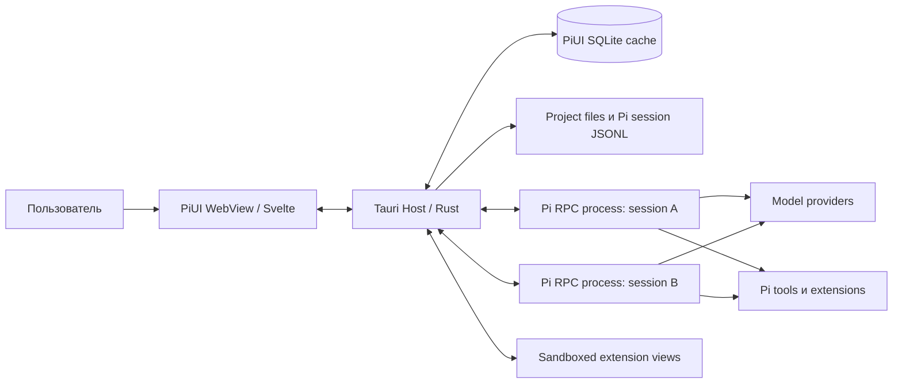
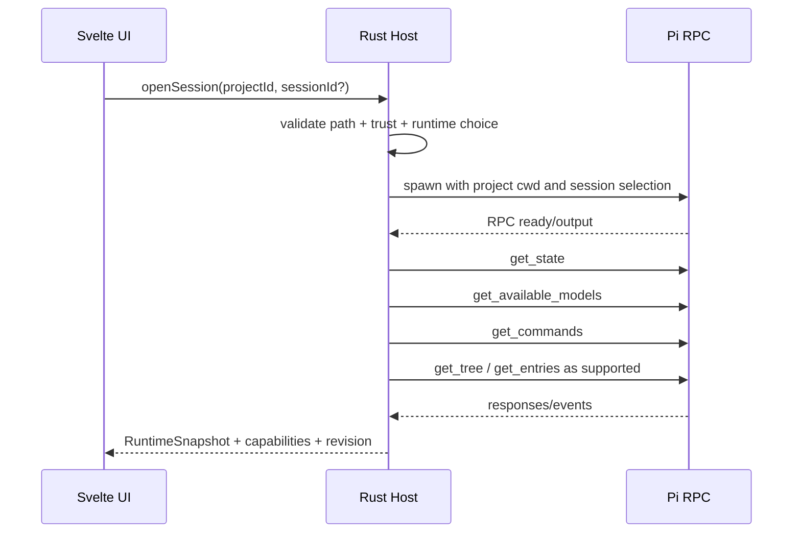

# PiUI — единая продуктовая и техническая спецификация

**Статус:** developer preview; production release gates остаются открытыми.

**Назначение:** единый self-contained документ для product, UX, runtime, frontend, security, QA и release agents. Машиночитаемые файлы из каталога `contracts/` остаются нормативными при расхождении с текстовыми примерами.

> Этот файл сгенерирован из модульных документов. Изменения следует вносить в исходные файлы и затем пересобирать master spec командой `python tools/build_master.py`.

## Содержание

- [Обзор и инварианты](#overview)
- [Правила для coding agents](#agents)
- [01. Продуктовая спецификация](#product)
- [02. UX и информационная архитектура](#ux)
- [03. Архитектура](#architecture)
- [04. Интеграция с Pi](#pi-integration)
- [05. PiUI Extension SDK](#extension-sdk)
- [06. Данные и сессии](#data)
- [07. Безопасность](#security)
- [08. Тестирование и производительность](#testing)
- [09. Roadmap и инженерные задачи](#roadmap)
- [10. Архитектурные решения](#adr)
- [11. Анализ повторного использования](#reuse)
- [12. Открытые риски и spikes](#risks)
- [Release readiness checklist](#release-checklist)
- [Prompt передачи новой команде](#handoff)
- [Контракты: руководство](#contracts-readme)
- [Источники](#sources)
- [Manifest schema](#manifest-schema)
- [Runtime protocol](#runtime-protocol)
- [PiUI Host API](#host-api)
- [Эталонный dual package](#reference-package)

---

<a id="overview"></a>

## Обзор и инварианты

_Исходный файл: `README.md`._

## PiUI

> A minimal, local desktop interface for browsing and continuing [Pi](https://pi.dev/) sessions.

PiUI is an **early developer preview**, not a production-ready Pi distribution or sandbox. It wraps Pi rather than replacing its agent loop, provider clients, tools, session format, or authentication store.

### What PiUI does today

- registers local project folders behind an explicit trust decision;
- discovers existing Pi JSONL sessions read-only and renders a bounded, safe timeline;
- starts a locally installed Pi CLI in RPC mode only after an explicit user action;
- continues an indexed session or starts a Pi-owned personal chat;
- streams typed user, assistant, reasoning, and tool activity into one transcript;
- keeps a rebuildable SQLite index separate from Pi JSONL;
- provides local appearance preferences, including theme, text size, density, motion, and conversation width.

### Current limitations

This repository is public because the source is useful for review and contribution. It is **not** a claim that every release gate is complete.

- The live-RPC path is a developer preview, not a managed/runtime-provenance guarantee.
- Concurrent writes to the same session from PiUI and the Pi CLI are not yet a supported workflow.
- Authentication stays in Pi's standard flow; PiUI does not read or expose `auth.json`.
- Windows and Linux are target platforms; release packaging, containment, updater, and platform-matrix gates remain open.

See [Foundation status](docs/13_FOUNDATION_STATUS.md), [open risks](#risks), and the [release checklist](#release-checklist) before treating PiUI as release-ready.

### Privacy and security boundary

PiUI is intentionally local-first:

- Pi JSONL remains the source of truth; PiUI does not write session JSONL directly.
- The WebView receives only typed, allowlisted host commands and safe display projections.
- Credentials, raw environment variables, filesystem paths, and agent-session artifacts must not be committed.
- `.pi/`, `.piui/`, local databases, logs, mutation outputs, build products, and `.env*` files are ignored by default.

If you find a vulnerability or accidentally committed sensitive data, follow [SECURITY.md](SECURITY.md). Do not put secrets, prompts, session files, or local paths in public issues.

### Development

#### Prerequisites

- Node.js 22+
- pnpm 10.23+
- Rust 1.94.1 with `rustfmt` and `clippy`
- Platform prerequisites for [Tauri 2](https://v2.tauri.app/start/prerequisites/)
- A local Pi CLI only when exercising the live-RPC preview

#### Install and verify

```bash
pnpm install --frozen-lockfile
pnpm repo:check
pnpm check
pnpm test
pnpm contract:test
pnpm build
pnpm test:e2e
pnpm perf:smoke
cargo test --workspace
cargo clippy --workspace --all-targets -- -D warnings
```

Run the desktop app during development:

```bash
pnpm tauri dev
```

#### Additional quality gates

```bash
pnpm repo:check
pnpm mutation:test
pnpm mutation:catalog-state
python tools/validate_spec.py
python tools/validate_runtime_evidence.py --check evidence/upstream/npm/earendil-works-pi-coding-agent/0.81.1
```

`pnpm test:e2e` is currently a static UI smoke check, not a packaged desktop E2E suite. The required release-level platform and real-Pi checks are documented in [docs/08_TESTING_AND_PERFORMANCE.md](#testing).

### Repository layout

```text
apps/desktop/           Tauri 2 host and Svelte 5 interface
crates/piui-contracts/  Safe host/UI DTOs and fixtures
crates/piui-index/      Rebuildable SQLite index and LF-only session scanner
crates/piui-runtime/    Pi RPC adapter, lifecycle, and safe stream projection
crates/piui-platform/   Native identity and process-containment primitives
crates/piui-extensions/ Extension manifest validation
contracts/              Versioned TypeScript contracts
fixtures/               Synthetic, credential-free test data
spikes/                 Isolated evidence and experiments; not runtime dependencies
docs/                   Product, architecture, security, and release documentation
```

### Contributing

Contributions are welcome. Please read [CONTRIBUTING.md](CONTRIBUTING.md), [AGENTS.md](#agents), and the [architecture documentation](#architecture) before opening a pull request. Changes to IPC contracts require a version bump, compatibility coverage, and an update under `contracts/`.

### Documentation

Most detailed project documentation is currently in Russian:

- [Product and scope](#product)
- [UX and settings](#ux)
- [Architecture](#architecture)
- [Pi integration](#pi-integration)
- [Security model](#security)
- [Testing and performance](#testing)
- [Changelog](CHANGELOG.md)
- [Sources and provenance notes](#sources)

### License

PiUI is licensed under the [MIT License](LICENSE). Third-party dependencies and cited external materials remain subject to their own licenses and terms.

---

<a id="agents"></a>

## Правила для coding agents

_Исходный файл: `AGENTS.md`._

## AGENTS.md — обязательные правила разработки PiUI

Этот файл предназначен для coding agents и инженеров, работающих над репозиторием PiUI. Требования ниже выше локального удобства конкретной задачи.

### Цель

Создать минимальную, быструю и расширяемую desktop-оболочку над Pi. Не создавать ещё один агентный harness.

### Неподлежащие пересмотру правила

- Не реализовывать agent loop, provider clients, compaction, tools или session branching внутри PiUI, когда это уже делает Pi.
- Все команды активной сессии отправлять через типизированный runtime adapter. Не писать в session JSONL напрямую.
- Считать JSONL Pi источником истины. База PiUI — только cache/index/UI metadata и должна полностью перестраиваться.
- Не читать и не изменять `auth.json` во frontend. Не выводить ключи, OAuth tokens, полный environment или prompt content в обычные logs.
- Не давать WebView общий shell/filesystem доступ. Frontend вызывает только allowlisted Tauri commands с валидируемыми аргументами.
- Не загружать project-local PiUI JavaScript до явного trust decision.
- Любой новый core feature сначала проверять на соответствие принципу: «может ли это быть extension contribution?». Если да — держать его вне core.
- Любой custom renderer обязан иметь generic fallback. Сессия должна оставаться читаемой при отключённом расширении.
- Не использовать Electron. Не добавлять SSR, cloud backend, telemetry или account system без отдельного ADR.
- Не вводить второй формат чатов.
- Не блокировать первый paint проверками сети, каталога моделей или package updates.

### Архитектурные слои

1. `ui` — Svelte-компоненты и локальное presentation state.
2. `host-api` — генерируемые TypeScript bindings к Rust commands/events.
3. `application` — use cases: проекты, сессии, attachments, extensions.
4. `runtime` — Pi process supervisor и RPC adapter.
5. `index` — read-only session scanner и rebuildable SQLite index.
6. `platform` — process groups, filesystem watch, trash, notifications, updates.

UI не обращается к слоям `runtime`, `index` или OS напрямую.

### Кодовые соглашения

- Rust: stable toolchain, edition 2024, `cargo fmt`, `clippy -D warnings`, ошибки через typed enums; `unwrap()` запрещён вне tests и доказуемых startup invariants.
- TypeScript: `strict: true`, без `any` в публичных contracts; discriminated unions для событий; exhaustive `switch` с `never`.
- Svelte: локальное состояние в компоненте, межэкранное состояние в небольших domain stores; не создавать глобальный store «на всё приложение».
- CSS: design tokens через custom properties, component-scoped CSS; без utility-class DSL в core UI.
- IPC: schema-first. Изменение event/command contract требует version bump, compatibility test и обновления `contracts/`.
- Логи: structured fields; никаких сообщений вроде `console.log(object)` для RPC payloads в production.

### Definition of Done для каждой задачи

- Реализован happy path и минимум один failure path.
- Добавлены unit tests; для пользовательского потока — integration/E2E test.
- Нет регрессии в safe mode и generic fallback.
- Проверены keyboard-only и screen-reader labels для нового интерактивного элемента.
- Измерено влияние на startup/RSS/rendering, если затронут hot path.
- Обновлена спецификация или ADR, если поведение изменилось.
- На Windows и Linux нет platform-specific assumption без отдельной ветки и теста.

### Запрещённые обходы

- Парсить stdout обычным универсальным line reader, который разделяет Unicode line separators. Pi RPC требует LF-only framing.
- Убивать только родительский PID и оставлять дочерние tool processes.
- Скрывать project trust за общей кнопкой «Continue».
- Автоматически копировать внешние файлы в проект без видимого пользователю решения.
- Рендерить raw HTML из Markdown, tool output или extension payload.
- Загружать extension bundle в основной DOM с полными правами по умолчанию.
- Считать `ctx.hasUI === true` признаком полной TUI-поддержки в RPC.
- Переименовывать или перемещать session files ради UI-сортировки.

### Приоритеты при конфликте требований

1. Сохранность пользовательских файлов и сессий.
2. Явная модель доверия и отсутствие ложного обещания sandbox.
3. Совместимость с Pi CLI.
4. Корректность runtime protocol.
5. Responsiveness интерфейса.
6. Расширяемость.
7. Визуальная полировка.

### Команды качества, которые должен предоставить репозиторий

```bash
pnpm check          # TypeScript/Svelte formatting, lint, typecheck
pnpm test           # unit tests
pnpm test:e2e       # Playwright against packaged/dev Tauri harness
cargo test --workspace
cargo clippy --workspace --all-targets -- -D warnings
pnpm contract:test  # schema fixtures and backward compatibility
pnpm perf:smoke     # startup, idle RSS, long-session scroll, stream batching
```

### Перед началом реализации

Первой задачей выполнить spikes из `docs/12_OPEN_RISKS.md`. Не строить UI поверх предположений о завершении RPC-процесса, initial session creation, OAuth и tree navigation.

---

<a id="product"></a>

## 01. Продуктовая спецификация

_Исходный файл: `docs/01_PRODUCT.md`._

## 01. Product Requirements Document

### 1. Назначение

PiUI — локальная desktop-оболочка над Pi agent harness. Она организует существующие рабочие папки как проекты, показывает связанные с ними Pi-сессии и даёт chat-first интерфейс для продолжения работы. Ядро продукта намеренно невелико: управление проектами и сессиями, чат, отображение agent activity, базовые настройки и точка расширения.

PiUI не конкурирует с Pi и не создаёт альтернативную экосистему. Один Pi package может содержать обычные Pi extensions/skills/prompts/themes и дополнительное UI-описание для PiUI.

### 2. Продуктовая формула

> **Существующий Pi + существующие файлы пользователя + минимальная графическая оболочка + версионированные UI contributions.**

#### 2.1 Почему это соответствует философии Pi

Pi прямо позиционирует себя как набор primitives, а не как заранее заданный workflow. Сессии имеют древовидную историю, расширения могут регистрировать tools, commands, события и TUI-компоненты. Следовательно, PiUI должен добавлять интерфейсные primitives, а не встраивать в core конкретные методологии вроде plan mode, subagents, worktrees или approval framework.

#### 2.2 Product principles

1. **Local first.** Сессии, настройки и проекты остаются локальными. Модельные providers могут быть удалёнными, но PiUI не имеет собственного cloud backend.
2. **Same Pi everywhere.** CLI и PiUI разделяют конфигурацию и сессии.
3. **Progressive disclosure.** На основном экране видны только действия текущей работы; сложные сведения открываются по запросу.
4. **Fast path first.** Добавить папку → открыть чат → отправить сообщение должно занимать минимум действий.
5. **Extension over accumulation.** Специализированная функция сначала проектируется как extension contribution.
6. **Honest security.** Trust не называется sandbox; пользователь видит, что Pi и backend-extensions исполняются с его OS-правами.
7. **Graceful degradation.** Незнакомые tool calls, custom messages и отключённые UI extensions остаются читаемыми.
8. **Keyboard and mouse parity.** Основные потоки полностью доступны с клавиатуры, но не требуют запоминания команд.

### 3. Целевые пользователи

#### 3.1 Primary: разработчик, уже использующий Pi

Нужен визуальный менеджер нескольких проектов и сессий без потери CLI-конфигурации, tools, extensions и истории.

#### 3.2 Secondary: пользователь, предпочитающий GUI

Хочет работать с Pi без постоянной навигации по terminal TUI, видеть изображения, structured tool activity и легко возвращаться к чатам.

#### 3.3 Extension author

Хочет одним package расширить поведение Pi и добавить UI: renderer своего tool, кнопку composer, settings, sidebar view или даже альтернативный shell.

#### 3.4 Maintainer

Нужны узкое ядро, стабильные contracts, воспроизводимые баги, safe mode и возможность обновлять Pi независимо от UI.

### 4. Jobs to be done

- Когда у меня несколько рабочих папок, я хочу быстро видеть активные Pi-сессии и их состояние.
- Когда я продолжаю сессию из CLI, я хочу найти её в PiUI без импорта или конвертации.
- Когда агент работает долго, я хочу переключиться на другой чат и позже увидеть результат.
- Когда расширение просит подтверждение или ввод, я хочу ответить нормальным GUI-диалогом.
- Когда tool возвращает сложный результат, я хочу увидеть удобный renderer, но не потерять raw data.
- Когда проект незнакомый, я хочу явно решить, загружать ли его extensions/settings.
- Когда UI extension падает, я хочу продолжать чат без потери сессии.

### 5. Термины

- **Project** — зарегистрированный в PiUI canonical path к существующей папке.
- **Session** — исходный JSONL-файл Pi и его дерево entries.
- **Active branch** — путь от корня session tree до текущего `leafId`.
- **Runtime** — запущенный процесс Pi RPC, обслуживающий одну открытую/работающую сессию.
- **Dormant session** — сессия без запущенного процесса; её метаданные доступны из индекса.
- **Pi extension** — TypeScript-модуль, загружаемый самим Pi.
- **PiUI extension** — UI contribution из того же или отдельного package, загружаемый PiUI.
- **Package** — распространяемый через npm/git/local Pi package с ключами `pi` и, опционально, `piui`.
- **Generic fallback** — безопасное стандартное отображение неизвестного payload.
- **Managed Pi** — закреплённая совместимая поставка Pi, распространяемая вместе с PiUI или его runtime installer.
- **System Pi** — команда `pi`, установленная пользователем.

### 6. Scope продукта

#### 6.1 Core 1.0

- Реестр проектов-папок.
- Список Pi-сессий по проектам.
- Новый чат, открытие и продолжение существующего.
- Одновременная работа нескольких сессий с ограничением concurrency.
- Streaming text/thinking/tool activity.
- Stop, steer, follow-up и очередь.
- Выбор provider/model и thinking level из данных Pi.
- Image input и inline image display.
- File attachment adapter без выдуманного бинарного протокола.
- Session rename, export, fork/clone; branch tree — чтение, переход после закрытия RPC-gap.
- Settings и runtime diagnostics.
- Project trust.
- Tier 0 и Tier 1/Tier 2 PiUI extensions.
- Search по локальному перестраиваемому индексу.
- Safe mode и crash recovery.
- Windows/Linux packaging; macOS-ready codebase.

#### 6.2 Намеренно вне core 1.0

- Git status, diffs, commits, worktrees.
- IDE или полноценный file explorer.
- Embedded terminal.
- Subagent orchestration dashboard.
- Plan mode.
- Permissions framework для действий модели.
- MCP registry.
- Remote SSH/containers UI.
- Cloud sync/accounts/teams.
- Extension marketplace и автоматическая публикация packages.
- Голосовой режим.

Эти функции допустимы как extensions; core предоставляет slots и host capabilities.

### 7. Functional requirements

#### 7.1 Project registry

| ID | Требование | Приоритет |
|---|---|---|
| PRJ-001 | Пользователь добавляет существующую папку через системный folder picker. | Must |
| PRJ-002 | Путь canonicalize-ится с учётом symlink/case rules платформы; дубликаты не создаются. | Must |
| PRJ-003 | Проект можно переименовать только в UI-реестре; имя папки на диске не меняется. | Must |
| PRJ-004 | Проект можно pin/unpin и скрыть из реестра без удаления папки или Pi-сессий. | Must |
| PRJ-005 | Недоступный путь показывается как offline/missing; запись не удаляется автоматически. | Must |
| PRJ-006 | Dragging папки на sidebar предлагает добавить её как project. | Should |
| PRJ-007 | Project-level Pi resources загружаются только после trust resolution. | Must |
| PRJ-008 | Пользователь может открыть папку в системном file manager и скопировать путь. | Should |
| PRJ-009 | Nested projects разрешены как отдельные entries; PiUI предупреждает о пересекающемся trust scope. | Should |

#### 7.2 Session discovery and lifecycle

| ID | Требование | Приоритет |
|---|---|---|
| SES-001 | PiUI обнаруживает существующие Pi session JSONL для canonical project path. | Must |
| SES-002 | Сессия, созданная/изменённая CLI, появляется после filesystem event или ручного refresh без импорта. | Must |
| SES-003 | Список содержит display name, fallback title, last activity, runtime status и branch indicator. | Must |
| SES-004 | Новый чат создаётся через Pi runtime, а не ручное создание JSONL. | Must |
| SES-005 | Открытие dormant session запускает runtime on demand и загружает нужный session file. | Must |
| SES-006 | Переключение UI не останавливает выполняющуюся сессию; idle inactive runtime можно выгрузить по TTL. | Must |
| SES-007 | Session rename использует Pi RPC `set_session_name`. | Must |
| SES-008 | Delete использует OS trash, после подтверждения и только для выбранного `.jsonl`; permanent delete скрыт в Advanced. | Must |
| SES-009 | Export использует Pi `export_html`; raw JSONL copy доступен отдельным действием. | Must |
| SES-010 | Fork/clone используют Pi RPC и отражаются в sidebar. | Must |
| SES-011 | Full tree view отображает все branches и labels; переход на произвольный node включается только при поддерживаемом runtime capability. | Should/blocked |
| SES-012 | Crash runtime не повреждает session file; пользователь видит restart/resume. | Must |
| SES-013 | Header-only/пустые sessions не засоряют список: они группируются или удаляются только по доказуемому ownership rule. | Should |
| SES-014 | Session list не требует запуска runtime для каждой сессии. | Must |

#### 7.3 Chat timeline

| ID | Требование | Приоритет |
|---|---|---|
| CHT-001 | Отображаются user, assistant, thinking, tool call/result, bash, compaction, retry, error и custom messages. | Must |
| CHT-002 | Streaming обновляется батчами; UI не пересобирает весь Markdown на каждый token delta. | Must |
| CHT-003 | Thinking collapsed по умолчанию; пользователь может раскрыть конкретный block. | Must |
| CHT-004 | Tool call и result визуально объединены в одну карточку с running/success/error/cancelled state. | Must |
| CHT-005 | Generic tool card показывает tool name, arguments, result summary и raw JSON/text по раскрытию. | Must |
| CHT-006 | Tool output не исполняет HTML/JS и не открывает ссылки автоматически. | Must |
| CHT-007 | Custom renderer не может скрыть доступ к raw payload. | Must |
| CHT-008 | Пользователь может копировать message text, code block, tool output и permalink/entry ID. | Should |
| CHT-009 | Long conversations virtualize off-screen content без скачка scroll anchor. | Must |
| CHT-010 | При чтении истории новые streaming events не насильно прокручивают вниз; показывается “New activity”. | Must |
| CHT-011 | Ошибка provider/retry отображается inline с ясным состоянием, не как исчезающий toast. | Must |
| CHT-012 | Compaction отображается ненавязчивым разделителем; details доступны по раскрытию. | Should |
| CHT-013 | Images из message content рендерятся inline с fit/zoom/open/copy path where applicable. | Must |
| CHT-014 | Неизвестный message/entry type показывается generic inspector, а не теряется. | Must |

#### 7.4 Composer and queues

| ID | Требование | Приоритет |
|---|---|---|
| CMP-001 | Multiline composer поддерживает обычный текст, slash commands, path suggestions и attachments. | Must |
| CMP-002 | В idle state `Enter` отправляет, `Shift+Enter` создаёт строку; hotkeys настраиваются. | Must |
| CMP-003 | Во время run пользователь явно выбирает `Steer` или `Follow up`; выбранное поведение видно до отправки. | Must |
| CMP-004 | Кнопка Send превращается в Stop только для active run; queued composer остаётся доступным. | Must |
| CMP-005 | Pending queue показывается chips/list, элементы можно удалить до доставки, если Pi capability это допускает; иначе UI честно сообщает ограничение. | Should |
| CMP-006 | `get_commands` питает autocomplete для extension commands, prompts и skills. | Must |
| CMP-007 | Built-in TUI commands, недоступные RPC, не предлагаются как исполняемые. | Must |
| CMP-008 | `set_editor_text` от extension заменяет/вставляет composer content с защитой от случайной потери несохранённого текста. | Must |
| CMP-009 | Draft сохраняется локально per session и очищается только после принятого prompt. | Must |
| CMP-010 | Composer не отправляет пустой prompt без attachment/command. | Must |

#### 7.5 Models and thinking

| ID | Требование | Приоритет |
|---|---|---|
| MOD-001 | Model picker заполняется через `get_available_models`, не из захардкоженного списка. | Must |
| MOD-002 | Текущая model/thinking state берётся из `get_state`. | Must |
| MOD-003 | Switching использует `set_model`; ошибки показываются рядом с picker. | Must |
| MOD-004 | Thinking options берутся через `get_available_thinking_levels`. | Must |
| MOD-005 | Picker показывает provider, display name, input modalities и context window, если они доступны. | Should |
| MOD-006 | Смена model во время несовместимого state блокируется или ставится в очередь согласно фактическому ответу Pi. | Must |
| MOD-007 | PiUI не создаёт собственный список цен; показывается только cost metadata, полученная от Pi, с пометкой estimate. | Must |
| MOD-008 | Неавторизованный provider ведёт в Settings/Auth flow, а не к ручному редактированию JSON в основном UI. | Must |

#### 7.6 Attachments

| ID | Требование | Приоритет |
|---|---|---|
| ATT-001 | PNG/JPEG/WebP/GIF при поддержке выбранной модели кодируются и передаются через RPC `images`. | Must |
| ATT-002 | Изображение имеет preview, MIME/size validation и remove action до отправки. | Must |
| ATT-003 | Файл внутри project root передаётся агенту как canonical relative path в структурированном text preamble; содержимое не дублируется автоматически. | Must |
| ATT-004 | Внешний файл требует явного выбора: reference original path или copy into managed project attachment area. | Must |
| ATT-005 | Copy использует content hash, collision-safe filename и provenance metadata; source не удаляется. | Must |
| ATT-006 | PDF/doc/archive не обещаются как “понятые” моделью: PiUI передаёт path и позволяет Pi/tool/extension прочитать или преобразовать файл. | Must |
| ATT-007 | Директории не прикрепляются как бинарные объекты; вставляется path reference. | Must |
| ATT-008 | Attachment size limits настраиваются; oversized image предлагает downscale/cancel без скрытого изменения оригинала. | Should |
| ATT-009 | При model без image input Send блокируется для image-only prompt и предлагает смену модели или path reference. | Must |
| ATT-010 | Attachment history в UI восстанавливается из message image blocks и PiUI metadata, но session validity не зависит от metadata. | Must |

#### 7.7 Extension compatibility

| ID | Требование | Приоритет |
|---|---|---|
| EXT-001 | Обычный Pi extension загружается самим Pi без переписывания для PiUI. | Must |
| EXT-002 | `select/confirm/input/editor` отображаются модальными UI и возвращают matching response. | Must |
| EXT-003 | `notify`, `setStatus`, `setWidget`, `setTitle`, `set_editor_text` имеют определённое отображение. | Must |
| EXT-004 | TUI-only APIs не симулируются ложными обещаниями; extension diagnostics указывает degradation. | Must |
| EXT-005 | Pi package может объявить `piui.manifest.json` с contributions и permissions. | Must for 1.0 |
| EXT-006 | Unknown/missing UI extension не ломает backend Pi extension. | Must |
| EXT-007 | Declarative contributions не исполняют arbitrary JS. | Must |
| EXT-008 | Rich views запускаются в sandboxed frame/worker и общаются только через capability host API. | Must |
| EXT-009 | Full shell replacement разрешён только explicitly trusted global package после restart. | Should for 1.0 |
| EXT-010 | Safe mode отключает все PiUI packages и project-local Pi resources. | Must |
| EXT-011 | Extension API имеет semantic version/capability negotiation и compatibility errors. | Must |
| EXT-012 | Extension can contribute settings, commands, status items, composer actions, sidebar/panel views, tool/message/preview renderers and optional shell. | Must |
| EXT-013 | Project UI package никогда не получает network/workspace-write/session-command capability без manifest permission и user grant. | Must |
| EXT-014 | Development mode поддерживает reload UI package без рестарта всей app, кроме shell replacement. | Should |

#### 7.8 Settings and authentication

| ID | Требование | Приоритет |
|---|---|---|
| SET-001 | Settings доступны кнопкой в верхней части sidebar и command palette. | Must |
| SET-002 | Разделы: General, Runtime, Models & Auth, Extensions, Appearance, Keybindings, Security, Advanced/Diagnostics. | Must |
| SET-003 | PiUI settings хранятся отдельно; Pi settings изменяются только через поддерживаемый adapter с atomic write/validation. | Must |
| SET-004 | OAuth/subscription login, пока нет headless API, запускается через контролируемый interactive Pi flow; результат остаётся в стандартном Pi auth store. | Must |
| SET-005 | API key field маскирует значение, никогда не читает существующий secret обратно в UI и записывает его через trusted backend flow. | Must |
| SET-006 | Runtime page показывает selected mode, path, version, capabilities, stderr diagnostics и “Test runtime”. | Must |
| SET-007 | Extensions page различает global/project, Pi backend/PiUI frontend, trusted/disabled/error states. | Must |
| SET-008 | Advanced settings скрыты по умолчанию и имеют reset-to-default. | Must |
| SET-009 | Theme default следует OS; light/dark и density доступны без перезапуска. | Should |
| SET-010 | Keybindings обнаруживают conflicts до сохранения. | Should |

#### 7.9 Search and navigation

| ID | Требование | Приоритет |
|---|---|---|
| NAV-001 | Search находит projects, session names, first user text и message text из локального индекса. | Must for 1.0 |
| NAV-002 | Search result открывает session и прокручивает к entry, если entry доступен active branch; иначе открывает tree context. | Should |
| NAV-003 | Command palette открывает project/session/settings/actions. | Must |
| NAV-004 | Back/forward navigation восстанавливает project/session/panel state, но не управляет runtime history. | Should |

#### 7.10 Notifications and lifecycle

| ID | Требование | Приоритет |
|---|---|---|
| LIF-001 | Background session completion помечается badge; OS notification опциональна. | Must |
| LIF-002 | Closing window при running sessions предлагает оставить app in tray, stop tasks или cancel close. | Should |
| LIF-003 | App exit корректно завершает owned idle runtimes; running processes не остаются orphaned без явной политики. | Must |
| LIF-004 | После crash PiUI восстанавливает project/session selection и перечитывает session source of truth. | Must |
| LIF-005 | Обновление приложения никогда не запускается во время незавершённой записи/миграции без безопасного restart flow. | Must |

### 8. Non-functional requirements

#### 8.1 Performance

Целевые бюджеты приведены в testing document. Ключевые требования:

- первый paint не ждёт network/auth/model refresh;
- dormant sessions не имеют процессов;
- idle app CPU близок к нулю;
- timeline virtualized;
- streaming batched;
- extension sandbox lazy-loaded;
- search index обновляется incrementally и имеет backpressure.

#### 8.2 Reliability

- append-only Pi sessions не модифицируются indexer-ом;
- partial JSONL line не считается corruption;
- process crash и extension crash изолированы от WebView;
- IPC requests имеют IDs, timeout и cancellation;
- migrations transactional, rollbackable и backed up;
- capability mismatch даёт actionable error.

#### 8.3 Accessibility

- WCAG 2.2 AA как целевой уровень;
- full keyboard flow;
- semantic landmarks, focus management, reduced motion, screen-reader live regions для streaming без спама;
- минимум 44×44 CSS px для touch-target where applicable, но desktop density допускает компактные визуальные размеры при достаточной hit area;
- status не передаётся только цветом.

#### 8.4 Privacy

- telemetry off and absent by default;
- crash report создаётся локально и отправляется только после preview/consent;
- logs redacted;
- extensions декларируют network domains;
- external links открываются системным browser.

#### 8.5 Compatibility

- Windows и Linux — release blockers;
- macOS code path в CI с раннего этапа;
- Pi protocol compatibility matrix, не “latest only” без проверки;
- неизвестные RPC events сохраняются в diagnostics и не валят parser.

### 9. Success metrics

Публичная версия считается успешной, когда:

1. 95% test fixtures CLI→PiUI→CLI сохраняют ту же active branch и readable history.
2. Crash-free sessions >99.5% в opt-in aggregate, либо эквивалентная локальная test telemetry для pre-release.
3. Median time add project → first accepted prompt менее 60 секунд для нового пользователя и менее 15 секунд для настроенного Pi.
4. Idle RSS и startup соответствуют бюджетам на обеих Tier-1 платформах.
5. Не менее трёх fixture packages доказывают: generic Pi extension, declarative UI package, sandboxed rich renderer.
6. Safe mode открывается после намеренно broken shell extension.
7. Ни один test не требует конвертации session JSONL в proprietary chat file.

### 10. Release gates

- Все Must requirements имеют тест или документированную manual acceptance procedure.
- Нет открытых P0/P1 data-loss/security bugs.
- Runtime compatibility tested с minimum, pinned и latest-supported Pi versions.
- Windows/Linux installers подписаны там, где инфраструктура позволяет, и проверены clean-machine install/update/uninstall.
- Third-party licenses/NOTICE собраны автоматически.
- Threat model reviewed после реализации extension host.
- Accessibility audit выполнен keyboard-only и минимум одним screen reader на каждой Tier-1 OS family.

---

<a id="ux"></a>

## 02. UX и информационная архитектура

_Исходный файл: `docs/02_UX.md`._

## 02. UX и информационная архитектура

### 1. Базовая композиция окна

PiUI — chat-first приложение с двумя постоянными областями и одной условной:

```text
┌──────────────────────┬──────────────────────────────────────────────┬───────────────┐
│  Settings            │                                              │ Optional panel│
│  + New chat          │               CHAT TIMELINE                  │ tree / preview│
│                      │                         [ Branch tree ]     │               │
│  PROJECTS            │  user                                        │               │
│  ▾ alpha             │  assistant · thinking · tools                │               │
│    ● auth refactor   │                                              │               │
│    ◌ tests           │                                              │               │
│  ▸ notes             ├──────────────────────────────────────────────┤               │
│                      │ [ model ▾ ][ thinking ▾ ]   Composer   [→]   │               │
│  running 1           │                                              │               │
└──────────────────────┴──────────────────────────────────────────────┴───────────────┘
```

- **Sidebar** постоянный, collapsible, default 272 px.
- **Workspace/chat** занимает всё оставшееся место.
- **Context panel** отсутствует по умолчанию и открывается только для tree, artifact/preview, diagnostics или extension view.
- На узком окне panel overlay, sidebar может становиться drawer.

### 2. Визуальный характер

Вдохновение берётся из Codex App и Hermes Desktop только на уровне паттернов: проекты с threads, chat-first sidebar, background status, structured tools и optional preview. Визуальная копия не требуется.

#### 2.1 Design principles

- Плоская иерархия, мало декоративных контейнеров.
- Один accent color; статусы используют icon + text/shape, не только цвет.
- Сообщения не превращаются в массив одинаковых bubble. User message может иметь compact surface; assistant content читается как документ.
- Tool cards compact и collapsed по умолчанию после завершения.
- Максимальная ширина текста 760–880 px, но wide code/tool output может расширяться.
- Монопространственный шрифт только для code/path/IDs/tool payload.
- Анимации короткие; streaming не двигает уже прочитанный контент.

#### 2.2 Design tokens

Core UI использует CSS custom properties:

```css
--piui-bg;
--piui-surface-1;
--piui-surface-2;
--piui-text;
--piui-text-muted;
--piui-border;
--piui-accent;
--piui-danger;
--piui-warning;
--piui-success;
--piui-focus;
--piui-radius-sm;
--piui-radius-md;
--piui-space-1 ... --piui-space-8;
--piui-font-ui;
--piui-font-mono;
```

Extensions получают только documented semantic tokens; внутренние class names не являются API.

### 3. Sidebar

#### 3.1 Верхняя зона

Порядок фиксирован:

1. **Settings** — icon + label, всегда доступно.
2. **New chat** — primary compact action. Всегда открывает personal chat без пользовательской папки; Pi получает host-owned neutral CWD, который не раскрывается WebView и не отображается как проект. Пустой personal chat живёт в памяти Pi и появляется в истории только после первого assistant response, когда Pi сам записывает JSONL.
3. **Add project** — secondary action для регистрации существующей пользовательской папки.
4. Optional command palette/search icon.

Settings расположен слева сверху, как задано исходным требованием. New chat отделён, чтобы settings не выглядел действием проекта.

Settings — не modal overlay. Он заменяет основной workspace, сохраняя глобальный sidebar, и имеет собственную вертикальную навигацию:

- **Appearance** — system/light/dark theme, density, reduced motion, chat text size and a persistent centered conversation-width choice; the default is `Wide`, so the timeline uses the workspace instead of leaving large unused side gutters;
- **Extensions** — bounded список global Pi extensions и реальные enable/disable switches.

Extension inventory и toggle выполняются через Pi `SettingsManager`/`DefaultPackageManager`, а не через разбор `settings.json` во frontend. WebView получает только opaque id, display name, source class и enabled state; native paths остаются в host. Изменения действуют для следующего запуска chat runtime. Project-local extensions здесь не управляются и остаются за project trust boundary.

Developer-only fake runtime, legacy probe и foundation disclaimers не показываются в product settings.

#### 3.2 Chats и projects

Над Projects есть отдельная системная группа **Chats** с personal sessions. Она не является project row: в ней нет пути, trust toggle, rename/pin/remove или project-local resource claims. Выбранный chat обозначен в sidebar, а chat surface показывает literal `No user folder is attached`; это не обещание OS sandbox.

Project row содержит:

- disclosure chevron;
- user-defined name или folder basename;
- runtime aggregate badge: running/error/unread completion;
- context menu.

Click по project row toggles expanded state без потери текущей открытой timeline. При первом/ручном refresh список сразу показывает `Scanning local Pi sessions…`, пока bounded host scan не завершится; поздний ответ не должен самовольно раскрыть закрытую пользователем группу.

Expanded project показывает sessions. Default sorting:

1. running/waiting-for-input;
2. pinned;
3. last activity descending.

Session row:

- status glyph;
- display name или deterministic fallback title;
- relative last activity при достаточной ширине;
- branch glyph только если session имеет >1 leaf/path;
- unread completion dot.

Не показывать model, token count и cost в каждой строке: это перегружает sidebar. Model/thinking доступны рядом с composer; подробности — в соответствующей панели.

#### 3.3 Session title fallback

Приоритет:

1. `sessionName` Pi;
2. первый user message, очищенный до одной строки и ограниченный длиной;
3. дата/время создания;
4. короткий session ID.

Не вызывать дополнительную LLM только ради названия. Rename доступен inline/context menu.

#### 3.4 Context menu проекта

- New chat
- Open folder
- Copy path
- Pin/unpin
- Refresh sessions
- Trust settings
- Project settings
- Remove from PiUI

“Remove” не удаляет папку/сессии.

#### 3.5 Context menu сессии

- Open
- Rename
- Pin/unpin
- Clone current branch
- Export HTML
- Reveal session file
- Copy session ID/path
- Move to trash

Dangerous action отделён separator и требует confirmation с названием сессии.

### 4. Управление workspace

Постоянного верхнего header/breadcrumb нет: имя выбранной session уже видно в sidebar, поэтому повтор не отнимает высоту у длинной timeline.

- Timeline не имеет постоянного toolbar: history и composer занимают доступную высоту без дублирующих controls.
- Model и thinking находятся рядом с composer, где пользователь принимает решение перед следующим prompt.
- Для restricted project нижняя chat surface содержит явный `Review trust`; runtime не запускается до отдельного trust decision.
- Статус runtime показывается у активной chat surface, а не в отдельной дублирующей строке.

### 5. Timeline

#### 5.1 Message anatomy

##### User

- compact tinted surface;
- timestamp hidden until hover/focus;
- attachment thumbnails/chips;
- actions: copy, fork from here, edit-and-fork when supported.

##### Assistant

- document layout without bubble;
- optional provider/model metadata hidden in details;
- text/thinking/tool blocks preserve original ordering;
- streaming caret only in active content block.

##### Thinking

- collapsed disclosure: `Reasoning · 12 s` or `Thinking`;
- no automatic expansion;
- while streaming, one-line live indicator can show last short fragment only if user enabled it;
- copied separately, never mixed silently into final answer.

##### Tool activity

Tool calls не становятся отдельными chat bubbles. Host semantic projector связывает Pi `toolCall` и `toolResult` по внутреннему call ID и отдаёт WebView одну компактную строку без исходного ID и raw JSON. Последовательные `tool`/`thinking` blocks визуально объединяются в одну activity group:

```text
⌄ 8 actions completed · 3 tools · 5 reasoning steps
```

При раскрытии группа показывает плотные строки высотой около 28–30 px:

```text
  ✓ Read file
  ✓ bash
  ✓ Reasoning
```

- title строится из allowlisted tool name/verb; command, arguments и native path не копируются в DTO;
- completed activity group collapsed по умолчанию;
- running/failed/stopped group и соответствующие rows раскрываются автоматически;
- ручное закрытие пользователем не сбрасывается при live-update той же группы;
- expanded body показывает только bounded plain-text output в monospace, с переносом длинных строк;
- tool output можно скопировать, а truncation обозначается нейтральным сообщением, не ошибкой;
- абсолютные project/home/session paths заменяются host-side display tokens (`<workspace>`, `<external-path>/<leaf>`);
- неизвестный или unmatched result остаётся читаемым через generic fallback;
- специализированный renderer может заменить summary, но обязан иметь тот же host-controlled fallback.

##### Retry/error

Inline status surface with retry attempt and user actions (`Retry now`, `Stop retry`) only when runtime supports them. Toast alone запрещён.

##### Compaction

Thin divider:

```text
──────── Context compacted · details ────────
```

##### Custom message/entry

- `custom_message` с `display: true` получает generic extension disclosure;
- `display: false` и state-only `custom` не засоряют conversation timeline;
- renderer matching `customType` может заменить disclosure, но при его отключении остаётся bounded plain-text fallback;
- raw extension JSON не передаётся в WebView.

#### 5.2 Streaming and scroll

- При первом открытии session viewport ставится на последние сообщения.
- При достижении верхних 96 px автоматически загружается предыдущая bounded page; после prepend сохраняется визуальный scroll anchor.
- Отдельной кнопки `Load older entries` нет.
- If viewport is within 80 px of bottom, follow streaming.
- Otherwise keep anchor and show floating `↓ New activity`.
- Persisted history и live runtime blocks рендерятся одним `Timeline` внутри одного scroll container; отдельного live-output scroller нет.
- Token deltas coalesce через `requestAnimationFrame`, поэтому Markdown parsing/layout выполняются не чаще одного раза за paint.
- После `turnCompleted` PiUI перечитывает bounded JSONL page и заменяет только blocks завершённого turn; новая queued activity, пришедшая во время синхронизации, не стирается.
- Markdown строится через AST и Svelte nodes без `{@html}`; raw HTML отображается как escaped code.
- Very long tool output has an internal bounded preview with copy action; раскрытие не снимает host byte limit.
- Activity grouping and path redaction are presentation/projection concerns: Pi JSONL remains unchanged and live/persisted blocks share the same Timeline scroll.

#### 5.3 Empty states

##### No projects

Title: `Start a new chat`
Primary: `New chat` (personal chat without a user folder)
Secondary: `Add project` remains visible in the sidebar; runtime diagnostics remain available in Settings.

##### Project without sessions

Title: project name
Body: `No Pi sessions in this folder`
Primary: `New chat`.

##### New empty session

Centered minimal prompt suggestions, sourced only from static copy or extension contributions. No carousel/news/content feed.

##### Missing runtime

Clear diagnostic: expected command/path, tested paths, install/select action. Chat composer disabled, project browsing remains available.

### 6. Composer

#### 6.1 Layout

```text
╭──────────────────────────────────────────────────────────────╮
│ Message Pi…                                                  │
│                                                              │
│ model ▾   thinking ▾   ready                            [ ↑ ] │
╰──────────────────────────────────────────────────────────────╯
```

- Composer — одна тихая rounded surface внизу workspace; history получает оставшуюся высоту и скроллится независимо.
- Model и thinking selectors находятся в нижней строке composer, а не в отдельной верхней панели.
- Последний display-safe Pi catalog хранится в bounded frontend cache. Переключение session не запускает agent runtime и не сбрасывает controls в `Unavailable`.
- На абсолютно первом запуске selector предлагает явное `Load available models…`: только это пользовательское действие запускает текущую session через typed runtime adapter и заполняет cache. После этого model/thinking доступны при последующих переключениях и перезапусках без нового process.
- Выбор, сделанный в dormant composer, применяется к runtime перед первым prompt.
- Круглая `↑` control отправляет prompt; у неё есть accessible name и tooltip.
- Attachment, slash autocomplete и recording controls не отображаются, пока соответствующий host feature не реализован: UI не создаёт декоративных неработающих действий.

#### 6.2 Idle state

- `Enter`: Send.
- `Shift+Enter`: newline.
- `Ctrl/Cmd+Enter`: configurable alternative Send.
- `Escape`: close autocomplete/popup, затем blur only on second press.

#### 6.3 Running state

Круглая primary control заменяет `↑` на square `Stop`, но composer остаётся активным. После остановки runtime возвращается в ready state и control снова отправляет prompt.

- **Steer** появляется рядом с control, когда во время streaming есть draft.
- `Enter` отправляет follow-up через Pi's atomic streaming behavior; placeholder явно сообщает это правило.
- Queue status показывается рядом с нижними model/thinking selectors.

Extension command отправляется через normal `prompt`, потому что Pi выполняет его немедленно даже во время streaming; UI предупреждает, что он не войдёт в очередь.

#### 6.4 Draft rules

- draft сохраняется per session после debounce;
- accepted prompt очищает draft;
- rejected prompt сохраняет текст/attachments;
- extension `set_editor_text` при непустом draft открывает non-blocking choice: Replace / Insert / Cancel, если request не помечен safe replacement;
- session switch не теряет draft.

### 7. Attachments UX

#### 7.1 Image

- thumbnail;
- filename/size;
- remove;
- click opens lightbox;
- unsupported MIME/size gives inline error.

#### 7.2 Project file

Chip displays relative path and icon. Hover показывает canonical path. Prompt preamble генерируется host-ом детерминированно, например:

```text
Attached project files:
- @src/api.ts
- @docs/spec.pdf
```

Точный syntax является internal adapter contract; пользователь видит preview before send.

#### 7.3 External file

Dialog:

- **Reference original path** — Pi получает абсолютный path; файл остаётся снаружи.
- **Copy into project attachments** — копия в managed area, видимый destination.
- Cancel.

Default зависит от security setting; никакого silent copy.

#### 7.4 Model without image support

Inline banner over composer:

`Selected model accepts text only. Remove image, send it as a file path, or choose an image-capable model.`

### 8. Model picker

Groups by provider. Search по provider/model name/ID.

Row:

```text
Claude Sonnet …        Anthropic
200k context · text/image · reasoning
```

Current selection checkmark. Auth issue or unavailable model disabled with reason. No badges “best/fastest” без данных.

Thinking picker показывает только levels, returned by Pi. Unsupported levels not rendered.

### 9. Branch/tree UX

Tree — secondary workflow, открывается right panel.

#### 9.1 Default

Timeline показывает active path. В текущем минимальном shell отдельная кнопка tree скрыта; чтение generic active path не зависит от tree renderer.

#### 9.2 Tree panel

Each node: role/type icon, short text, timestamp, optional label. Current leaf highlighted. Actions:

- View context
- Fork from user message
- Clone active path
- Navigate here — only if runtime capability available
- Set label — only if capability available
- Copy entry ID

When navigate command unavailable, action disabled with explanation rather than emulation by rewriting file.

#### 9.3 Edit previous prompt

Implemented as fork, not mutation. Dialog preloads original text, then creates fork and sends changed prompt.

### 10. Extension UI mapping

#### 10.1 Standard RPC dialogs

- `select` → searchable modal/listbox if >8 options; simple radio list otherwise.
- `confirm` → modal with explicit primary/secondary labels; destructive style only from host policy, not arbitrary extension HTML.
- `input` → single-line field.
- `editor` → multiline editor with submit/cancel.
- timeout → visible countdown only when >1 s; host lets Pi auto-resolve.

Multiple requests queue per runtime; only one modal active per window. Closing session does not silently answer “yes”; it returns cancellation where protocol permits.

#### 10.2 Fire-and-forget

- `notify` → toast + notification log.
- `setStatus` → session status line / extension status collection.
- `setWidget` above/below editor → compact text widget in composer zone, keyed and replaceable.
- `setTitle` → window title suffix, sanitized/truncated.
- `set_editor_text` → composer adapter.

#### 10.3 Rich contributions

Default slots:

- `sidebar.project.beforeSessions`
- `sidebar.project.afterSessions`
- `workspace.header.actions`
- `workspace.panel`
- `timeline.message.renderer`
- `timeline.tool.renderer`
- `composer.actions.leading`
- `composer.actions.trailing`
- `composer.widget.above`
- `composer.widget.below`
- `status.left`
- `status.right`
- `settings.section`
- `preview.provider`
- `shell`

Extension UI must not assume pixel coordinates. Placement is semantic slot + order/group.

### 11. Settings UX

Settings replaces workspace, sidebar stays.

#### 11.1 General

- launch behavior;
- close behavior/tray;
- language;
- update channel;
- notifications.

#### 11.1a Implemented Appearance

- system/light/dark;
- compact/comfortable density and reduced motion;
- small/medium/large chat text size;
- `Wide` / `Centered` / `Focused` conversation lane. `Wide` is the default and reduces unused side space; the latter two retain a progressively narrower centered reading column.

These values are PiUI-only local index metadata and never change Pi configuration, session JSONL, authentication, or project trust.

#### 11.2 Runtime

- Managed/System/Custom Pi mode;
- path/version/capabilities;
- Test runtime;
- supported range warning;
- concurrency and idle TTL;
- open logs.

#### 11.3 Models & Auth

- detected providers;
- login/logout/API key actions;
- configured models;
- default model is Pi setting, not PiUI-only shadow;
- interactive login fallback clearly marked.

#### 11.4 Extensions

Two aligned columns/statuses:

```text
Package             Pi backend          PiUI frontend
my-review           enabled             enabled · sandboxed
legacy-tool         enabled             no UI manifest
broken-ui           enabled             disabled · crash
```

Actions: enable/disable frontend, permissions, trust source, reload, reveal package, diagnostics. Backend enablement follows Pi package/settings semantics.

#### 11.5 Appearance

- system/light/dark;
- density compact/comfortable;
- font size;
- conversation width / side gutters;
- code font;
- reduce motion;
- extension theme contributions.

#### 11.6 Security

- trusted projects;
- UI extension grants;
- external file default;
- link opening;
- sandbox runtime profiles when later available;
- clear trust decision.

#### 11.7 Advanced/Diagnostics

- paths;
- session index rebuild;
- protocol trace toggle with redaction warning;
- safe mode restart;
- export diagnostic bundle preview;
- reset UI state.

### 12. Project trust flow

Before first RPC start in a project with protected resources:

```text
This folder contains Pi settings or executable extensions.

Trusting it allows Pi to load project-local settings, packages and TypeScript
extensions. Pi then runs with your user account permissions. This is not a sandbox.

[Open without project resources] [Cancel] [Trust this folder]
```

Details list exact detected resources and canonical path. Choices:

- Trust folder persistently via Pi-compatible trust store/official API.
- Trust once (`--approve`) for this runtime only.
- Open without project resources (`--no-approve`).
- Cancel.

`AGENTS.md`/context-file behavior should be explained in details because Pi may load context independently of protected extension trust according to its settings. PiUI must not state that “nothing from the repo is read”.

### 13. Runtime states and visible behavior

| State | Sidebar | Header | Composer |
|---|---|---|---|
| Dormant | neutral | “Not running” only in details | enabled after activation |
| Starting | spinner | Starting Pi… | disabled |
| Idle | hollow dot | Idle | Send |
| Running | animated glyph | Running / tool name | Stop + queue mode |
| WaitingForUI | alert dot | Needs input | modal owns focus |
| Retrying | warning glyph | Retrying attempt n | Stop retry/queue |
| Compacting | progress | Compacting context | queue allowed per capability |
| Crashed | error glyph | Runtime crashed | Restart |
| MissingPath | muted error | Project unavailable | disabled |
| TrustRequired | shield | Trust required | disabled |

### 14. Keyboard map defaults

| Action | Windows/Linux | macOS |
|---|---|---|
| Command palette | Ctrl+K | Cmd+K |
| New chat | Ctrl+N | Cmd+N |
| Search sessions | Ctrl+Shift+F | Cmd+Shift+F |
| Settings | Ctrl+, | Cmd+, |
| Toggle sidebar | Ctrl+B | Cmd+B |
| Toggle panel | Ctrl+Alt+B | Cmd+Option+B |
| Send | Enter | Enter |
| Newline | Shift+Enter | Shift+Enter |
| Stop | Esc twice / Ctrl+. | Esc twice / Cmd+. |
| Next session | Ctrl+Tab | Ctrl+Tab |
| Previous session | Ctrl+Shift+Tab | Ctrl+Shift+Tab |
| Focus composer | Ctrl+L (configurable) | Cmd+L |
| Rename session | F2 | Return/F2 |

Conflicts with OS/WebView shortcuts resolved by platform-specific keymap. All shortcuts rebindable except emergency safe-mode startup modifier.

### 15. Accessibility details

- Sidebar is a tree with correct `aria-expanded` and roving tabindex.
- Timeline uses feed/log semantics carefully; streaming delta is not announced token-by-token. Announce message completion and critical tool/permission requests.
- Modal focus trapped and restored to invoking element.
- Tool state conveyed by icon + label.
- Thinking disclosure and raw tabs keyboard operable.
- Color contrast AA in both themes.
- Reduced motion disables status pulse and smooth scroll.
- Extension views must declare accessible name; host rejects unnamed contribution in development validation.

### 16. Responsive behavior

- ≥1200 px: sidebar + chat + optional panel.
- 800–1199 px: panel overlays or narrows chat; sidebar collapsible.
- 600–799 px: sidebar drawer; header actions in overflow.
- <600 px: unsupported as primary target, but UI remains usable for narrow desktop windows; no mobile promise.

### 17. Copywriting rules

- Use Pi terminology: session, project, model, thinking, extension.
- Do not call tool execution “sandboxed” unless an actual OS/container adapter is active.
- Error copy contains action and diagnostic detail toggle.
- Avoid anthropomorphic status text.
- Confirmations name the affected session/folder.
- Never show raw access tokens or full environment values.

---

<a id="architecture"></a>

## 03. Архитектура

_Исходный файл: `docs/03_ARCHITECTURE.md`._

## 03. Архитектура PiUI

### 1. Архитектурная цель

PiUI должен быть тонкой desktop-оболочкой, которая:

- запускает официальный Pi runtime без переписывания agent loop;
- выдерживает падение, зависание или несовместимость отдельной сессии;
- не держит runtime-процесс для каждого исторического чата;
- предоставляет расширениям стабильные семантические точки интеграции;
- остаётся отзывчивой на длинных сессиях и потоковом выводе;
- одинаково проектируется для Windows, Linux и macOS;
- может обновлять Pi runtime независимо от UI, но не незаметно нарушать совместимость.

Архитектура обязана быть **локальной по умолчанию**. Для работы самого Pi могут использоваться внешние model providers, но PiUI не требует собственного сервера, аккаунта или облачной БД.

### 2. Принятое решение по стеку

| Слой | Выбор | Назначение |
|---|---|---|
| Desktop host | Tauri 2 / Rust | окна, IPC, процессы, файловые операции, системная интеграция, updater |
| UI | Svelte 5 + TypeScript + Vite | chat timeline, sidebar, settings, extension surfaces |
| UI primitives | собственные токены + выборочные Bits UI primitives | доступные dialog/menu/select/tooltip без готовой визуальной темы |
| Runtime transport | Pi RPC по JSONL через stdin/stdout | команды сессии и поток событий |
| Process runtime | `tokio::process::Command` | точный контроль framing, stderr, process group/job object и shutdown |
| Metadata/index | SQLite через `rusqlite`, FTS5 опционально | проекты, UI metadata и перестраиваемый поиск |
| File watching | `notify` | инкрементальное обнаружение session files и package changes |
| Trash | системная корзина через Rust crate/platform adapter | обратимое удаление session files |
| Tests | Rust tests, Vitest, Playwright + packaged smoke tests | contracts, UI, runtime и платформы |

#### Почему не Electron

Electron упрощает Node-интеграцию, но включает отдельный Chromium/Node runtime на окно приложения. Для требования минимального idle footprint это плохой базовый выбор. PiUI не нуждается в Node API во frontend: процессами и файлами всё равно должен владеть доверенный host.

#### Почему не Flutter

Flutter может дать быстрый native-like UI, однако экосистема Pi и его расширений TypeScript-ориентирована. Svelte/TypeScript позволяет переиспользовать типы manifest и host API, а sandboxed extension views естественно размещаются в WebView/iframe.

#### Почему не Qt

Qt даёт зрелый desktop stack, но усложняет TypeScript-oriented extension SDK и поставку web-based isolated views. Он остаётся резервной альтернативой, если измерения покажут неприемлемое расхождение системных WebView между платформами.

#### Почему Svelte без SvelteKit

PiUI — однооконное локальное приложение без SSR, server routes и web deployment. Обычный Vite build уменьшает поверхность конфигурации. Роутинг экранов реализуется локальным state machine, а не URL-first framework.

### 3. Контекст системы



Основная граница доверия проходит между WebView/extension views и Rust host. Pi processes запускаются как локальные дочерние процессы с правами пользователя; это не sandbox.

### 4. Топология процессов

#### 4.1 Один процесс на реально активную сессию

Состояния runtime slot:

```text
Dormant -> Starting -> Ready -> Running -> Ready
                    \-> Failed -> Recovering -> Ready|Dormant
Ready|Running -> Stopping -> Dormant
```

- **Dormant:** история доступна из индексатора, Pi process отсутствует.
- **Starting:** выбран runtime, проверена версия, запущен RPC, выполнен handshake.
- **Ready:** процесс держит сессию открытой и принимает команды.
- **Running:** идёт assistant turn/tool execution.
- **Recovering:** PiUI восстанавливает представление из JSONL и предлагает повторно открыть runtime.
- **Stopping:** мягкое завершение, затем platform-specific termination fallback.

Исторический список из сотен сессий не должен означать сотни процессов.

#### 4.2 Политика пула

Параметры по умолчанию:

- `maxLiveRuntimes = 3`;
- активная вкладка не вытесняется;
- сессия с незавершённым turn не вытесняется;
- idle ready-процесс закрывается после 10 минут;
- при превышении лимита закрывается самый давно неиспользуемый idle runtime;
- значения доступны в Advanced settings, но core UX не рекламирует параллелизм как отдельную функцию.

Для MVP допустим `maxLiveRuntimes = 1`, если multi-session supervisor не готов. Контракты при этом сразу должны поддерживать несколько runtime IDs.

#### 4.3 Управление дочерними процессами

Host обязан:

- запускать Pi с явным `cwd` проекта;
- задавать контролируемое окружение и не логировать секреты;
- читать stdout побайтно/чанками и разделять только по `0x0A`;
- ограничивать максимальный размер одного protocol frame;
- читать stderr отдельно и помещать его в redactable diagnostic ring buffer;
- на Unix создавать отдельную process group;
- на Windows использовать Job Object или эквивалент, чтобы завершать дерево процессов;
- отличать нормальный EOF от crash и protocol corruption;
- не считать строку stderr RPC-событием;
- сериализовать команды, для которых Pi требует последовательность, и поддерживать correlation IDs на уровне PiUI adapter.

Tauri sidecar применяется для упаковки managed runtime, но сам supervisor строится на `tokio::process`, а не на frontend shell plugin.

### 5. Runtime modes

PiUI поддерживает три режима, все через один `RuntimeAdapter`:

#### Managed Pi

PiUI поставляет проверенную версию Pi как sidecar или устанавливает её в app-managed directory. Предпочтительный кандидат — официальный standalone Pi executable с его runtime assets из versioned upstream release; PiUI не выполняет `npm install` при запуске приложения и не требует Node/Bun в системе пользователя. Если готовый upstream artifact недоступен для нужной платформы, допустима воспроизводимая сборка из versioned release source тем же upstream build path, но только после license/provenance review.

- рекомендуемый режим public release;
- версия, target triple, upstream source URL/hash и PiUI compatibility range закреплены в подписанном release manifest;
- upstream checksum проверяется до переподписания/упаковки артефакта PiUI;
- обновление runtime отделено от UI update и может быть откатано;
- package manager пользователя не затрагивается;
- host показывает фактическую версию, origin, hash и путь;
- отсутствие managed artifact не блокирует system/custom modes.

#### System Pi

Используется `pi` из `PATH`.

- удобен разработчикам и для внутреннего alpha;
- PiUI проводит version/capability probe перед запуском;
- при несовместимости не пытается молча продолжить;
- пользователь видит, какой executable найден.

#### Custom executable

Пользователь выбирает бинарник/launcher вручную.

- нужен для forks, development builds и Nix-like environments;
- путь хранится как настройка, но проект не может подменить его сам;
- такой runtime помечается как custom и не обновляется PiUI.

#### Требование к adapter

```rust
trait RuntimeAdapter {
    async fn probe(&self) -> Result<RuntimeCapabilities, RuntimeError>;
    async fn open(&self, request: OpenRuntimeRequest) -> Result<RuntimeHandle, RuntimeError>;
    async fn command(&self, handle: RuntimeId, command: RuntimeCommand) -> Result<(), RuntimeError>;
    async fn stop(&self, handle: RuntimeId, mode: StopMode) -> Result<(), RuntimeError>;
    fn subscribe(&self, handle: RuntimeId) -> RuntimeEventStream;
}
```

UI не знает, managed это executable или system Pi.

### 6. Capability negotiation

Версия Pi сама по себе недостаточна. При старте host формирует capability set на основании:

1. версии executable;
2. успешного ответа на безопасные RPC probes;
3. доступных команд;
4. opt-in bridge extension, если он установлен;
5. PiUI runtime protocol version.

Пример capabilities:

```json
{
  "rpc": true,
  "images": true,
  "models.list": true,
  "session.switch": true,
  "session.tree.read": true,
  "session.tree.navigate": false,
  "session.shutdown": false,
  "auth.headless": false,
  "ui.standardDialogs": true,
  "ui.customTui": false,
  "piuiBridge": null
}
```

Frontend показывает или отключает действие на основании capability, а не имени версии. Любое отсутствие capability должно приводить к понятному fallback, а не к исключению в UI.

### 7. Компоненты Rust host

```text
src-tauri/src/
  app/                 use cases и orchestration
  runtime/
    supervisor.rs
    rpc_codec.rs
    pi_rpc_adapter.rs
    capability_probe.rs
    process_tree.rs
  sessions/
    scanner.rs
    jsonl_reader.rs
    indexer.rs
    repository.rs
  projects/
    registry.rs
    trust.rs
  attachments/
    resolver.rs
    managed_store.rs
  extensions/
    discovery.rs
    manifest.rs
    grants.rs
    view_broker.rs
  ipc/
    commands.rs
    events.rs
    dto.rs
  platform/
    windows.rs
    linux.rs
    macos.rs
  security/
    redaction.rs
    path_policy.rs
  db/
    migrations.rs
    repositories.rs
  diagnostics/
    logging.rs
    bundle.rs
```

#### Основные сервисы

- `ProjectRegistry`: canonical path, display name, ordering, trust state.
- `SessionScanner`: read-only discovery Pi JSONL, incremental metadata extraction.
- `SessionIndex`: rebuildable SQLite/FTS index.
- `RuntimeSupervisor`: lifecycle Pi processes, command queues, crash recovery.
- `AttachmentResolver`: image encoding, file-reference policy, managed copies.
- `ExtensionRegistry`: discovery, validation, enablement and permission grants.
- `ViewBroker`: isolated message channel between extension iframe/worker and host.
- `DiagnosticsService`: redacted logs and support bundle.

### 8. Компоненты frontend

```text
src/
  app/                 shell и screen state machine
  features/
    projects/
    sessions/
    chat/
    composer/
    settings/
    extensions/
    trust/
  components/          PiUI-owned presentation components
  primitives/          thin wrappers over accessible headless primitives
  stores/              небольшие domain stores
  host-api/            generated bindings/events
  renderers/
    markdown/
    tool/
    message/
    extension/
  styles/
    tokens.css
    reset.css
  workers/
    search-client.ts
```

#### State ownership

- Rust владеет process state, project trust, filesystem state, extension grants.
- Frontend владеет selection, scroll anchor, expanded/collapsed blocks, transient menus.
- Draft текста хранится в SQLite с debounce, но текущая строка остаётся локальной для мгновенного ввода.
- Timeline cache во frontend ограничен; старые блоки могут выгружаться и запрашиваться страницами.

Не допускается единый глобальный mutable store со всем приложением.

### 9. Typed IPC между Svelte и Rust

#### Команды

Frontend вызывает только команды вида:

```ts
openProject(path)
listProjects()
listSessions(projectId, cursor)
openSession(projectId, sessionId)
createSession(projectId, options)
sendTurn(runtimeId, input, attachments, mode)
abortTurn(runtimeId)
setModel(runtimeId, modelRef)
setThinking(runtimeId, level)
renameSession(sessionId, name)
exportSession(sessionId, target)
trashSession(sessionId)
respondToUiRequest(requestId, value)
setExtensionGrant(extensionId, permission, decision)
```

Каждая команда:

- валидирует IDs и paths на Rust стороне;
- возвращает typed result с stable error code;
- не принимает shell string;
- не возвращает секреты;
- имеет max payload limits.

#### События

Rust публикует discriminated unions:

```ts
type HostEvent =
  | { type: 'runtime.state'; runtimeId: string; state: RuntimeState }
  | { type: 'session.delta'; runtimeId: string; delta: SessionDelta }
  | { type: 'session.reindexed'; sessionId: string; revision: number }
  | { type: 'ui.request'; runtimeId: string; request: UiRequest }
  | { type: 'notification'; level: NoticeLevel; message: string }
  | { type: 'extension.changed'; extensionId: string }
  | { type: 'diagnostic'; code: string; safeSummary: string };
```

Высокочастотные token events агрегируются host или frontend scheduler в кадры 16–33 ms. Один token не должен означать один full-tree render.

### 10. Представление timeline

Pipeline:

```text
Pi RPC event / JSONL entry
  -> normalized SessionDelta
  -> immutable block model
  -> renderer registry
  -> virtualized timeline
```

Нормализованный block не теряет raw payload и source entry ID:

```ts
interface TimelineBlock {
  id: string;
  parentId?: string;
  kind: 'user' | 'assistant' | 'thinking' | 'tool' | 'custom' | 'error' | 'compaction';
  status: 'pending' | 'streaming' | 'complete' | 'failed';
  source: { sessionId: string; entryId?: string; extensionId?: string };
  content: unknown;
  raw?: unknown;
}
```

Renderer registry всегда заканчивается generic JSON/text fallback. Никакой renderer не может сделать запись невидимой без явного фильтра пользователя.

### 11. Extension architecture

Extension host состоит из трёх независимых механизмов:

1. **Backend compatibility:** Pi сам загружает обычные Pi extensions.
2. **Declarative contributions:** PiUI читает manifest как данные и отображает собственными компонентами.
3. **Sandboxed rich views:** изолированный iframe/worker, общающийся через versioned broker.

Trusted shell replacement — отдельный режим, не часть обычного extension loading path.

Project-local UI package не загружается до trust. Backend Pi resources также не должны запускаться до доверия в PiUI-controlled workflow.

### 12. Хранение и индекс

- Pi session JSONL — authoritative.
- PiUI SQLite — cache и metadata.
- Scanner не держит все сообщения всех сессий в памяти.
- На startup читаются project/session headers и последние metadata; full indexing идёт после usable shell с ограничением I/O.
- FTS можно отключить.
- Индекс имеет schema version и generation ID.
- При несовместимости база переименовывается в backup и перестраивается, а не мигрирует session content.

### 13. Работа с длинными сессиями

Обязательные техники:

- block virtualization после 200 timeline blocks;
- измерение высоты и сохранение scroll anchor;
- windowed loading назад/вперёд;
- memoized Markdown AST для завершённых сообщений;
- code highlighting в worker или лениво после viewport entry;
- collapsed tool output с лимитом initial render;
- потоковый plaintext/минимальный Markdown, финальный parse после завершения блока;
- blob/object URLs для локальных изображений вместо повторного base64 в DOM;
- освобождение preview resources при закрытии.

### 14. Startup pipeline

1. Показать окно и shell из локальных настроек.
2. Открыть SQLite и реестр проектов.
3. Проверить crash marker/safe mode.
4. Быстро просканировать session headers для выбранного проекта.
5. Показать список и последнюю выбранную сессию из read-only данных.
6. Запустить runtime только при создании/продолжении интерактивной сессии.
7. В фоне после first usable state: FTS indexing, update check, package validation.

Сеть, providers и model list не блокируют шаги 1–5.

### 15. Error containment

| Ошибка | Поведение |
|---|---|
| Один Pi process упал | остальные сессии и shell работают; чат переходит в recoverable state |
| Некорректный JSON frame | сохранить redacted diagnostics, остановить только этот runtime |
| Extension renderer упал | заменить generic fallback, отключить renderer после crash loop |
| SQLite повреждён | закрыть/переименовать cache, перестроить из JSONL |
| Session JSONL имеет неполную последнюю строку | не считать файл потерянным; дождаться изменения или открыть до последней полной LF |
| Project path исчез | сохранить реестр, показать missing state и Locate/Remove |
| Managed Pi несовместим | rollback runtime или явный repair; не менять JSONL |
| WebView reload | host продолжает контролировать процесс; UI запрашивает snapshot и revision |

### 16. Packaging и обновления

Release artifacts:

- Windows: signed installer, WebView2 bootstrap policy, x64 обязательно; ARM64 после матрицы.
- Linux: AppImage и/или deb/rpm после distro matrix; system WebKit dependency явно документируется.
- macOS: signed/notarized universal или разделённые arm64/x64 builds.

UI update и managed Pi update имеют отдельные версии и compatibility matrix. Автообновление не применяется во время running turn; скачивание может идти, установка — после явного restart.

### 17. Наблюдаемость без telemetry

По умолчанию данные остаются локально:

- structured rotating logs с redaction;
- runtime lifecycle metrics в памяти;
- пользовательская команда «Export diagnostics»;
- diagnostic bundle перечисляет версии, capabilities, platform, crash codes и последние безопасные stderr lines;
- prompts, tool arguments, paths и environment исключены по умолчанию либо требуют отдельного opt-in preview.

Удалённая telemetry отсутствует в 1.0.

### 18. Репозиторий

Рекомендуемый monorepo:

```text
piui/
  apps/desktop/              Svelte frontend + Tauri shell
  crates/piui-runtime/       process supervisor/RPC codec
  crates/piui-index/         JSONL scanner/SQLite index
  crates/piui-extensions/    manifest/grants/view broker
  packages/contracts/        TS types + generated schemas
  packages/extension-sdk/    author-facing helpers
  packages/ui-nodes/         declarative node validation
  examples/extensions/
  tests/fixtures/
  docs/
```

`packages/contracts` публикуется независимо только после стабилизации. Внутри репозитория Rust и TS типы генерируются из одного schema source либо проверяются golden fixtures, чтобы избежать drift.

### 19. Архитектурные критерии приёмки

Архитектура считается подтверждённой, когда:

- одна и та же session file открывается и продолжается в PiUI и CLI;
- закрытие idle runtime не меняет историю;
- crash runtime не падает вместе с desktop shell;
- удаление SQLite не удаляет и не повреждает ни одной Pi session;
- WebView не может выполнить произвольную команду или прочитать путь без host policy;
- extension без PiUI manifest работает backend-only;
- отключение extension оставляет все записи читаемыми generic renderer;
- long-session fixture остаётся прокручиваемым в рамках performance budget;
- Windows/Linux process-tree tests не оставляют orphan tool processes.

---

<a id="pi-integration"></a>

## 04. Интеграция с Pi

_Исходный файл: `docs/04_PI_INTEGRATION.md`._

## 04. Интеграция с Pi

### 1. Принцип интеграции

PiUI использует Pi как единственный источник поведения агента. Он не вызывает model providers напрямую и не интерпретирует tools вместо Pi. Основной транспорт — официальный RPC mode:

```text
PiUI Rust host <-> stdin/stdout JSONL <-> pi --mode rpc
```

Каждый запуск привязан к конкретному project `cwd` и, когда это поддержано выбранным способом запуска, к существующей или новой Pi session.

### 2. Что принадлежит Pi, а что PiUI

| Область | Владелец |
|---|---|
| provider authentication и model requests | Pi |
| agent loop, tools, compaction, steering queue | Pi |
| Pi extensions и их backend lifecycle | Pi |
| session entries и ветвление | Pi session format/API |
| project/session navigation GUI | PiUI |
| process lifecycle, recovery, diagnostics | PiUI host |
| визуальный timeline и composer | PiUI |
| project registry и UI drafts | PiUI SQLite |
| generic file-reference UX | PiUI adapter, затем Pi prompt/tools |
| PiUI-specific extension surfaces | PiUI Extension SDK |

Никакой PiUI feature не должен становиться вторым каноническим представлением agent state.

#### Global extension configuration

PiUI не парсит и не записывает Pi `settings.json`. Extensions settings вызывает короткий typed host adapter, который в offline mode импортирует upstream `SettingsManager` и `DefaultPackageManager`, пропускает установку отсутствующих packages и использует те же setters, что `pi config`. В UI проецируются только global user resources; filesystem paths и package source strings не пересекают IPC. Toggle применяется к будущим runtime starts. Project-local resources остаются вне этого surface и требуют отдельного trusted-project flow.

### 3. Protocol framing

#### 3.1 Требования codec

- одна JSON-команда на строку, завершается LF (`0x0A`);
- один JSON-response/event на LF-framed строку stdout;
- CR перед LF допускается только если это подтверждено fixture; codec не использует универсальное Unicode `lines()` поведение;
- пустые строки игнорируются с diagnostic counter;
- frame больше конфигурируемого лимита, например 32 MiB, останавливает runtime как protocol violation;
- невалидный UTF-8 и JSON не подменяются replacement characters без записи причины;
- stderr не смешивается со stdout;
- при EOF неполный frame фиксируется отдельно;
- parser fuzz-тестируется на chunk boundaries.

#### 3.2 Correlation

PiUI оборачивает RPC-вызовы внутренним `commandId`, даже если конкретный Pi request/response уже имеет собственный ID. Это нужно для:

- timeout/cancellation;
- связывания UI action с response;
- диагностики без логирования payload;
- повторного snapshot после WebView reload.

Неизвестный event type сохраняется как `runtime.unknown` и не роняет процесс. Это обеспечивает forward compatibility.

### 4. Startup handshake



Порядок probes должен быть tolerant: отсутствие одной команды не отменяет базовый чат, если `prompt` и state доступны.

### 5. Маппинг базовых возможностей

Точные payloads берутся из текущей Pi RPC schema и фиксируются contract fixtures. Таблица задаёт продуктовый смысл, а не заменяет upstream docs.

| Pi capability/command | PiUI действие | Fallback |
|---|---|---|
| `prompt` | отправить новый user turn | заблокировать composer с diagnostic error |
| `steer` | вмешаться в текущий turn | поставить follow-up, если steer недоступен |
| `follow_up` | добавить следующий turn в очередь | локальный draft, пока текущий turn не завершён |
| `abort` | Stop | terminate runtime только после timeout и предупреждения |
| `get_state` | runtime/session snapshot | read-only JSONL snapshot + reconnect |
| `get_available_models` | model picker | текущая модель + ссылка в settings/diagnostics |
| model switch command | смена модели | недоступное действие с причиной |
| thinking level commands | thinking picker | скрыть picker, не эмулировать prompt text |
| queue mode commands | Steer/Follow-up semantics | фиксированный безопасный режим |
| `new_session` | новый чат | новый process/bootstrap path |
| `switch_session` | открыть существующую session в process | новый process с session selector |
| `fork` / `clone` | создать ветку/копию | скрыть advanced action |
| `get_entries` | page timeline | read-only scanner для history, RPC для live state |
| `get_tree` | показать дерево | read-only tree без navigation action |
| set session name | Rename | UI alias в cache только как временный fallback, явно маркированный |
| export | экспорт transcript | host-side generic export только если output идентичен/явно другой |
| `get_commands` | slash autocomplete | PiUI core commands + найденные extension commands |
| Extension UI Protocol | dialogs/status/widgets | generic native surfaces |

### 6. Message/event normalization

PiUI не рендерит upstream JSON напрямую. Adapter преобразует его в стабильные внутренние события; raw source остаётся только в Pi JSONL/host и не пересекает WebView IPC:

```ts
type SessionDelta =
  | { kind: 'turn.started'; turnId: string }
  | { kind: 'message.started'; block: TimelineBlock }
  | { kind: 'message.text.delta'; blockId: string; text: string }
  | { kind: 'message.thinking.delta'; blockId: string; text: string }
  | { kind: 'tool.started'; blockId: string; tool: ToolInvocation }
  | { kind: 'tool.updated'; blockId: string; safeSummary?: string }
  | { kind: 'tool.completed'; blockId: string; toolName: string; isError: boolean; safeSummary?: string }
  | { kind: 'entry.appended'; blockId: string; entryKind: string; text?: string }
  | { kind: 'turn.completed'; turnId: string; stopReason?: string }
  | { kind: 'runtime.error'; code: string; recoverable: boolean };
```

Правила:

- порядок событий сохраняется внутри одного runtime;
- host присваивает monotonically increasing `revision`;
- UI применяет delta только к ожидаемой revision либо запрашивает snapshot;
- duplicate event после reconnect должен быть idempotent по entry/block ID;
- persisted projection v2 знает Pi v3 `user`, `assistant`, `thinking`, `toolCall`, `toolResult`, `bashExecution`, `custom_message` и `compaction`;
- tool call/result коррелируются host-side, tool-only assistant entry не создаёт пустое Pi message;
- tool result никогда не исполняется как HTML;
- Markdown превращается в allowlisted AST nodes и никогда не использует raw `{@html}`;
- неизвестные entries отображаются compact generic compatibility disclosure без raw payload;
- live blocks и persisted blocks используют один renderer; после turn host rescan заменяет завершённые ephemeral blocks.

### 7. Streaming и очередь

#### Composer modes

Пользователь видит явную семантику:

- **Send** в Ready — обычный `prompt`;
- **Steer** во время Running — сообщение направляется текущему turn;
- **Queue next** — follow-up после текущего turn;
- **Stop** — `abort`.

Enter не должен незаметно менять семантику в зависимости от timing. Рекомендуемый default:

- Enter отправляет `prompt` в Ready;
- во время Running Enter ставит follow-up;
- отдельная кнопка/shortcut выполняет Steer;
- tooltip и queue badge показывают выбранный режим.

Настройка queue mode синхронизируется через Pi RPC, если capability доступна.

#### Abort escalation

1. отправить `abort`;
2. ждать подтверждение/состояние в пределах timeout;
3. показать «Agent does not respond»;
4. разрешить `Force stop runtime`;
5. завершить process tree;
6. перечитать JSONL до последней полной entry и предложить reopen.

Force stop не должен автоматически повторять prompt.

### 8. Модели и thinking level

Model picker:

- загружается из `get_available_models`, а не из hardcoded registry;
- показывает provider/model ID и доступные признаки, которые реально вернул Pi;
- поддерживает search и recent models;
- текущая модель отмечается даже если исчезла из списка;
- ошибка provider/auth отображается рядом, не блокируя просмотр истории;
- переключение выполняется до отправки следующего prompt и подтверждается state/event.

Thinking picker:

- строится из capabilities/current state;
- не обещает уровни, которых нет у выбранной модели/runtime;
- скрывается, если Pi не сообщает управляемый thinking level;
- значение сохраняется Pi, а не только UI preference.

### 9. Sessions

#### 9.1 Обнаружение

Для списка PiUI читает session files через отдельный read-only scanner. Это нужно, чтобы не запускать Pi для каждой строки sidebar. Scanner извлекает:

- session identifier/path;
- project/cwd metadata;
- session name;
- created/updated time;
- первая user text preview;
- последняя complete entry;
- branch/tree summary;
- runtime/model metadata, если присутствует;
- parse health.

PiUI не придумывает новый session ID и не переименовывает файл для сортировки.

#### 9.2 Открытие

Предпочтительный путь — документированный Pi startup/session selector или RPC `switch_session`. До реализации обязательно проверить, создаёт ли bare RPC startup пустую session entry/file. Если создаёт, host должен использовать launch option/bridge, исключающий ghost sessions.

#### 9.3 Создание

`New chat` в системной группе Chats сразу открывает пустой composer; runtime в host-owned neutral CWD запускается лениво при первом Send. Contextual project chat аналогично запускает Pi в выбранном project cwd только при Send. Открытие и быстрое переключение history sessions не создаёт agent process: UI переиспользует bounded display-safe provider/model cache. На первом запуске пользователь может явно выбрать `Load available models…`; этот action активирует текущую session через тот же typed runtime adapter, а не отдельный catalog subprocess. В обоих случаях Pi остаётся единственным writer: empty session может быть in-memory до первого assistant response. Session появляется в sidebar только после появления устойчивого Pi JSONL/file, а не по optimistic fake ID.

#### 9.4 Rename

Переименование идёт через Pi command. До подтверждения UI показывает pending state. Локальный display alias не должен выдавать себя за Pi session name; допускается только как временный internal workaround и удаляется после upstream support.

#### 9.5 Tree, fork и clone

- `get_tree` используется для чтения branch graph;
- `fork`/`clone` вызываются через Pi и после ответа scanner обновляет список;
- PiUI не меняет `parentId` в JSONL;
- переход на произвольную старую ветвь включается только при наличии документированной capability;
- до этого tree panel read-only с действиями, которые Pi реально поддерживает.

#### 9.6 Trash

При неактивной сессии host перемещает весь session file в системную корзину. При активной:

1. предупреждает о running state;
2. abort/stop runtime;
3. закрывает file handles;
4. перемещает файл в корзину;
5. удаляет только rebuildable index rows.

PiUI не реализует permanent delete в основном UX 1.0.

### 10. Стандартный Pi Extension UI Protocol

Pi RPC передаёт часть `ctx.ui`-взаимодействий. PiUI маппит их так:

| Extension request/effect | PiUI renderer |
|---|---|
| select | searchable native modal/listbox |
| confirm | modal с точным текстом и безопасным default |
| input | single-line dialog |
| editor | multi-line dialog с monospaced option |
| notify | toast + notification center |
| status | runtime/session status strip |
| widget | стандартный RPC: безопасные text lines; PiUI SDK: отдельные validated UI nodes |
| title | session/window title hint, не полный контроль OS title без policy |
| editor text | composer draft update с visible source indicator |

Требования:

- каждый request имеет ID, timeout policy и cancel response;
- modal очередь принадлежит конкретному runtime;
- закрытие окна/сессии отвечает cancellation, а не оставляет Pi ждать навсегда;
- extension name/source видимы пользователю;
- rich/unknown payload имеет fallback;
- request не может открыть произвольный URL/path без host permission.

#### Неподдерживаемая TUI-паритетность

RPC не означает полную поддержку всех TUI customizations. PiUI 1.0 не эмулирует через догадки:

- `ctx.ui.custom()`;
- custom header/footer;
- замену TUI editor;
- TUI themes;
- прямое управление terminal cells.

Для них используется PiUI Extension SDK, описанный отдельно.

### 11. Slash commands

Autocomplete объединяет:

1. PiUI-owned commands: `/new`, `/open`, `/settings`, `/extensions`, `/diagnostics`;
2. команды из `get_commands`;
3. declarative PiUI commands из enabled extension manifests.

Namespace и collision rules:

- PiUI core commands зарезервированы;
- backend extension command сохраняет имя Pi;
- UI-only command рекомендуется объявлять как `extensionId.command` и может иметь label;
- collision не разрешается порядком установки: UI показывает qualified choices;
- built-in TUI commands, которых нет в RPC, не должны подделываться как Pi commands.

### 12. Attachments

#### 12.1 Изображения

Изображения — единственный attachment type, который PiUI может передавать через image-aware RPC payload без дополнительной tool convention.

Flow:

1. пользователь выбирает/вставляет/drop изображение;
2. host проверяет MIME по содержимому и размер;
3. создаёт безопасный preview URL;
4. при отправке кодирует в формат, который ожидает текущий Pi RPC;
5. сохраняет provenance reference в PiUI metadata, но не дублирует base64 в SQLite;
6. timeline отображает thumbnail и open preview;
7. если модель не поддерживает image input, Send блокируется с точным объяснением или attachment удаляется пользователем.

Нужны лимиты количества, индивидуального и суммарного размера.

#### 12.2 Файл внутри проекта

По умолчанию PiUI прикладывает **структурированную ссылку на относительный путь**, а не читает весь файл в prompt:

```text
Attachment: project://src/lib/parser.ts
Resolved path: <project root>/src/lib/parser.ts
```

Фактический prompt encoding должен быть стабильным и документированным, например human-readable fenced attachment references. Pi/tools решают, когда читать файл. UI показывает, что это path reference, а не загрузка содержимого модели.

#### 12.3 Внешний файл

Пользователь выбирает один из режимов:

- **Reference original:** абсолютный путь передаётся как controlled file reference; он может перестать существовать.
- **Copy to managed attachments:** host копирует файл в app-managed storage, считает hash и хранит provenance. Он не помещает файл в repository без отдельного действия.

Никакого автоматического копирования в project root.

#### 12.4 PDF и office-документы

PiUI показывает имя/type/size и передаёт path reference. Он не обещает встроенное понимание PDF/DOCX. Обработку выполняет Pi tool/extension/skill. Preview может быть отдельным расширением.

#### 12.5 Drag-and-drop текста и директорий

- выделенный текст вставляется в composer;
- директория превращается в path reference только после подтверждения;
- рекурсивное прикладывание содержимого директории запрещено по умолчанию;
- symlink resolution выполняется host и проверяется path policy.

### 13. Authentication и provider setup

Pi владеет auth. PiUI не должен разбирать `auth.json` ради собственного provider client.

MVP варианты в порядке предпочтения:

1. официальный headless auth API, если появится;
2. controlled interactive Pi subprocess в dedicated terminal-like modal для `/login`;
3. инструкции по запуску `pi` в системном терминале и автоматическое обнаружение обновлённого auth state;
4. API key environment/config flow только через официально поддержанный Pi механизм.

Dedicated auth subprocess:

- не является общим terminal emulator;
- запускается только для allowlisted auth action;
- отображает stdin/stdout интерактивно;
- не записывает transcript в обычный log;
- после завершения запускает capability/model refresh.

До spike нельзя обещать бесшовный OAuth GUI.

### 14. Settings mapping

PiUI settings делятся на:

- **Pi-owned:** runtime config, models/providers, queue/thinking settings, extension/package behavior;
- **PiUI-owned:** layout, fonts, notifications, project registry, runtime executable choice, performance, UI extensions;
- **Derived:** фактические capabilities и resolved paths.

Pi-owned settings изменяются только через официальный API/CLI или атомарный config adapter, документированный Pi. Frontend не редактирует произвольный JSON текст. При отсутствии headless API показывается read-only state + controlled action.

### 15. История и совместимость CLI ↔ PiUI

Обязательные round-trip tests:

1. создать session в CLI, продолжить в PiUI, снова открыть в CLI;
2. создать в PiUI, branch/fork в CLI, увидеть дерево в PiUI;
3. выполнить backend extension command в обоих интерфейсах;
4. отключить PiUI custom renderer и прочитать custom entry generic card;
5. compaction/history entries не меняют смысл после UI indexing;
6. Unicode, large tool output, image entries и interrupted turn сохраняются.

PiUI никогда не «исправляет» upstream JSONL без отдельной recovery copy и явного пользователя.

### 16. Recovery

После crash или protocol error:

- runtime slot помечается Failed;
- UI прекращает optimistic streaming;
- scanner читает session до последней полной строки;
- незавершённые блоки маркируются Interrupted, а не Complete;
- пользователь может открыть diagnostics, Reopen runtime или оставить history read-only;
- Reopen не повторяет последнюю user message;
- если Pi при reopen добавляет system/session events, они принимаются как authoritative.

### 17. Обязательные upstream/bridge gaps

До public 1.0 необходимо либо получить официальную Pi capability, либо реализовать минимальный bridge extension с versioning для:

| Gap | Почему нужен | Допустимый временный fallback |
|---|---|---|
| явный open existing session без ghost session | чистая история и sidebar | подтверждённый CLI launch selector |
| базовая RPC-команда graceful shutdown | сохранность и отсутствие orphan processes; `ctx.shutdown()` существует внутри Pi extension context, но не как самостоятельная RPC-команда | bridge command на `ctx.shutdown()`; иначе EOF + timeout + process group termination |
| navigate to arbitrary tree node | полный branch UX | read-only tree + fork/clone only |
| headless provider login/status | нормальный settings flow | controlled interactive auth subprocess |
| richer attachment descriptors | типизированные file references | stable textual path convention |
| capability/version endpoint | forward compatibility | probe matrix + executable version |
| full extension UI parity | TUI custom views не передаются | PiUI SDK + generic fallback |

Bridge не должен переопределять agent loop. Его задача — открыть узкие недостающие операции через официальные Pi extension/SDK primitives.

### 18. Acceptance criteria интеграции

- RPC codec проходит fragmented-frame/fuzz fixtures и не делит по Unicode separators.
- Реальная сессия round-trip совместима с CLI.
- Model list и thinking не hardcoded.
- Standard Extension UI requests не зависают при закрытии окна.
- Images передаются и отображаются; generic files честно обозначены как references.
- Tree actions включаются только по capabilities.
- Force stop завершает process tree на Windows/Linux.
- Crash recovery не повторяет prompt и не пишет JSONL.
- Unknown RPC event не ломает UI.
- auth flow не раскрывает secrets в logs/frontend state.

---

<a id="extension-sdk"></a>

## 05. PiUI Extension SDK

_Исходный файл: `docs/05_EXTENSION_SDK.md`._

## 05. PiUI Extension SDK

### 1. Цель

PiUI должен продолжать философию Pi: минимальное ядро, расширение через пакеты. При этом нельзя считать, что TUI-компоненты автоматически переносимы в desktop GUI. Поэтому один package может содержать две независимые, совместимые части:

- `pi` — backend extension/resources, которые загружает Pi;
- `piui` — необязательное описание GUI contributions, которое загружает PiUI.

Отсутствие `piui` никогда не мешает backend extension работать.

### 2. Уровни расширяемости

#### Tier 0 — Backend-only compatibility

Пакет содержит только обычный Pi extension.

PiUI обязан:

- позволить Pi загрузить extension по обычным правилам;
- показать зарегистрированные tools и commands, если Pi сообщает их через RPC;
- обработать стандартный Extension UI Protocol;
- отрисовать tool/custom entries универсальной карточкой;
- не требовать изменений package.

Это уровень совместимости по умолчанию.

#### Tier 1 — Declarative contributions

Пакет содержит `piui.manifest.json`, но не исполняет собственный UI JavaScript. Manifest может добавить:

- команды и command palette entries;
- composer actions;
- status items;
- settings schema;
- project/session context menu actions;
- sidebar или right-panel views из безопасного UI node tree;
- tool/message/custom-entry renderers из UI node tree;
- preview providers, возвращающие безопасную модель preview;
- themes/design tokens в ограниченной схеме;
- keybinding defaults.

PiUI создаёт все элементы своими компонентами. Это основной и рекомендуемый extension path.

#### Tier 2 — Sandboxed rich views

Пакет предоставляет статический web bundle для сложного представления. Он запускается:

- в sandboxed iframe/WebView без прямого Tauri API;
- с отдельным origin или opaque origin;
- без network по умолчанию;
- через versioned `postMessage` broker;
- с capability-based host API;
- с CSP, запрещающим inline/eval, кроме явно согласованной dev policy;
- с ограничениями размера bundle, памяти, message rate и payload size.

Rich view подходит для графов, специализированных inspectors, canvas-based previews и сложных interactive tools.

#### Tier 3 — Trusted shell replacement

Пакет может полностью заменить обычный layout PiUI, если пользователь явно доверил **глобально установленный** пакет как shell.

Ограничения:

- project-local package не может стать shell;
- shell запускается в отдельной изолированной surface и общается через тот же broker;
- он не получает raw Tauri `invoke`, shell или filesystem API;
- выбор shell требует restart и отдельного предупреждения;
- immutable recovery layer остаётся у host: safe-mode shortcut/menu, crash screen, permission dialogs и update integrity prompts;
- при crash loop PiUI автоматически возвращается к core shell;
- одновременно активен только один shell;
- shell не меняет формат сессий и не заменяет Pi runtime.

Так сохраняется требование полного изменения интерфейса без передачи extension неограниченных прав desktop host.

### 3. Package layout

```text
my-package/
  package.json
  pi/
    extension.ts
  piui.manifest.json
  piui/
    worker.js              # необязательно
    views/
      graph/index.html     # Tier 2, необязательно
      graph/assets/*
    icons/*
```

Пример `package.json`:

```json
{
  "name": "@example/pi-project-health",
  "version": "1.2.0",
  "type": "module",
  "pi": {
    "extensions": ["./pi/extension.ts"]
  },
  "piui": {
    "manifest": "./piui.manifest.json"
  }
}
```

PiUI сначала применяет правила discovery Pi packages, затем ищет необязательный `piui.manifest.json`. Он не запускает `postinstall` и не выполняет package code для чтения manifest.

### 4. Manifest

Минимальный manifest:

```json
{
  "$schema": "https://schemas.piui.dev/extension-manifest/v1.json",
  "schemaVersion": 1,
  "id": "example.project-health",
  "name": "Project Health",
  "version": "1.2.0",
  "engines": {
    "piui": ">=1.0.0 <2",
    "pi": ">=0.0.0"
  },
  "contributes": {
    "commands": [
      {
        "id": "example.project-health.refresh",
        "title": "Refresh project health",
        "handler": "worker:refresh"
      }
    ],
    "composerActions": [
      {
        "id": "example.project-health.attachSummary",
        "title": "Attach health summary",
        "icon": "pulse",
        "command": "example.project-health.refresh",
        "when": "project.trusted && runtime.ready"
      }
    ]
  },
  "permissions": ["session.read", "project.read"]
}
```

Полная JSON Schema находится в `contracts/piui-extension-manifest.schema.json`. Проверка manifest состоит из двух обязательных проходов:

1. JSON Schema проверяет форму, типы, ограничения размеров и structural security invariants: явный массив `permissions`, соответствие `ui.shell` shell-entrypoint, `network` origin allowlist и `ui.richView` views-entrypoint.
2. Host semantic validator проверяет принадлежность contribution ID namespace расширения, уникальность ID, существование command/handler/view targets, dependency cycles, допустимость slot, trust scope и соответствие фактических Host API вызовов выданным capabilities.

Прохождение одной JSON Schema не означает, что пакет разрешён к активации. Ошибка второго прохода переводит UI-часть в disabled/backend-only state с диагностикой, но не даёт ей частичный доступ.

#### Обязательные поля

- `schemaVersion`: целое major schema number;
- `id`: стабильный reverse-domain-like ID, не меняется между версиями;
- `name`: user-facing label;
- `version`: SemVer package version;
- `engines.piui`: совместимый диапазон PiUI;
- `contributes`: декларативные contributions;
- `permissions`: минимально необходимые capabilities.

#### Entry points

```json
{
  "entrypoints": {
    "worker": "./piui/worker.js",
    "views": {
      "graph": "./piui/views/graph/index.html"
    },
    "shell": "./piui/shell/index.html"
  }
}
```

Entry points resolve только внутри package root после canonicalization. `..`, symlink escape и remote URL запрещены.

### 5. Semantic slots

Extensions указывают **смысл**, а не пиксельные координаты. Поддерживаемые slots v1:

- `sidebar.project.beforeSessions`
- `sidebar.project.afterSessions`
- `sidebar.footer`
- `header.session.leading`
- `header.session.trailing`
- `timeline.block.actions`
- `composer.leading`
- `composer.actions`
- `composer.footer`
- `rightPanel.primary`
- `settings.extensions`
- `status.runtime`

Manifest не задаёт `top: 12px` или прямой selector core DOM. Host решает responsive layout, accessibility и compact mode.

Ordering:

```json
{
  "slot": "composer.actions",
  "order": 200,
  "group": "attachments"
}
```

- меньший `order` идёт раньше;
- core резервирует диапазон `0–99`;
- extensions обычно используют `100–999`;
- одинаковый order сортируется по extension ID;
- extension не может скрывать contribution другого extension.

### 6. Declarative UI node vocabulary

Tier 1 renderer возвращает сериализуемое дерево из allowlisted узлов:

```ts
type UiNode =
  | { type: 'text'; value: string; tone?: Tone; selectable?: boolean }
  | { type: 'markdown'; value: string; trusted: false }
  | { type: 'code'; value: string; language?: string; maxLines?: number }
  | { type: 'icon'; name: BuiltInIconName; label?: string }
  | { type: 'badge'; label: string; tone?: Tone }
  | { type: 'image'; source: ResourceRef; alt: string; fit?: 'contain' | 'cover' }
  | { type: 'row'; children: UiNode[]; gap?: 'xs' | 'sm' | 'md'; wrap?: boolean }
  | { type: 'column'; children: UiNode[]; gap?: 'xs' | 'sm' | 'md' }
  | { type: 'separator' }
  | { type: 'button'; label: string; command: string; args?: JsonValue; disabled?: boolean }
  | { type: 'link'; label: string; target: ResourceRef }
  | { type: 'progress'; value?: number; label: string }
  | { type: 'table'; columns: TableColumn[]; rows: JsonValue[][]; maxRows?: number }
  | { type: 'tree'; items: TreeItem[] }
  | { type: 'details'; summary: UiNode[]; children: UiNode[]; open?: boolean }
  | { type: 'empty'; title: string; description?: string; action?: UiAction };
```

Запрещены raw HTML, arbitrary CSS, inline scripts, DOM event strings и external image URLs без permission. Markdown проходит PiUI sanitizer; `trusted: true` в v1 отсутствует.

Limits v1:

- depth ≤ 20;
- nodes ≤ 2,000 на render result;
- text ≤ 2 MiB суммарно;
- table ≤ 1,000 rows до pagination;
- update rate ≤ 30 messages/s на view;
- payload > limit отклоняется и заменяется fallback.

### 7. Contributions

#### 7.1 Commands

```json
{
  "id": "example.explainSelection",
  "title": "Explain selected text",
  "category": "Example",
  "icon": "sparkles",
  "handler": "worker:explainSelection",
  "when": "selection.text && runtime.ready",
  "enablement": "project.trusted",
  "defaultKeybinding": "CtrlOrMeta+Shift+E"
}
```

Handler types:

- `pi-command:<name>` — вызывает command, который уже зарегистрирован backend extension;
- `host:<allowlisted-action>` — только действия, явно открытые SDK;
- `worker:<handler>` — вызывает sandboxed extension worker;
- `view:<viewId>:<message>` — посылает событие rich view.

Command не может содержать shell command string.

#### 7.2 Composer actions

Action может:

- вставить текст;
- добавить structured attachment reference;
- открыть dialog/view;
- вызвать command;
- преобразовать draft через worker после разрешения `composer.read/write`.

Он не получает содержимое draft без permission.

#### 7.3 Status items

Status item имеет короткий label, tooltip и command. Host ограничивает ширину и переносит overflow в меню. Extension не может создавать persistent animation без running state.

#### 7.4 Settings

Extension объявляет JSON-like schema с поддержанными controls:

- boolean;
- string/password reference;
- number с min/max;
- enum;
- path picker с конкретным access mode;
- keybinding;
- secret reference.

Секреты хранятся в platform credential store и передаются worker только через opaque token/approved request. Они не попадают в обычный settings JSON.

#### 7.5 Tool renderers

Matcher:

```json
{
  "id": "example.build-renderer",
  "for": {
    "toolName": "build_project",
    "extensionId": "example.backend"
  },
  "kind": "declarative",
  "handler": "worker:renderBuild",
  "priority": 100
}
```

Rules:

- exact extension ID + tool name сильнее wildcard;
- пользователь может отключить renderer отдельно от backend extension;
- generic raw view доступен всегда;
- renderer получает redacted payload в соответствии с permissions;
- renderer не меняет результат tool execution.

#### 7.6 Message/custom-entry renderers

Matcher использует stable type/namespace, а не произвольную эвристику текста. Если два renderer имеют одинаковый priority, PiUI выбирает точнейший matcher и показывает диагностируемый conflict при равенстве.

#### 7.7 Sidebar/right-panel views

Tier 1 view возвращает UiNode и обновляется по явным subscriptions. Tier 2 view указывается через `viewId`. Правую панель можно открыть по команде; extension не должен принудительно держать её открытой после каждого запуска без user preference.

#### 7.8 Preview providers

Provider объявляет поддерживаемые URI/MIME и возвращает:

- text/code preview;
- image resource;
- declarative nodes;
- sandboxed rich view.

Он не ассоциирует executable previewer без отдельной permission и user action.

#### 7.9 Themes

Theme contribution может переопределять только documented semantic tokens:

```json
{
  "id": "example.dim",
  "label": "Example Dim",
  "tokens": {
    "surface.canvas": "#101114",
    "text.primary": "#f2f3f5",
    "accent.primary": "#8ba7ff"
  }
}
```

Перед публикацией PiUI проверяет contrast критических пар. Theme не может встраивать CSS/JS в Tier 1. Пользователь всегда может вернуться к System/Light/Dark в safe mode.

### 8. Context keys и `when`

PiUI предоставляет ограниченный expression language без `eval`:

```text
project.trusted && runtime.ready && editor.hasText
session.running || session.queuedCount > 0
resource.mime == "image/png"
```

Поддерживаются `&&`, `||`, `!`, `==`, `!=`, `<`, `>`, parentheses и membership в literal list. Unknown key evaluates false.

Основные keys:

- `platform`: `windows|linux|macos`;
- `project.open`, `project.trusted`, `project.hasGit`;
- `session.open`, `session.running`, `session.hasBranches`;
- `runtime.ready`, `runtime.capability.<name>`;
- `composer.hasText`, `composer.hasAttachments`;
- `selection.text` как boolean, не само содержимое;
- `view.<id>.visible`;
- `safeMode`.

Extension не может создавать глобальный key с чужим namespace.

### 9. Host API и permissions

Полный TypeScript contract — `contracts/piui-host-api.d.ts`.

#### Permission groups

| Permission | Возможности |
|---|---|
| `session.read` | metadata/timeline blocks текущей сессии |
| `session.command` | отправка allowlisted Pi/PiUI commands |
| `session.prompt` | отправка/steer/follow-up после user-visible action |
| `composer.read` | чтение draft |
| `composer.write` | изменение draft/attachments |
| `project.read` | чтение файлов через scoped API |
| `project.write` | запись через scoped API и conflict checks |
| `externalFiles.read` | user-picked external handles |
| `network` | fetch через host proxy для approved origins |
| `clipboard.read` | только после user gesture |
| `clipboard.write` | запись clipboard |
| `notifications` | system notifications |
| `storage` | namespaced extension storage |
| `secrets` | opaque credential references |
| `ui.richView` | запуск Tier 2 view |
| `ui.shell` | request trusted shell activation |

#### Permission decisions

Decision scope:

- deny;
- allow once;
- allow for this project;
- allow globally.

Не все permissions допускают все scopes. `ui.shell` — только global; `externalFiles.read` обычно per handle; `clipboard.read` — per gesture.

Prompt должен объяснять конкретное действие и extension source. Нельзя просить «полный доступ» одним неразделимым grant.

#### Host API principles

- structured inputs/outputs;
- cancellable requests;
- resource handles вместо произвольных paths;
- origin allowlist для network;
- max payload и rate limits;
- permissions проверяются host при каждом вызове, а не только UI;
- view/worker не видит grants других extensions;
- API version передаётся при handshake.

### 10. Worker model

Tier 1 dynamic handlers исполняются не в main UI realm. Extension worker:

- загружается как module worker в изолированном context;
- не имеет Tauri globals;
- получает `initialize(apiVersion, extensionId, grantedCapabilities)`;
- регистрирует named handlers;
- возвращает JSON-serializable results;
- может быть завершён host при timeout/crash loop;
- не должен хранить authoritative state только в памяти.

Recommended handler lifecycle:

```ts
export function activate(ctx: PiUiExtensionContext) {
  ctx.commands.register('refresh', async (args, signal) => { /* ... */ });
  ctx.renderers.register('renderBuild', async (input, signal) => { /* ... */ });
}
```

Фактическая загрузка может быть реализована через bootstrap worker, но public semantics остаётся такой.

### 11. Rich view protocol

Handshake:

```text
view -> host: piui.view.ready { apiVersion, viewId }
host -> view: piui.view.initialize { theme, locale, capabilities, state }
view -> host: piui.request { id, method, params }
host -> view: piui.response { id, result|error }
host -> view: piui.event { subscriptionId, event }
```

Security:

- exact `event.source`/channel token validation;
- opaque per-instance channel secret;
- no wildcard `postMessage` target where avoidable;
- iframe sandbox without `allow-same-origin` unless isolated custom scheme demands and security review approves;
- navigation blocked; external link requests go to host confirmation/policy;
- downloads blocked by default;
- popups blocked;
- CSP generated host-side;
- clipboard, fullscreen, camera, microphone, geolocation запрещены без future ADR.

Lifecycle:

- `mount`, `visibilityChanged`, `themeChanged`, `dispose`;
- hidden views могут быть suspended;
- crash/timeout заменяется diagnostic fallback;
- state persistence идёт через extension storage API.

### 12. Full shell contract

Shell получает high-level application model и commands:

- project/session listing and selection;
- timeline paging and subscriptions;
- composer state/actions;
- settings navigation;
- extension surfaces;
- window-safe commands.

Shell **не получает**:

- raw process handles;
- unrestricted filesystem;
- secret material;
- updater signing controls;
- permission dialog suppression;
- ability to disable safe mode;
- direct session JSONL write.

Host overlays/shortcuts:

- launch safe mode;
- return to core shell;
- crash recovery;
- permission prompt;
- app quit/force runtime stop;
- critical update integrity error.

Activation flow:

1. package installed globally;
2. manifest validates `ui.shell` and shell entrypoint;
3. user opens Settings → Appearance → Application shell;
4. warning names publisher/source/permissions;
5. host writes trusted shell selection;
6. restart;
7. shell handshake within timeout;
8. on failure, core shell opens with incident banner.

### 13. Discovery и precedence

Sources:

1. Pi global packages/extensions;
2. Pi project-local packages/extensions, only after trust;
3. PiUI built-in packages;
4. optional user-added development package paths.

Precedence не означает silent override. Duplicate extension IDs:

- exact same resolved package/version is deduplicated;
- разные packages с одним ID создают conflict state;
- пользователь выбирает источник или отключает один;
- project package не может подменить trusted global shell по ID.

Manifest parse никогда не исполняет JavaScript. Icons/resources проверяются как files inside package root.

### 14. Enablement и dependency

Extension может указать optional dependencies:

```json
{
  "extensionDependencies": {
    "example.backend": ">=2 <3"
  }
}
```

PiUI проверяет presence/version, но не устанавливает автоматически. В v1 нет marketplace resolver. Backend и UI enablement показываются отдельно:

- Backend enabled by Pi;
- PiUI contributions enabled;
- Rich views permission granted;
- Renderer enabled;
- Shell selected.

Отключение UI renderer не обязано отключать backend tool.

### 15. Versioning

- Manifest `schemaVersion` — major integer; host поддерживает ограниченный набор.
- Host API использует SemVer-like `apiVersion` и capability negotiation.
- Unknown optional contribution игнорируется с warning.
- Unknown required feature в `requires` отключает UI part целиком, backend остаётся доступен.
- Contracts backwards-compatible внутри PiUI major.
- Deprecated API минимум один minor release сообщает warning до удаления в следующем major.
- Extension должен проверять capabilities, а не парсить PiUI version для поведения.

### 16. Development experience

Команды будущего SDK:

```bash
piui extension init
piui extension validate ./piui.manifest.json
piui extension dev ./
piui extension pack
piui extension inspect-permissions
```

Dev mode:

- требует явного включения в Advanced settings;
- показывает persistent banner;
- допускает local package path и hot reload declarative manifest;
- rich view reload не должен перезапускать Pi runtime;
- shell hot reload доступен только в отдельном development window;
- production permission rules по умолчанию сохраняются.

### 17. Generic fallback

Для каждого contribution/render type PiUI имеет fallback:

- tool invocation → имя, args, status, text/JSON result;
- custom entry → namespace/type + JSON inspector;
- missing sidebar view → disabled placeholder в extension diagnostics;
- rich view crash → error card + Open raw data;
- unsupported UiNode → omitted node + validation notice, не весь timeline crash;
- missing command handler → disabled action;
- incompatible manifest → backend-only mode.

Raw payload может содержать чувствительные данные, поэтому inspector открывается по действию и использует redaction/notice.

### 18. Accessibility и localization

- extension label/description должны иметь plain-text fallback;
- icon-only action требует label;
- declarative nodes автоматически получают core focus/navigation semantics;
- rich view отвечает за внутреннюю accessibility и проходит audit для featured packages;
- extension strings могут указывать locale bundles, но default locale обязателен;
- host permission prompts не локализуются extension HTML — только structured strings;
- directionality и reduced motion передаются в view initialization.

### 19. Acceptance criteria SDK

- Backend-only Pi extension работает без manifest.
- Один package одновременно регистрирует Pi tool и PiUI renderer.
- Project-local rich view не исполняется до trust.
- Tier 1 manifest не выполняет JavaScript при discovery.
- Rich view не может вызвать Tauri API напрямую.
- Network request блокируется без grant и approved origin.
- Отключение renderer возвращает generic readable card.
- Duplicate IDs дают conflict, а не silent precedence.
- Shell crash возвращает core shell.
- Safe mode запускается даже при сломанном shell/theme.
- API/schema compatibility проверяется fixtures в CI.

---

<a id="data"></a>

## 06. Данные и сессии

_Исходный файл: `docs/06_DATA_AND_SESSIONS.md`._

## 06. Данные, проекты и сессии

### 1. Источники истины

PiUI использует строгую иерархию:

1. **Pi session JSONL** — каноническая история, дерево, persistent extension entries.
2. **Pi configuration/package locations** — канонический backend runtime configuration.
3. **Файловая система project folder** — канонические project resources.
4. **PiUI SQLite** — только UI metadata, registry и rebuildable index.
5. **Frontend memory** — transient presentation state.

Удаление пунктов 4–5 не должно уничтожать пункты 1–3.

### 2. Project model

Проект — зарегистрированная существующая директория.

```ts
interface ProjectRecord {
  id: string;                    // PiUI UUID, не filesystem-derived public ID
  canonicalPath: string;
  displayPath: string;
  name: string;
  addedAt: string;
  lastOpenedAt?: string;
  orderKey: string;
  trustState: 'unknown' | 'trusted' | 'restricted';
  missingSince?: string;
  runtimeProfileId?: string;
}
```

#### Path identity

Host canonicalizes path с platform rules:

- Windows drive letter/case и UNC обрабатываются без string-only сравнения;
- symlinks/junctions разрешаются для identity, но display path сохраняется;
- trailing separators нормализуются;
- одна canonical directory не регистрируется дважды;
- nested projects допустимы и считаются отдельными projects;
- project move не определяется автоматически как тот же project без filesystem identity evidence; UI предлагает Locate.

PiUI не создаёт `.piui` в проекте без отдельного решения/ADR. Все собственные metadata по умолчанию находятся в app data directory.

### 3. Session discovery

#### 3.1 Где искать

Scanner получает explicit Pi session roots из runtime environment (`PI_CODING_AGENT_SESSION_DIR` имеет приоритет) и рассматривает существующий conventional project-local `<project>/.pi/agent-sessions` как известную directory mapping. Один JSONL читается с жёстким host limit 128 MiB; oversized source сохраняется нетронутым и не выдаётся за проиндексированный. Default global Pi location может использоваться как initial hint. Project settings files не парсятся ради discovery; пути и raw scanner diagnostics не передаются в WebView.

Связь session ↔ project определяется в порядке:

1. явный cwd/project metadata session header;
2. нормализованный path в entries/metadata, если формат Pi это определяет;
3. известная directory mapping Pi;
4. user-assisted assignment только как PiUI metadata, без изменения session file.

Unassigned sessions доступны в отдельной системной группе только в Advanced/All sessions view, чтобы sidebar проекта не загрязнялся.

#### 3.2 Scanner pipeline

```text
cached SQLite catalog -> immediate sidebar snapshot
filesystem watcher / explicit refresh / Pi runtime exit / polling hint
  -> per-project reconciliation generation
  -> no-follow identity + weak catalog fingerprint
  -> unchanged source: mark seen only
  -> changed source: bounded LF metadata parser + full revision hash
  -> one SQLite batch transaction + complete-only sweep
  -> versioned opaque host event
```

Filesystem traversal, hashing и SQLite commit запускаются через host `spawn_blocking`, поэтому Tauri invoke/event task публикует `refreshStarted` сразу и не блокирует WebView. Только доказанно complete pass становится `current`; incomplete coverage (unavailable candidate/root, limit, CAS mismatch или пустой набор roots без authority) оставляет safe cached rows видимыми, но публикуется как `degraded` и не сбрасывает счётчик periodic integrity scan.

Catalog fingerprint хранится только host-side и включает path, native file ID/inode, size, mtime, bounded prefix/tail continuity digest и parser version. Mtime или continuity digest не считаются доказательством content revision: они позволяют только пропустить повторный catalog parse. Timeline и mutation admission используют отдельное strong observation с identity-bound full revision verification.

Для первого turn новой Pi-сессии UI сохраняет baseline известных opaque IDs до запуска Pi и не auto-select'ит catalog row, пока не найдёт ровно один новый persisted row. Краткие retries имеют bounded exponential backoff; если JSONL ещё не появился или candidates неоднозначны, visible `Retry discovery` даёт пользователю явный recovery path вместо выбора чужой сессии.

#### 3.3 Partial writes

Если файл заканчивается без LF:

- последняя неполная строка хранится только как scanner tail buffer;
- она не индексируется как entry;
- при следующем change bytes дописываются;
- после длительного отсутствия изменений UI может показать non-destructive warning;
- никакая repair write не выполняется автоматически.

#### 3.4 Rotation/move/delete

- rename/move сопоставляется по file ID/hash where possible;
- trash/delete удаляет index projection, но запись проекта остаётся;
- появление файла с тем же path и другим identity считается новым scan generation;
- scanner отменяет устаревшие jobs по generation token.

### 4. Session projection

```ts
interface SessionProjection {
  id: string;
  fileUri: string;
  projectId?: string;
  piSessionId?: string;
  name?: string;
  titleSource: 'pi-name' | 'first-user-message' | 'date-id' | 'ui-alias';
  createdAt?: string;
  updatedAt?: string;
  firstUserPreview?: string;
  lastMessagePreview?: string;
  entryCount: number;
  branchCount?: number;
  currentLeafId?: string;
  modelRef?: string;
  parseState: 'healthy' | 'partial' | 'unsupported' | 'corrupt';
  fileRevision: string;
}
```

Title fallback:

1. Pi session name;
2. первая непустая user message, очищенная и ограниченная длиной;
3. локализованная дата + короткий ID.

PiUI не делает скрытый LLM-вызов для генерации title.

### 5. SQLite schema

Рекомендуемые таблицы:

```sql
CREATE TABLE projects (
  id TEXT PRIMARY KEY,
  canonical_path TEXT NOT NULL UNIQUE,
  display_path TEXT NOT NULL,
  name TEXT NOT NULL,
  order_key TEXT NOT NULL,
  trust_state TEXT NOT NULL,
  runtime_profile_id TEXT,
  added_at INTEGER NOT NULL,
  last_opened_at INTEGER,
  missing_since INTEGER
);

CREATE TABLE sessions_index (
  id TEXT PRIMARY KEY,
  file_uri TEXT NOT NULL UNIQUE,
  project_id TEXT,
  pi_session_id TEXT,
  name TEXT,
  title_source TEXT NOT NULL,
  created_at INTEGER,
  updated_at INTEGER,
  first_user_preview TEXT,
  last_message_preview TEXT,
  entry_count INTEGER NOT NULL,
  branch_count INTEGER,
  current_leaf_id TEXT,
  model_ref TEXT,
  parse_state TEXT NOT NULL,
  file_revision TEXT NOT NULL,
  index_generation INTEGER NOT NULL
);

CREATE TABLE session_ui_state (
  session_id TEXT PRIMARY KEY,
  pinned INTEGER NOT NULL DEFAULT 0,
  archived_in_ui INTEGER NOT NULL DEFAULT 0,
  ui_alias TEXT,
  last_opened_at INTEGER,
  scroll_anchor_entry_id TEXT,
  scroll_anchor_offset REAL
);

CREATE TABLE drafts (
  project_id TEXT NOT NULL,
  session_id TEXT,
  body TEXT NOT NULL,
  attachments_json TEXT NOT NULL,
  updated_at INTEGER NOT NULL,
  PRIMARY KEY(project_id, session_id)
);

CREATE TABLE attachment_refs (
  id TEXT PRIMARY KEY,
  session_id TEXT,
  source_kind TEXT NOT NULL,
  source_uri TEXT NOT NULL,
  managed_uri TEXT,
  sha256 TEXT,
  mime TEXT,
  size_bytes INTEGER,
  created_at INTEGER NOT NULL
);

CREATE TABLE extension_grants (
  extension_id TEXT NOT NULL,
  project_id TEXT,
  permission TEXT NOT NULL,
  decision TEXT NOT NULL,
  updated_at INTEGER NOT NULL,
  PRIMARY KEY(extension_id, project_id, permission)
);

CREATE TABLE trusted_ui_packages (
  package_fingerprint TEXT PRIMARY KEY,
  extension_id TEXT NOT NULL,
  scope TEXT NOT NULL,
  granted_at INTEGER NOT NULL,
  revoked_at INTEGER
);

CREATE TABLE index_state (
  key TEXT PRIMARY KEY,
  value TEXT NOT NULL
);
```

FTS projection optional:

```sql
CREATE VIRTUAL TABLE message_fts USING fts5(
  session_id UNINDEXED,
  entry_id UNINDEXED,
  role UNINDEXED,
  body,
  tokenize = 'unicode61'
);
```

FTS может не индексировать thinking/tool payload по default privacy setting.

### 6. Миграции

- App-owned metadata проходит обычные forward migrations.
- Rebuildable `sessions_index`/FTS имеют independent generation and can be dropped/rebuilt.
- Перед destructive metadata migration создаётся локальный backup DB.
- Downgrade не обещается для mutable UI metadata; release rollback умеет восстановить previous backup.
- Session JSONL никогда не участвует в PiUI DB migration.
- Migration failure открывает app read-only/safe mode, не блокируя export path.

### 7. Session timeline paging

Для неактивной сессии timeline читается scanner/repository страницами. Для активной:

1. initial snapshot сверяется с Pi `get_entries`/state;
2. historical pages могут приходить из read-only projection;
3. live deltas идут от RPC;
4. после append scanner подтверждает file revision;
5. при расхождении IDs host делает resync, не сливает строки эвристически.

Desktop semantic timeline имеет `projectionVersion: 2`. Discovery/index path сохраняет только 120-character previews и не несёт стоимость rich rendering. Только bounded render rescan известной session повторно разбирает allowlisted Pi v3 content:

- user/assistant Markdown: до 64 KiB на block;
- reasoning/tool/custom/compaction: до 16 KiB;
- суммарный display budget: 4 MiB с сохранением newest content;
- `toolCall` + `toolResult` коррелируются внутри host и превращаются в один block;
- call IDs, tool arguments/commands, raw entry JSON и unknown payload не пересекают IPC;
- display-текст проходит bounded lexical path redaction: project prefix становится `<workspace>`, прочие absolute drive/UNC/POSIX paths — `<external-path>/<leaf>`;
- runtime tool labels проходят ту же allowlist и неизвестные имена становятся `Tool activity`;
- превышение budget обозначается `truncated`, а не маскируется как полный ответ.

Первый latest-page request создаёт один host-private immutable projection cache для пары session/revision. Перед reuse older cursor host делает identity-bound streamed full-revision verification и canonical header attribution; cached blocks не выдаются за current после same-size/mtime rewrite или path replacement. Новый latest request снова наблюдает Pi JSONL и атомарно заменяет bounded cache.

Frontend преобразует соседние `tool`/`thinking` blocks в одну activity group. Группа сворачивается после успешного завершения, раскрывается для running/failed/interrupted state и сохраняет ручное состояние при streaming updates. Это не меняет порядок blocks и не добавляет второй формат чатов.

Cursor:

```ts
interface EntryPageCursor {
  sessionId: string;
  direction: 'older' | 'newer';
  anchorEntryId?: string;
  fileRevision: string;
  limit: number;
}
```

Если file revision изменился, response указывает `staleCursor`, UI сохраняет визуальный anchor и запрашивает новый page.

### 8. Tree representation

Pi session format формирует дерево через entry IDs/parent IDs. PiUI создаёт read-only projection:

```ts
interface SessionTreeNode {
  entryId: string;
  parentId?: string;
  roleOrType: string;
  createdAt?: string;
  preview?: string;
  children: string[];
  isCurrentPath: boolean;
}
```

Rules:

- orphan node не удаляется; показывается diagnostic root group;
- cycle считается corruption и разрывается только в projection;
- порядок siblings берётся из file/event order;
- current path определяется Pi state, если доступен, иначе последним leaf как heuristic с маркировкой;
- navigation command никогда не реализуется записью `parentId`.

### 9. Drafts

- draft сохраняется debounce, например 500–1000 ms, и при blur/window close;
- один draft на `(project, session|null)`;
- новый чат имеет `sessionId = null`, затем draft atomically rekeys на созданную session;
- attachment references сохраняются без base64;
- после успешной отправки draft очищается только после command accepted;
- после crash text восстанавливается;
- sensitive draft не попадает в logs/search index;
- optional setting полностью отключает persistence drafts.

### 10. Attachment storage

App-managed location:

```text
<app-data>/attachments/<sha256-prefix>/<sha256>/<sanitized-name>
```

Metadata хранит original path и copy time, но UI может скрывать sensitive absolute path в обычном view.

Rules:

- copy использует temp file + fsync/atomic rename where supported;
- hash проверяется после copy;
- одинаковое содержимое дедуплицируется физически, references остаются отдельными;
- cleanup удаляет blob только если нет refs и прошло grace period;
- attachment quota настраивается;
- session trash не немедленно удаляет managed blob до grace period;
- внешний файл не считается permanent без managed copy.

### 11. Search

MVP search:

- session title/name;
- first/last preview;
- optional message body FTS.

Filters:

- project;
- date range;
- model/provider where indexed;
- has image/tool/error;
- active/trashed not mixed.

Privacy defaults:

- raw tool arguments/results не индексируются;
- thinking не индексируется;
- excluded paths/session types можно настроить;
- index can be wiped/rebuilt;
- search result snippet sanitizes Markdown and paths;
- no remote embedding/indexing.

### 12. File watcher strategy

- watcher создаётся host-side на resolved Pi session roots и на подтверждённые project-local roots, не на каждый file;
- `notify` events считаются lossy scheduling hints: в WebView приходит только versioned `{ protocol, sequence, kind }`, без path/event/error payload;
- events coalesced 200 ms; active selected catalog reconciliation получает hint первым;
- overflow означает complete bounded reconciliation, не потерю cached state;
- frontend всегда запускает редкий bounded polling через allowlisted catalog refresh command; watcher unavailable лишь убирает ускоряющий hint и никогда не лишает reconciliation fallback;
- stale/duplicate hints coalesced per project; cached rows не очищаются до successful complete sweep, а incomplete sweep не маркируется `current`;
- network filesystems и WSL mounts тестируются отдельно;
- periodic integrity scan остаётся обязательным для same-stat in-place rewrite, который watcher/fingerprint не может доказательно исключить.

### 13. Concurrent access CLI ↔ PiUI

Возможен одновременный доступ к одной session из CLI и PiUI. До подтверждения upstream locking semantics PiUI применяет осторожную модель:

- scanner допускает внешние appends;
- active runtime сравнивает revision/state;
- при обнаружении второго writer показывает conflict banner;
- не пытается merge два running turns;
- пользователь выбирает: открыть read-only, остановить локальный runtime или создать fork/clone;
- filesystem lock PiUI не выдаёт за гарантию, если Pi его не соблюдает;
- data loss prevention важнее seamless multi-writer.

Этот сценарий обязателен для spike и stress tests.

### 14. Export

Приоритет — Pi RPC export. Host предоставляет generic export только как отдельный формат PiUI и не называет его upstream export.

Форматы:

- Pi-native export через runtime;
- Markdown transcript;
- JSON diagnostic/raw projection;
- optional HTML standalone после sanitization.

Экспорт:

- не изменяет session;
- явно указывает branch/current path;
- позволяет исключить thinking/tool raw data;
- обрабатывает local images как copied assets или data URLs с size warning;
- пишет temp + atomic rename;
- не перезаписывает без confirmation.

### 15. Trash и восстановление

PiUI использует системную корзину, где возможно. Он хранит tombstone только для UI refresh/undo window, не копию session content.

`Undo`:

- доступен, если platform API вернул recoverable location/handle;
- иначе UI честно направляет в system Trash;
- при collision recovery создаёт безопасное имя и затем scanner сопоставляет Pi metadata;
- активный runtime никогда не остаётся привязан к trashed file.

### 16. Backup и recovery

PiUI не становится backup system, но:

- перед любым host-side file move проверяет source/destination;
- diagnostics умеет перечислить recent session paths;
- corrupted JSONL можно открыть read-only до последней валидной line;
- optional recovery copy создаётся только по явному действию;
- repair никогда не переписывает original in place;
- DB backup не выдаётся за backup chats.

### 17. Data retention

Настройки:

- logs retention (default короткий, например 7 дней);
- attachment cache quota/grace period;
- thumbnail cache;
- FTS on/off и clear;
- draft persistence on/off;
- diagnostics bundle preview.

Pi sessions не получают automatic retention policy от PiUI 1.0.

### 18. Acceptance criteria данных

- Удаление PiUI DB и повторный запуск восстанавливают projects при наличии registry backup/import и полностью перестраивают sessions index; session files неизменны.
- Scanner корректно обрабатывает partial last line и fragmented UTF-8.
- Duplicate canonical project path не создаётся на Windows/Linux.
- External CLI append появляется без app restart.
- Concurrent writer обнаруживается и не вызывает silent merge.
- Timeline page сохраняет anchor при reindex.
- Managed attachment hash/provenance проверяемы.
- Trash не оставляет active runtime.
- FTS можно полностью очистить без удаления sessions.
- Ни один code path не пишет Pi entry/parent ID напрямую.

---

<a id="security"></a>

## 07. Безопасность

_Исходный файл: `docs/07_SECURITY.md`._

## 07. Безопасность и модель доверия

### 1. Основная честная формулировка

Pi и его backend extensions запускаются с правами локального пользователя. Project trust контролирует, какие project-local ресурсы загружаются, но **не превращает Pi в sandbox**. PiUI обязан сообщать это до первого запуска агента в новом проекте.

PiUI снижает риск UI и случайных действий, но не может обещать изоляцию malicious Pi tool/extension без отдельной OS/container sandbox architecture.

### 2. Защищаемые активы

- source code и остальные файлы пользователя;
- Pi sessions и branch history;
- provider credentials, OAuth tokens и API keys;
- environment variables;
- clipboard;
- external files, выбранные пользователем;
- extension permission grants;
- update channel и installed binaries;
- integrity UI: permission/trust prompts и safe mode;
- приватность prompt/tool output/logs;
- availability приложения и отсутствие orphan processes.

### 3. Trust boundaries

```text
[Untrusted content: Markdown/tool output/project files]
                  |
                  v
[Svelte renderer + sanitizer] --typed IPC--> [Trusted Rust host]
                  ^                               |
                  |                               v
[Sandboxed PiUI views/workers]                [Pi process]
                                                  |
                                       [Tools/backend extensions]
                                                  |
                                      [Filesystem/network/providers]
```

Отдельные trust decisions:

1. доверять проекту для запуска Pi/project-local resources;
2. включить backend Pi extension;
3. включить PiUI declarative contributions;
4. дать permission rich view/worker;
5. выбрать global shell replacement;
6. открыть внешний link/file;
7. передать секрет/clipboard/network access.

Один trust checkbox не заменяет все уровни.

### 4. Threat actors и сценарии

#### Malicious project

Репозиторий может содержать project-local Pi extension/skill/instructions, которые выполняют команды или убеждают модель сделать опасное действие.

Меры:

- проект сначала открывается read-only/restricted;
- до trust не запускается Pi в этом cwd и не загружается project-local executable UI code;
- dialog перечисляет категории ресурсов, которые могут активироваться;
- доступны `Open restricted`, `Trust and start`, `Cancel`;
- trust можно отозвать;
- смена canonical path/file identity может потребовать повторного решения.

#### Malicious backend extension/tool

Backend code выполняется внутри Pi environment с правами пользователя.

Меры PiUI ограничены:

- показывать source/location/version extension;
- не скрывать tool execution;
- сохранять generic raw view;
- позволять отключить package и открыть safe mode;
- не выдавать backend extension дополнительные PiUI permissions автоматически;
- не заявлять, что PiUI sandboxed этот код.

Будущая container/OS sandbox — отдельный проект и ADR.

#### Malicious PiUI rich view

View может пытаться читать filesystem, вызывать host, красть clipboard/token или делать phishing UI.

Меры:

- sandboxed isolated surface;
- без direct Tauri API;
- capability broker и host-side checks;
- network deny by default;
- visible extension identity в frame/header/permission prompt;
- no unrestricted overlays above immutable host prompts;
- rate/payload/time limits;
- CSP и navigation blocking;
- kill/revoke/crash-loop handling.

#### Prompt/tool output as active content

Markdown может содержать HTML, links, SVG/data payloads или terminal escapes.

Меры:

- raw HTML disabled or sanitized allowlist;
- scripts, event attributes, iframes, forms, style injection запрещены;
- links открываются через host policy;
- `file:` и custom schemes требуют validation;
- ANSI escape sequences не передаются terminal emulator; text renderer sanitizes controls;
- SVG рассматривается как active content: rasterize/sandbox или block inline;
- code blocks — text only;
- bidi/control characters могут визуально маркироваться в sensitive paths/code.

#### Compromised update/package source

Меры:

- signed desktop updates;
- HTTPS insufficient alone; verify signature/hash;
- managed Pi artifacts pinned in signed PiUI release manifest, включая upstream version, target, origin и checksum;
- предпочитать официальный standalone release artifact либо воспроизводимую сборку из versioned release source; не выполнять runtime `npm install` из приложения;
- генерировать SBOM/provenance и проверять upstream hash до упаковки;
- atomic update + rollback;
- no install during running turn;
- extension marketplace отсутствует в 1.0;
- local package source и fingerprint видимы;
- package manifest parsing does not execute scripts;
- shell selection requires explicit trust and restart.

### 5. Project trust UX

Рекомендуемый текст по смыслу:

> Pi и расширения этого проекта могут читать и изменять файлы и запускать процессы с вашими пользовательскими правами. Это не песочница.

Dialog показывает:

- canonical project path;
- найденные project-local Pi resources/packages;
- выбранный Pi executable;
- действия `Открыть без запуска`, `Доверять и запустить`, `Отмена`;
- ссылку на подробности;
- checkbox «запомнить для этого неизменённого пути/source» только при достаточной identity model.

Нельзя использовать только расплывчатое «Этот проект может быть небезопасен».

#### Restricted mode

В restricted mode разрешено:

- просматривать проиндексированную историю;
- просматривать project path и session metadata;
- экспортировать существующую session;
- менять глобальные PiUI settings.

Запрещено:

- запускать Pi в project cwd;
- загружать project-local backend/UI code;
- читать произвольные project files через extension API;
- отправлять prompt, который запустит tools в проекте.

### 6. Tauri/WebView boundary

Frontend получает только узкие allowlisted commands. Требования:

- Tauri capability files минимальны и разделены по window/surface;
- extension views не наследуют core window capabilities;
- CSP запрещает remote scripts и `unsafe-eval` в production;
- devtools отключены в production либо доступны через explicit diagnostic build;
- custom protocols проверяют origin и canonical path;
- deep links считаются untrusted input;
- no generic `execute(command: string)` IPC;
- no generic `readFile(path: string)` для extension views;
- IPC DTO size/rate limits;
- every sensitive command checks current window/view identity.

Core frontend тоже не считается полностью доверенным к OS; проверка всегда повторяется в Rust.

### 7. Path policy

Host принимает typed resource references:

```ts
type ResourceRef =
  | { scheme: 'project'; projectId: string; relativePath: string }
  | { scheme: 'picked'; handleId: string }
  | { scheme: 'attachment'; attachmentId: string }
  | { scheme: 'package'; extensionId: string; relativePath: string };
```

Rules:

- canonicalize before policy check;
- reject traversal after decoding, not only literal `..`;
- handle symlinks/junctions and TOCTOU where possible;
- project read/write stays within canonical root unless external handle granted;
- package resources stay within immutable/resolved package root;
- Windows reserved devices/alternate data streams tested;
- file size/type limits before reading into memory;
- writes use temp + atomic replace and conflict token;
- extension never receives unrestricted absolute path unless permission contract explicitly requires it and user approves.

### 8. Process execution

- Pi executable resolved by trusted runtime profile, never project-controlled PATH mutation without display;
- args constructed as array, not shell string;
- shell invocation avoided;
- working directory validated;
- environment built from allowlisted inherited variables + Pi-required config;
- secrets not copied into diagnostic env dump;
- process group/job object owns descendants;
- force stop terminates tree;
- output frame limits protect memory;
- stderr ring buffer redacts known secret patterns and paths for export;
- custom executable mode visibly marked.

Tools launched by Pi may create descendants outside controllable tree; PiUI documents this limitation rather than claiming perfect cleanup.

### 9. Secrets и authentication

- Pi owns provider credentials;
- PiUI does not mirror secret values in SQLite/frontend stores;
- platform credential store used only for PiUI extension secrets;
- password inputs disable copy/display by default but permit explicit reveal;
- auth subprocess transcript is not persisted in normal logs;
- screenshots/support bundles exclude secret surfaces where technically possible;
- errors are redacted before crossing IPC;
- environment variables shown only by name unless explicit diagnostic reveal;
- clipboard secret copy clears only if platform support and user chooses; no false guarantee.

Secret redaction is defense-in-depth, not proof that arbitrary tool output cannot echo a key. UI warns before exporting raw logs/tool results.

### 10. Extension permissions

Host checks:

- extension ID + package fingerprint;
- source scope (global/project);
- active project/session;
- requested permission;
- grant scope and expiry;
- user gesture requirement;
- requested resource/origin;
- request rate/size.

Package update/fingerprint change invalidates high-risk grants (`project.write`, `network`, `secrets`, `ui.shell`) unless signature/publisher policy explicitly supports continuity.

Permission prompts cannot be rendered by extension-controlled HTML. Rich view pauses while host prompt is active.

### 11. Network policy

Core Pi network belongs to Pi/provider/tool behavior and is outside PiUI rich-view proxy.

PiUI extension network:

- denied by default;
- manifest declares origin patterns;
- user approves actual origins;
- requests flow through host proxy;
- schemes limited to HTTPS by default;
- localhost/private network ranges require separate high-risk grant;
- redirects revalidated;
- credentials/cookies isolated per extension or absent;
- response size/time limits;
- no raw socket/listener API in v1;
- user-agent identifies PiUI extension request without leaking project path.

### 12. Link/open behavior

- `https:` link: preview domain and open in system browser after policy/user action;
- `mailto:`: explicit user action;
- `file:`: never directly navigate WebView; resolve through host and reveal/open with confirmation;
- `project:`: open internal preview/editor integration, not browser navigation;
- executable file: reveal in folder by default, running it is not a core link action;
- unknown scheme blocked with diagnostic.

Markdown link text cannot hide target domain in confirmation.

### 13. Images и media

- content-sniff MIME, do not trust filename;
- decode limits protect against decompression bombs;
- SVG is not inserted inline as trusted markup;
- EXIF metadata can contain sensitive data; PiUI does not automatically upload media except through explicit send;
- thumbnails stored in cache with quota;
- external image URLs in messages are not fetched automatically by default;
- data/blob URLs bounded;
- image preview uses isolated decoder paths available in system WebView; high-risk formats can be blocked.

### 14. Session integrity

- active writes only through Pi;
- scanner read-only;
- no direct parentId/session mutation;
- before trash/export, verify current file identity;
- concurrent writer detection;
- corruption repair only to a new copy;
- session path not accepted from renderer payload without lookup in registry;
- SQLite cache never overwrites newer file projection based on stale revision.

### 15. Logging и diagnostics

Production logs include:

- timestamp, level, component, event code;
- runtime ID pseudonym;
- exit code/protocol error category;
- capability names;
- durations and sizes.

Excluded by default:

- prompt/assistant text;
- tool args/results;
- full absolute paths;
- env values;
- auth content;
- extension storage values;
- attachment contents;
- raw RPC frames.

Support bundle workflow:

1. build local bundle;
2. show manifest/size/categories;
3. let user include optional redacted/raw sections;
4. save locally;
5. PiUI does not upload automatically.

### 16. Safe mode

Safe mode activates when:

- user holds documented startup modifier;
- CLI flag/environment is passed;
- previous shell/view caused crash loop;
- integrity check fails;
- Settings requests restart in safe mode.

Safe mode:

- uses core theme/shell;
- disables all PiUI workers/views/shell packages;
- disables project-local Pi resources until explicit re-trust/start;
- can optionally disable all backend extensions via safe runtime profile;
- opens diagnostics/extensions management;
- never edits sessions merely by launching.

Recovery shortcut must work outside extension-controlled DOM, например native menu/global startup handling.

### 17. Update security

- platform code signing where available;
- updater verifies signed metadata and artifact;
- rollback-safe version metadata;
- managed runtime manifest binds PiUI compatibility range, hash and source;
- no silent downgrade;
- update channel stable/beta/dev explicit;
- dev builds visibly marked and do not consume stable grants blindly;
- SBOM and dependency audit generated in CI;
- reproducible build goals tracked even if full reproducibility is not initially achieved;
- compromised key response/revocation process documented before public release.

### 18. Security testing

Minimum suite:

- path traversal/symlink/junction cases;
- malformed JSONL/RPC frames and oversized payloads;
- malicious Markdown/HTML/SVG/ANSI/bidi fixtures;
- extension iframe breakout attempts;
- unauthorized host API calls and forged channel tokens;
- redirect/private-network checks;
- permission revocation during active request;
- package fingerprint change;
- shell crash loop and safe-mode recovery;
- secret redaction snapshots;
- orphan process tests;
- concurrent session writer;
- update signature failure.

Fuzz targets: RPC codec, session line decoder, manifest parser, UiNode validator, resource URI parser.

### 19. Security release gates

Public 1.0 запрещён, пока:

- trust wording не reviewed на точность;
- extension views не изолированы от Tauri IPC;
- arbitrary shell/path IPC отсутствует;
- signed update path не протестирован;
- safe mode не работает при broken shell;
- process tree cleanup не проверен на Windows/Linux;
- diagnostics не проходит secret-content review;
- generic renderers безопасно обрабатывают hostile content;
- high-risk permission grants инвалидируются при package identity change.

---

<a id="testing"></a>

## 08. Тестирование и производительность

_Исходный файл: `docs/08_TESTING_AND_PERFORMANCE.md`._

## 08. Тестирование, производительность и критерии приёмки

### 1. Цель качества

PiUI не считается «лёгким» по выбору Tauri или субъективному впечатлению. Лёгкость и скорость подтверждаются повторяемыми измерениями, где desktop shell и Pi runtime учитываются раздельно.

Performance budgets ниже — критерии проекта, а не уже достигнутые показатели.

### 2. Reference environments

Минимум три baseline machine profiles:

#### Low/mid Windows

- 4 физических/логических производительных cores уровня Intel i5-8250U или близкого;
- 16 GiB RAM;
- SSD;
- поддерживаемая Windows 11 x64;
- system WebView2 stable;
- 1920×1080, 100–150% scale.

#### Linux baseline

- 4-core x86-64;
- 16 GiB RAM;
- SSD;
- актуальный поддерживаемый Ubuntu LTS/GNOME и один дополнительный distro family;
- system WebKitGTK version из release matrix;
- Wayland и X11 smoke coverage.

#### macOS candidate

- Apple M1, 8 GiB RAM;
- поддерживаемая macOS;
- system WKWebView.

CI runners полезны для regression, но release performance decision принимается на закреплённых физических машинах.

### 3. Test datasets

Версионированные synthetic/anonymized fixtures:

- `empty-project`: 0 sessions;
- `normal-project`: 50 sessions, 1,000 entries;
- `large-project`: 500 sessions, 50,000 entries;
- `long-session`: 10,000 timeline blocks;
- `tool-heavy`: 2,000 tool calls, большие JSON/text results;
- `branch-heavy`: ≥2,000 tree nodes, ≥100 leaves;
- `unicode`: RTL, emoji, combining marks, invalid/partial UTF-8 boundaries;
- `images`: common formats, large dimensions, corrupt images, SVG;
- `partial-jsonl`: incomplete last line and chunk boundaries;
- `corrupt-jsonl`: malformed entry, duplicate IDs, orphan/cycle projection;
- `extensions`: backend-only, declarative, rich view, broken view, shell crash;
- `concurrent-writer`: external appends while PiUI active.

Fixtures must not contain real credentials or user chats.

### 4. Performance budgets

#### 4.1 Startup

Измерять cold OS cache и warm cache отдельно. Release gate использует минимум 20 runs, reports p50/p95.

| Метрика | Budget |
|---|---|
| process start → first visible core frame, warm | p50 ≤ 0.8 s, p95 ≤ 1.5 s |
| process start → usable sidebar with cached registry | p50 ≤ 1.5 s, p95 ≤ 2.5 s |
| open normal project → session list interactive | p95 ≤ 1.0 s |
| open cached long session → first viewport | p95 ≤ 0.8 s |
| network/provider/model lookup on critical first-paint path | 0 blocking calls |

Cold cache target may be up to 2× warm budget but is tracked separately. Splash screen не считается usable frame.

#### 4.2 Memory

Resident set измеряется после 60 seconds idle, окно visible, no Pi runtime, normal project loaded.

| Метрика | Budget |
|---|---|
| Windows/macOS core app RSS | target ≤ 120 MiB, hard gate ≤ 160 MiB |
| Linux core app RSS | target ≤ 150 MiB, hard gate ≤ 190 MiB |
| growth после 50 open/close session cycles | ≤ 15 MiB retained после GC/settle |
| hidden rich view после dispose | ≤ 2 MiB unexplained retained per cycle |
| attachment/image previews after close | no unbounded growth |

Pi process, provider SDK caches и child tools измеряются отдельными рядами. Итоговый user-visible report показывает **Total = PiUI + live Pi runtimes + child processes**, чтобы не скрывать реальное потребление.

#### 4.3 CPU и responsiveness

| Метрика | Budget |
|---|---|
| idle CPU, averaged 60 s | < 0.5% одного core target; <1% hard gate |
| composer keystroke input latency | p95 < 16 ms |
| token/event received → painted | p95 < 75 ms, p99 < 150 ms |
| stream scheduler backlog under 50 events/s | p95 < 100 ms |
| long-session scroll frame time | p95 < 20 ms; no >200 ms main-thread stall |
| sidebar search response on 500 sessions | p95 < 100 ms after index ready |
| menu/dialog open | p95 < 100 ms |

Animation disabled/reduced-motion path also тестируется.

#### 4.4 Indexing/I/O

| Метрика | Budget |
|---|---|
| startup header scan, 500 unchanged sessions | p95 ≤ 1.5 s and non-blocking UI |
| incremental append visible in sidebar/timeline | p95 ≤ 500 ms after filesystem event |
| full FTS rebuild 50,000 entries | completes without UI stalls >100 ms |
| idle indexer CPU | throttled; no sustained >25% one core without visible progress/control |
| database size | tracked vs source text; no raw binary attachment duplication |

Absolute FTS duration зависит от storage; release regression gate uses ±15% against baseline plus responsiveness limits.

#### 4.5 Package

- compressed PiUI application payload target ≤35 MiB, excluding optional WebView bootstrap and managed Pi runtime;
- runtime and UI artifact sizes reported separately;
- no dependency may add >5 MiB compressed without ADR;
- duplicate JS libraries detected in bundle report;
- source maps not shipped publicly unless access-controlled policy exists.

### 5. Unit tests

#### Rust

- LF-only RPC codec and chunking;
- typed command serialization/response parsing;
- runtime state machine transitions;
- process exit/timeout/escalation;
- path canonicalization/policy per platform;
- session scanner incremental parser;
- tree projection with orphan/cycle cases;
- SQLite repositories/migrations;
- attachment hash/copy/cleanup;
- manifest/schema/permission decisions;
- redaction.

#### TypeScript/Svelte

- normalized reducer and revision handling;
- composer mode semantics;
- capability-based action states;
- timeline block renderers/fallback;
- context expression parser;
- UiNode validation/rendering;
- keyboard navigation/focus restoration;
- stores do not retain disposed sessions/views;
- settings validation.

Coverage percentage не заменяет scenario coverage. Critical parsers/state machines require branch-oriented tests and mutation/fuzz where practical.

Для изменений в correctness-sensitive Rust paths (identity/revision checks, LF framing, parser limits, generation/CAS/sweep, trust admission) обязателен targeted mutation-test run через `cargo mutants` до merge. В PR фиксируются examined functions, killed/survived/unviable mutants и обоснование каждого допустимого survivor; mutation tool не добавляется в production dependencies. Репозиторий предоставляет `pnpm mutation:test` для index/catalog-reconciler gate, включая path-free persisted Appearance preference codec, и `pnpm mutation:catalog-state` для freshness/coalescing state machine; более узкий или расширенный `cargo mutants` invocation фиксируется рядом с изменением.

### 6. Contract tests

Fixtures pin:

- representative Pi RPC requests/responses/events;
- unknown future event fields/types;
- session JSONL format examples;
- Extension UI requests;
- PiUI manifest v1 valid/invalid cases;
- host API request/response errors;
- rich view handshake;
- UiNode limits;
- diagnostics redaction.

CI checks:

- Rust DTO ↔ TypeScript DTO compatibility;
- JSON Schema examples;
- no breaking change without protocol version bump;
- old extension fixture works on new host within supported major;
- new optional fields ignored by old parser fixture where required.

### 7. Integration tests с Pi

Use a real pinned Pi runtime in integration CI plus a deterministic fake RPC runtime.

#### Fake runtime

Supports scripted:

- slow/fragmented JSONL output;
- streaming deltas;
- UI requests;
- malformed frames;
- crash/EOF/hang;
- model/capability variants;
- unknown events;
- delayed abort;
- large payload.

Fake runtime делает tests быстрыми и воспроизводимыми.

#### Real Pi matrix

- managed pinned version;
- latest compatible system version in scheduled CI;
- oldest supported version;
- optional development/nightly signal, non-blocking until intentionally supported.

Real tests verify CLI↔PiUI session round-trip, extensions and actual startup/shutdown semantics.

### 8. E2E flows

Обязательные Playwright/Tauri harness scenarios:

1. add folder → restricted view → trust → create chat;
2. open existing CLI session → continue → reopen in CLI fixture;
3. stream response → steer → follow-up → stop;
4. switch model/thinking and verify state;
5. paste/drop image → preview → send → reopen timeline;
6. attach project file as path reference;
7. external file reference vs managed copy;
8. tool call success/error/large output;
9. standard extension select/confirm/input/editor;
10. backend-only extension generic renderer;
11. declarative extension command/settings/renderer;
12. rich view permission deny/allow/revoke;
13. shell crash → core recovery;
14. Pi process crash → read-only history → reopen;
15. concurrent writer conflict;
16. rename/export/trash;
17. missing project locate flow;
18. safe mode;
19. keyboard-only complete chat flow;
20. WebView reload while runtime continues.

Tests should assert host state/data, not only screenshots.

### 9. Platform matrix

#### Windows mandatory

- installer/update/signature;
- WebView2 absent/bootstrap behavior;
- spaces/non-ASCII/long paths;
- drive letters, UNC, junctions, reserved names;
- Job Object process tree cleanup;
- clipboard/file dialogs/notifications;
- high DPI/multiple monitors;
- antivirus-sensitive startup and locked files.

#### Linux mandatory

- AppImage/deb or chosen formats;
- WebKitGTK dependency checks;
- Wayland/X11;
- GNOME/KDE smoke;
- symlink/case-sensitive paths;
- process groups/signals/zombies;
- trash spec behavior;
- file watcher limits;
- sandboxed iframe/WebView behavior.

#### macOS candidate

- signing/notarization;
- arm64/x64 as supported;
- WKWebView;
- process groups;
- quarantine/path permissions;
- file dialogs/trash/keychain;
- Retina/multiple spaces.

Windows and Linux release blockers имеют одинаковый приоритет.

### 10. Accessibility tests

- automated axe-like checks where supported;
- keyboard traversal and no focus traps;
- focus return after dialogs/menus;
- screen-reader labels for icon buttons;
- streamed assistant content announced in throttled meaningful chunks, not token-by-token;
- status changes use appropriate live regions;
- color contrast core themes and contributed themes;
- 200% zoom/reflow;
- reduced motion;
- high contrast/system theme behavior;
- tool card/raw JSON navigability;
- rich view accessibility responsibility documented and auditable.

Manual matrix includes NVDA on Windows and Orca on Linux; VoiceOver for macOS release.

### 11. Security tests

Использовать checklist из `07_SECURITY.md` плюс:

- Tauri capabilities snapshot test;
- no extension origin can invoke core IPC;
- forged `postMessage` source/token rejected;
- CSP test build;
- malicious Markdown corpus;
- path traversal corpus including encoded separators;
- package symlink escape;
- secrets absent from logs/crash report;
- update tamper failure;
- permission grant invalidation after package change;
- network redirect revalidation;
- safe mode independent of shell DOM.

Public release требует targeted external security review extension broker/update boundary.

### 12. Fuzz и property-based testing

Targets:

- `rpc_codec(bytes)` never panics/OOM within configured limits;
- `session_jsonl_decoder(line)`;
- `manifest_parser(json)`;
- `ui_node_validator(json)`;
- `context_expression_parser(text)`;
- `resource_ref_parser(text)`;
- tree projection invariant: no infinite traversal;
- event reducer invariant: revision monotonicity/idempotence.

Fuzz corpus пополняется каждым production-like parser incident.

### 13. Chaos/recovery tests

Во время каждого этапа случайно:

- kill Pi parent/child;
- freeze stdout;
- close stdin;
- truncate only fixture copy of session file;
- append from external writer;
- reload WebView;
- revoke project/extension permission;
- remove project path;
- fill attachment quota/disk;
- lock SQLite/session file;
- crash rich view/worker;
- interrupt update.

Assertions: no silent data mutation, shell remains usable or safe recovery appears, diagnostics gives stable error code.

### 14. Performance harness

Repository provides:

```bash
pnpm perf:startup --runs 20 --profile normal-project
pnpm perf:memory --duration 60s
pnpm perf:stream --rate 50 --duration 120s
pnpm perf:scroll --fixture long-session
pnpm perf:index --fixture large-project
pnpm perf:extensions --fixture extensions
```

Harness records:

- commit/build/runtime versions;
- OS/WebView/hardware profile;
- p50/p95/p99;
- PiUI RSS and process-tree RSS separately;
- CPU, main-thread long tasks, dropped frames;
- artifact/bundle sizes;
- raw result JSON and human report.

CI comments regression; release branch blocks on hard budgets or >15% regression without approved ADR.

### 15. Profiling rules

- measure packaged release build, not only dev server;
- warmup runs excluded according to fixed method;
- no unrelated apps/update tasks on physical benchmark machine;
- GC cannot be manually forced unless same procedure used for baseline and clearly reported;
- system WebView version recorded;
- memory sampled long enough to detect delayed cleanup;
- active Pi/provider network latency excluded from UI render metric but separately reported;
- screenshot/video recording overhead disabled for performance numbers.

### 16. Visual regression

Snapshot only stable surfaces:

- core shell light/dark/system;
- empty/loading/error/running states;
- common timeline blocks;
- trust/permission dialogs;
- compact/narrow layout;
- 100/150/200% scale.

Do not snapshot dynamic timestamps/tokens without normalization. Visual diff complements semantic assertions, not replaces them.

### 17. Upgrade/rollback tests

- previous stable PiUI DB → current;
- current update failure → previous app opens backup metadata;
- managed Pi runtime upgrade and rollback;
- extension manifest/API previous minor;
- package fingerprint/grant invalidation;
- disabled/incompatible renderer fallback;
- sessions created in old Pi remain readable;
- no Pi JSONL migration performed by PiUI update.

### 18. Release gates

#### Internal alpha

- core E2E happy paths Windows/Linux;
- real Pi chat round-trip;
- no direct JSONL writes;
- process crash recovery;
- trust flow;
- measured startup/RSS baseline, even if target not yet met.

#### Public beta

- all mandatory E2E;
- declarative SDK stable candidate;
- rich views isolated;
- signed update candidate;
- accessibility critical flows;
- no hard performance budget violation;
- known gaps clearly surfaced.

#### Public 1.0

- Windows/Linux release matrix green;
- safe mode and shell recovery;
- contract compatibility suite;
- external security review findings resolved/accepted;
- measured budgets published internally with reproducible command;
- no P0/P1 data-loss/security bugs;
- Pi runtime compatibility matrix fixed;
- documentation and examples match shipped API.

### 19. Severity model

- **P0:** data loss, secret exposure, update compromise, sandbox/IPC escape, inability to recover shell.
- **P1:** incorrect prompt/tool action, orphan process with effects, session corruption/conflict hidden, app unusable on mandatory platform.
- **P2:** major feature broken with workaround, substantial performance/accessibility regression.
- **P3:** localized UX/visual defect.

P0/P1 block release. Performance hard-gate failure is at least P1 for release, not cosmetic debt.

---

<a id="roadmap"></a>

## 09. Roadmap и инженерные задачи

_Исходный файл: `docs/09_ROADMAP_AND_TASKS.md`._

## 09. Порядок реализации и инженерные задачи

### 1. Правило исполнения

Реализация идёт через вертикальные проверяемые slices. Нельзя сначала построить весь красивый frontend, а затем «подключить Pi». Самый ранний рабочий slice должен открыть реальную session, отправить prompt, отобразить streaming и пережить crash процесса.

Первый обязательный gate — spikes из Phase 0. Их результаты могут уточнить transport, но не отменяют инвариант: Pi остаётся владельцем agent/session semantics.

### 2. Рабочие потоки

- **W0 Contracts:** schemas, DTO, fixtures, compatibility.
- **W1 Runtime:** Rust supervisor, RPC codec, Pi adapter, process tree.
- **W2 Data:** project registry, scanner, SQLite index, attachments.
- **W3 UI:** shell, sidebar, timeline, composer, settings, accessibility.
- **W4 Extensions:** discovery, standard RPC UI, declarative SDK, sandbox.
- **W5 Platform/Release:** packaging, updater, diagnostics, perf/security matrices.

После Phase 0 потоки могут идти параллельно через зафиксированные contracts. Изменение contract требует синхронного обновления W0 и dependent fixtures.

### 3. Phase 0 — обязательные технические spikes

Каждый spike заканчивается маленьким executable harness, captured fixtures и decision note. Скриншот/устное описание не считаются результатом.

#### SPIKE-01 — Открытие существующей session без ghost file

**Вопрос:** как корректно запустить RPC и открыть конкретную Pi session, не создавая лишнюю пустую сессию?

**Действия:**

- проверить supported CLI startup arguments и `switch_session`;
- записать список файлов до/после каждого варианта;
- протестировать path с пробелами/Unicode;
- проверить новую и существующую session;
- зафиксировать startup events/state.

**Pass:** deterministic procedure с stable session identity и без ghost file.

**Fail/решение:** спроектировать минимальный Pi bridge/upstream request; не обходить прямой записью JSONL.

#### SPIKE-02 — Graceful shutdown и process tree

**Вопрос:** как RPC process завершает текущую session и descendants?

- EOF stdin;
- signal/terminate;
- documented shutdown command, если есть;
- running/idle states;
- Unix process group и Windows Job Object;
- child tool process fixture.

**Output:** state diagram, timeout values, platform implementation test.

#### SPIKE-03 — Tree navigation

**Вопрос:** можно ли перейти на произвольный existing tree node официальным RPC/SDK способом?

**Output:** supported command/capability или bridge API proposal. До ответа UI tree read-only.

#### SPIKE-04 — Provider auth

**Вопрос:** можно ли реализовать login/status/logout без полноценного terminal emulator?

- OAuth/provider interactive flows;
- API key flow;
- model refresh после auth;
- secret visibility/logging.

**Output:** выбранный MVP flow и список upstream gaps.

#### SPIKE-05 — Extension UI Protocol parity

Создать Pi extension fixture, вызывающий все documented `ctx.ui` operations. Зафиксировать RPC events, cancellation и unsupported APIs.

**Output:** golden event corpus + mapping table + timeout/cancel behavior.

#### SPIKE-06 — Concurrent access

Открыть одну session в CLI и PiUI harness одновременно, выполнить appends/turns и изучить locking/state behavior.

**Output:** conflict detector criteria и safe UX. Нельзя предполагать multi-writer safety.

#### SPIKE-07 — Managed Pi packaging

Упаковать Pi runtime как Tauri sidecar/app-managed artifact на Windows/Linux test builds. Сначала проверить готовые official standalone Pi release artifacts; затем, только при необходимости, воспроизводимую сборку Bun executable из versioned upstream release source:

- asset inventory, target triples и bundled runtime assets;
- upstream `SHA256SUMS`/provenance verification;
- executable naming/architecture;
- launch permissions, quarantine и antivirus behavior;
- версия/capability probe;
- подписанный PiUI runtime manifest;
- update/rollback layout;
- package size и cold-start/RSS overhead;
- одинаковое чтение `~/.pi/agent` config/packages/sessions в managed и system modes.

**Output:** packaging ADR amendment, reproducible acquisition/build script, SBOM/provenance record и test artifacts.

#### SPIKE-08 — WebView baseline

Минимальный Tauri+Svelte shell на reference machines:

- cold/warm startup;
- idle RSS/CPU;
- 10k virtualized blocks;
- iframe/worker isolation capability;
- platform rendering differences.

**Pass:** реалистичный путь к hard budgets. Иначе пересмотреть UI stack до product implementation.

#### SPIKE-09 — Session scanner compatibility

Прогнать реальный corpus Pi sessions:

- format versions;
- partial lines;
- branches/custom entries/compaction/images;
- external appends;
- file roots/config resolution.

**Output:** parser fixtures и unsupported state behavior.

#### SPIKE-10 — Pi version/capability probe

Определить надёжный способ узнать executable version и доступные RPC commands, включая unknown/new fields.

**Output:** initial `RuntimeCapabilities` contract.

### 4. Gate G0 — разрешение на продуктовую разработку

G0 проходит, если:

- SPIKE-01/02 имеют безопасный путь;
- RPC codec/fixtures подтверждены;
- auth имеет честный MVP fallback;
- scanner не требует записи session files;
- Tauri baseline не нарушает hard memory/startup budgets без перспективы;
- bridge gaps формально описаны и ограничены.

При провале транспорт может перейти на in-process Pi SDK adapter, но только после нового ADR с анализом isolation, extension loading и packaging. Frontend contracts сохраняются.

### 5. Phase 1 — каркас и contracts

#### FOUNDATION-01 — Monorepo

Создать workspace layout из `03_ARCHITECTURE.md`, pinned toolchains, formatting/lint/typecheck/test commands.

**Acceptance:** clean clone выполняет все empty quality commands на Windows/Linux CI.

#### CONTRACT-01 — Runtime protocol v1

Реализовать schema/source types для commands/events/errors/capabilities.

**Acceptance:** Rust↔TS compatibility tests и generated API docs.

#### CONTRACT-02 — Fake Pi runtime

Scriptable binary с scenarios: stream, tool, UI request, malformed, hang, crash.

**Acceptance:** deterministic integration tests without network.

#### RUNTIME-01 — LF JSONL codec

Chunk parser, max frame, correlation, unknown event.

**Acceptance:** unit/fuzz corpus, no panic/OOM.

#### RUNTIME-02 — Supervisor skeleton

Spawn/ready/stop/crash state machine, stderr ring buffer, process group abstraction.

#### UI-01 — Core shell

Window, design tokens, sidebar/main layout, error boundary, safe-mode boot state.

#### UI-02 — Host API client

Generated typed bindings, reconnect/snapshot/revision handling.

#### QUALITY-01 — Test/fixture harness

Vitest, Rust integration, Playwright/Tauri harness, performance result format.

### 6. Phase 2 — read-only projects и history

#### PROJECT-01 — Registry

Add/remove/locate/reorder projects, canonical path handling, missing state.

#### TRUST-01 — Restricted/trust flow

Trust record, literal warning, no runtime/project code before trust.

#### DATA-01 — Session root resolution

Runtime/config probe, roots watcher setup, diagnostics.

#### DATA-02 — Incremental scanner

Header/entries parser, partial tail, revisions, watcher coalescing.

#### DATA-03 — SQLite projection

Migrations, projects, sessions index, rebuild command.

#### UI-03 — Project/session sidebar

Loading/empty/missing/parse-state, recent sorting, new chat disabled in restricted mode.

#### UI-04 — Read-only timeline

Normalized blocks, Markdown sanitizer, tool/custom generic cards, images, pagination.

#### UI-05 — Timeline virtualization

10k-block fixture, scroll anchor, lazy code highlighting.

#### SEARCH-01 — Session search

Name/preview search; FTS body can be deferred to public 1.0.

**Gate G1:** пользователь добавляет папку, видит существующие Pi sessions и безопасно читает их без запуска Pi.

### 7. Phase 3 — live Pi chat MVP

#### RUNTIME-03 — Real Pi adapter

Managed/system/custom profiles, capability probe, open existing/new session.

#### RUNTIME-04 — Command mapping

Prompt/steer/follow-up/abort/state/models/thinking/queue commands.

#### RUNTIME-05 — Live normalization

Pi events → `SessionDelta`, revision/snapshot/idempotence.

#### UI-06 — Composer

Draft, Send/Steer/Queue next/Stop, shortcuts, pending/error states.

#### UI-07 — Streaming timeline

Batch 16–33 ms, interrupted blocks, autoscroll policy, screen-reader throttling.

#### UI-08 — Model/thinking controls

Dynamic model list, recent models, capability-based thinking picker.

#### DATA-04 — Draft persistence

Debounced drafts, rekey new session, optional disable.

#### RECOVERY-01 — Runtime crash/reopen

Read-only recovery, no prompt repeat, force-stop escalation.

#### SESSION-01 — New/open/rename

Only official Pi operations; pending confirmation; no fake session IDs.

#### SESSION-02 — Tree/fork/clone

Enable only supported operations; read-only branch panel fallback.

#### SESSION-03 — Export/trash

Pi export where supported, system trash, active-runtime close.

**Gate G2 (internal alpha):** реальная CLI session round-trip, streaming, stop/steer/follow-up, model switch, crash recovery, no JSONL writes.

### 8. Phase 4 — attachments и standard extensions

#### ATTACH-01 — Images

Paste/drop/picker, MIME/size validation, preview, RPC encoding, model support error.

#### ATTACH-02 — Project path references

Structured relative refs, composer chips, stable prompt convention.

#### ATTACH-03 — External files

Reference original vs managed copy, hash/provenance/quota/cleanup.

#### EXT-01 — Package discovery

Global/project package locations, manifest discovery as data, conflicts, trust.

#### EXT-02 — Standard RPC UI dialogs

Select/confirm/input/editor/cancel/timeout/modal queue.

#### EXT-03 — Standard status/widgets/title/editor effects

Native core surfaces and generic fallback.

#### UI-09 — Commands palette/slash autocomplete

Core + `get_commands`, collision rules, keyboard navigation.

#### SETTINGS-01 — Settings shell

General/runtime/models-auth/extensions/appearance/keybindings/security/advanced.

#### AUTH-01 — Approved MVP auth flow

Результат SPIKE-04, secret-safe diagnostics.

**Gate G3 (feature-complete MVP):** images/files, standard extension UX, settings/auth path, trust and recovery complete.

### 9. Phase 5 — declarative PiUI SDK

#### SDK-01 — Manifest schema/parser

JSON Schema v1, path/engine validation, invalid/incompatible backend-only fallback.

#### SDK-02 — Context expression engine

No eval, namespace/limits, tests.

#### SDK-03 — UiNode schema/renderer

All v1 nodes, size/depth limits, sanitization, accessibility.

#### SDK-04 — Commands/actions/status

Command broker, composer/status/context contributions, ordering/collisions.

#### SDK-05 — Settings contribution

Schema controls, namespaced storage, secret references.

#### SDK-06 — Tool/custom renderers

Matcher/priority/raw fallback/independent disable.

#### SDK-07 — Sidebar/right-panel/preview/theme

Semantic slots, lifecycle, contrast validation.

#### SDK-08 — Worker host

Isolated module worker, handler registry, permissions, timeout/crash loop.

#### SDK-09 — Extension author tooling

Validate/dev/pack/inspect permissions, example packages, docs.

#### SDK-10 — Compatibility suite

Previous fixtures, optional unknown contribution, API deprecation checks.

**Gate G4:** backend-only and dual Pi/PiUI package demonstrably work; declarative v1 frozen for public beta.

### 10. Phase 6 — rich views и trusted shell

#### SANDBOX-01 — View broker

Opaque channel, handshake, request/response/subscriptions, lifecycle.

#### SANDBOX-02 — CSP/origin/navigation policy

No direct Tauri, blocked links/download/popups, resource scheme.

#### SANDBOX-03 — Permission broker

Once/project/global scopes, origin/resource checks, revoke/update invalidation.

#### SANDBOX-04 — Network proxy

HTTPS origins, redirect/private-network policy, limits.

#### SANDBOX-05 — Crash/rate/memory containment

Timeout, dispose/suspend, crash fallback and diagnostics.

#### SHELL-01 — Trusted shell surface

Global-only activation, same broker, full application model, no raw host.

#### SHELL-02 — Immutable recovery layer

Native safe-mode/startup modifier/menu, core fallback and crash-loop detection.

#### SHELL-03 — Reference alternate shell

Минимальный example, доказывающий полный layout replacement и recovery.

**Gate G5:** security tests подтверждают isolation; shell не может отключить recovery.

### 11. Phase 7 — public 1.0 hardening

#### PERF-01 — Instrumentation and baseline

Startup/RSS/CPU/stream/scroll/index harness, fixed physical machine reports.

#### PERF-02 — Optimization pass

Bundle audit, virtualization, memory leak cleanup, scanner throttling.

#### A11Y-01 — Core accessibility audit

Keyboard, screen readers, zoom, contrast, reduced motion.

#### SECURITY-01 — Threat-model verification

Fuzz corpus, capabilities audit, hostile content, grants, paths.

#### SECURITY-02 — External review

Extension broker, updater, process/path boundary.

#### RELEASE-01 — Windows packaging/signing/update

Installer, WebView2 policy, Job Object, upgrade/rollback.

#### RELEASE-02 — Linux packaging/signing/update

Chosen formats, WebKitGTK matrix, Wayland/X11, process/trash/watch.

#### RELEASE-03 — macOS candidate

Build/sign/notarize/test; release only if matrix green.

#### RELEASE-04 — Managed Pi matrix

Pinned runtime artifact, hash, compatibility, rollback.

#### DOCS-01 — User docs

Trust, runtime choice, projects/sessions, attachments, extensions, diagnostics.

#### DOCS-02 — Developer SDK docs

Manifest, host API, examples, compatibility/versioning.

#### QA-01 — Full release matrix

All gates from `08_TESTING_AND_PERFORMANCE.md`.

### 12. Не включать в критический путь 1.0

Следующие инициативы получают отдельные extensions/ADRs после core release:

- Git status/diff/review;
- worktree management;
- terminal emulator;
- file explorer/editor;
- subagent orchestration dashboard;
- plan mode;
- MCP management;
- SSH/remote Pi;
- cloud sync/account;
- extension marketplace;
- collaboration/team policies;
- mobile/web clients.

Core contracts не должны препятствовать им, но реализация не должна усложнять 1.0.

### 13. Параллелизация после G0

Рекомендуемые независимые lanes:

- Agent A: `piui-runtime` + fake runtime + process lifecycle.
- Agent B: session scanner/index + fixtures.
- Agent C: Svelte shell/sidebar/read-only timeline.
- Agent D: contracts/generation/test harness.
- Agent E: trust/security/path policy.
- Agent F после stable normalized blocks: composer/live timeline.
- Agent G после manifest schema: declarative SDK.
- Agent H после host API permissions: sandboxed views.
- Platform agents: Windows и Linux packaging/tests с ранних phases, не в конце.

Merge dependency:

```text
G0 -> Contracts/Fake Runtime
   -> Runtime Adapter -> Live Chat -> Recovery
   -> Scanner/Index  -> Sidebar/History
   -> Trust/Path     -> Attachments/Extensions
   -> Manifest       -> Declarative SDK -> Sandbox -> Shell
   -> Perf harness across all phases
```

### 14. Формат задания coding agent

Каждое задание должно содержать:

```text
Task ID:
Goal:
Relevant specs/contracts:
Allowed files/modules:
Dependencies/assumptions:
Required happy path:
Required failure path:
Tests/fixtures:
Performance/security constraints:
Out of scope:
Expected artifacts:
```

Agent обязан:

1. прочитать `AGENTS.md` и связанные docs;
2. проверить assumptions против fixtures/capabilities;
3. не расширять scope скрыто;
4. добавить tests вместе с кодом;
5. сообщить contract/ADR impact;
6. не заменять неизвестное поведение Pi прямой JSONL-правкой.

### 15. Pull request gates

- linked Task ID и acceptance criteria;
- tests green;
- contract diff reviewed;
- no new unrestricted Tauri capability;
- performance report для hot path;
- Windows/Linux consideration;
- screenshots только дополнение к semantic tests;
- docs/ADR updated;
- extension generic fallback verified where relevant;
- safe mode remains bootable.

### 16. Definition of product completion

PiUI 1.0 завершён не по количеству экранов, а когда:

- пользовательская история едина с CLI Pi;
- обязательный MVP workflow устойчив;
- расширение может добавлять backend behavior и GUI без core patch;
- полный trusted shell replacement доказан reference package;
- Windows/Linux проходят security/performance/recovery gates;
- отсутствие UI extension не ломает Pi extension;
- known upstream gaps либо закрыты, либо честно ограничивают видимую функцию;
- core остаётся минимальным и не включает вторую IDE.

---

<a id="adr"></a>

## 10. Архитектурные решения

_Исходный файл: `docs/10_ADR.md`._

## 10. Architecture Decision Records

Дата базовой фиксации: 23 июля 2026 года. Все решения имеют статус **Accepted**, если явно не указано иное. Изменение требует нового ADR, а не тихого отклонения в коде.

---

### ADR-001 — PiUI является оболочкой над Pi, а не новым harness

**Контекст:** Pi уже владеет providers, agent loop, tools, extensions, compaction и sessions.

**Решение:** PiUI делегирует всё agent behavior Pi и добавляет GUI/process/data adapters.

**Отклонено:** собственный model/provider layer; импорт Pi sessions в новый формат; fork Pi core внутри UI.

**Последствия:** зависимость от RPC/SDK capabilities и необходимость честных fallbacks. Зато CLI/PiUI используют одну историю и ecosystem.

**Пересмотр:** только если Pi перестанет предоставлять пригодный embedding/API и upstream collaboration невозможна.

---

### ADR-002 — Tauri 2 + Rust + Svelte 5

**Контекст:** обязательны Windows/Linux, низкий footprint, TypeScript-friendly extension UI и надёжное управление процессами.

**Решение:** Tauri host на Rust, Svelte 5 frontend, Vite static build.

**Отклонено:** Electron (bundled Chromium/Node footprint), Flutter/Qt (хуже web-extension fit), browser-only localhost app (lifecycle/security/distribution), native per-platform UIs (стоимость parity).

**Последствия:** platform WebView differences становятся частью test matrix; Rust boundary требует typed contracts.

**Пересмотр:** если SPIKE-08 показывает hard budget/platform blocker, который нельзя устранить.

---

### ADR-003 — Pi RPC является основным runtime adapter

**Контекст:** RPC официально предназначен для custom UIs и даёт process isolation.

**Решение:** запускать `pi --mode rpc`, читать/писать JSONL через Rust supervisor.

**Отклонено:** embed SDK in desktop host by default; screen-scraping TUI; pseudo-terminal automation.

**Последствия:** несколько TUI APIs недоступны; нужны PiUI SDK/bridge gaps. Crash Pi не обязан падать вместе с shell.

**Пересмотр:** если G0 обнаружит нерешаемые startup/shutdown/session selection проблемы. SDK adapter допускается за тем же interface после отдельного ADR.

---

### ADR-004 — Один process на live session, dormant history без process

**Контекст:** project может иметь сотни sessions; параллельные turns требуют независимого state.

**Решение:** process slot только для active/running sessions, capped pool и idle eviction.

**Отклонено:** один глобальный Pi process для всего app; один process на каждую session в sidebar; process per turn.

**Последствия:** supervisor complexity и resource budgets; хорошая fault isolation и multi-session readiness.

**Пересмотр:** если Pi предлагает официальный multi-session server с эквивалентной isolation/semantics.

---

### ADR-005 — Pi JSONL является source of truth

**Контекст:** CLI и PiUI должны продолжать одни sessions.

**Решение:** читать JSONL для discovery/index, изменять active state только через Pi.

**Отклонено:** импорт/экспорт в PiUI chat DB; прямое редактирование entries; копии sessions как authoritative.

**Последствия:** scanner должен выдерживать external writes/format evolution. Удаление PiUI DB безопасно для истории.

**Пересмотр:** не планируется без изменения философии продукта.

---

### ADR-006 — SQLite только для registry/UI metadata/rebuildable index

**Контекст:** быстрый sidebar/search/drafts не должны требовать запуска Pi или полного parse каждый раз.

**Решение:** локальная SQLite, FTS optional; session projection rebuildable.

**Отклонено:** JSON settings-only для всех индексов; storing full authoritative conversation; remote DB.

**Последствия:** migrations и reindex flow, но fast queries и corruption isolation.

**Пересмотр:** если измерения показывают, что scanner без DB удовлетворяет все масштабы; metadata DB всё равно вероятно остаётся.

---

### ADR-007 — Managed, system и custom Pi runtime profiles

**Контекст:** public app нуждается в reproducibility, разработчики — в текущем/fork Pi.

**Решение:** единый adapter с тремя runtime modes; managed рекомендуется public release. Managed runtime в первую очередь использует официальный standalone Pi release artifact с проверенным checksum либо воспроизводимую сборку из versioned upstream source; приложение не запускает npm install/update.

**Отклонено:** только bundled runtime; только PATH; npm install mutation by PiUI.

**Последствия:** compatibility probe, separate update/rollback, clear diagnostics.

**Пересмотр:** если Pi распространяется как stable embeddable library/server с лучшим lifecycle.

---

### ADR-008 — Frontend не получает shell/filesystem напрямую

**Контекст:** WebView отображает untrusted model/tool/extension content.

**Решение:** only allowlisted typed Tauri IPC; Rust validates paths/permissions.

**Отклонено:** Tauri shell plugin exposed to UI; generic read/write/exec commands; Node integration.

**Последствия:** больше host API work, существенно меньшая attack surface.

**Пересмотр:** не планируется; новые возможности добавляются узкими APIs.

---

### ADR-009 — Четыре tiers расширяемости

**Контекст:** нужно одновременно поддержать существующие Pi extensions, простой GUI extension path и полную замену интерфейса.

**Решение:** Tier 0 backend-only; Tier 1 declarative; Tier 2 sandboxed rich views; Tier 3 trusted global shell.

**Отклонено:** произвольный JS в core DOM; требовать UI manifest от каждого Pi extension; запрет полного customization.

**Последствия:** capability broker, schema/versioning и safe mode обязательны.

**Пересмотр:** расширение tiers возможно в major SDK, но isolation principles сохраняются.

---

### ADR-010 — Semantic slots вместо координат/DOM selectors

**Контекст:** extensions должны переживать responsive layout и redesign.

**Решение:** manifest указывает semantic contribution slot/order/when.

**Отклонено:** CSS selectors, pixel coordinates, React/Svelte component injection в core tree.

**Последствия:** не каждый экспериментальный layout возможен в Tier 1; Tier 2/3 покрывают сложные случаи.

**Пересмотр:** slots добавляются совместимо по usage, не раскрывая internal DOM.

---

### ADR-011 — Generic fallback и raw inspectability обязательны

**Контекст:** session может содержать entries от отключённого/несовместимого extension.

**Решение:** every custom tool/message/view renderer falls back to safe generic card; raw payload available by action.

**Отклонено:** скрывать unknown entries; error whole timeline; hard dependency on renderer package.

**Последствия:** session remains readable; нужно защищать raw inspector и redact sensitive content.

**Пересмотр:** не планируется.

---

### ADR-012 — Generic files передаются как references, images — через RPC

**Контекст:** Pi RPC directly supports image input, но не общий binary attachment abstraction.

**Решение:** images encoded through Pi RPC; project/external docs represented as explicit path/resource references, optional managed copy.

**Отклонено:** читать каждый файл в prompt; обещать native PDF understanding; автоматически копировать в repository.

**Последствия:** честный UX и малые payloads; tools/extensions отвечают за чтение/обработку документов.

**Пересмотр:** когда Pi предоставляет typed general attachment API.

---

### ADR-013 — Capability negotiation важнее version checks

**Контекст:** Pi RPC развивается; forks/custom builds могут иметь разные функции.

**Решение:** probe runtime and expose named capabilities; version используется для diagnostics/known compatibility, не для единственного branch logic.

**Отклонено:** `if version >= x` повсюду; optimistic UI с runtime errors.

**Последствия:** initial probe complexity, зато forward/fork compatibility.

**Пересмотр:** если Pi вводит стабильный formal capability endpoint — adapter упрощается, принцип остаётся.

---

### ADR-014 — Svelte/Vite без SvelteKit и без Tailwind в core

**Контекст:** нет SSR/web routes; требуется маленькая и контролируемая design system.

**Решение:** Svelte 5 + Vite, CSS custom properties/scoped CSS, выборочные headless primitives.

**Отклонено:** SvelteKit adapter-static без нужды; full component kit; utility DSL как public extension contract.

**Последствия:** больше собственных component styles, меньше framework surface и stable semantic tokens.

**Пересмотр:** только если реальная routing/build need оправдывает framework layer.

---

### ADR-015 — Git, terminal, worktrees и IDE features не входят в 1.0 core

**Контекст:** вдохновение Codex App легко превращает PiUI в тяжёлую IDE.

**Решение:** core ограничен projects/sessions/chat/runtime/extensions. Остальное — packages.

**Отклонено:** встроить diff/file explorer/terminal «сразу, раз это coding app».

**Последствия:** минимальный продукт; Extension SDK должен иметь достаточно slots/APIs для будущих функций.

**Пересмотр:** после 1.0 на основании usage, через отдельный ADR и performance budget.

---

### ADR-016 — Safe mode и immutable recovery layer

**Контекст:** trusted shell способен полностью изменить UI и может сломаться/быть malicious.

**Решение:** host-owned startup shortcut/menu, core shell fallback, permission/integrity dialogs вне extension control.

**Отклонено:** shell extension replaces entire trusted app; recovery only through settings inside shell.

**Последствия:** небольшая immutable host surface обязательна даже при «полной» замене UI.

**Пересмотр:** не планируется.

---

### ADR-017 — Нет remote telemetry/account/cloud backend в 1.0

**Контекст:** local-first tool, sensitive prompts/code/secrets, минимальность.

**Решение:** local structured logs and user-exported diagnostic bundle; no automatic telemetry.

**Отклонено:** default analytics/crash upload; required PiUI account; cloud sync.

**Последствия:** меньше production observability; важны high-quality local diagnostics и opt-in future ADR.

**Пересмотр:** только с explicit privacy model, user control и отдельным product decision.

---

### ADR-018 — Signed UI/runtime updates разделены

**Контекст:** PiUI и Pi могут обновляться с разным cadence; runtime compatibility критична.

**Решение:** signed desktop updater и отдельный signed managed Pi manifest/artifact with rollback; manifest фиксирует upstream origin/version/hash, target и compatibility range.

**Отклонено:** silently run latest PATH Pi; bundle runtime forever with app; npm update on startup.

**Последствия:** release infrastructure сложнее, но reproducibility и rollback лучше.

**Пересмотр:** если upstream предоставляет подписанный stable runtime channel/API, который можно безопасно делегировать.

---

### ADR-019 — Performance budgets являются release gates

**Контекст:** «лёгкий» невозможно гарантировать архитектурным лозунгом.

**Решение:** измерять packaged builds на fixed hardware; hard budgets block release; PiUI и Pi memory separated and totaled.

**Отклонено:** только bundle size; dev-mode impressions; скрывать child processes.

**Последствия:** performance harness развивается с ранних phases; dependency additions требуют cost awareness.

**Пересмотр:** budgets калибруются только по documented evidence/reference hardware, не ради прохождения текущего build.

---

### ADR-020 — Не делать прямой fork существующего desktop agent UI

**Контекст:** OpenCovibe/Hermes дают полезные patterns, но имеют другую session/runtime semantics и feature scope.

**Решение:** чистый PiUI repository; selectively port small licensed patterns/components with attribution and tests.

**Отклонено:** fork Electron Hermes; relabel Codex UI; reuse another app’s session DB/protocol as core.

**Последствия:** больше первоначальной работы, меньше inherited complexity и semantic mismatch.

**Пересмотр:** если найден проект, уже использующий Pi RPC, совместимый license/architecture и подтверждённые quality budgets.

---

### ADR-021 — Внешние ecosystem evidence наблюдательны до выбора PiUI-signed release policy

**Контекст:** публичный npm registry может предоставить SRI, registry signature и SLSA source facts, но эти факты относятся к конкретному upstream tarball и не определяют PiUI runtime/channel policy.

**Решение:** PiUI может хранить ограниченный exact-byte locally authored observed summary и offline проверять его внутреннюю согласованность. Пока raw registry signature/key, Sigstore DSSE/certificate и Rekor inclusion material не retained, такая проверка структурная, а не криптографическая upstream verification. Такой packet всегда non-authorizing: npm identity/key не добавляется в production keyring и не конвертируется в bundle, supervisor или launch capability. Только будущая PiUI-signed policy с ролями signer, key roll/revocation, channel/sequence, acquisition, SBOM и rollback может выбрать independently authenticated external evidence как один из входов.

**Отклонено:** использовать npm key как PiUI production key; считать `npm audit signatures` trust root; авторизовать global install, archive или executable по version/SRI/attestation; запускать npm из runtime.

**Последствия:** packet полезен как durable review input и regression fixture, но не закрывает ни один Phase 0 или managed-runtime activation gate.

**Пересмотр:** только вместе с утверждённым signed release policy и handle-bound installation/launch design.

---

### ADR-022 — Cache-first каталог с инкрементальной сверкой JSONL

**Контекст:** synchronous full discovery блокировал sidebar на десятки секунд и повторно создавал parser/tree/timeline allocations для уже известных sessions. При этом Pi JSONL обязан остаться source of truth, а stale catalog не должен разрешать mutation.

**Решение:** sidebar получает last-indexed SQLite catalog сразу через versioned v7 snapshot. Host запускает bounded per-project reconciliation отдельно: no-follow identity, metadata/prefix-tail evidence позволяют пропустить unchanged source; changed source проходит streaming LF metadata parse и strong full revision hash. Scanner commits one generation-stamped batch; deletion разрешено только после complete sweep. Watcher передаёт UI лишь opaque lossy hint, а не path/event payload. Selected timeline и runtime admission используют отдельную strong identity-bound observation, не catalog freshness.

**Отклонено:** блокировать list API полным scan; считать mtime/tail hash доказательством revision; хранить authoritative transcript в SQLite; выдавать raw filesystem watcher events WebView; global refresh lock для всех projects.

**Последствия:** SQLite migration хранит host-private fingerprint evidence; legacy rows показываются cache-first и backfillятся при следующей сверке. Cold rebuild остаётся read-only и bounded; same-stat rewrite требует full integrity reconciliation/strong observation. IPC v7 имеет snapshot watermark для восстановления после missed/reordered events.

**Пересмотр:** если Pi предоставит официальные session-change/revision/lock capabilities с эквивалентной cross-platform semantics.

---

<a id="reuse"></a>

## 11. Анализ повторного использования

_Исходный файл: `docs/11_REUSE_REVIEW.md`._

## 11. Обзор существующих приложений и стратегия переиспользования

### 1. Вывод

PiUI следует создавать в отдельном чистом репозитории. Не форкать целиком Codex App, Hermes Desktop или OpenCovibe. Переиспользование допустимо точечно: небольшие изолированные модули/паттерны после license и architecture review, с attribution, собственными tests и адаптацией к Pi semantics.

Главная причина — не визуальная уникальность, а несовпадение источника истины, protocol и extension philosophy. PiUI должен разделять sessions/config/extensions с Pi, а не унаследовать чужой storage/runtime abstraction.

### 2. Критерии оценки

Каждый кандидат оценивается по:

1. license и NOTICE obligations;
2. совместимости Tauri/Svelte/Rust;
3. process/session model;
4. возможности сохранить Pi JSONL как source of truth;
5. extension/security boundary;
6. Windows/Linux maturity;
7. performance/accessibility tests;
8. объёму лишнего feature scope;
9. активности/качества кода на момент фактического заимствования;
10. стоимости дальнейшего ownership.

Popularity/stars не являются архитектурным критерием.

### 3. Codex App

Источник: [официальное описание Codex App](https://openai.com/index/introducing-the-codex-app/).

#### Что полезно как продуктовый reference

- threads, сгруппированные по projects;
- быстрое переключение между задачами без потери контекста;
- desktop shell поверх существующей CLI history/config;
- фокус на supervision, а не IDE chrome;
- inline progress и действия вокруг текущего thread;
- модель «sidebar projects/threads + main conversation».

#### Что не переносить в PiUI core

- worktrees;
- встроенный diff/review;
- orchestration множества agents как обязательную концепцию;
- Codex-specific sandbox/model/account semantics;
- предположение, что task/thread равен Pi session branch.

#### Решение

Использовать только как UX/reference behavior. Не считать доступным source base и не воспроизводить визуал 1:1. PiUI должен выглядеть самостоятельным и следовать собственным contracts.

### 4. Официальный Hermes Desktop

Источник: [Hermes Agent Desktop guide](https://github.com/NousResearch/hermes-agent/blob/main/website/docs/user-guide/desktop.md).

#### Полезные продуктовые паттерны

- CLI и desktop разделяют state: session можно начать в одном интерфейсе и продолжить в другом;
- chat-first layout;
- session list, search и hygiene по мере роста;
- model control рядом с активной chat/session;
- queue editing и visible running state;
- settings GUI поверх agent configuration;
- uninstall app без обязательного удаления agent/config/chats;
- local shell и backend остаются концептуально раздельными.

#### Не переносить автоматически

- Hermes-specific profiles, YOLO, gateway, memory, schedules и toolsets;
- remote backend API architecture;
- широкий dashboard scope;
- settings fields, которых Pi не предоставляет;
- безопасность/approval semantics Hermes как замену Pi trust model.

#### Решение

Использовать для UX flows и совместимости CLI↔desktop. Код официального Hermes Desktop в рамках этого исследования не выбран как implementation base; сначала нужен отдельный repository/license/code audit.

### 5. OpenCovibe

Источник: [AnyiWang/OpenCovibe](https://github.com/AnyiWang/OpenCovibe).

На дату исследования repository заявляет Tauri v2 + Svelte 5, long-lived per-session process model и Apache License 2.0. Он концептуально близок: локальная desktop-оболочка над coding-agent CLIs.

#### Лучший кандидат для точечного code study

Изучить, но не копировать вслепую:

- Tauri process/session actor lifecycle;
- bidirectional stream decoding и event normalization;
- app/window lifecycle;
- drag-and-drop attachments;
- long-session rendering/virtualization;
- platform packaging scripts;
- diagnostics/testing patterns;
- handling multiple transports/capabilities.

#### Что не использовать как PiUI основу

- собственную run/event storage model;
- Claude/Codex protocol abstractions как canonical Pi adapter;
- terminal/diff/provider-specific feature scope;
- SvelteKit/Tailwind только потому, что они уже есть;
- assumptions, проверенные преимущественно на macOS;
- весь repository fork с последующим удалением лишних функций.

OpenCovibe прямо отмечает, что Windows/Linux функциональны, но тестировались слабее; PiUI не может унаследовать это как достаточную гарантию.

#### License procedure

При копировании Apache-2.0 code:

- сохранить copyright/license headers;
- включить требуемые LICENSE/NOTICE;
- документировать исходный commit/path;
- перечислить изменения;
- не смешивать copied module с PiUI-specific code без понятной provenance;
- провести security/performance review независимо от upstream.

#### Решение

**Selectively reuse after audit.** Это единственный рассмотренный кандидат, из которого разумно заимствовать небольшие implementation patterns в выбранном стеке.

### 6. Community Hermes Desktop / Hermes One

Источник: [fathah/hermes-desktop](https://github.com/fathah/hermes-desktop).

Repository использует Electron и охватывает значительно более широкий набор экранов: providers, profiles, memory, skills, schedules, gateways, office и т. д.

#### Полезно

- визуальные идеи chat/session/settings;
- examples полнотекстового session search;
- onboarding/provider setup edge cases;
- UX больших configuration surfaces;
- tests вокруг streaming/IPC могут дать checklist ideas.

#### Почему не база

- Electron против требования low footprint;
- другой backend protocol и storage;
- очень широкий scope;
- community project не равен официальному Hermes Desktop;
- значительная часть UI не относится к минимальному PiUI.

#### Решение

Visual/flow research only. Отдельные framework-independent algorithms можно рассмотреть после MIT attribution review, но fork запрещён ADR-020.

### 7. Alma

Вероятно, в голосовой расшифровке под «Alama» имелась в виду [Alma](https://alma.now/) — desktop-интерфейс для нескольких AI providers. Это предположение, а не установленный факт.

#### Полезно

- минимальный polished chat shell;
- model/provider switching;
- local-first positioning;
- аккуратное представление tool use.

#### Почему не база

- provider orchestration не равно Pi agent/session harness;
- нет подтверждённой совместимости с Pi JSONL/extensions/RPC;
- extension security и project/session model отличаются;
- код/license не исследовались как пригодный source base.

#### Решение

Visual reference only. Не принимать архитектурные решения на основании Alma.

### 8. Tauri, Svelte и Bits UI

Официальные источники:

- [Tauri 2](https://v2.tauri.app/)
- [Tauri sidecars](https://v2.tauri.app/develop/sidecar/)
- [Svelte documentation](https://svelte.dev/docs/svelte/overview)
- [Bits UI](https://www.bits-ui.com/)

#### Что использовать

- Tauri native/system WebView host и Rust commands;
- sidecar packaging, но process lifecycle в собственном Rust supervisor;
- Svelte compiler/runtime и TypeScript;
- выборочные headless accessible primitives для dialogs, listboxes, menus и tooltips.

#### Что не делать

- exposing Tauri shell plugin to extension/content UI;
- импорт всего component kit/theme;
- превращение Bits UI internals в public PiUI extension contract;
- зависимость core UX от нестабильных private framework APIs.

### 9. Матрица решений

| Кандидат | UX inspiration | Code study | Selective code reuse | Fork/base |
|---|---:|---:|---:|---:|
| Codex App | Да | Нет подтверждённой базы | Нет | Нет |
| Official Hermes Desktop | Да | После отдельного audit | Возможно | Нет |
| OpenCovibe | Да | Да | Да, после audit/NOTICE | Нет |
| Community Hermes Desktop | Да | Ограниченно | Только малые framework-independent части | Нет |
| Alma | Да | Нет | Нет | Нет |
| Tauri/Svelte/Bits UI | Да | Да | Через нормальные dependencies | Да, как платформенный stack, не app fork |

### 10. Процесс заимствования кода

Для каждого candidate module создать `REUSE-REVIEW-<id>.md`:

```text
Upstream repository/commit/path:
License/NOTICE:
Purpose:
Lines/modules proposed:
Why rewrite is worse:
Security review:
Performance review:
Platform assumptions:
Changes required for Pi semantics:
Tests added:
Ongoing update strategy:
Decision: copy/adapt/reimplement/reject
```

Rules:

- pin exact commit, не копировать с moving main без фиксации;
- prefer reimplementing small generic pattern over importing large dependency tree;
- no copied session schema/protocol as source of truth;
- no dependency solely for one trivial helper;
- preserve attribution;
- upstream update не применяется автоматически;
- copied code проходит PiUI lint/tests/security.

### 11. Кандидаты для собственного open-source release

Чтобы ecosystem мог развиваться без fork core, отдельно публикуются:

- `@piui/contracts`;
- `@piui/extension-sdk`;
- manifest JSON Schema;
- UI node schema/rendering reference;
- fake Pi RPC test harness;
- example dual Pi/PiUI packages.

Desktop host можно открыть целиком, но SDK/fixtures важнее для расширяемости. License PiUI следует выбрать до первого external code import; Apache-2.0 упрощает совместимость с OpenCovibe reuse, MIT проще, но не переносит upstream NOTICE obligations. Решение о license — отдельное юридическое/проектное действие, не сделанное этой спецификацией.

---

<a id="risks"></a>

## 12. Открытые риски и spikes

_Исходный файл: `docs/12_OPEN_RISKS.md`._

## 12. Открытые риски, неизвестные и обязательные проверки

### 1. Статус документа

Риски ниже не замаскированы под реализованные возможности. До выполнения Phase 0 многие технические детали являются обоснованным проектным решением, но не подтверждённым поведением конкретной версии Pi/OS.

Шкала:

- **Вероятность:** Low / Medium / High.
- **Влияние:** Medium / High / Critical.
- **Gate:** этап, до которого риск обязан быть закрыт или формально принят.

### 2. Критический риск-регистр

| ID | Риск | Вероятность | Влияние | Gate |
|---|---|---:|---:|---|
| R-01 | RPC startup создаёт ghost session при открытии existing chat | Medium | High | G0 |
| R-02 | Нет корректного graceful shutdown, остаются child tools | Medium | Critical | G0/G2 |
| R-03 | Нельзя перейти на arbitrary branch node через RPC | High | Medium/High | G0/G4 |
| R-04 | Provider OAuth/login требует полноценного TTY | High | High | G0/G3 |
| R-05 | RPC/TUI extension UI parity ограничена сильнее ожидаемого | High | High | G0/G3 |
| R-06 | Одновременный CLI/PiUI writer повреждает/рассинхронизирует session | Medium | Critical | G0/G2 |
| R-07 | Session format/root меняется между Pi versions | Medium | High | G1/G4 |
| R-08 | System WebView footprint/behavior нарушает budgets на Linux/Windows | Medium | High | G0/G6 |
| R-09 | Tauri sidecar Pi packaging сложен/нестабилен на mandatory platforms | Medium | High | G0/G6 |
| R-10 | Rich view isolation имеет platform-specific escape/IPC exposure | Medium | Critical | G5 |
| R-11 | Trusted shell делает recovery недоступным | Low/Medium | Critical | G5 |
| R-12 | Full-feature UI extension SDK раздувает core и задерживает stable v1 | High | High | G4/G5 |
| R-13 | Pi executable/backend extensions имеют user permissions; пользователи принимают это за sandbox | High | Critical | G1/G6 |
| R-14 | Large sessions/tool outputs вызывают memory leak/jank | High | High | G2/G6 |
| R-15 | Windows process/path semantics дают orphan/traversal bugs | Medium | Critical | G2/G6 |
| R-16 | Linux WebKitGTK/distro matrix слишком фрагментирована | High | High | G6 |
| R-17 | Reused external code приносит license/security/architecture debt | Medium | High | До merge |
| R-18 | Managed runtime и system Pi расходятся по packages/config behavior | Medium | High | G2/G6 |
| R-19 | Generic file references недостаточно понятны модели/tools | Medium | Medium | G3 |
| R-20 | Scope creep превращает PiUI в IDE/dashboard | High | High | Все gates |

### 3. Детализация и exit criteria

#### R-01 — Ghost sessions

**Сигнал:** запуск RPC без явного selector создаёт новый JSONL до `switch_session`.

**Mitigation:** supported launch option; deferred session creation; minimal bridge.

**Запрещённый workaround:** удалить ghost file после запуска без подтверждения ownership.

**Exit:** automated test proves zero extra files across new/open/crash paths.

#### R-02 — Shutdown/process tree

**Сигнал:** EOF/abort не завершает Pi или descendants; Windows leaves process.

**Mitigation:** graceful command/EOF, timeout escalation, Unix process groups, Windows Job Object.

**Residual:** descendants daemonized outside group may survive; document limits.

**Exit:** child-process fixture leaves zero owned descendants on Windows/Linux.

#### R-03 — Branch navigation

**Сигнал:** `get_tree` есть, command navigate отсутствует.

**Mitigation:** read-only tree; only fork/clone; upstream/bridge capability.

**Exit:** official/bridge operation with round-trip CLI test, либо explicit 1.0 product limitation accepted.

#### R-04 — Authentication

**Сигнал:** `/login` требует terminal interaction not exposed via RPC/get_commands.

**Mitigation:** dedicated allowlisted auth subprocess or external terminal instructions; never generic terminal.

**Exit:** provider matrix flow works without secret logs and refreshes models.

#### R-05 — Extension parity

**Сигнал:** `ctx.ui.custom`, header/footer/editor/theme no-op; custom entries lack renderer metadata.

**Mitigation:** Tier 0 generic fallback + PiUI manifest/SDK; extension UI fixture corpus.

**Exit:** documented compatibility matrix and dual-package example; no claim of full automatic TUI parity.

#### R-06 — Concurrent writers

**Сигнал:** CLI and PiUI append divergent turns to same session/current leaf.

**Mitigation:** external-write revision detection, conflict state, read-only/fork choice.

**Exit:** stress fixture never silently merges or loses entries.

#### R-07 — Session format drift

**Сигнал:** unknown headers/entry types/root paths break scanner.

**Mitigation:** tolerant decoder, raw preservation, version/capability probe, pinned managed runtime, fixtures.

**Exit:** oldest/current supported Pi corpus and unknown-event tests pass.

#### R-08 — WebView performance/variance

**Сигнал:** baseline RSS/startup over hard gate; long timeline differs across WebKitGTK/WebView2.

**Mitigation:** early SPIKE-08, minimal dependencies, virtualization, platform-specific fixes.

**Fallback:** reconsider Qt/other stack before product coupling, not after 1.0.

**Exit:** physical reference measurements within hard budgets.

#### R-09 — Managed runtime packaging

**Сигнал:** executable naming, architecture, permissions, updates or package assets fail.

**Mitigation:** сначала использовать official standalone Pi release artifacts; проверять upstream checksum/provenance; хранить отдельные sidecar artifacts/manifests; system/custom modes remain fallback; никогда не выполнять npm install/update при startup.

**Exit:** signed/tested install-update-rollback on Windows/Linux.

#### R-10 — Rich view isolation

**Сигнал:** iframe/view can call core Tauri IPC, navigate, fetch secrets or spoof host prompt.

**Mitigation:** separate capability/origin, broker tokens, immutable prompts, CSP, adversarial tests.

**Exit:** security review and platform tests; otherwise ship declarative SDK only and defer Tier 2.

#### R-11 — Shell recovery

**Сигнал:** broken shell blocks settings/safe mode.

**Mitigation:** native startup modifier/menu, crash-loop counter, core fallback outside shell.

**Exit:** malicious/broken reference shell cannot suppress recovery.

#### R-12 — SDK scope

**Сигнал:** v1 tries to support arbitrary layout/CSS/DOM in declarative tier.

**Mitigation:** frozen small node vocabulary/slots; complex cases go Tier 2/3; usage-driven additions.

**Exit:** schema v1 implementable/testable, unknown contributions degrade gracefully.

#### R-13 — False sandbox perception

**Сигнал:** users trust project because desktop app looks managed/safe.

**Mitigation:** literal trust wording, restricted mode, extension source visibility, no misleading shields.

**Exit:** security/UX review validates comprehension; docs repeat limitation.

#### R-14 — Long-session performance

**Сигнал:** entire timeline/Markdown/tool output stays in DOM/memory.

**Mitigation:** virtualization, paging, lazy parse, output truncation/collapse, leak tests.

**Exit:** 10k-block fixture meets hard budgets after repeated open/close.

#### R-15 — Windows semantics

**Сигнал:** UNC/junction/ADS/long path/process cleanup bugs.

**Mitigation:** Rust platform adapter and Windows-specific corpus/physical CI.

**Exit:** mandatory tests, no POSIX-only assumptions.

#### R-16 — Linux distribution variance

**Сигнал:** WebKitGTK missing/incompatible; Wayland dialogs/tray; AppImage issues.

**Mitigation:** narrow declared support matrix, dependency preflight, deb/AppImage choice based on tests.

**Exit:** two distro families and Wayland/X11 smoke; unsupported cases stated.

#### R-17 — External reuse

**Сигнал:** copied OpenCovibe/Hermes code retains unrelated storage/protocol or misses NOTICE.

**Mitigation:** per-module reuse review, exact commit, own tests.

**Exit:** legal/provenance checklist in PR.

#### R-18 — Runtime profile divergence

**Сигнал:** managed Pi loads packages/config differently from system Pi.

**Mitigation:** same resolved home/config semantics where intended, visible paths, compatibility tests.

**Exit:** fixture package/session works in all supported profiles or differences documented.

#### R-19 — File references

**Сигнал:** model ignores textual attachment convention; tool cannot resolve managed URI.

**Mitigation:** stable human-readable path refs, optional bridge/tool resolver, user-visible semantics.

**Exit:** real workflows validate project/external file use; typed Pi API replaces convention when available.

#### R-20 — Scope creep

**Сигнал:** core PRs add Git/terminal/diff/subagents before stable chat/extensions.

**Mitigation:** ADR-015, extension-first review, release gates, explicit non-goals.

**Exit:** ongoing; each new core feature requires ADR.

### 4. Вторичные риски

- system WebView updates can regress rendering between PiUI releases;
- model/provider list can be slow/offline;
- clipboard/image decoder behavior differs by platform;
- FTS may expose sensitive local text to other local processes with same user rights;
- project moved through symlink can invalidate trust identity;
- permission fatigue may lead users to allow everything;
- extension package updates can change behavior without publisher signatures;
- session trash undo differs by OS;
- full diagnostics may accidentally include prompt/path via third-party error strings;
- screen readers may announce streaming too aggressively;
- update signing infrastructure itself becomes critical secret;
- managed attachment cache can grow silently;
- app crash during DB migration can lose UI metadata, though not sessions;
- custom Pi forks may claim version but diverge semantics;
- anti-virus may quarantine sidecar on Windows;
- WSL/project paths bridge Windows/Linux identity ambiguously.

Каждый должен иметь issue/test до соответствующей feature release.

### 5. Upstream requests к Pi

Рекомендуемый минимальный список, без требования превратить Pi в GUI framework:

1. explicit capability/protocol version endpoint;
2. open existing session at RPC startup without creating another;
3. graceful shutdown RPC command/ack;
4. navigate current branch/tree node;
5. headless auth status/start flow or structured interactive channel;
6. typed generic attachment/resource references;
7. richer metadata for custom entries/tool renderers;
8. documented concurrent access/locking semantics;
9. complete list of config operations suitable for external UI.

Каждый request должен быть small, generic and useful to any custom UI, not PiUI-specific pixel behavior.

### 6. Bridge extension fallback

Если upstream API недоступен, `@piui/pi-bridge` может:

- регистрировать минимальные Pi commands/events;
- expose tree navigation/session selection/auth metadata through supported extension/SDK primitives;
- translate typed resource references;
- advertise bridge version/capabilities.

Bridge не должен:

- implement agent loop;
- introduce second session file;
- write JSONL outside Pi APIs;
- render desktop UI;
- become mandatory for basic prompt/streaming;
- hide version incompatibility.

### 7. Go/no-go правила

- **No-go public rich views:** R-10 unresolved.
- **No-go trusted shell:** R-11 unresolved.
- **No-go Windows/Linux release:** R-02/R-08/R-09/R-15/R-16 unresolved.
- **No-go session mutation features:** R-01/R-06/R-07 unresolved.
- **No-go “full extension compatibility” claim:** R-05 unresolved or wording not narrowed.
- **No-go low-memory claim:** physical hard budgets not measured.
- **No-go public auto-update:** signing/rollback not verified.

Частичный релиз допустим только с отключённой/скрытой unsupported feature, а не с optimistic broken action.

### 8. Risk review cadence

На каждом gate:

- обновить probability/impact;
- приложить test/fixture/decision evidence;
- перевести закрытый риск в ADR/known limitation;
- не закрывать риск ссылкой на code review без runtime evidence;
- новые риски добавлять до merge архитектурного изменения.

---

<a id="release-checklist"></a>

## Release readiness checklist

_Исходный файл: `CHECKLIST_RELEASE.md`._

## PiUI — release readiness checklist

Этот чек-лист является блокирующим для public 1.0. Отметка ставится только при наличии ссылки на автоматический тест, артефакт CI, ADR или подписанный manual-test report.

### 1. Product scope

- [ ] Реализованы только функции, входящие в `docs/01_PRODUCT.md`; scope creep вынесен в extensions или backlog.
- [ ] Пользователь может добавить существующую папку, создать и продолжить Pi-сессию, закрыть PiUI и открыть ту же историю в CLI Pi.
- [ ] Проекты и сессии не зависят от облачного аккаунта или сети.
- [ ] Empty, loading, offline, permission-denied, missing-runtime, crashed-runtime и corrupted-index states имеют явный UX.
- [ ] Все необратимые действия имеют предупреждение или восстановимый trash flow.

### 2. Pi runtime и совместимость

- [ ] Пройдены все Phase 0 spikes из `docs/09_ROADMAP_AND_TASKS.md`.
- [ ] Зафиксированы минимальная, рекомендуемая и максимальная проверенная версии Pi.
- [ ] Capability negotiation проверяется интеграционными тестами; версия не используется как единственный источник возможностей.
- [ ] RPC stdout парсится только как протокол; stderr хранится отдельно и не ломает parser.
- [ ] Частичные строки, invalid JSON, неизвестные event types и out-of-order completion обрабатываются без падения shell.
- [ ] Stop, steer, follow-up, compaction, retry и runtime crash проходят recovery tests.
- [ ] Одновременное открытие одной сессии в CLI и PiUI либо безопасно поддержано, либо явно блокируется lock-механизмом.
- [ ] Завершение PiUI не оставляет orphaned Pi/tool processes на Windows, Linux и macOS.

### 3. Данные и сессии

- [ ] Pi JSONL остаётся source of truth; PiUI не переписывает его напрямую.
- [ ] Удаление SQLite-базы PiUI не удаляет и не повреждает Pi-сессии.
- [ ] Индекс полностью перестраивается из реестра проектов и session files.
- [ ] Atomic writes, migrations, backups и rollback migrations покрыты тестами.
- [ ] Symlink/junction/case-sensitivity/path-length/Unicode edge cases проверены по платформам.
- [ ] Rename, archive/trash, export и import имеют однозначные semantics и не создают ghost sessions.
- [ ] Secrets, prompts, tool results и пользовательские пути не попадают в telemetry по умолчанию.

### 4. Attachments и rendering

- [ ] Изображения проходят официальный Pi RPC path и корректно отображаются в истории.
- [ ] Обычные файлы передаются как явные path/resource references; UI не создаёт ложного впечатления, что Pi получил бинарный upload.
- [ ] Managed-copy режим, если включён, показывает конечный путь, размер и правила удаления.
- [ ] Большие изображения, SVG, malformed media, missing files и внешние пути безопасно обрабатываются.
- [ ] Markdown, code blocks, links, tool cards и extension output защищены от script injection и unsafe URL schemes.
- [ ] Для неизвестного custom entry/renderer существует универсальный raw-data fallback.

### 5. Extension SDK

- [ ] Backend-only Pi extension работает без `piui.manifest.json`.
- [ ] Manifest валидируется schema до загрузки; несовместимая версия отклоняется с понятной диагностикой.
- [ ] Declarative contributions проходят deterministic ordering, collision handling и lifecycle tests.
- [ ] Rich views работают в изоляции и не получают Tauri/shell/filesystem API напрямую.
- [ ] Каждая host capability выдаётся отдельно, видима пользователю и может быть отозвана.
- [ ] Project-local UI package не исполняется до trust decision.
- [ ] Full-shell replacement доступен только доверенному global package.
- [ ] Safe mode запускается до загрузки extension UI и не может быть скрыт или переопределён расширением.
- [ ] Crash loop, timeout, memory abuse и invalid messages расширения не роняют core shell.
- [ ] Reference package из `examples/minimal-piui-package/` проходит contract tests.

### 6. Security и privacy

- [ ] Threat model из `docs/07_SECURITY.md` пересмотрен перед release candidate.
- [ ] Frontend CSP запрещает inline/eval и произвольные remote origins.
- [ ] Tauri commands allowlisted; argument validation и path authorization находятся в Rust-host.
- [ ] WebView не имеет общего shell API, unrestricted filesystem или raw process spawning.
- [ ] Remote content не получает привилегированный origin.
- [ ] OAuth/login flow не передаёт credentials через DOM, logs или extension messages.
- [ ] Логи имеют redaction, retention policy и явный export flow.
- [ ] Dependency/SBOM/license/audit checks проходят в CI.
- [ ] Update artifacts подписаны; downgrade и compromised-update scenarios протестированы.
- [ ] Security contact, vulnerability policy и supported-version policy опубликованы.
- [ ] Clean clone проходит `pnpm repo:check`; source tree и Git history не содержат credentials, Pi sessions, agent artifacts, private paths или generated local state, а `LICENSE`/NOTICE/package metadata согласованы.

### 7. Performance и устойчивость

- [ ] First frame и usable-shell budgets из `docs/08_TESTING_AND_PERFORMANCE.md` пройдены на минимальных reference machines.
- [ ] Измерены отдельно RSS shell, каждый Pi runtime, extension hosts и tool child processes.
- [ ] Idle core-shell RSS не превышает release gate; отклонение документировано только ADR и новой базовой линией.
- [ ] Idle CPU, token-to-paint p95, input latency и scroll jank проходят бюджеты.
- [ ] 10 000 message blocks не рендерятся одновременно; virtualization подтверждена профилем.
- [ ] Startup и открытие существующей истории не требуют сети.
- [ ] Memory leak soak test, rapid session switching, long streaming и repeated extension reload пройдены.
- [ ] Crash recovery не теряет подтверждённые Pi entries и не дублирует user prompts.

### 8. Accessibility и UX quality

- [ ] Полный основной flow доступен с клавиатуры.
- [ ] Focus order, focus restoration, dialogs, menus и screen-reader labels проверены.
- [ ] Contrast, reduced motion, zoom 200%, high-DPI и narrow-window modes пройдены.
- [ ] Streaming updates не создают неконтролируемых live-region announcements.
- [ ] Ошибки содержат действие восстановления и diagnostic identifier, но не раскрывают secrets.
- [ ] Default UI остаётся минимальным: необязательные панели не открыты автоматически.

### 9. Platform matrix

- [ ] Windows 10/11: WebView2 bootstrap, installer, paths, Job Object, process termination, updates.
- [ ] Linux: поддерживаемые distro/WebKitGTK versions, Wayland/X11, packaging, permissions, child cleanup.
- [ ] macOS: Intel/Apple Silicon при заявленной поддержке, signing/notarization, sandbox/permissions, updates.
- [ ] На каждой платформе пройдены clean install, upgrade, downgrade rejection, uninstall и user-data preservation.
- [ ] Runtime discovery проверен для managed Pi, system Pi и custom executable.
- [ ] Managed Pi artifact имеет зафиксированные upstream origin/version/checksum, target triple, SBOM/provenance и проверенный rollback; приложение не выполняет npm install/update.
- [ ] Diagnostics bundle сообщает версии Pi/PiUI/WebView/OS без утечки содержимого чатов.

### 10. Release engineering и документация

- [ ] Reproducible build или документированная степень reproducibility подтверждена.
- [ ] Версии schema, host API и runtime protocol синхронизированы.
- [ ] Changelog перечисляет breaking changes и migration path.
- [ ] Public SDK docs содержат permissions, lifecycle, limits, fallback и compatibility examples.
- [ ] `AGENTS.md`, ADR, open risks и source list актуальны.
- [ ] User guide объясняет project trust, file semantics, safe mode, backups и CLI interoperability.
- [ ] Release candidate прошёл dogfood на реальных Pi extensions и существующих session trees.
- [ ] Go/no-go review подписан владельцами runtime, security, frontend и release engineering.

---

<a id="handoff"></a>

## Prompt передачи новой команде

_Исходный файл: `HANDOFF_PROMPT.md`._

## PiUI — handoff для coding agents и contributors

PiUI — минимальная desktop-оболочка над Pi agent harness. Она не заменяет Pi agent loop, provider clients, tools, compaction, session storage или authentication.

### Перед любой задачей

Прочитай в таком порядке:

1. `README.md`, `CONTRIBUTING.md` и `AGENTS.md`.
2. `docs/13_FOUNDATION_STATUS.md` и `docs/12_OPEN_RISKS.md`.
3. Документ затрагиваемой подсистемы и связанные ADR в `docs/`.
4. `contracts/README.md` и машиночитаемые contracts, если меняется IPC/UI DTO.

### Неподлежащие пересмотру границы

- Не писать Pi JSONL напрямую и не создавать второй формат чата.
- Не давать WebView общий shell/filesystem/process API.
- Не читать и не передавать `auth.json`, credentials, полный environment или raw prompts.
- Не запускать project-local UI/JavaScript до отдельного trust decision.
- Не выдавать local live-RPC preview за managed runtime, sandbox или release-ready feature.
- Не добавлять cloud backend, telemetry, account system или Electron без ADR.
- Для нового core feature сначала проверить extension-first alternative.

### Текущий статус

Foundation и временный local live-RPC preview реализованы, но public-release gates остаются открытыми. Реальные Pi/runtime/packaging/platform claims должны соответствовать только доказательствам в `docs/13_FOUNDATION_STATUS.md`, `spikes/PHASE0_GATE.md` и `CHECKLIST_RELEASE.md`.

### Формат работы

В начале задачи зафиксируй:

- scope и затронутые acceptance criteria;
- изменяемые public contracts и migration/compatibility impact;
- data/security/performance/platform risks;
- automated и manual validation plan.

В конце укажи:

- реализованное и сознательно не реализованное;
- команды и результаты проверок;
- новые assumptions/open risks;
- нужен ли ADR, schema bump или upstream issue;
- rollback, если изменение затрагивает user-visible state.

### Definition of done

Изменение не готово только потому, что оно визуально работает. Нужны typed boundaries, happy/failure-path tests, сохранность Pi/CLI compatibility, safe-mode/generic fallback coverage, доступные keyboard/screen-reader labels и обновлённая документация.

Никогда не добавляй в репозиторий session JSONL, prompts, tool output, screenshots реальных сессий, credentials, local paths, usernames, `.env`, `.pi/` state или mutation/build artifacts.

---

<a id="contracts-readme"></a>

## Контракты: руководство

_Исходный файл: `contracts/README.md`._

## PiUI contracts

- `piui-extension-manifest.schema.json` — нормативная JSON Schema manifest v1.
- `piui-host-api.d.ts` — author-facing API для declarative workers и rich views.
- `runtime-protocol.ts` — внутренний typed IPC между Rust host и core Svelte UI; v3 introduced the local live-runtime surface, v4 adds Pi-reported thinking-level discovery with a bumped event envelope, v5 adds host-owned personal Chats commands and scoped runtime events without exposing a workspace path, v6 versions desktop semantic timeline projection v2 (bounded known Pi content, correlated tools, no raw JSON/tool arguments), v7 adds cache-first session-catalog snapshots plus opaque watcher hints, and v8 versions PiUI-only appearance preferences (font size and centered conversation width). Catalog freshness never authorizes a JSONL mutation.

### Правила

1. Эти файлы versioned и проходят compatibility tests.
2. Raw Pi RPC types не должны протекать в public PiUI Extension API.
3. Изменение обязательного поля или значения union требует protocol/schema major bump.
4. Новое optional поле внутри major должно безопасно игнорироваться старым consumer там, где это заявлено.
5. Rust DTO генерируются из того же schema source или проверяются golden JSON fixtures.
6. Example manifest обязан валидироваться этой схемой в CI; негативные fixtures обязаны доказывать, что несовместимые permission/entrypoint-комбинации отклоняются.
7. JSON Schema проверяет структурные и часть security-инвариантов: `ui.shell` ↔ shell entrypoint, `network` ↔ allowlist origin, `ui.richView` ↔ views entrypoint, rich contribution → `ui.richView`.
8. Host выполняет второй, семантический проход: уникальность и принадлежность namespace, существование `viewId`/command/handler targets, dependency cycles, slot conflicts, trust level, фактическое соответствие Host API calls выданным permissions и запрет `ui.shell` для project-local/untrusted packages.
9. API, описанный здесь, является целевым контрактом для реализации; это не утверждение, что SDK уже существует.

---

<a id="sources"></a>

## Источники

_Исходный файл: `sources/SOURCES.md`._

## Источники и исследовательская база PiUI

**Дата проверки:** 23 июля 2026 года.
**Наблюдаемая версия Pi:** `v0.81.1`; ссылки на `latest` проверялись в тот же день.

Этот перечень фиксирует внешние материалы, на которых основаны фактические утверждения и архитектурные ограничения спецификации. Источники не становятся runtime-зависимостями PiUI. Перед началом реализации команда обязана повторно проверить документы Pi, если установленная версия отличается от проверенной во время исследования.

### Pi: продукт, интеграция и безопасность

- [Pi — главная страница](https://pi.dev/) — философия минимального agent harness, способы встраивания и общая модель расширяемости.
- [Pi quickstart](https://pi.dev/docs/latest/quickstart) — установка, authentication, file references и CLI session selection.
- [Pi extensions](https://pi.dev/docs/latest/extensions) — tools, commands, events, `ctx.ui`, custom renderers и lifecycle расширений.
- [Pi RPC mode](https://pi.dev/docs/latest/rpc) — JSONL-протокол, команды, события, prompt/steer/follow-up, изображения и Extension UI Protocol.
- [Pi session format](https://pi.dev/docs/latest/session-format) — дерево JSONL-сессии, entries и правила восстановления истории.
- [Pi packages](https://pi.dev/docs/latest/packages) — упаковка и распространение расширений, prompts и themes.
- [Pi security](https://pi.dev/docs/latest/security) — project trust и отсутствие встроенной полноценной песочницы для инструментов.
- [Pi SDK](https://pi.dev/docs/latest/sdk) — программное создание agent session, `SessionManager` и методы, отсутствующие или неполные в RPC.
- [Pi providers](https://pi.dev/docs/latest/providers) — модели, credentials и интерактивные сценарии авторизации.
- [Официальный репозиторий Pi](https://github.com/earendil-works/pi) — исходный код, версии, issues, standalone Bun binaries/build path и точка проверки реального API перед интеграцией.

### Desktop-стек

- [Tauri 2](https://v2.tauri.app/) — кроссплатформенная desktop-оболочка на системном WebView.
- [Tauri sidecars](https://v2.tauri.app/develop/sidecar/) — упаковка и управление внешними исполняемыми файлами.
- [Tauri WebView versions](https://v2.tauri.app/reference/webview-versions/) — платформенные движки WebView и требования к тестовой матрице.
- [Tauri security](https://v2.tauri.app/security/) — IPC, capabilities, trust boundaries и минимизация доступов frontend.
- [Svelte overview](https://svelte.dev/docs/svelte/overview) — компилируемая UI-модель.
- [Svelte lifecycle](https://svelte.dev/docs/svelte/lifecycle-hooks) — render effects и lifecycle semantics Svelte 5.
- [Bits UI](https://www.bits-ui.com/) — headless accessibility primitives для точечного использования без полного UI-kit.

### Продуктовые и UX-ориентиры

- [Introducing the Codex app](https://openai.com/index/introducing-the-codex-app/) — организация threads по проектам и совместная история/config с CLI.
- [Официальное руководство Hermes Desktop](https://github.com/NousResearch/hermes-agent/blob/main/website/docs/user-guide/desktop.md) — chat-first desktop UX, sessions, model controls и общие данные с CLI.
- [OpenCovibe](https://github.com/AnyiWang/OpenCovibe) — Tauri/Svelte-пример desktop coding UI и process/session patterns; годится только для точечного аудита.
- [Community Hermes Desktop](https://github.com/fathah/hermes-desktop) — широкий Electron-клиент; используется как negative/feature-scope reference, а не как база.
- [Alma](https://alma.now/) — desktop AI orchestration как визуальный ориентир; не является архитектурной основой PiUI.

### Правило использования источников

1. Официальные документы и исходный код Pi имеют приоритет над примерами сторонних клиентов.
2. Любое недокументированное поведение подтверждается spike-тестом на минимальной и целевой версиях Pi.
3. Копирование стороннего кода допускается только после проверки лицензии, provenance и необходимости; решение фиксируется отдельным ADR.
4. Ссылки на «latest» не закрепляют API навсегда. Поддерживаемые версии Pi и вычисленные capabilities фиксируются в каждом релизе PiUI.

---

<a id="manifest-schema"></a>

## Manifest schema

_Нормативный файл: `contracts/piui-extension-manifest.schema.json`._

```json
{
  "$schema": "https://json-schema.org/draft/2020-12/schema",
  "$id": "https://schemas.piui.dev/extension-manifest/v1.json",
  "title": "PiUI Extension Manifest v1",
  "description": "Declarative UI contributions and isolated entry points for a PiUI-aware Pi package.",
  "type": "object",
  "additionalProperties": false,
  "required": [
    "schemaVersion",
    "id",
    "name",
    "version",
    "engines",
    "permissions",
    "contributes"
  ],
  "properties": {
    "$schema": {
      "type": "string",
      "format": "uri"
    },
    "schemaVersion": {
      "const": 1
    },
    "id": {
      "$ref": "#/$defs/extensionId"
    },
    "name": {
      "type": "string",
      "minLength": 1,
      "maxLength": 100
    },
    "displayName": {
      "type": "string",
      "minLength": 1,
      "maxLength": 100
    },
    "description": {
      "type": "string",
      "maxLength": 1000
    },
    "version": {
      "$ref": "#/$defs/version"
    },
    "publisher": {
      "type": "string",
      "minLength": 1,
      "maxLength": 100
    },
    "license": {
      "type": "string",
      "maxLength": 100
    },
    "homepage": {
      "type": "string",
      "format": "uri"
    },
    "repository": {
      "type": "string",
      "format": "uri"
    },
    "engines": {
      "type": "object",
      "additionalProperties": false,
      "required": [
        "piui"
      ],
      "properties": {
        "piui": {
          "$ref": "#/$defs/versionRange"
        },
        "pi": {
          "$ref": "#/$defs/versionRange"
        },
        "hostApi": {
          "$ref": "#/$defs/versionRange"
        }
      }
    },
    "entrypoints": {
      "type": "object",
      "additionalProperties": false,
      "properties": {
        "worker": {
          "$ref": "#/$defs/packagePath"
        },
        "views": {
          "type": "object",
          "propertyNames": {
            "$ref": "#/$defs/localId"
          },
          "additionalProperties": {
            "$ref": "#/$defs/packagePath"
          },
          "maxProperties": 50,
          "minProperties": 1
        },
        "shell": {
          "$ref": "#/$defs/packagePath"
        }
      }
    },
    "permissions": {
      "type": "array",
      "items": {
        "$ref": "#/$defs/permission"
      },
      "uniqueItems": true,
      "maxItems": 30,
      "default": []
    },
    "permissionDetails": {
      "type": "object",
      "additionalProperties": false,
      "properties": {
        "network": {
          "type": "object",
          "additionalProperties": false,
          "required": [
            "origins"
          ],
          "properties": {
            "origins": {
              "type": "array",
              "items": {
                "type": "string",
                "pattern": "^https://(?:\\*\\.)?[A-Za-z0-9.-]+(?::[0-9]{1,5})?$"
              },
              "uniqueItems": true,
              "maxItems": 50,
              "minItems": 1
            },
            "allowPrivateNetwork": {
              "type": "boolean",
              "default": false
            }
          }
        },
        "project": {
          "type": "object",
          "additionalProperties": false,
          "properties": {
            "readGlobs": {
              "$ref": "#/$defs/globs"
            },
            "writeGlobs": {
              "$ref": "#/$defs/globs"
            }
          }
        }
      }
    },
    "extensionDependencies": {
      "type": "object",
      "propertyNames": {
        "$ref": "#/$defs/extensionId"
      },
      "additionalProperties": {
        "$ref": "#/$defs/versionRange"
      },
      "maxProperties": 50
    },
    "requires": {
      "type": "array",
      "items": {
        "type": "string",
        "minLength": 1,
        "maxLength": 100
      },
      "uniqueItems": true,
      "maxItems": 50
    },
    "contributes": {
      "$ref": "#/$defs/contributes"
    }
  },
  "allOf": [
    {
      "if": {
        "required": [
          "entrypoints"
        ],
        "properties": {
          "entrypoints": {
            "required": [
              "shell"
            ]
          }
        }
      },
      "then": {
        "required": [
          "permissions"
        ],
        "properties": {
          "permissions": {
            "contains": {
              "const": "ui.shell"
            }
          }
        }
      }
    },
    {
      "if": {
        "required": [
          "permissions"
        ],
        "properties": {
          "permissions": {
            "contains": {
              "const": "ui.shell"
            }
          }
        }
      },
      "then": {
        "required": [
          "entrypoints"
        ],
        "properties": {
          "entrypoints": {
            "required": [
              "shell"
            ]
          }
        }
      }
    },
    {
      "if": {
        "required": [
          "permissions"
        ],
        "properties": {
          "permissions": {
            "contains": {
              "const": "network"
            }
          }
        }
      },
      "then": {
        "required": [
          "permissionDetails"
        ],
        "properties": {
          "permissionDetails": {
            "required": [
              "network"
            ]
          }
        }
      }
    },
    {
      "if": {
        "required": [
          "permissionDetails"
        ],
        "properties": {
          "permissionDetails": {
            "required": [
              "network"
            ]
          }
        }
      },
      "then": {
        "required": [
          "permissions"
        ],
        "properties": {
          "permissions": {
            "contains": {
              "const": "network"
            }
          }
        }
      }
    },
    {
      "if": {
        "required": [
          "permissions"
        ],
        "properties": {
          "permissions": {
            "contains": {
              "const": "ui.richView"
            }
          }
        }
      },
      "then": {
        "required": [
          "entrypoints"
        ],
        "properties": {
          "entrypoints": {
            "required": [
              "views"
            ]
          }
        }
      }
    },
    {
      "if": {
        "required": [
          "contributes"
        ],
        "properties": {
          "contributes": {
            "anyOf": [
              {
                "required": [
                  "renderers"
                ],
                "properties": {
                  "renderers": {
                    "contains": {
                      "type": "object",
                      "required": [
                        "kind"
                      ],
                      "properties": {
                        "kind": {
                          "const": "rich"
                        }
                      }
                    }
                  }
                }
              },
              {
                "required": [
                  "views"
                ],
                "properties": {
                  "views": {
                    "contains": {
                      "type": "object",
                      "required": [
                        "kind"
                      ],
                      "properties": {
                        "kind": {
                          "const": "rich"
                        }
                      }
                    }
                  }
                }
              },
              {
                "required": [
                  "previewProviders"
                ],
                "properties": {
                  "previewProviders": {
                    "contains": {
                      "type": "object",
                      "required": [
                        "kind"
                      ],
                      "properties": {
                        "kind": {
                          "const": "rich"
                        }
                      }
                    }
                  }
                }
              }
            ]
          }
        }
      },
      "then": {
        "required": [
          "permissions"
        ],
        "properties": {
          "permissions": {
            "contains": {
              "const": "ui.richView"
            }
          }
        }
      }
    }
  ],
  "$defs": {
    "extensionId": {
      "type": "string",
      "minLength": 3,
      "maxLength": 120,
      "pattern": "^[a-z][a-z0-9]*(?:[.-][a-z0-9]+)+$"
    },
    "localId": {
      "type": "string",
      "minLength": 1,
      "maxLength": 100,
      "pattern": "^[A-Za-z][A-Za-z0-9._-]*$"
    },
    "qualifiedId": {
      "type": "string",
      "minLength": 3,
      "maxLength": 180,
      "pattern": "^[A-Za-z][A-Za-z0-9.-]*[.:][A-Za-z0-9._-]+$"
    },
    "version": {
      "type": "string",
      "pattern": "^(0|[1-9][0-9]*)\\.(0|[1-9][0-9]*)\\.(0|[1-9][0-9]*)(?:-[0-9A-Za-z.-]+)?(?:\\+[0-9A-Za-z.-]+)?$"
    },
    "versionRange": {
      "type": "string",
      "minLength": 1,
      "maxLength": 100
    },
    "packagePath": {
      "type": "string",
      "minLength": 1,
      "maxLength": 500,
      "pattern": "^(?:\\./)?(?!/)(?![A-Za-z]:)(?!.*(?:^|/)\\.\\.(?:/|$)).+$"
    },
    "icon": {
      "type": "string",
      "minLength": 1,
      "maxLength": 200,
      "pattern": "^(?:[a-z][a-z0-9-]*|package:[A-Za-z0-9._/-]+)$"
    },
    "when": {
      "type": "string",
      "maxLength": 1024
    },
    "order": {
      "type": "integer",
      "minimum": -10000,
      "maximum": 10000,
      "default": 200
    },
    "handler": {
      "type": "string",
      "minLength": 3,
      "maxLength": 300,
      "pattern": "^(?:pi-command|host|worker|view):[^\\s]+$"
    },
    "permission": {
      "type": "string",
      "enum": [
        "session.read",
        "session.command",
        "session.prompt",
        "composer.read",
        "composer.write",
        "project.read",
        "project.write",
        "externalFiles.read",
        "network",
        "clipboard.read",
        "clipboard.write",
        "notifications",
        "storage",
        "secrets",
        "ui.richView",
        "ui.shell"
      ]
    },
    "globs": {
      "type": "array",
      "items": {
        "type": "string",
        "minLength": 1,
        "maxLength": 300
      },
      "uniqueItems": true,
      "maxItems": 100
    },
    "slot": {
      "type": "string",
      "enum": [
        "sidebar.project.beforeSessions",
        "sidebar.project.afterSessions",
        "sidebar.footer",
        "header.session.leading",
        "header.session.trailing",
        "timeline.block.actions",
        "composer.leading",
        "composer.actions",
        "composer.footer",
        "rightPanel.primary",
        "settings.extensions",
        "status.runtime"
      ]
    },
    "command": {
      "type": "object",
      "additionalProperties": false,
      "required": [
        "id",
        "title",
        "handler"
      ],
      "properties": {
        "id": {
          "$ref": "#/$defs/qualifiedId"
        },
        "title": {
          "type": "string",
          "minLength": 1,
          "maxLength": 120
        },
        "category": {
          "type": "string",
          "maxLength": 80
        },
        "description": {
          "type": "string",
          "maxLength": 500
        },
        "icon": {
          "$ref": "#/$defs/icon"
        },
        "handler": {
          "$ref": "#/$defs/handler"
        },
        "when": {
          "$ref": "#/$defs/when"
        },
        "enablement": {
          "$ref": "#/$defs/when"
        },
        "defaultKeybinding": {
          "type": "string",
          "maxLength": 100
        }
      }
    },
    "composerAction": {
      "type": "object",
      "additionalProperties": false,
      "required": [
        "id",
        "title",
        "command"
      ],
      "properties": {
        "id": {
          "$ref": "#/$defs/qualifiedId"
        },
        "title": {
          "type": "string",
          "minLength": 1,
          "maxLength": 100
        },
        "description": {
          "type": "string",
          "maxLength": 300
        },
        "icon": {
          "$ref": "#/$defs/icon"
        },
        "command": {
          "$ref": "#/$defs/qualifiedId"
        },
        "slot": {
          "const": "composer.actions"
        },
        "group": {
          "type": "string",
          "maxLength": 80
        },
        "order": {
          "$ref": "#/$defs/order"
        },
        "when": {
          "$ref": "#/$defs/when"
        }
      }
    },
    "statusItem": {
      "type": "object",
      "additionalProperties": false,
      "required": [
        "id",
        "text"
      ],
      "properties": {
        "id": {
          "$ref": "#/$defs/qualifiedId"
        },
        "text": {
          "type": "string",
          "minLength": 1,
          "maxLength": 80
        },
        "tooltip": {
          "type": "string",
          "maxLength": 300
        },
        "icon": {
          "$ref": "#/$defs/icon"
        },
        "command": {
          "$ref": "#/$defs/qualifiedId"
        },
        "slot": {
          "const": "status.runtime"
        },
        "order": {
          "$ref": "#/$defs/order"
        },
        "when": {
          "$ref": "#/$defs/when"
        }
      }
    },
    "settingProperty": {
      "type": "object",
      "additionalProperties": false,
      "required": [
        "id",
        "type",
        "label"
      ],
      "properties": {
        "id": {
          "$ref": "#/$defs/localId"
        },
        "type": {
          "enum": [
            "boolean",
            "string",
            "secret",
            "number",
            "enum",
            "path",
            "keybinding"
          ]
        },
        "label": {
          "type": "string",
          "minLength": 1,
          "maxLength": 120
        },
        "description": {
          "type": "string",
          "maxLength": 500
        },
        "default": {},
        "enum": {
          "type": "array",
          "items": {
            "type": "object",
            "additionalProperties": false,
            "required": [
              "value",
              "label"
            ],
            "properties": {
              "value": {
                "type": [
                  "string",
                  "number",
                  "boolean"
                ]
              },
              "label": {
                "type": "string",
                "minLength": 1,
                "maxLength": 100
              }
            }
          },
          "maxItems": 100
        },
        "minimum": {
          "type": "number"
        },
        "maximum": {
          "type": "number"
        },
        "step": {
          "type": "number",
          "exclusiveMinimum": 0
        },
        "pathMode": {
          "enum": [
            "file",
            "directory",
            "saveFile"
          ]
        },
        "when": {
          "$ref": "#/$defs/when"
        }
      }
    },
    "settingsSection": {
      "type": "object",
      "additionalProperties": false,
      "required": [
        "id",
        "title",
        "properties"
      ],
      "properties": {
        "id": {
          "$ref": "#/$defs/qualifiedId"
        },
        "title": {
          "type": "string",
          "minLength": 1,
          "maxLength": 120
        },
        "description": {
          "type": "string",
          "maxLength": 500
        },
        "order": {
          "$ref": "#/$defs/order"
        },
        "properties": {
          "type": "array",
          "items": {
            "$ref": "#/$defs/settingProperty"
          },
          "maxItems": 100
        }
      }
    },
    "rendererMatcher": {
      "type": "object",
      "additionalProperties": false,
      "minProperties": 1,
      "properties": {
        "toolName": {
          "type": "string",
          "maxLength": 200
        },
        "extensionId": {
          "$ref": "#/$defs/extensionId"
        },
        "messageType": {
          "type": "string",
          "maxLength": 200
        },
        "entryType": {
          "type": "string",
          "maxLength": 200
        },
        "mime": {
          "type": "string",
          "maxLength": 200
        }
      }
    },
    "renderer": {
      "type": "object",
      "additionalProperties": false,
      "required": [
        "id",
        "for",
        "kind"
      ],
      "properties": {
        "id": {
          "$ref": "#/$defs/qualifiedId"
        },
        "for": {
          "$ref": "#/$defs/rendererMatcher"
        },
        "kind": {
          "enum": [
            "declarative",
            "rich"
          ]
        },
        "handler": {
          "$ref": "#/$defs/handler"
        },
        "viewId": {
          "$ref": "#/$defs/localId"
        },
        "priority": {
          "type": "integer",
          "minimum": -1000,
          "maximum": 1000,
          "default": 100
        },
        "when": {
          "$ref": "#/$defs/when"
        }
      },
      "allOf": [
        {
          "if": {
            "properties": {
              "kind": {
                "const": "declarative"
              }
            },
            "required": [
              "kind"
            ]
          },
          "then": {
            "required": [
              "handler"
            ]
          }
        },
        {
          "if": {
            "properties": {
              "kind": {
                "const": "rich"
              }
            },
            "required": [
              "kind"
            ]
          },
          "then": {
            "required": [
              "viewId"
            ]
          }
        }
      ]
    },
    "view": {
      "type": "object",
      "additionalProperties": false,
      "required": [
        "id",
        "title",
        "slot",
        "kind"
      ],
      "properties": {
        "id": {
          "$ref": "#/$defs/qualifiedId"
        },
        "title": {
          "type": "string",
          "minLength": 1,
          "maxLength": 120
        },
        "icon": {
          "$ref": "#/$defs/icon"
        },
        "slot": {
          "$ref": "#/$defs/slot"
        },
        "kind": {
          "enum": [
            "declarative",
            "rich"
          ]
        },
        "handler": {
          "$ref": "#/$defs/handler"
        },
        "viewId": {
          "$ref": "#/$defs/localId"
        },
        "order": {
          "$ref": "#/$defs/order"
        },
        "when": {
          "$ref": "#/$defs/when"
        },
        "retainContextWhenHidden": {
          "type": "boolean",
          "default": false
        }
      },
      "allOf": [
        {
          "if": {
            "properties": {
              "kind": {
                "const": "declarative"
              }
            },
            "required": [
              "kind"
            ]
          },
          "then": {
            "required": [
              "handler"
            ]
          }
        },
        {
          "if": {
            "properties": {
              "kind": {
                "const": "rich"
              }
            },
            "required": [
              "kind"
            ]
          },
          "then": {
            "required": [
              "viewId"
            ]
          }
        }
      ]
    },
    "previewProvider": {
      "type": "object",
      "additionalProperties": false,
      "required": [
        "id",
        "title",
        "kind"
      ],
      "properties": {
        "id": {
          "$ref": "#/$defs/qualifiedId"
        },
        "title": {
          "type": "string",
          "minLength": 1,
          "maxLength": 120
        },
        "schemes": {
          "type": "array",
          "items": {
            "enum": [
              "project",
              "picked",
              "attachment",
              "package"
            ]
          },
          "uniqueItems": true,
          "maxItems": 4
        },
        "mime": {
          "type": "array",
          "items": {
            "type": "string",
            "minLength": 1,
            "maxLength": 200
          },
          "uniqueItems": true,
          "maxItems": 100
        },
        "extensions": {
          "type": "array",
          "items": {
            "type": "string",
            "pattern": "^\\.[A-Za-z0-9._+-]+$"
          },
          "uniqueItems": true,
          "maxItems": 100
        },
        "kind": {
          "enum": [
            "declarative",
            "rich"
          ]
        },
        "handler": {
          "$ref": "#/$defs/handler"
        },
        "viewId": {
          "$ref": "#/$defs/localId"
        },
        "priority": {
          "type": "integer",
          "minimum": -1000,
          "maximum": 1000,
          "default": 100
        }
      },
      "allOf": [
        {
          "if": {
            "properties": {
              "kind": {
                "const": "declarative"
              }
            },
            "required": [
              "kind"
            ]
          },
          "then": {
            "required": [
              "handler"
            ]
          }
        },
        {
          "if": {
            "properties": {
              "kind": {
                "const": "rich"
              }
            },
            "required": [
              "kind"
            ]
          },
          "then": {
            "required": [
              "viewId"
            ]
          }
        }
      ]
    },
    "theme": {
      "type": "object",
      "additionalProperties": false,
      "required": [
        "id",
        "label",
        "tokens"
      ],
      "properties": {
        "id": {
          "$ref": "#/$defs/qualifiedId"
        },
        "label": {
          "type": "string",
          "minLength": 1,
          "maxLength": 100
        },
        "base": {
          "enum": [
            "light",
            "dark"
          ]
        },
        "tokens": {
          "type": "object",
          "propertyNames": {
            "pattern": "^[a-z][a-z0-9]*(?:\\.[a-z0-9-]+)+$"
          },
          "additionalProperties": {
            "type": "string",
            "minLength": 1,
            "maxLength": 128
          },
          "maxProperties": 300
        }
      }
    },
    "keybinding": {
      "type": "object",
      "additionalProperties": false,
      "required": [
        "command",
        "key"
      ],
      "properties": {
        "command": {
          "$ref": "#/$defs/qualifiedId"
        },
        "key": {
          "type": "string",
          "minLength": 1,
          "maxLength": 100
        },
        "when": {
          "$ref": "#/$defs/when"
        }
      }
    },
    "menuItem": {
      "type": "object",
      "additionalProperties": false,
      "required": [
        "location",
        "command"
      ],
      "properties": {
        "location": {
          "enum": [
            "project.context",
            "session.context",
            "timeline.block.context",
            "attachment.context",
            "commandPalette"
          ]
        },
        "command": {
          "$ref": "#/$defs/qualifiedId"
        },
        "group": {
          "type": "string",
          "maxLength": 80
        },
        "order": {
          "$ref": "#/$defs/order"
        },
        "when": {
          "$ref": "#/$defs/when"
        }
      }
    },
    "contributes": {
      "type": "object",
      "additionalProperties": false,
      "properties": {
        "commands": {
          "type": "array",
          "items": {
            "$ref": "#/$defs/command"
          },
          "maxItems": 200
        },
        "composerActions": {
          "type": "array",
          "items": {
            "$ref": "#/$defs/composerAction"
          },
          "maxItems": 50
        },
        "statusItems": {
          "type": "array",
          "items": {
            "$ref": "#/$defs/statusItem"
          },
          "maxItems": 50
        },
        "settings": {
          "type": "array",
          "items": {
            "$ref": "#/$defs/settingsSection"
          },
          "maxItems": 50
        },
        "renderers": {
          "type": "array",
          "items": {
            "$ref": "#/$defs/renderer"
          },
          "maxItems": 100
        },
        "views": {
          "type": "array",
          "items": {
            "$ref": "#/$defs/view"
          },
          "maxItems": 50
        },
        "previewProviders": {
          "type": "array",
          "items": {
            "$ref": "#/$defs/previewProvider"
          },
          "maxItems": 50
        },
        "themes": {
          "type": "array",
          "items": {
            "$ref": "#/$defs/theme"
          },
          "maxItems": 20
        },
        "keybindings": {
          "type": "array",
          "items": {
            "$ref": "#/$defs/keybinding"
          },
          "maxItems": 200
        },
        "menus": {
          "type": "array",
          "items": {
            "$ref": "#/$defs/menuItem"
          },
          "maxItems": 200
        }
      }
    }
  }
}
```

---

<a id="runtime-protocol"></a>

## Runtime protocol

_Нормативный файл: `contracts/runtime-protocol.ts`._

```ts
/**
 * PiUI internal host protocol v1.
 *
 * This protocol is between the trusted Rust/Tauri host and the core Svelte UI.
 * It is not the raw Pi RPC schema and must not leak process handles, arbitrary
 * filesystem paths, secrets, or shell commands.
 */

export type JsonPrimitive = string | number | boolean | null;
export type JsonValue = JsonPrimitive | JsonValue[] | { [key: string]: JsonValue };

export type Id = string;
export type ProjectId = Id;
export type SessionId = Id;
export type RuntimeId = Id;
export type CommandId = Id;
export type Revision = number;

export interface ProtocolEnvelope<TType extends string, TPayload> {
  protocol: 1;
  type: TType;
  payload: TPayload;
}

export type HostCommand =
  | ProtocolEnvelope<'project.list', Record<string, never>>
  | ProtocolEnvelope<'project.add', { path: string }>
  | ProtocolEnvelope<'project.remove', { projectId: ProjectId }>
  | ProtocolEnvelope<'project.locate', { projectId: ProjectId; path: string }>
  | ProtocolEnvelope<'project.setTrust', { projectId: ProjectId; trust: ProjectTrustState }>
  | ProtocolEnvelope<'session.list', { projectId: ProjectId; cursor?: string; limit?: number }>
  | ProtocolEnvelope<'session.open', { projectId: ProjectId; sessionId: SessionId }>
  | ProtocolEnvelope<'session.create', { projectId: ProjectId; runtimeProfileId?: string }>
  | ProtocolEnvelope<'session.page', EntryPageRequest>
  | ProtocolEnvelope<'session.rename', { sessionId: SessionId; name: string }>
  | ProtocolEnvelope<'session.export', { sessionId: SessionId; format: ExportFormat; targetPath: string }>
  | ProtocolEnvelope<'session.trash', { sessionId: SessionId }>
  | ProtocolEnvelope<'runtime.send', SendTurnRequest>
  | ProtocolEnvelope<'runtime.abort', { runtimeId: RuntimeId }>
  | ProtocolEnvelope<'runtime.forceStop', { runtimeId: RuntimeId }>
  | ProtocolEnvelope<'runtime.reopen', { projectId: ProjectId; sessionId: SessionId }>
  | ProtocolEnvelope<'runtime.setModel', { runtimeId: RuntimeId; model: ModelRef }>
  | ProtocolEnvelope<'runtime.setThinking', { runtimeId: RuntimeId; level: string }>
  | ProtocolEnvelope<'runtime.setQueueMode', { runtimeId: RuntimeId; mode: QueueMode }>
  | ProtocolEnvelope<'runtime.snapshot', { runtimeId: RuntimeId }>
  | ProtocolEnvelope<'ui.respond', { runtimeId: RuntimeId; requestId: string; response: UiResponse }>
  | ProtocolEnvelope<'extension.setGrant', ExtensionGrantChange>
  | ProtocolEnvelope<'extension.invoke', ExtensionCommandInvocation>
  | ProtocolEnvelope<'diagnostics.export', DiagnosticsExportRequest>;

/**
 * Protocol v1 is frozen. Additive commands are represented in v2 so an
 * exhaustive v1 consumer never receives an unknown command discriminant.
 */
export interface ProtocolEnvelopeV2<TType extends string, TPayload> {
  protocol: 2;
  type: TType;
  payload: TPayload;
}

type ReversionHostCommand<T> = T extends ProtocolEnvelope<infer TType, infer TPayload>
  ? ProtocolEnvelopeV2<TType, TPayload>
  : never;

/**
 * Cursor pages are a v2-only desktop/read-only API. The cursor is opaque and
 * host-held; it never contains a filesystem path or source entry identifier.
 */
export interface CursorTimelinePageRequest {
  projectId: ProjectId;
  sessionId: SessionId;
  cursor?: string;
  limit?: number;
}

/** Safe WebView projection for cursor pages; unlike the extension-facing
 * TimelineBlock it intentionally has no arbitrary JSON `content` field. */
export interface DesktopTimelineBlock {
  id: string;
  parentId?: string;
  kind: 'user' | 'assistant' | 'thinking' | 'tool' | 'custom' | 'error' | 'compaction' | 'unknown';
  createdAt?: string;
  label: string;
  text?: string;
  safeSummary?: string;
  /** Host-derived semantic operation metadata; raw Pi JSON is never exposed. */
  title?: string;
  toolName?: string;
  collapsible?: boolean;
  truncated?: boolean;
  fallback?: boolean;
  status: 'complete' | 'streaming' | 'failed' | 'interrupted';
}

export interface DesktopReadOnlyTree {
  nodes: Array<{
    entryId: string;
    parentId?: string;
    label: string;
    kind: string;
    depth: number;
    isCurrentPath: boolean;
    issue?: 'orphan' | 'cycle' | 'duplicate' | 'depth-limit' | 'truncated';
  }>;
  diagnosticCount: number;
  navigationSupported: false;
}

/** PiUI-owned, path-free local display preferences. These values are not Pi
 * configuration and are persisted only in PiUI's rebuildable local index. */
export interface UiPreferences {
  theme: 'system' | 'dark' | 'light';
  density: 'comfortable' | 'compact';
  reducedMotion: 'system' | 'reduce';
}

/** Desktop bootstrap payload. This is v2 because v1's HostSnapshot is frozen;
 * it is intentionally a safe projection, with no filesystem or auth data. */
/** Desktop project projection adds local registry pinning without mutating
 * the frozen v1 ProjectSummary contract. */
export interface DesktopProjectSummaryV2 extends ProjectSummary {
  pinned: boolean;
}

export interface DesktopBootstrapSnapshotV2 {
  appVersion: string;
  safeMode: boolean;
  preferences: UiPreferences;
  projects: DesktopProjectSummaryV2[];
  selectedProjectId?: ProjectId;
  selectedSessionId?: SessionId;
}

export interface CursorTimelinePage {
  /** Projection v2 groups known Pi v3 messages, reasoning, and tool results. */
  projectionVersion: 2;
  sessionId: SessionId;
  blocks: DesktopTimelineBlock[];
  tree: DesktopReadOnlyTree;
  fileRevision: string;
  rangeStart: number;
  totalBlocks: number;
  olderCursor?: string;
  staleCursor: boolean;
}

export type HostCommandV2 =
  | ReversionHostCommand<HostCommand>
  | ProtocolEnvelopeV2<'session.search', { query: string }>
  | ProtocolEnvelopeV2<'session.pageByCursor', CursorTimelinePageRequest>
  | ProtocolEnvelopeV2<'ui.preferences.set', UiPreferences>;

export interface HostCommandRequest {
  commandId: CommandId;
  command: HostCommand;
}

export interface HostCommandRequestV2 {
  commandId: CommandId;
  command: HostCommandV2;
}

export type HostCommandResponse =
  | { protocol: 1; commandId: CommandId; ok: true; result: JsonValue | null }
  | { protocol: 1; commandId: CommandId; ok: false; error: HostError };

export type HostCommandResponseV2 =
  | { protocol: 2; commandId: CommandId; ok: true; result: JsonValue | null }
  | { protocol: 2; commandId: CommandId; ok: false; error: HostError };

/**
 * Protocol v3 adds the explicit local live-Pi runtime preview. It is separate
 * from the frozen v1/v2 request shapes because it adds an event channel and
 * lifecycle commands rather than mutating their semantics.
 */
export interface ProtocolEnvelopeV3<TType extends string, TPayload> {
  protocol: 3;
  type: TType;
  payload: TPayload;
}

type ReversionV2HostCommand<T> = T extends ProtocolEnvelopeV2<infer TType, infer TPayload>
  ? ProtocolEnvelopeV3<TType, TPayload>
  : never;

export interface DesktopLiveModelV3 {
  provider: string;
  id: string;
  label?: string;
}

/** Intentionally has no session-file path: paths stay host-private. */
export interface DesktopLiveSessionStateV3 {
  sessionId: SessionId;
  sessionName?: string;
  messageCount: number;
  pendingMessageCount: number;
  isStreaming: boolean;
  isCompacting: boolean;
  autoCompactionEnabled: boolean;
  steeringMode: string;
  followUpMode: string;
  model?: DesktopLiveModelV3;
  thinkingLevel: string;
}

export interface DesktopLiveRuntimeSnapshotV3 {
  runtimeId: RuntimeId;
  state: RuntimeState;
  revision: number;
  capabilities: {
    rpc: true;
    'session.tree.read': true;
    'session.tree.navigate': false;
    'auth.headless': false;
    'ui.standardDialogs': false;
  };
  safeSummary?: string;
}

export interface DesktopLiveRuntimeStartV3 {
  runtime: DesktopLiveRuntimeSnapshotV3;
  runtimeId: RuntimeId;
  launchLabel: string;
  sessionState: DesktopLiveSessionStateV3;
  sessionId?: SessionId;
}

/** Direct payload on the `piui://runtime-event` channel. */
export type DesktopRuntimeStreamEventV3 =
  | { kind: 'state'; state: RuntimeState; revision: number; safeSummary?: string }
  | { kind: 'stateSnapshot'; state: DesktopLiveSessionStateV3; revision: number }
  | { kind: 'modelsAvailable'; models: DesktopLiveModelV3[] }
  | { kind: 'userMessage'; blockId: string; text: string }
  | { kind: 'assistantTextStarted'; blockId: string }
  | { kind: 'assistantTextDelta'; blockId: string; delta: string }
  | { kind: 'assistantMessageCompleted'; blockId?: string; isError: boolean; safeSummary?: string }
  | { kind: 'thinkingStarted'; blockId: string }
  | { kind: 'thinkingDelta'; blockId: string; delta: string }
  | { kind: 'toolStarted'; blockId: string; toolName: string }
  | { kind: 'toolUpdated'; blockId: string; toolName: string; safeSummary?: string }
  | { kind: 'toolCompleted'; blockId: string; toolName: string; isError: boolean; safeSummary?: string }
  | { kind: 'entryAppended'; blockId: string; entryId: string; parentId?: string; entryKind: string; text?: string }
  | { kind: 'turnStarted' }
  | { kind: 'turnCompleted'; safeSummary?: string }
  | { kind: 'queueUpdate'; steering: number; followUp: number }
  | { kind: 'compaction'; active: boolean; safeSummary?: string }
  | { kind: 'thinkingLevelChanged'; level: string }
  | { kind: 'sessionInfoChanged'; name?: string }
  | { kind: 'extensionUiRequest'; id: string; method: string; safeSummary?: string }
  | { kind: 'runtimeError'; safeSummary: string };

/** Versioned direct event payload emitted by the desktop host. */
export type DesktopRuntimeEventEnvelopeV3 = {
  protocol: 3;
  runtimeId: RuntimeId;
  projectId: ProjectId;
  sessionId?: SessionId;
} & DesktopRuntimeStreamEventV3;

export type HostCommandV3 =
  | ReversionV2HostCommand<HostCommandV2>
  | ProtocolEnvelopeV3<'runtime.start', { projectId: ProjectId; sessionId?: SessionId }>
  | ProtocolEnvelopeV3<'runtime.prompt', { runtimeId: RuntimeId; text: string }>
  | ProtocolEnvelopeV3<'runtime.steer', { runtimeId: RuntimeId; text: string }>
  | ProtocolEnvelopeV3<'runtime.followUp', { runtimeId: RuntimeId; text: string }>
  | ProtocolEnvelopeV3<'runtime.abort', { runtimeId: RuntimeId }>
  | ProtocolEnvelopeV3<'runtime.stop', { runtimeId: RuntimeId }>
  | ProtocolEnvelopeV3<'runtime.state.get', { runtimeId: RuntimeId }>
  | ProtocolEnvelopeV3<'runtime.models.get', { runtimeId: RuntimeId }>
  | ProtocolEnvelopeV3<'runtime.model.set', { runtimeId: RuntimeId; provider: string; modelId: string }>
  | ProtocolEnvelopeV3<'runtime.thinking.set', { runtimeId: RuntimeId; level: string }>
  | ProtocolEnvelopeV3<'runtime.sessionName.set', { runtimeId: RuntimeId; name: string }>;

export interface HostCommandRequestV3 {
  commandId: CommandId;
  command: HostCommandV3;
}

export type HostCommandResponseV3 =
  | { protocol: 3; commandId: CommandId; ok: true; result: JsonValue | null }
  | { protocol: 3; commandId: CommandId; ok: false; error: HostError };

/**
 * Protocol v4 preserves the v3 surface while adding Pi-reported thinking
 * levels. The runtime event envelope also advances to v4 so a v3 WebView does
 * not silently consume a command/event surface it cannot fully represent.
 */
export interface ProtocolEnvelopeV4<TType extends string, TPayload> {
  protocol: 4;
  type: TType;
  payload: TPayload;
}

type ReversionV3HostCommand<T> = T extends ProtocolEnvelopeV3<infer TType, infer TPayload>
  ? ProtocolEnvelopeV4<TType, TPayload>
  : never;

export type DesktopRuntimeStreamEventV4 = DesktopRuntimeStreamEventV3;

export type DesktopRuntimeEventEnvelopeV4 = {
  protocol: 4;
  runtimeId: RuntimeId;
  projectId: ProjectId;
  sessionId?: SessionId;
} & DesktopRuntimeStreamEventV4;

export type HostCommandV4 =
  | ReversionV3HostCommand<HostCommandV3>
  | ProtocolEnvelopeV4<'runtime.thinkingLevels.get', { runtimeId: RuntimeId }>;

export interface HostCommandRequestV4 {
  commandId: CommandId;
  command: HostCommandV4;
}

export type HostCommandResponseV4 =
  | { protocol: 4; commandId: CommandId; ok: true; result: JsonValue | null }
  | { protocol: 4; commandId: CommandId; ok: false; error: HostError };

/**
 * Protocol v5 adds the host-owned personal Chats scope. It is deliberately a
 * distinct command family rather than `projectId: undefined`: the WebView
 * never receives the neutral workspace path or treats it as a user project.
 * Runtime stream envelopes advance to v5 so personal events omit the
 * host-owned backing workspace identity entirely.
 */
export interface ProtocolEnvelopeV5<TType extends string, TPayload> {
  protocol: 5;
  type: TType;
  payload: TPayload;
}

type ReversionV4HostCommand<T> = T extends ProtocolEnvelopeV4<infer TType, infer TPayload>
  ? ProtocolEnvelopeV5<TType, TPayload>
  : never;

export interface PersonalTimelinePageRequest {
  sessionId: SessionId;
  cursor?: string;
  limit?: number;
}

export type DesktopRuntimeStreamEventV5 = DesktopRuntimeStreamEventV4;

/** The scope is discriminated so a projectless event cannot carry a hidden
 * backing project id into the WebView. */
export type DesktopRuntimeEventEnvelopeV5 =
  | ({
    protocol: 5;
    runtimeId: RuntimeId;
    scope: 'project';
    projectId: ProjectId;
    sessionId?: SessionId;
  } & DesktopRuntimeStreamEventV5)
  | ({
    protocol: 5;
    runtimeId: RuntimeId;
    scope: 'personal';
    sessionId?: SessionId;
  } & DesktopRuntimeStreamEventV5);

export type HostCommandV5 =
  | ReversionV4HostCommand<HostCommandV4>
  | ProtocolEnvelopeV5<'session.personal.list', Record<string, never>>
  | ProtocolEnvelopeV5<'session.personal.page', PersonalTimelinePageRequest>
  | ProtocolEnvelopeV5<'session.personal.tree', { sessionId: SessionId }>
  | ProtocolEnvelopeV5<'runtime.personal.start', { sessionId?: SessionId }>;

export interface HostCommandRequestV5 {
  commandId: CommandId;
  command: HostCommandV5;
}

export type HostCommandResponseV5 =
  | { protocol: 5; commandId: CommandId; ok: true; result: JsonValue | null }
  | { protocol: 5; commandId: CommandId; ok: false; error: HostError };

/** Protocol v6 versions the semantic transcript projection. Commands remain
 * behaviorally compatible; cursor-page responses now declare projection v2. */
export interface ProtocolEnvelopeV6<TType extends string, TPayload> {
  protocol: 6;
  type: TType;
  payload: TPayload;
}

type ReversionV5HostCommand<T> = T extends ProtocolEnvelopeV5<infer TType, infer TPayload>
  ? ProtocolEnvelopeV6<TType, TPayload>
  : never;

export type HostCommandV6 = ReversionV5HostCommand<HostCommandV5>;

export interface HostCommandRequestV6 {
  commandId: CommandId;
  command: HostCommandV6;
}

export type HostCommandResponseV6 =
  | { protocol: 6; commandId: CommandId; ok: true; result: JsonValue | null }
  | { protocol: 6; commandId: CommandId; ok: false; error: HostError };

/** Protocol v7 adds a cache-first, generation-safe session catalog surface.
 * It is deliberately distinct from strong JSONL observations used for a
 * transcript or mutation admission: catalog freshness never authorizes Pi
 * session mutation. */
export interface ProtocolEnvelopeV7<TType extends string, TPayload> {
  protocol: 7;
  type: TType;
  payload: TPayload;
}

type ReversionV6HostCommand<T> = T extends ProtocolEnvelopeV6<infer TType, infer TPayload>
  ? ProtocolEnvelopeV7<TType, TPayload>
  : never;

export type SessionCatalogFreshness = 'cached' | 'refreshing' | 'current' | 'degraded';
export type SessionCatalogScope = 'project' | 'personal';

/** Safe materialized sidebar projection. `sequence` is an opaque host event
 * watermark, never a filesystem path, Pi id, or content revision. */
export interface DesktopSessionCatalogSnapshotV7 {
  protocol: 7;
  scope: SessionCatalogScope;
  projectId?: ProjectId;
  sequence: number;
  freshness: SessionCatalogFreshness;
  sessions: SessionSummary[];
}

export type DesktopSessionCatalogEventV7 =
  | {
      protocol: 7;
      kind: 'refreshStarted';
      scope: SessionCatalogScope;
      projectId?: ProjectId;
      sequence: number;
    }
  | { protocol: 7; kind: 'snapshot'; snapshot: DesktopSessionCatalogSnapshotV7 }
  | {
      protocol: 7;
      kind: 'refreshFailed';
      scope: SessionCatalogScope;
      projectId?: ProjectId;
      sequence: number;
      safeSummary: string;
    };

/** Watcher transport is an opaque, lossy scheduling hint. Source paths,
 * native event names, and errors stay in the host; reconciliation remains the
 * authoritative JSONL read path. */
export interface DesktopSessionRootHintV7 {
  protocol: 7;
  sequence: number;
  kind: 'changed' | 'overflow' | 'unavailable';
}

export type HostCommandV7 =
  | ReversionV6HostCommand<HostCommandV6>
  | ProtocolEnvelopeV7<'session.catalog.get', { projectId: ProjectId }>
  | ProtocolEnvelopeV7<'session.catalog.refresh', { projectId: ProjectId }>
  | ProtocolEnvelopeV7<'session.personal.catalog.get', Record<string, never>>
  | ProtocolEnvelopeV7<'session.personal.catalog.refresh', Record<string, never>>;

export interface HostCommandRequestV7 {
  commandId: CommandId;
  command: HostCommandV7;
}

export type HostCommandResponseV7 =
  | { protocol: 7; commandId: CommandId; ok: true; result: JsonValue | null }
  | { protocol: 7; commandId: CommandId; ok: false; error: HostError };

/** Protocol v8 versions the full local appearance preference set. The v2
 * preference payload stays frozen so older WebViews can retain its smaller
 * compatible surface. */
export interface ProtocolEnvelopeV8<TType extends string, TPayload> {
  protocol: 8;
  type: TType;
  payload: TPayload;
}

type ReversionV7HostCommand<T> = T extends ProtocolEnvelopeV7<infer TType, infer TPayload>
  ? ProtocolEnvelopeV8<TType, TPayload>
  : never;

export interface UiPreferencesV8 extends UiPreferences {
  /** Presentation-only chat text scale. */
  fontSize: 'small' | 'medium' | 'large';
  /** Controls the centered conversation lane, never a session or project. */
  chatWidth: 'wide' | 'centered' | 'focused';
}

export interface DesktopBootstrapSnapshotV8 extends Omit<DesktopBootstrapSnapshotV2, 'preferences'> {
  preferences: UiPreferencesV8;
}

export type HostCommandV8 =
  | ReversionV7HostCommand<HostCommandV7>
  | ProtocolEnvelopeV8<'ui.preferences.set.v8', UiPreferencesV8>;

export interface HostCommandRequestV8 {
  commandId: CommandId;
  command: HostCommandV8;
}

export type HostCommandResponseV8 =
  | { protocol: 8; commandId: CommandId; ok: true; result: JsonValue | null }
  | { protocol: 8; commandId: CommandId; ok: false; error: HostError };

export interface HostError {
  code:
    | 'INVALID_ARGUMENT'
    | 'NOT_FOUND'
    | 'NOT_TRUSTED'
    | 'NOT_SUPPORTED'
    | 'PERMISSION_DENIED'
    | 'CONFLICT'
    | 'RUNTIME_NOT_READY'
    | 'RUNTIME_FAILED'
    | 'PROTOCOL_ERROR'
    | 'TIMEOUT'
    | 'IO_ERROR'
    | 'INTERNAL_ERROR';
  message: string;
  recoverable: boolean;
  details?: JsonValue;
}

export type HostEvent =
  | ProtocolEnvelope<'host.ready', HostSnapshot>
  | ProtocolEnvelope<'project.changed', { project: ProjectSummary; reason: ChangeReason }>
  | ProtocolEnvelope<'session.changed', { session: SessionSummary; reason: ChangeReason }>
  | ProtocolEnvelope<'session.removed', { sessionId: SessionId; reason: 'trashed' | 'external' }>
  | ProtocolEnvelope<'session.delta', RuntimeSessionDelta>
  | ProtocolEnvelope<'session.reindexed', { sessionId: SessionId; fileRevision: string }>
  | ProtocolEnvelope<'runtime.state', RuntimeStateEvent>
  | ProtocolEnvelope<'runtime.snapshot', RuntimeSnapshot>
  | ProtocolEnvelope<'ui.request', { runtimeId: RuntimeId; request: UiRequest }>
  | ProtocolEnvelope<'notification', HostNotification>
  | ProtocolEnvelope<'extension.changed', { extensionId: string; reason: ChangeReason }>
  | ProtocolEnvelope<'diagnostic', DiagnosticNotice>;

export type ChangeReason = 'created' | 'updated' | 'removed' | 'reindexed' | 'external';

export interface HostSnapshot {
  appVersion: string;
  protocolVersion: 1;
  safeMode: boolean;
  projects: ProjectSummary[];
  selectedProjectId?: ProjectId;
  selectedSessionId?: SessionId;
}

export type ProjectTrustState = 'unknown' | 'trusted' | 'restricted';

export interface ProjectSummary {
  id: ProjectId;
  name: string;
  displayPath: string;
  trustState: ProjectTrustState;
  missing: boolean;
  lastOpenedAt?: string;
}

export interface SessionSummary {
  id: SessionId;
  projectId?: ProjectId;
  title: string;
  titleSource: 'pi-name' | 'first-user-message' | 'date-id' | 'ui-alias';
  createdAt?: string;
  updatedAt?: string;
  preview?: string;
  entryCount: number;
  branchCount?: number;
  parseState: 'healthy' | 'partial' | 'unsupported' | 'corrupt';
  runtimeState?: RuntimeState;
  model?: ModelRef;
}

export type RuntimeState =
  | 'dormant'
  | 'starting'
  | 'ready'
  | 'running'
  | 'recovering'
  | 'stopping'
  | 'failed';

export interface RuntimeStateEvent {
  runtimeId: RuntimeId;
  projectId: ProjectId;
  sessionId?: SessionId;
  state: RuntimeState;
  previousState?: RuntimeState;
  reasonCode?: string;
  safeSummary?: string;
}

export interface RuntimeCapabilities {
  rpc: boolean;
  images: boolean;
  'models.list': boolean;
  'models.switch': boolean;
  'thinking.set': boolean;
  'queue.setMode': boolean;
  'session.switch': boolean;
  'session.new': boolean;
  'session.rename': boolean;
  'session.export': boolean;
  'session.fork': boolean;
  'session.clone': boolean;
  'session.tree.read': boolean;
  'session.tree.navigate': boolean;
  'session.shutdown': boolean;
  'auth.headless': boolean;
  'ui.standardDialogs': boolean;
  'ui.customTui': false;
  [futureCapability: string]: boolean | string | number | null;
}

export interface RuntimeSnapshot {
  runtimeId: RuntimeId;
  projectId: ProjectId;
  sessionId?: SessionId;
  state: RuntimeState;
  revision: Revision;
  capabilities: RuntimeCapabilities;
  currentModel?: ModelRef;
  availableModels: ModelDescriptor[];
  thinkingLevel?: string;
  thinkingLevels?: string[];
  queueMode?: QueueMode;
  queuedCount: number;
  blocks: TimelineBlock[];
}

export interface RuntimeSessionDelta {
  runtimeId: RuntimeId;
  sessionId?: SessionId;
  revision: Revision;
  previousRevision: Revision;
  delta: SessionDelta;
}

export type SessionDelta =
  | { kind: 'turn.started'; turnId: string }
  | { kind: 'message.started'; block: TimelineBlock }
  | { kind: 'message.text.delta'; blockId: string; text: string }
  | { kind: 'message.thinking.delta'; blockId: string; text: string }
  | { kind: 'tool.started'; blockId: string; tool: ToolInvocation }
  | { kind: 'tool.updated'; blockId: string; update: JsonValue }
  | { kind: 'tool.completed'; blockId: string; result: JsonValue; isError: boolean }
  | { kind: 'entry.appended'; entryId: string; parentId?: string; raw: JsonValue }
  | { kind: 'block.status'; blockId: string; status: BlockStatus }
  | { kind: 'turn.completed'; turnId: string; stopReason?: string }
  | { kind: 'queue.changed'; queuedCount: number }
  | { kind: 'runtime.error'; code: string; recoverable: boolean; safeSummary: string };

export type TimelineBlockKind =
  | 'user'
  | 'assistant'
  | 'thinking'
  | 'tool'
  | 'custom'
  | 'error'
  | 'compaction';

export type BlockStatus = 'pending' | 'streaming' | 'complete' | 'failed' | 'interrupted';

export interface TimelineBlock {
  id: string;
  parentId?: string;
  kind: TimelineBlockKind;
  status: BlockStatus;
  createdAt?: string;
  source: {
    sessionId: SessionId;
    entryId?: string;
    extensionId?: string;
    type?: string;
  };
  content: JsonValue;
  raw?: JsonValue;
}

export interface ToolInvocation {
  name: string;
  label?: string;
  extensionId?: string;
  arguments: JsonValue;
}

export interface ModelRef {
  provider: string;
  id: string;
}

export interface ModelDescriptor extends ModelRef {
  label?: string;
  supportsImages?: boolean;
  contextWindow?: number;
  thinkingLevels?: string[];
  unavailableReason?: string;
}

export type QueueMode = 'steer' | 'followUp';
export type DeliveryMode = 'prompt' | 'steer' | 'followUp';

export interface SendTurnRequest {
  runtimeId: RuntimeId;
  text: string;
  mode: DeliveryMode;
  attachments: AttachmentDescriptor[];
}

export type AttachmentDescriptor =
  | {
      kind: 'image';
      attachmentId: string;
      mime: string;
      displayName: string;
      sizeBytes: number;
    }
  | {
      kind: 'project-file';
      projectId: ProjectId;
      relativePath: string;
      displayName: string;
    }
  | {
      kind: 'external-file';
      handleId: string;
      mode: 'reference' | 'managed-copy';
      displayName: string;
      mime?: string;
      sizeBytes?: number;
    };

export type UiRequest =
  | { id: string; kind: 'select'; title: string; message?: string; options: UiSelectOption[]; allowCancel: boolean }
  | { id: string; kind: 'confirm'; title: string; message: string; confirmLabel?: string; cancelLabel?: string }
  | { id: string; kind: 'input'; title: string; message?: string; value?: string; placeholder?: string; password?: boolean }
  | { id: string; kind: 'editor'; title: string; value?: string; language?: string; allowCancel: boolean };

export interface UiSelectOption {
  id: string;
  label: string;
  description?: string;
  disabled?: boolean;
}

export type UiResponse =
  | { kind: 'selected'; optionId: string }
  | { kind: 'confirmed'; value: boolean }
  | { kind: 'submitted'; value: string }
  | { kind: 'cancelled'; reason: 'user' | 'session-closed' | 'timeout' | 'runtime-stopped' };

export interface EntryPageRequest {
  sessionId: SessionId;
  direction: 'older' | 'newer';
  anchorEntryId?: string;
  fileRevision: string;
  limit: number;
}

export interface EntryPage {
  sessionId: SessionId;
  blocks: TimelineBlock[];
  fileRevision: string;
  olderCursor?: string;
  newerCursor?: string;
  staleCursor: boolean;
}

export type ExportFormat = 'pi-native' | 'markdown' | 'json' | 'html';

export interface ExtensionGrantChange {
  extensionId: string;
  projectId?: ProjectId;
  permission: ExtensionPermission;
  decision: 'deny' | 'allow-once' | 'allow-project' | 'allow-global' | 'revoke';
}

export type ExtensionPermission =
  | 'session.read'
  | 'session.command'
  | 'session.prompt'
  | 'composer.read'
  | 'composer.write'
  | 'project.read'
  | 'project.write'
  | 'externalFiles.read'
  | 'network'
  | 'clipboard.read'
  | 'clipboard.write'
  | 'notifications'
  | 'storage'
  | 'secrets'
  | 'ui.richView'
  | 'ui.shell';

export interface ExtensionCommandInvocation {
  extensionId: string;
  command: string;
  args?: JsonValue;
  userGesture: boolean;
}

export interface DiagnosticsExportRequest {
  targetPath: string;
  include: Array<'versions' | 'capabilities' | 'safe-logs' | 'paths' | 'raw-runtime-output'>;
  acknowledgeSensitiveContent: boolean;
}

export interface HostNotification {
  level: 'info' | 'success' | 'warning' | 'error';
  title?: string;
  message: string;
  sourceExtensionId?: string;
  actions?: Array<{ id: string; label: string }>;
}

export interface DiagnosticNotice {
  code: string;
  level: 'debug' | 'info' | 'warning' | 'error';
  safeSummary: string;
  runtimeId?: RuntimeId;
  sessionId?: SessionId;
}
```

---

<a id="host-api"></a>

## PiUI Host API

_Нормативный файл: `contracts/piui-host-api.d.ts`._

```ts
/**
 * PiUI Extension Host API v1 — author-facing contract.
 *
 * Workers and rich views receive a capability-limited implementation of this
 * interface after manifest validation and permission checks. No Tauri API,
 * process handle, unrestricted path, or secret value is exposed directly.
 */

export type JsonPrimitive = string | number | boolean | null;
export type JsonValue = JsonPrimitive | JsonValue[] | { [key: string]: JsonValue };

export type ExtensionPermission =
  | 'session.read'
  | 'session.command'
  | 'session.prompt'
  | 'composer.read'
  | 'composer.write'
  | 'project.read'
  | 'project.write'
  | 'externalFiles.read'
  | 'network'
  | 'clipboard.read'
  | 'clipboard.write'
  | 'notifications'
  | 'storage'
  | 'secrets'
  | 'ui.richView'
  | 'ui.shell';

export type ResourceRef =
  | { scheme: 'project'; projectId: string; relativePath: string }
  | { scheme: 'picked'; handleId: string }
  | { scheme: 'attachment'; attachmentId: string }
  | { scheme: 'package'; extensionId: string; relativePath: string };

export interface Disposable {
  dispose(): void;
}

export type Event<T> = (listener: (event: T) => void) => Disposable;

export interface PiUiExtensionContext {
  readonly extension: ExtensionIdentity;
  readonly apiVersion: string;
  readonly grantedPermissions: ReadonlySet<ExtensionPermission>;
  readonly capabilities: Readonly<Record<string, boolean | string | number | null>>;
  readonly commands: CommandsApi;
  readonly session: SessionApi;
  readonly composer: ComposerApi;
  readonly project: ProjectApi;
  readonly externalFiles: ExternalFilesApi;
  readonly ui: UiApi;
  readonly storage: StorageApi;
  readonly network: NetworkApi;
  readonly clipboard: ClipboardApi;
  readonly notifications: NotificationsApi;
  readonly secrets: SecretsApi;
  readonly subscriptions: Disposable[];
}

export interface ExtensionIdentity {
  id: string;
  name: string;
  version: string;
  source: 'global' | 'project' | 'built-in' | 'development';
  packageFingerprint: string;
}

export type ExtensionActivator = (context: PiUiExtensionContext) => void | Promise<void>;

export interface CommandsApi {
  register(
    handlerId: string,
    handler: (args: JsonValue | undefined, context: CommandExecutionContext) => JsonValue | void | Promise<JsonValue | void>,
  ): Disposable;
  execute(commandId: string, args?: JsonValue, options?: { userVisible?: boolean }): Promise<JsonValue | undefined>;
}

export interface CommandExecutionContext {
  readonly userGesture: boolean;
  readonly projectId?: string;
  readonly sessionId?: string;
  readonly signal: AbortSignal;
}

export interface SessionApi {
  getCurrent(): Promise<SessionSnapshot | null>;
  getBlocks(options?: { before?: string; after?: string; limit?: number }): Promise<TimelineBlockPage>;
  onDidChange: Event<SessionChangeEvent>;
  executePiCommand(name: string, args?: string): Promise<void>;
  send(input: SessionInput, options: { mode: 'prompt' | 'steer' | 'followUp'; userVisible: true }): Promise<void>;
}

export interface SessionSnapshot {
  id: string;
  projectId: string;
  title: string;
  state: 'dormant' | 'starting' | 'ready' | 'running' | 'recovering' | 'stopping' | 'failed';
  revision: number;
  model?: { provider: string; id: string };
  queuedCount: number;
  capabilities: Readonly<Record<string, boolean | string | number | null>>;
}

export interface SessionInput {
  text: string;
  attachments?: ExtensionAttachment[];
}

export type ExtensionAttachment =
  | { kind: 'resource'; resource: ResourceRef; displayName?: string }
  | { kind: 'text'; text: string; label?: string };

export interface TimelineBlockPage {
  blocks: TimelineBlock[];
  olderCursor?: string;
  newerCursor?: string;
}

export interface TimelineBlock {
  id: string;
  parentId?: string;
  kind: 'user' | 'assistant' | 'thinking' | 'tool' | 'custom' | 'error' | 'compaction';
  status: 'pending' | 'streaming' | 'complete' | 'failed' | 'interrupted';
  createdAt?: string;
  source: {
    sessionId: string;
    entryId?: string;
    extensionId?: string;
    type?: string;
  };
  content: JsonValue;
  raw?: JsonValue;
}

export interface SessionChangeEvent {
  sessionId: string;
  revision: number;
  kind: 'snapshot' | 'block-added' | 'block-updated' | 'state' | 'queue' | 'model';
  block?: TimelineBlock;
}

export interface ComposerApi {
  getState(): Promise<ComposerState>;
  replaceText(text: string): Promise<void>;
  insertText(text: string, options?: { at: 'cursor' | 'start' | 'end' }): Promise<void>;
  addAttachment(attachment: ExtensionAttachment): Promise<void>;
  removeAttachment(attachmentId: string): Promise<void>;
  focus(): Promise<void>;
  onDidChange: Event<ComposerState>;
}

export interface ComposerState {
  text: string;
  attachments: Array<{
    id: string;
    kind: 'image' | 'project-file' | 'external-file' | 'extension';
    displayName: string;
    resource?: ResourceRef;
  }>;
  deliveryMode: 'prompt' | 'steer' | 'followUp';
}

export interface ProjectApi {
  getCurrent(): Promise<ProjectSnapshot | null>;
  readText(resource: ResourceRef, options?: { maxBytes?: number }): Promise<TextResource>;
  readBinary(resource: ResourceRef, options?: { maxBytes?: number }): Promise<BinaryResource>;
  stat(resource: ResourceRef): Promise<ResourceStat>;
  list(relativeDirectory: string, options?: { maxEntries?: number }): Promise<ResourceStat[]>;
  writeText(
    resource: ResourceRef,
    text: string,
    options: { expectedRevision?: string; create?: boolean },
  ): Promise<{ revision: string }>;
  onDidChangeResources: Event<{ resources: ResourceRef[] }>;
}

export interface ProjectSnapshot {
  id: string;
  name: string;
  displayPath: string;
  trusted: boolean;
}

export interface TextResource {
  resource: ResourceRef;
  text: string;
  encoding: 'utf-8';
  revision: string;
  truncated: boolean;
}

export interface BinaryResource {
  resource: ResourceRef;
  bytes: Uint8Array;
  mime?: string;
  revision: string;
  truncated: boolean;
}

export interface ResourceStat {
  resource: ResourceRef;
  name: string;
  kind: 'file' | 'directory' | 'symlink' | 'other';
  sizeBytes?: number;
  mime?: string;
  modifiedAt?: string;
  revision?: string;
}

export interface ExternalFilesApi {
  pick(options: {
    mode: 'file' | 'files' | 'directory';
    title?: string;
    mime?: string[];
  }): Promise<ResourceRef[]>;
  copyToManaged(resource: ResourceRef): Promise<ResourceRef>;
}

export interface UiApi {
  showInformation(message: string, options?: MessageOptions): Promise<string | undefined>;
  showWarning(message: string, options?: MessageOptions): Promise<string | undefined>;
  showError(message: string, options?: MessageOptions): Promise<string | undefined>;
  showQuickPick<T extends QuickPickItem>(items: readonly T[], options: QuickPickOptions): Promise<T | undefined>;
  showInput(options: InputOptions): Promise<string | undefined>;
  openView(viewId: string, options?: { column?: 'rightPanel' | 'modal'; preserveFocus?: boolean }): Promise<void>;
  closeView(viewId: string): Promise<void>;
  setStatus(itemId: string, update: StatusUpdate | null): Promise<void>;
  render(handlerId: string, handler: DeclarativeRenderHandler): Disposable;
  getTheme(): Promise<ThemeSnapshot>;
  onDidChangeTheme: Event<ThemeSnapshot>;
}

export interface MessageOptions {
  title?: string;
  modal?: boolean;
  actions?: string[];
}

export interface QuickPickItem {
  id: string;
  label: string;
  description?: string;
  detail?: string;
  disabled?: boolean;
}

export interface QuickPickOptions {
  title?: string;
  placeholder?: string;
  canPickMany?: false;
}

export interface InputOptions {
  title?: string;
  prompt?: string;
  value?: string;
  placeholder?: string;
  password?: boolean;
  validate?: (value: string) => string | undefined | Promise<string | undefined>;
}

export interface StatusUpdate {
  text: string;
  tooltip?: string;
  tone?: Tone;
  command?: string;
}

export type DeclarativeRenderHandler = (
  input: DeclarativeRenderInput,
  context: { signal: AbortSignal },
) => UiNode | Promise<UiNode>;

export interface DeclarativeRenderInput {
  rendererId: string;
  block?: TimelineBlock;
  resource?: ResourceRef;
  data?: JsonValue;
}

export type Tone = 'neutral' | 'muted' | 'info' | 'success' | 'warning' | 'danger' | 'accent';

export type UiNode =
  | { type: 'text'; value: string; tone?: Tone; selectable?: boolean }
  | { type: 'markdown'; value: string; trusted: false }
  | { type: 'code'; value: string; language?: string; maxLines?: number }
  | { type: 'icon'; name: string; label?: string }
  | { type: 'badge'; label: string; tone?: Tone }
  | { type: 'image'; source: ResourceRef; alt: string; fit?: 'contain' | 'cover' }
  | { type: 'row'; children: UiNode[]; gap?: 'xs' | 'sm' | 'md'; wrap?: boolean }
  | { type: 'column'; children: UiNode[]; gap?: 'xs' | 'sm' | 'md' }
  | { type: 'separator' }
  | { type: 'button'; label: string; command: string; args?: JsonValue; disabled?: boolean }
  | { type: 'link'; label: string; target: ResourceRef }
  | { type: 'progress'; value?: number; label: string }
  | { type: 'table'; columns: TableColumn[]; rows: JsonValue[][]; maxRows?: number }
  | { type: 'tree'; items: TreeItem[] }
  | { type: 'details'; summary: UiNode[]; children: UiNode[]; open?: boolean }
  | { type: 'empty'; title: string; description?: string; action?: UiAction };

export interface TableColumn {
  id: string;
  label: string;
  align?: 'start' | 'center' | 'end';
}

export interface TreeItem {
  id: string;
  label: string;
  description?: string;
  children?: TreeItem[];
  command?: string;
  args?: JsonValue;
}

export interface UiAction {
  label: string;
  command: string;
  args?: JsonValue;
}

export interface ThemeSnapshot {
  id: string;
  kind: 'light' | 'dark';
  highContrast: boolean;
  reducedMotion: boolean;
  direction: 'ltr' | 'rtl';
  tokens: Readonly<Record<string, string>>;
}

export interface StorageApi {
  get<T extends JsonValue>(key: string): Promise<T | undefined>;
  set(key: string, value: JsonValue): Promise<void>;
  delete(key: string): Promise<void>;
  keys(prefix?: string): Promise<string[]>;
}

export interface NetworkApi {
  fetch(input: NetworkRequest): Promise<NetworkResponse>;
}

export interface NetworkRequest {
  url: string;
  method?: 'GET' | 'POST' | 'PUT' | 'PATCH' | 'DELETE';
  headers?: Record<string, string>;
  body?: string | Uint8Array;
  timeoutMs?: number;
  maxResponseBytes?: number;
}

export interface NetworkResponse {
  status: number;
  headers: Record<string, string>;
  body: Uint8Array;
  finalUrl: string;
  truncated: boolean;
}

export interface ClipboardApi {
  readText(options: { userGesture: true }): Promise<string>;
  writeText(text: string): Promise<void>;
}

export interface NotificationsApi {
  show(options: { title: string; body: string; tag?: string }): Promise<void>;
}

export interface SecretsApi {
  createReference(label: string): Promise<SecretRef>;
  has(reference: SecretRef): Promise<boolean>;
  delete(reference: SecretRef): Promise<void>;
  use<T extends JsonValue>(
    reference: SecretRef,
    operation: { kind: 'network-header'; request: NetworkRequest; headerName: string; prefix?: string },
  ): Promise<NetworkResponse>;
}

export interface SecretRef {
  id: string;
  label: string;
}

export interface PiUiHostError extends Error {
  code:
    | 'PERMISSION_DENIED'
    | 'NOT_SUPPORTED'
    | 'NOT_FOUND'
    | 'CONFLICT'
    | 'INVALID_ARGUMENT'
    | 'LIMIT_EXCEEDED'
    | 'CANCELLED'
    | 'TIMEOUT'
    | 'INTERNAL_ERROR';
  recoverable: boolean;
  details?: JsonValue;
}

export interface RichViewReadyMessage {
  type: 'piui.view.ready';
  apiVersion: string;
  viewId: string;
  channelToken: string;
}

export interface RichViewInitializeMessage {
  type: 'piui.view.initialize';
  apiVersion: string;
  viewId: string;
  channelToken: string;
  extension: ExtensionIdentity;
  grantedPermissions: ExtensionPermission[];
  theme: ThemeSnapshot;
  locale: string;
  capabilities: Record<string, boolean | string | number | null>;
  state?: JsonValue;
}

export interface RichViewRequestMessage {
  type: 'piui.request';
  id: string;
  channelToken: string;
  method: string;
  params?: JsonValue;
}

export type RichViewResponseMessage =
  | { type: 'piui.response'; id: string; channelToken: string; ok: true; result?: JsonValue }
  | { type: 'piui.response'; id: string; channelToken: string; ok: false; error: { code: string; message: string } };

export interface RichViewEventMessage {
  type: 'piui.event';
  channelToken: string;
  subscriptionId: string;
  event: JsonValue;
}
```

---

<a id="reference-package"></a>

## Эталонный dual package

Пакет ниже иллюстрирует совместное размещение обычного Pi extension и необязательных PiUI contributions. Файлы в каталоге `examples/minimal-piui-package/` являются нормативным исполняемым примером.

### `examples/minimal-piui-package/package.json`

```json
{
  "name": "@example/pi-project-health",
  "version": "1.0.0",
  "private": true,
  "type": "module",
  "description": "Reference package that extends both Pi and PiUI.",
  "pi": {
    "extensions": [
      "./pi/extension.ts"
    ]
  },
  "piui": {
    "manifest": "./piui.manifest.json"
  }
}
```

### `examples/minimal-piui-package/pi/extension.ts`

```ts
import type { ExtensionAPI } from "@earendil-works/pi-coding-agent";

/**
 * Backend half of the package. It works in ordinary Pi even when PiUI is not
 * installed, because all agent behavior is registered through Pi itself.
 */
export default function projectHealthExtension(pi: ExtensionAPI): void {
  pi.registerCommand("project-health-refresh", {
    description: "Append a simple project-health entry to the current session",
    handler: async (_args, ctx) => {
      const recordedAt = new Date().toISOString();
      const payload = {
        status: "ok",
        projectName: ctx.cwd.split(/[\\/]/).filter(Boolean).at(-1) ?? ctx.cwd,
        recordedAt,
      };

      pi.appendEntry("example.project-health", payload);
      ctx.ui.notify(`Project health recorded at ${recordedAt}`, "info");
    },
  });
}
```

### `examples/minimal-piui-package/piui/worker.js`

```js
/**
 * Declarative PiUI worker. It never receives Tauri, Node, shell, or arbitrary
 * filesystem access. All operations go through the capability-limited context.
 */
export async function activate(ctx) {
  ctx.commands.register("openPanel", async () => {
    await ctx.ui.openView("example.project-health.panel", {
      column: "rightPanel",
      preserveFocus: false,
    });
  });

  ctx.ui.render("renderHealth", async ({ block }) => {
    const data = block?.content ?? {};
    const status = typeof data.status === "string" ? data.status : "unknown";
    const projectName = typeof data.projectName === "string" ? data.projectName : "Project";
    const recordedAt = typeof data.recordedAt === "string" ? data.recordedAt : "Unknown time";

    return {
      type: "column",
      gap: "sm",
      children: [
        {
          type: "row",
          gap: "sm",
          children: [
            { type: "badge", label: status, tone: status === "ok" ? "success" : "warning" },
            { type: "text", value: projectName },
          ],
        },
        { type: "text", value: `Recorded: ${recordedAt}`, tone: "muted", selectable: true },
      ],
    };
  });

  ctx.ui.render("renderPanel", async () => {
    const [project, session] = await Promise.all([
      ctx.project.getCurrent(),
      ctx.session.getCurrent(),
    ]);

    if (!project) {
      return {
        type: "empty",
        title: "No project is open",
        description: "Open a project to view its health information.",
      };
    }

    return {
      type: "column",
      gap: "md",
      children: [
        { type: "text", value: project.name, tone: "accent", selectable: true },
        { type: "text", value: `Trusted: ${project.trusted ? "yes" : "no"}` },
        { type: "text", value: `Session: ${session?.title ?? "none"}`, tone: "muted" },
        {
          type: "button",
          label: "Refresh project health",
          command: "example.project-health.refresh",
        },
      ],
    };
  });
}
```

### `examples/minimal-piui-package/piui.manifest.json`

```json
{
  "$schema": "https://schemas.piui.dev/extension-manifest/v1.json",
  "schemaVersion": 1,
  "id": "example.project-health",
  "name": "Project Health",
  "description": "Demonstrates a backend Pi command and declarative PiUI contributions in one package.",
  "version": "1.0.0",
  "publisher": "Example",
  "license": "MIT",
  "engines": {
    "piui": ">=1.0.0 <2",
    "pi": ">=0.0.0",
    "hostApi": ">=1.0.0 <2"
  },
  "entrypoints": {
    "worker": "./piui/worker.js"
  },
  "permissions": [
    "session.read",
    "project.read",
    "storage"
  ],
  "contributes": {
    "commands": [
      {
        "id": "example.project-health.refresh",
        "title": "Refresh project health",
        "category": "Project Health",
        "description": "Runs the backend Pi command and appends a structured session entry.",
        "icon": "pulse",
        "handler": "pi-command:project-health-refresh",
        "when": "project.trusted && runtime.ready"
      },
      {
        "id": "example.project-health.openPanel",
        "title": "Open project health panel",
        "category": "Project Health",
        "icon": "panel-right",
        "handler": "worker:openPanel",
        "when": "project.trusted"
      }
    ],
    "composerActions": [
      {
        "id": "example.project-health.composerRefresh",
        "title": "Refresh project health",
        "description": "Run the Project Health command before the next prompt.",
        "icon": "pulse",
        "command": "example.project-health.refresh",
        "slot": "composer.actions",
        "group": "project-health",
        "order": 220,
        "when": "project.trusted && runtime.ready"
      }
    ],
    "settings": [
      {
        "id": "example.project-health.settings",
        "title": "Project Health",
        "description": "Display preferences for the example extension.",
        "order": 200,
        "properties": [
          {
            "id": "showDetails",
            "type": "boolean",
            "label": "Show detailed status",
            "description": "Include the current project path and session state in the panel.",
            "default": false
          }
        ]
      }
    ],
    "renderers": [
      {
        "id": "example.project-health.entryRenderer",
        "for": {
          "entryType": "example.project-health",
          "extensionId": "example.project-health"
        },
        "kind": "declarative",
        "handler": "worker:renderHealth",
        "priority": 100
      }
    ],
    "views": [
      {
        "id": "example.project-health.panel",
        "title": "Project Health",
        "icon": "pulse",
        "slot": "rightPanel.primary",
        "kind": "declarative",
        "handler": "worker:renderPanel",
        "order": 200,
        "when": "project.trusted"
      }
    ],
    "menus": [
      {
        "location": "project.context",
        "command": "example.project-health.refresh",
        "group": "diagnostics",
        "order": 200,
        "when": "project.trusted && runtime.ready"
      }
    ]
  }
}
```

### `examples/minimal-piui-package/README.md`

```md
# Minimal dual Pi/PiUI package

Этот пример показывает обязательное разделение:

- `pi/extension.ts` регистрирует backend command через Pi и работает без PiUI;
- `piui.manifest.json` описывает GUI contributions как данные;
- `piui/worker.js` возвращает только declarative `UiNode` и использует capability-limited host API.

В production package необходимо:

1. зафиксировать совместимые версии зависимостей и engines;
2. добавить tests для backend command и render handlers;
3. не использовать package `private: true` при публикации;
4. валидировать manifest командой SDK/JSON Schema;
5. запрашивать только реально необходимые permissions;
6. предусмотреть generic fallback — PiUI уже покажет custom entry без этого renderer.

Manifest намеренно не содержит rich view или trusted shell. Они добавляются только когда declarative nodes недостаточны.
```
