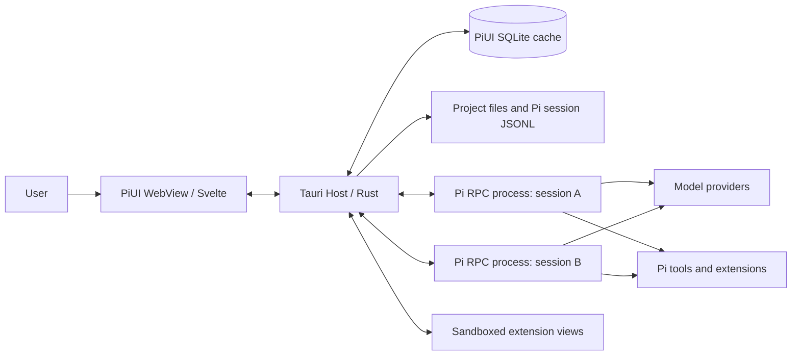

# 03. PiUI Architecture

## 1. Architectural goal

PiUI must be a thin desktop shell that:

- launches the official Pi runtime without rewriting the agent loop;
- withstands the crash, hang, or incompatibility of an individual session;
- does not keep a runtime process for every historical chat;
- provides extensions with stable semantic integration points;
- remains responsive with long sessions and streaming output;
- is designed consistently for Windows, Linux, and macOS;
- can update the Pi runtime independently of the UI without silently breaking compatibility.

The architecture must be **local by default**. Pi itself may use external model providers, but PiUI does not require its own server, account, or cloud database.

## 2. Adopted stack decision

| Layer | Choice | Purpose |
|---|---|---|
| Desktop host | Tauri 2 / Rust | windows, IPC, processes, file operations, system integration, updater |
| UI | Svelte 5 + TypeScript + Vite | chat timeline, sidebar, settings, extension surfaces |
| UI primitives | custom tokens + selected Bits UI primitives | accessible dialog/menu/select/tooltip without a prebuilt visual theme |
| Runtime transport | Pi RPC over JSONL through stdin/stdout | session commands and event streaming |
| Process runtime | `tokio::process::Command` | precise control of framing, stderr, process group/job object, and shutdown |
| Metadata/index | SQLite through `rusqlite`, FTS5 optional | projects, UI metadata, and rebuildable search |
| File watching | `notify` | incremental discovery of session files and package changes |
| Trash | system recycle bin through a Rust crate/platform adapter | reversible deletion of session files |
| Tests | Rust tests, Vitest, Playwright + packaged smoke tests | contracts, UI, runtime, and platforms |

### Why not Electron

Electron simplifies Node integration, but includes a separate Chromium/Node runtime for each application window. This is a poor baseline choice for the minimum idle-footprint requirement. PiUI does not need the Node API in the frontend: the trusted host must own processes and files regardless.

### Why not Flutter

Flutter can provide a fast native-like UI; however, the Pi ecosystem and its extensions are TypeScript-oriented. Svelte/TypeScript enables reuse of manifest and host API types, while sandboxed extension views fit naturally in a WebView/iframe.

### Why not Qt

Qt provides a mature desktop stack, but complicates the TypeScript-oriented extension SDK and delivery of web-based isolated views. It remains a fallback alternative if measurements show an unacceptable divergence in system WebViews across platforms.

### Why Svelte without SvelteKit

PiUI is a single-window local application without SSR, server routes, or web deployment. A regular Vite build reduces the configuration surface. Screen routing is implemented as a local state machine rather than a URL-first framework.

## 3. System context



The primary trust boundary runs between WebView/extension views and the Rust host. Pi processes run as local child processes with user privileges; this is not a sandbox.

## 4. Process topology

### 4.1 One process per genuinely active session

Runtime-slot states:

```text
Dormant -> Starting -> Ready -> Running -> Ready
                    \-> Failed -> Recovering -> Ready|Dormant
Ready|Running -> Stopping -> Dormant
```

- **Dormant:** history is available from the indexer; no Pi process exists.
- **Starting:** the runtime is selected, its version checked, RPC launched, and the handshake completed.
- **Ready:** the process keeps the session open and accepts commands.
- **Running:** an assistant turn/tool execution is in progress.
- **Recovering:** PiUI restores the view from JSONL and offers to reopen the runtime.
- **Stopping:** graceful termination, followed by a platform-specific termination fallback.

A historical list of hundreds of sessions must not mean hundreds of processes.

### 4.2 Pool policy

Default parameters:

- `maxLiveRuntimes = 3`;
- the active tab is not evicted;
- a session with an unfinished turn is not evicted;
- an idle ready process is closed after 10 minutes;
- when the limit is exceeded, the longest-unused idle runtime is closed;
- values are available in Advanced settings, but the core UX does not promote parallelism as a separate feature.

For the MVP, `maxLiveRuntimes = 1` is acceptable if the multi-session supervisor is not ready. Contracts must nevertheless support multiple runtime IDs from the outset.

### 4.3 Child-process management

The host must:

- launch Pi with an explicit project `cwd`;
- set a controlled environment and not log secrets;
- read stdout byte-by-byte/in chunks and split only on `0x0A`;
- limit the maximum size of a single protocol frame;
- read stderr separately and place it in a redactable diagnostic ring buffer;
- create a separate process group on Unix;
- use a Job Object or equivalent on Windows to terminate the process tree;
- distinguish normal EOF from a crash and protocol corruption;
- not treat a stderr line as an RPC event;
- serialize commands for which Pi requires ordering, and support correlation IDs at the PiUI adapter level.

The Tauri sidecar is used to package a managed runtime, but the supervisor itself is built on `tokio::process`, not a frontend shell plugin.

## 5. Runtime modes

PiUI supports three modes, all through a single `RuntimeAdapter`:

### Managed Pi

PiUI ships a verified version of Pi as a sidecar or installs it in an app-managed directory. The preferred candidate is the official standalone Pi executable with its runtime assets from a versioned upstream release; PiUI does not run `npm install` at application startup and does not require Node/Bun on the user's system. If a ready upstream artifact is unavailable for the required platform, a reproducible build from versioned release source using the same upstream build path is permitted, but only after license/provenance review.

- recommended mode for public releases;
- version, target triple, upstream source URL/hash, and PiUI compatibility range are pinned in a signed release manifest;
- the upstream checksum is verified before PiUI artifact re-signing/packaging;
- runtime updates are separate from UI updates and can be rolled back;
- the user's package manager is not affected;
- the host shows the actual version, origin, hash, and path;
- the absence of a managed artifact does not block system/custom modes.

### System Pi

Uses `pi` from `PATH`.

- convenient for developers and internal alpha;
- PiUI performs a version/capability probe before launch;
- on incompatibility, it does not attempt to continue silently;
- the user sees which executable was found.

### Custom executable

The user selects a binary/launcher manually.

- required for forks, development builds, and Nix-like environments;
- the path is stored as a setting, but a project cannot replace it itself;
- this runtime is marked as custom and is not updated by PiUI.

### Adapter requirement

```rust
trait RuntimeAdapter {
    async fn probe(&self) -> Result<RuntimeCapabilities, RuntimeError>;
    async fn open(&self, request: OpenRuntimeRequest) -> Result<RuntimeHandle, RuntimeError>;
    async fn command(&self, handle: RuntimeId, command: RuntimeCommand) -> Result<(), RuntimeError>;
    async fn stop(&self, handle: RuntimeId, mode: StopMode) -> Result<(), RuntimeError>;
    fn subscribe(&self, handle: RuntimeId) -> RuntimeEventStream;
}
```

The UI does not know whether the executable is managed or system Pi.

## 6. Capability negotiation

The Pi version alone is insufficient. At startup, the host forms a capability set based on:

1. the executable version;
2. successful responses to safe RPC probes;
3. available commands;
4. an opt-in bridge extension, if installed;
5. the PiUI runtime protocol version.

Example capabilities:

```json
{
  "rpc": true,
  "images": true,
  "models.list": true,
  "session.switch": true,
  "session.tree.read": true,
  "session.tree.navigate": false,
  "session.shutdown": false,
  "auth.headless": false,
  "ui.standardDialogs": true,
  "ui.customTui": false,
  "piuiBridge": null
}
```

The frontend shows or disables an action based on a capability, not a version name. Any missing capability must result in a clear fallback, not a UI exception.

## 7. Rust host components

```text
src-tauri/src/
  app/                 use cases and orchestration
  runtime/
    supervisor.rs
    rpc_codec.rs
    pi_rpc_adapter.rs
    capability_probe.rs
    process_tree.rs
  sessions/
    scanner.rs
    jsonl_reader.rs
    indexer.rs
    repository.rs
  projects/
    registry.rs
    trust.rs
  attachments/
    resolver.rs
    managed_store.rs
  extensions/
    discovery.rs
    manifest.rs
    grants.rs
    view_broker.rs
  ipc/
    commands.rs
    events.rs
    dto.rs
  platform/
    windows.rs
    linux.rs
    macos.rs
  security/
    redaction.rs
    path_policy.rs
  db/
    migrations.rs
    repositories.rs
  diagnostics/
    logging.rs
    bundle.rs
```

### Core services

- `ProjectRegistry`: canonical path, display name, ordering, trust state.
- `SessionScanner`: read-only Pi JSONL discovery, incremental metadata extraction.
- `SessionIndex`: rebuildable SQLite/FTS index.
- `RuntimeSupervisor`: Pi process lifecycle, command queues, crash recovery.
- `AttachmentResolver`: image encoding, file-reference policy, managed copies.
- `ExtensionRegistry`: discovery, validation, enablement, and permission grants.
- `ViewBroker`: isolated message channel between the extension iframe/worker and host.
- `DiagnosticsService`: redacted logs and support bundle.

## 8. Frontend components

```text
src/
  app/                 shell and screen state machine
  features/
    projects/
    sessions/
    chat/
    composer/
    settings/
    extensions/
    trust/
  components/          PiUI-owned presentation components
  primitives/          thin wrappers over accessible headless primitives
  stores/              small domain stores
  host-api/            generated bindings/events
  renderers/
    markdown/
    tool/
    message/
    extension/
  styles/
    tokens.css
    reset.css
  workers/
    search-client.ts
```

### State ownership

- Rust owns process state, project trust, filesystem state, and extension grants.
- The frontend owns selection, scroll anchor, expanded/collapsed blocks, and transient menus.
- Text drafts are stored in SQLite with debounce, but the current line remains local for immediate input.
- The frontend timeline cache is bounded; older blocks may be unloaded and requested in pages.

A single global mutable store containing the entire application is not allowed.

## 9. Typed IPC between Svelte and Rust

### Commands

The frontend calls only commands of the form:

```ts
openProject(path)
listProjects()
listSessions(projectId, cursor)
openSession(projectId, sessionId)
createSession(projectId, options)
sendTurn(runtimeId, input, attachments, mode)
abortTurn(runtimeId)
setModel(runtimeId, modelRef)
setThinking(runtimeId, level)
renameSession(sessionId, name)
exportSession(sessionId, target)
trashSession(sessionId)
respondToUiRequest(requestId, value)
setExtensionGrant(extensionId, permission, decision)
```

Each command:

- validates IDs and paths on the Rust side;
- returns a typed result with a stable error code;
- does not accept a shell string;
- does not return secrets;
- has maximum payload limits.

### Events

Rust publishes discriminated unions:

```ts
type HostEvent =
  | { type: 'runtime.state'; runtimeId: string; state: RuntimeState }
  | { type: 'session.delta'; runtimeId: string; delta: SessionDelta }
  | { type: 'session.reindexed'; sessionId: string; revision: number }
  | { type: 'ui.request'; runtimeId: string; request: UiRequest }
  | { type: 'notification'; level: NoticeLevel; message: string }
  | { type: 'extension.changed'; extensionId: string }
  | { type: 'diagnostic'; code: string; safeSummary: string };
```

High-frequency token events are batched by the host or frontend scheduler into 16–33 ms frames. One token must not mean one full-tree render.

## 10. Timeline representation

Pipeline:

```text
Pi RPC event / JSONL entry
  -> normalized SessionDelta
  -> immutable block model
  -> renderer registry
  -> virtualized timeline
```

A normalized block does not lose the raw payload or source entry ID:

```ts
interface TimelineBlock {
  id: string;
  parentId?: string;
  kind: 'user' | 'assistant' | 'thinking' | 'tool' | 'custom' | 'error' | 'compaction';
  status: 'pending' | 'streaming' | 'complete' | 'failed';
  source: { sessionId: string; entryId?: string; extensionId?: string };
  content: unknown;
  raw?: unknown;
}
```

The renderer registry always ends with a generic JSON/text fallback. No renderer can make an entry invisible without an explicit user filter.

## 11. Extension architecture

The extension host consists of three independent mechanisms:

1. **Backend compatibility:** Pi itself loads standard Pi extensions.
2. **Declarative contributions:** PiUI reads the manifest as data and renders it with its own components.
3. **Sandboxed rich views:** an isolated iframe/worker communicating through a versioned broker.

Trusted shell replacement is a separate mode, not part of the normal extension loading path.

A project-local UI package is not loaded before trust. Backend Pi resources also must not start before trust in a PiUI-controlled workflow.

## 12. Storage and index

- Pi session JSONL is authoritative.
- PiUI SQLite is cache and metadata.
- The scanner does not keep all messages from all sessions in memory.
- At startup, project/session headers and recent metadata are read; full indexing runs after the usable shell with I/O throttling.
- FTS may be disabled.
- The index has a schema version and generation ID.
- On incompatibility, the database is renamed to a backup and rebuilt rather than migrating session content.

## 13. Handling long sessions

Required techniques:

- block virtualization after 200 timeline blocks;
- height measurement and scroll-anchor preservation;
- windowed loading backward/forward;
- memoized Markdown AST for completed messages;
- code highlighting in a worker or lazily after viewport entry;
- collapsed tool output with an initial-render limit;
- streaming plaintext/minimal Markdown, final parse after block completion;
- blob/object URLs for local images instead of repeated base64 in the DOM;
- release preview resources on close.

## 14. Startup pipeline

1. Show the window and shell from local settings.
2. Open SQLite and the project registry.
3. Check the crash marker/safe mode.
4. Quickly scan session headers for the selected project.
5. Show the list and most recently selected session from read-only data.
6. Start the runtime only when an interactive session is created or continued.
7. In the background after the first usable state: FTS indexing, update check, package validation.

Network, providers, and the model list do not block steps 1–5.

## 15. Error containment

| Error | Behavior |
|---|---|
| One Pi process crashes | other sessions and the shell continue working; the chat enters a recoverable state |
| Invalid JSON frame | retain redacted diagnostics; stop only this runtime |
| Extension renderer crashes | replace with generic fallback; disable the renderer after a crash loop |
| SQLite is corrupted | close/rename the cache; rebuild from JSONL |
| Session JSONL has an incomplete final line | do not consider the file lost; wait for a change or open through the last complete LF |
| Project path disappears | retain the registry; show missing state and Locate/Remove |
| Managed Pi is incompatible | roll back the runtime or explicitly repair; do not change JSONL |
| WebView reload | the host continues controlling the process; the UI requests snapshot and revision |

## 16. Packaging and updates

Release artifacts:

- Windows: signed installer, WebView2 bootstrap policy, x64 mandatory; ARM64 after the matrix.
- Linux: AppImage and/or deb/rpm after the distro matrix; system WebKit dependency explicitly documented.
- macOS: signed/notarized universal or separate arm64/x64 builds.

UI updates and managed Pi updates have separate versions and a compatibility matrix. Auto-update is not applied during a running turn; downloading may proceed, while installation follows an explicit restart.

## 17. Observability without telemetry

By default, data remains local:

- structured rotating logs with redaction;
- in-memory runtime lifecycle metrics;
- user-facing “Export diagnostics” command;
- the diagnostic bundle lists versions, capabilities, platform, crash codes, and recent safe stderr lines;
- prompts, tool arguments, paths, and environment are excluded by default or require a separate opt-in preview.

There is no remote telemetry in 1.0.

## 18. Repository

Recommended monorepo:

```text
piui/
  apps/desktop/              Svelte frontend + Tauri shell
  crates/piui-runtime/       process supervisor/RPC codec
  crates/piui-index/         JSONL scanner/SQLite index
  crates/piui-extensions/    manifest/grants/view broker
  packages/contracts/        TS types + generated schemas
  packages/extension-sdk/    author-facing helpers
  packages/ui-nodes/         declarative node validation
  examples/extensions/
  tests/fixtures/
  docs/
```

`packages/contracts` is published independently only after stabilization. Within the repository, Rust and TS types are generated from one schema source or verified with golden fixtures to prevent drift.

## 19. Architectural acceptance criteria

The architecture is considered validated when:

- the same session file opens and continues in PiUI and the CLI;
- closing an idle runtime does not change history;
- a runtime crash does not crash the desktop shell with it;
- deleting SQLite does not delete or corrupt any Pi session;
- the WebView cannot execute an arbitrary command or read a path without host policy;
- an extension without a PiUI manifest works backend-only;
- disabling an extension leaves all entries readable by the generic renderer;
- the long-session fixture remains scrollable within the performance budget;
- Windows/Linux process-tree tests leave no orphaned tool processes.
