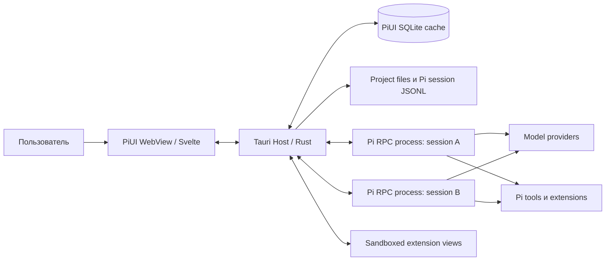

# 03. Архитектура PiUI

## 1. Архитектурная цель

PiUI должен быть тонкой desktop-оболочкой, которая:

- запускает официальный Pi runtime без переписывания agent loop;
- выдерживает падение, зависание или несовместимость отдельной сессии;
- не держит runtime-процесс для каждого исторического чата;
- предоставляет расширениям стабильные семантические точки интеграции;
- остаётся отзывчивой на длинных сессиях и потоковом выводе;
- одинаково проектируется для Windows, Linux и macOS;
- может обновлять Pi runtime независимо от UI, но не незаметно нарушать совместимость.

Архитектура обязана быть **локальной по умолчанию**. Для работы самого Pi могут использоваться внешние model providers, но PiUI не требует собственного сервера, аккаунта или облачной БД.

## 2. Принятое решение по стеку

| Слой | Выбор | Назначение |
|---|---|---|
| Desktop host | Tauri 2 / Rust | окна, IPC, процессы, файловые операции, системная интеграция, updater |
| UI | Svelte 5 + TypeScript + Vite | chat timeline, sidebar, settings, extension surfaces |
| UI primitives | собственные токены + выборочные Bits UI primitives | доступные dialog/menu/select/tooltip без готовой визуальной темы |
| Runtime transport | Pi RPC по JSONL через stdin/stdout | команды сессии и поток событий |
| Process runtime | `tokio::process::Command` | точный контроль framing, stderr, process group/job object и shutdown |
| Metadata/index | SQLite через `rusqlite`, FTS5 опционально | проекты, UI metadata и перестраиваемый поиск |
| File watching | `notify` | инкрементальное обнаружение session files и package changes |
| Trash | системная корзина через Rust crate/platform adapter | обратимое удаление session files |
| Tests | Rust tests, Vitest, Playwright + packaged smoke tests | contracts, UI, runtime и платформы |

### Почему не Electron

Electron упрощает Node-интеграцию, но включает отдельный Chromium/Node runtime на окно приложения. Для требования минимального idle footprint это плохой базовый выбор. PiUI не нуждается в Node API во frontend: процессами и файлами всё равно должен владеть доверенный host.

### Почему не Flutter

Flutter может дать быстрый native-like UI, однако экосистема Pi и его расширений TypeScript-ориентирована. Svelte/TypeScript позволяет переиспользовать типы manifest и host API, а sandboxed extension views естественно размещаются в WebView/iframe.

### Почему не Qt

Qt даёт зрелый desktop stack, но усложняет TypeScript-oriented extension SDK и поставку web-based isolated views. Он остаётся резервной альтернативой, если измерения покажут неприемлемое расхождение системных WebView между платформами.

### Почему Svelte без SvelteKit

PiUI — однооконное локальное приложение без SSR, server routes и web deployment. Обычный Vite build уменьшает поверхность конфигурации. Роутинг экранов реализуется локальным state machine, а не URL-first framework.

## 3. Контекст системы



Основная граница доверия проходит между WebView/extension views и Rust host. Pi processes запускаются как локальные дочерние процессы с правами пользователя; это не sandbox.

## 4. Топология процессов

### 4.1 Один процесс на реально активную сессию

Состояния runtime slot:

```text
Dormant -> Starting -> Ready -> Running -> Ready
                    \-> Failed -> Recovering -> Ready|Dormant
Ready|Running -> Stopping -> Dormant
```

- **Dormant:** история доступна из индексатора, Pi process отсутствует.
- **Starting:** выбран runtime, проверена версия, запущен RPC, выполнен handshake.
- **Ready:** процесс держит сессию открытой и принимает команды.
- **Running:** идёт assistant turn/tool execution.
- **Recovering:** PiUI восстанавливает представление из JSONL и предлагает повторно открыть runtime.
- **Stopping:** мягкое завершение, затем platform-specific termination fallback.

Исторический список из сотен сессий не должен означать сотни процессов.

### 4.2 Политика пула

Параметры по умолчанию:

- `maxLiveRuntimes = 3`;
- активная вкладка не вытесняется;
- сессия с незавершённым turn не вытесняется;
- idle ready-процесс закрывается после 10 минут;
- при превышении лимита закрывается самый давно неиспользуемый idle runtime;
- значения доступны в Advanced settings, но core UX не рекламирует параллелизм как отдельную функцию.

Для MVP допустим `maxLiveRuntimes = 1`, если multi-session supervisor не готов. Контракты при этом сразу должны поддерживать несколько runtime IDs.

### 4.3 Управление дочерними процессами

Host обязан:

- запускать Pi с явным `cwd` проекта;
- задавать контролируемое окружение и не логировать секреты;
- читать stdout побайтно/чанками и разделять только по `0x0A`;
- ограничивать максимальный размер одного protocol frame;
- читать stderr отдельно и помещать его в redactable diagnostic ring buffer;
- на Unix создавать отдельную process group;
- на Windows использовать Job Object или эквивалент, чтобы завершать дерево процессов;
- отличать нормальный EOF от crash и protocol corruption;
- не считать строку stderr RPC-событием;
- сериализовать команды, для которых Pi требует последовательность, и поддерживать correlation IDs на уровне PiUI adapter.

Tauri sidecar применяется для упаковки managed runtime, но сам supervisor строится на `tokio::process`, а не на frontend shell plugin.

## 5. Runtime modes

PiUI поддерживает три режима, все через один `RuntimeAdapter`:

### Managed Pi

PiUI поставляет проверенную версию Pi как sidecar или устанавливает её в app-managed directory. Предпочтительный кандидат — официальный standalone Pi executable с его runtime assets из versioned upstream release; PiUI не выполняет `npm install` при запуске приложения и не требует Node/Bun в системе пользователя. Если готовый upstream artifact недоступен для нужной платформы, допустима воспроизводимая сборка из versioned release source тем же upstream build path, но только после license/provenance review.

- рекомендуемый режим public release;
- версия, target triple, upstream source URL/hash и PiUI compatibility range закреплены в подписанном release manifest;
- upstream checksum проверяется до переподписания/упаковки артефакта PiUI;
- обновление runtime отделено от UI update и может быть откатано;
- package manager пользователя не затрагивается;
- host показывает фактическую версию, origin, hash и путь;
- отсутствие managed artifact не блокирует system/custom modes.

### System Pi

Используется `pi` из `PATH`.

- удобен разработчикам и для внутреннего alpha;
- PiUI проводит version/capability probe перед запуском;
- при несовместимости не пытается молча продолжить;
- пользователь видит, какой executable найден.

### Custom executable

Пользователь выбирает бинарник/launcher вручную.

- нужен для forks, development builds и Nix-like environments;
- путь хранится как настройка, но проект не может подменить его сам;
- такой runtime помечается как custom и не обновляется PiUI.

### Требование к adapter

```rust
trait RuntimeAdapter {
    async fn probe(&self) -> Result<RuntimeCapabilities, RuntimeError>;
    async fn open(&self, request: OpenRuntimeRequest) -> Result<RuntimeHandle, RuntimeError>;
    async fn command(&self, handle: RuntimeId, command: RuntimeCommand) -> Result<(), RuntimeError>;
    async fn stop(&self, handle: RuntimeId, mode: StopMode) -> Result<(), RuntimeError>;
    fn subscribe(&self, handle: RuntimeId) -> RuntimeEventStream;
}
```

UI не знает, managed это executable или system Pi.

## 6. Capability negotiation

Версия Pi сама по себе недостаточна. При старте host формирует capability set на основании:

1. версии executable;
2. успешного ответа на безопасные RPC probes;
3. доступных команд;
4. opt-in bridge extension, если он установлен;
5. PiUI runtime protocol version.

Пример capabilities:

```json
{
  "rpc": true,
  "images": true,
  "models.list": true,
  "session.switch": true,
  "session.tree.read": true,
  "session.tree.navigate": false,
  "session.shutdown": false,
  "auth.headless": false,
  "ui.standardDialogs": true,
  "ui.customTui": false,
  "piuiBridge": null
}
```

Frontend показывает или отключает действие на основании capability, а не имени версии. Любое отсутствие capability должно приводить к понятному fallback, а не к исключению в UI.

## 7. Компоненты Rust host

```text
src-tauri/src/
  app/                 use cases и orchestration
  runtime/
    supervisor.rs
    rpc_codec.rs
    pi_rpc_adapter.rs
    capability_probe.rs
    process_tree.rs
  sessions/
    scanner.rs
    jsonl_reader.rs
    indexer.rs
    repository.rs
  projects/
    registry.rs
    trust.rs
  attachments/
    resolver.rs
    managed_store.rs
  extensions/
    discovery.rs
    manifest.rs
    grants.rs
    view_broker.rs
  ipc/
    commands.rs
    events.rs
    dto.rs
  platform/
    windows.rs
    linux.rs
    macos.rs
  security/
    redaction.rs
    path_policy.rs
  db/
    migrations.rs
    repositories.rs
  diagnostics/
    logging.rs
    bundle.rs
```

### Основные сервисы

- `ProjectRegistry`: canonical path, display name, ordering, trust state.
- `SessionScanner`: read-only discovery Pi JSONL, incremental metadata extraction.
- `SessionIndex`: rebuildable SQLite/FTS index.
- `RuntimeSupervisor`: lifecycle Pi processes, command queues, crash recovery.
- `AttachmentResolver`: image encoding, file-reference policy, managed copies.
- `ExtensionRegistry`: discovery, validation, enablement and permission grants.
- `ViewBroker`: isolated message channel between extension iframe/worker and host.
- `DiagnosticsService`: redacted logs and support bundle.

## 8. Компоненты frontend

```text
src/
  app/                 shell и screen state machine
  features/
    projects/
    sessions/
    chat/
    composer/
    settings/
    extensions/
    trust/
  components/          PiUI-owned presentation components
  primitives/          thin wrappers over accessible headless primitives
  stores/              небольшие domain stores
  host-api/            generated bindings/events
  renderers/
    markdown/
    tool/
    message/
    extension/
  styles/
    tokens.css
    reset.css
  workers/
    search-client.ts
```

### State ownership

- Rust владеет process state, project trust, filesystem state, extension grants.
- Frontend владеет selection, scroll anchor, expanded/collapsed blocks, transient menus.
- Draft текста хранится в SQLite с debounce, но текущая строка остаётся локальной для мгновенного ввода.
- Timeline cache во frontend ограничен; старые блоки могут выгружаться и запрашиваться страницами.

Не допускается единый глобальный mutable store со всем приложением.

## 9. Typed IPC между Svelte и Rust

### Команды

Frontend вызывает только команды вида:

```ts
openProject(path)
listProjects()
listSessions(projectId, cursor)
openSession(projectId, sessionId)
createSession(projectId, options)
sendTurn(runtimeId, input, attachments, mode)
abortTurn(runtimeId)
setModel(runtimeId, modelRef)
setThinking(runtimeId, level)
renameSession(sessionId, name)
exportSession(sessionId, target)
trashSession(sessionId)
respondToUiRequest(requestId, value)
setExtensionGrant(extensionId, permission, decision)
```

Каждая команда:

- валидирует IDs и paths на Rust стороне;
- возвращает typed result с stable error code;
- не принимает shell string;
- не возвращает секреты;
- имеет max payload limits.

### События

Rust публикует discriminated unions:

```ts
type HostEvent =
  | { type: 'runtime.state'; runtimeId: string; state: RuntimeState }
  | { type: 'session.delta'; runtimeId: string; delta: SessionDelta }
  | { type: 'session.reindexed'; sessionId: string; revision: number }
  | { type: 'ui.request'; runtimeId: string; request: UiRequest }
  | { type: 'notification'; level: NoticeLevel; message: string }
  | { type: 'extension.changed'; extensionId: string }
  | { type: 'diagnostic'; code: string; safeSummary: string };
```

Высокочастотные token events агрегируются host или frontend scheduler в кадры 16–33 ms. Один token не должен означать один full-tree render.

## 10. Представление timeline

Pipeline:

```text
Pi RPC event / JSONL entry
  -> normalized SessionDelta
  -> immutable block model
  -> renderer registry
  -> virtualized timeline
```

Нормализованный block не теряет raw payload и source entry ID:

```ts
interface TimelineBlock {
  id: string;
  parentId?: string;
  kind: 'user' | 'assistant' | 'thinking' | 'tool' | 'custom' | 'error' | 'compaction';
  status: 'pending' | 'streaming' | 'complete' | 'failed';
  source: { sessionId: string; entryId?: string; extensionId?: string };
  content: unknown;
  raw?: unknown;
}
```

Renderer registry всегда заканчивается generic JSON/text fallback. Никакой renderer не может сделать запись невидимой без явного фильтра пользователя.

## 11. Extension architecture

Extension host состоит из трёх независимых механизмов:

1. **Backend compatibility:** Pi сам загружает обычные Pi extensions.
2. **Declarative contributions:** PiUI читает manifest как данные и отображает собственными компонентами.
3. **Sandboxed rich views:** изолированный iframe/worker, общающийся через versioned broker.

Trusted shell replacement — отдельный режим, не часть обычного extension loading path.

Project-local UI package не загружается до trust. Backend Pi resources также не должны запускаться до доверия в PiUI-controlled workflow.

## 12. Хранение и индекс

- Pi session JSONL — authoritative.
- PiUI SQLite — cache и metadata.
- Scanner не держит все сообщения всех сессий в памяти.
- На startup читаются project/session headers и последние metadata; full indexing идёт после usable shell с ограничением I/O.
- FTS можно отключить.
- Индекс имеет schema version и generation ID.
- При несовместимости база переименовывается в backup и перестраивается, а не мигрирует session content.

## 13. Работа с длинными сессиями

Обязательные техники:

- block virtualization после 200 timeline blocks;
- измерение высоты и сохранение scroll anchor;
- windowed loading назад/вперёд;
- memoized Markdown AST для завершённых сообщений;
- code highlighting в worker или лениво после viewport entry;
- collapsed tool output с лимитом initial render;
- потоковый plaintext/минимальный Markdown, финальный parse после завершения блока;
- blob/object URLs для локальных изображений вместо повторного base64 в DOM;
- освобождение preview resources при закрытии.

## 14. Startup pipeline

1. Показать окно и shell из локальных настроек.
2. Открыть SQLite и реестр проектов.
3. Проверить crash marker/safe mode.
4. Быстро просканировать session headers для выбранного проекта.
5. Показать список и последнюю выбранную сессию из read-only данных.
6. Запустить runtime только при создании/продолжении интерактивной сессии.
7. В фоне после first usable state: FTS indexing, update check, package validation.

Сеть, providers и model list не блокируют шаги 1–5.

## 15. Error containment

| Ошибка | Поведение |
|---|---|
| Один Pi process упал | остальные сессии и shell работают; чат переходит в recoverable state |
| Некорректный JSON frame | сохранить redacted diagnostics, остановить только этот runtime |
| Extension renderer упал | заменить generic fallback, отключить renderer после crash loop |
| SQLite повреждён | закрыть/переименовать cache, перестроить из JSONL |
| Session JSONL имеет неполную последнюю строку | не считать файл потерянным; дождаться изменения или открыть до последней полной LF |
| Project path исчез | сохранить реестр, показать missing state и Locate/Remove |
| Managed Pi несовместим | rollback runtime или явный repair; не менять JSONL |
| WebView reload | host продолжает контролировать процесс; UI запрашивает snapshot и revision |

## 16. Packaging и обновления

Release artifacts:

- Windows: signed installer, WebView2 bootstrap policy, x64 обязательно; ARM64 после матрицы.
- Linux: AppImage и/или deb/rpm после distro matrix; system WebKit dependency явно документируется.
- macOS: signed/notarized universal или разделённые arm64/x64 builds.

UI update и managed Pi update имеют отдельные версии и compatibility matrix. Автообновление не применяется во время running turn; скачивание может идти, установка — после явного restart.

## 17. Наблюдаемость без telemetry

По умолчанию данные остаются локально:

- structured rotating logs с redaction;
- runtime lifecycle metrics в памяти;
- пользовательская команда «Export diagnostics»;
- diagnostic bundle перечисляет версии, capabilities, platform, crash codes и последние безопасные stderr lines;
- prompts, tool arguments, paths и environment исключены по умолчанию либо требуют отдельного opt-in preview.

Удалённая telemetry отсутствует в 1.0.

## 18. Репозиторий

Рекомендуемый monorepo:

```text
piui/
  apps/desktop/              Svelte frontend + Tauri shell
  crates/piui-runtime/       process supervisor/RPC codec
  crates/piui-index/         JSONL scanner/SQLite index
  crates/piui-extensions/    manifest/grants/view broker
  packages/contracts/        TS types + generated schemas
  packages/extension-sdk/    author-facing helpers
  packages/ui-nodes/         declarative node validation
  examples/extensions/
  tests/fixtures/
  docs/
```

`packages/contracts` публикуется независимо только после стабилизации. Внутри репозитория Rust и TS типы генерируются из одного schema source либо проверяются golden fixtures, чтобы избежать drift.

## 19. Архитектурные критерии приёмки

Архитектура считается подтверждённой, когда:

- одна и та же session file открывается и продолжается в PiUI и CLI;
- закрытие idle runtime не меняет историю;
- crash runtime не падает вместе с desktop shell;
- удаление SQLite не удаляет и не повреждает ни одной Pi session;
- WebView не может выполнить произвольную команду или прочитать путь без host policy;
- extension без PiUI manifest работает backend-only;
- отключение extension оставляет все записи читаемыми generic renderer;
- long-session fixture остаётся прокручиваемым в рамках performance budget;
- Windows/Linux process-tree tests не оставляют orphan tool processes.
