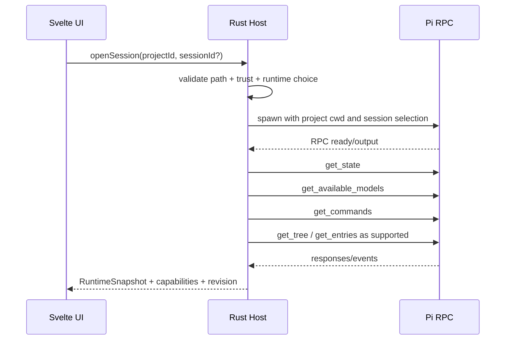

# 04. Pi Integration

## 1. Integration principle

PiUI uses Pi as the sole source of agent behavior. It does not call model providers directly or interpret tools in place of Pi. The primary transport is the official RPC mode:

```text
PiUI Rust host <-> stdin/stdout JSONL <-> pi --mode rpc
```

Each launch is bound to a specific project `cwd` and, when supported by the selected launch method, to an existing or new Pi session.

## 2. What belongs to Pi and what belongs to PiUI

| Area | Owner |
|---|---|
| provider authentication and model requests | Pi |
| agent loop, tools, compaction, steering queue | Pi |
| Pi extensions and their backend lifecycle | Pi |
| session entries and branching | Pi session format/API |
| project/session navigation GUI | PiUI |
| process lifecycle, recovery, diagnostics | PiUI host |
| visual timeline and composer | PiUI |
| project registry and UI drafts | PiUI SQLite |
| generic file-reference UX | PiUI adapter, then Pi prompt/tools |
| PiUI-specific extension surfaces | PiUI Extension SDK |

No PiUI feature must become a second canonical representation of agent state.

### Global extension configuration

PiUI does not parse or write Pi `settings.json`. Extension settings invoke a small typed host adapter which, in offline mode, imports upstream `SettingsManager` and `DefaultPackageManager`, skips installation of missing packages, and uses the same setters as `pi config`. Only global user resources are projected into the UI; filesystem paths and package source strings do not cross IPC. A toggle applies to future runtime starts. Project-local resources remain outside this surface and require a separate trusted-project flow.

## 3. Protocol framing

### 3.1 Codec requirements

- one JSON command per line, terminated by LF (`0x0A`);
- one JSON response/event per LF-framed stdout line;
- CR before LF is allowed only if confirmed by a fixture; the codec does not use universal Unicode `lines()` behavior;
- empty lines are ignored with a diagnostic counter;
- a frame larger than the configurable limit, for example 32 MiB, stops the runtime as a protocol violation;
- invalid UTF-8 and JSON are not substituted with replacement characters without recording the reason;
- stderr is not mixed with stdout;
- an incomplete frame at EOF is recorded separately;
- the parser is fuzz-tested on chunk boundaries.

### 3.2 Correlation

PiUI wraps RPC calls with an internal `commandId`, even if the specific Pi request/response already has its own ID. This is needed for:

- timeout/cancellation;
- linking a UI action to a response;
- diagnostics without logging payloads;
- repeating a snapshot after WebView reload.

An unknown event type is retained as `runtime.unknown` and does not crash the process. This ensures forward compatibility.

## 4. Startup handshake



The probe order must be tolerant: the absence of one command does not cancel basic chat if `prompt` and state are available.

## 5. Mapping core capabilities

Exact payloads are taken from the current Pi RPC schema and pinned in contract fixtures. The table defines product semantics; it does not replace upstream documentation.

| Pi capability/command | PiUI action | Fallback |
|---|---|---|
| `prompt` | send a new user turn | block the composer with a diagnostic error |
| `steer` | intervene in the current turn | queue a follow-up if steer is unavailable |
| `follow_up` | add the next turn to the queue | local draft until the current turn completes |
| `abort` | Stop | terminate the runtime only after timeout and warning |
| `get_state` | runtime/session snapshot | read-only JSONL snapshot + reconnect |
| `get_available_models` | model picker | current model + link in settings/diagnostics |
| model switch command | change model | unavailable action with a reason |
| thinking level commands | thinking picker | hide the picker; do not emulate prompt text |
| queue mode commands | Steer/Follow-up semantics | fixed safe mode |
| `new_session` | new chat | new process/bootstrap path |
| `switch_session` | open an existing session in the process | new process with session selector |
| `fork` / `clone` | create a branch/copy | hide advanced action |
| `get_entries` | page the timeline | read-only scanner for history, RPC for live state |
| `get_tree` | show the tree | read-only tree without a navigation action |
| set session name | Rename | UI alias in cache only as a temporary fallback, explicitly marked |
| export | export transcript | host-side generic export only if output is identical/explicitly different |
| `get_commands` | slash autocomplete | PiUI core commands + discovered extension commands |
| Extension UI Protocol | dialogs/status/widgets | generic native surfaces |

## 6. Message/event normalization

PiUI does not render upstream JSON directly. The adapter transforms it into stable internal events; the raw source remains only in Pi JSONL/host and does not cross WebView IPC:

```ts
type SessionDelta =
  | { kind: 'turn.started'; turnId: string }
  | { kind: 'message.started'; block: TimelineBlock }
  | { kind: 'message.text.delta'; blockId: string; text: string }
  | { kind: 'message.thinking.delta'; blockId: string; text: string }
  | { kind: 'tool.started'; blockId: string; tool: ToolInvocation }
  | { kind: 'tool.updated'; blockId: string; safeSummary?: string }
  | { kind: 'tool.completed'; blockId: string; toolName: string; isError: boolean; safeSummary?: string }
  | { kind: 'entry.appended'; blockId: string; entryKind: string; text?: string }
  | { kind: 'turn.completed'; turnId: string; stopReason?: string }
  | { kind: 'runtime.error'; code: string; recoverable: boolean };
```

Rules:

- event order is preserved within one runtime;
- the host assigns a monotonically increasing `revision`;
- the UI applies a delta only to the expected revision, or requests a snapshot;
- a duplicate event after reconnect must be idempotent by entry/block ID;
- persisted projection v2 knows Pi v3 `user`, `assistant`, `thinking`, `toolCall`, `toolResult`, `bashExecution`, `custom_message`, and `compaction`;
- tool call/result are correlated host-side; a tool-only assistant entry does not create an empty Pi message;
- tool result is never executed as HTML;
- Markdown is converted into allowlisted AST nodes and never uses raw `{@html}`;
- unknown entries are shown as a compact generic compatibility disclosure without the raw payload;
- live blocks and persisted blocks use one renderer; after a turn, a host rescan replaces completed ephemeral blocks.

## 7. Streaming and queue

### Composer modes

The user sees explicit semantics:

- **Send** in Ready — regular `prompt`;
- **Steer** during Running — the message directs the current turn;
- **Queue next** — a follow-up after the current turn;
- **Stop** — `abort`.

Enter must not silently change semantics based on timing. Recommended default:

- Enter sends `prompt` in Ready;
- during Running, Enter queues a follow-up;
- a separate button/shortcut performs Steer;
- a tooltip and queue badge show the selected mode.

The queue-mode setting is synchronized through Pi RPC if the capability is available.

### Abort escalation

1. send `abort`;
2. wait for confirmation/state within the timeout;
3. show “Agent does not respond”;
4. allow `Force stop runtime`;
5. terminate the process tree;
6. reread JSONL through the last complete entry and offer reopen.

Force stop must not automatically repeat the prompt.

## 8. Models and thinking level

Model picker:

- is loaded from `get_available_models`, not a hardcoded registry;
- shows the provider/model ID and available traits actually returned by Pi;
- supports search and recent models;
- marks the current model even if it disappears from the list;
- displays a provider/auth error adjacent to it and does not block history viewing;
- switching occurs before sending the next prompt and is confirmed by state/event.

Thinking picker:

- is built from capabilities/current state;
- does not promise levels unavailable to the selected model/runtime;
- is hidden if Pi does not report a controllable thinking level;
- the value is saved by Pi, not only as a UI preference.

## 9. Sessions

### 9.1 Discovery

For the list, PiUI reads session files through a separate read-only scanner. This is necessary to avoid starting Pi for every sidebar row. The scanner extracts:

- session identifier/path;
- project/cwd metadata;
- session name;
- created/updated time;
- first user text preview;
- last complete entry;
- branch/tree summary;
- runtime/model metadata, if present;
- parse health.

PiUI does not invent a new session ID or rename a file for sorting.

### 9.2 Opening

The preferred path is a documented Pi startup/session selector or RPC `switch_session`. Before implementation, it is mandatory to verify whether bare RPC startup creates an empty session entry/file. If it does, the host must use a launch option/bridge that prevents ghost sessions.

### 9.3 Creation

`New chat` in the system Chats group immediately opens an empty composer; the runtime in a host-owned neutral CWD starts lazily on the first Send. A contextual project chat similarly starts Pi in the selected project `cwd` only on Send. Opening and rapidly switching history sessions does not create an agent process: the UI reuses a bounded display-safe provider/model cache. On first launch, the user may explicitly choose `Load available models…`; this action activates the current session through the same typed runtime adapter, not a separate catalog subprocess. In both cases, Pi remains the only writer: an empty session may be in memory until the first assistant response. A session appears in the sidebar only after durable Pi JSONL/file appears, not from an optimistic fake ID.

### 9.4 Rename

Renaming proceeds through a Pi command. Until confirmation, the UI shows a pending state. A local display alias must not present itself as a Pi session name; it is permitted only as a temporary internal workaround and is removed after upstream support.

### 9.5 Tree, fork, and clone

- `get_tree` is used to read the branch graph;
- `fork`/`clone` are called through Pi, and the scanner refreshes the list after the response;
- PiUI does not change `parentId` in JSONL;
- navigation to an arbitrary old branch is enabled only when a documented capability is available;
- until then, the tree panel is read-only with actions Pi actually supports.

### 9.6 Trash

For an inactive session, the host moves the entire session file to the system recycle bin. For an active session:

1. warns about the running state;
2. aborts/stops the runtime;
3. closes file handles;
4. moves the file to the recycle bin;
5. deletes only rebuildable index rows.

PiUI does not implement permanent delete in the primary 1.0 UX.

## 10. Standard Pi Extension UI Protocol

Pi RPC conveys some `ctx.ui` interactions. PiUI maps them as follows:

| Extension request/effect | PiUI renderer |
|---|---|
| select | searchable native modal/listbox |
| confirm | modal with exact text and safe default |
| input | single-line dialog |
| editor | multi-line dialog with monospaced option |
| notify | toast + notification center |
| status | runtime/session status strip |
| widget | standard RPC: safe text lines; PiUI SDK: separate validated UI nodes |
| title | session/window title hint, not full OS-title control without policy |
| editor text | composer draft update with visible source indicator |

Requirements:

- every request has an ID, timeout policy, and cancel response;
- the modal queue belongs to a specific runtime;
- closing the window/session responds with cancellation rather than leaving Pi waiting forever;
- the extension name/source is visible to the user;
- rich/unknown payload has a fallback;
- a request cannot open an arbitrary URL/path without host permission.

### Unsupported TUI parity

RPC does not mean full support for all TUI customizations. PiUI 1.0 does not emulate by guesswork:

- `ctx.ui.custom()`;
- custom header/footer;
- TUI editor replacement;
- TUI themes;
- direct terminal-cell control.

PiUI Extension SDK is used for these, as described separately.

## 11. Slash commands

Autocomplete combines:

1. PiUI-owned commands: `/new`, `/open`, `/settings`, `/extensions`, `/diagnostics`;
2. commands from `get_commands`;
3. declarative PiUI commands from enabled extension manifests.

Namespace and collision rules:

- PiUI core commands are reserved;
- a backend extension command retains the Pi name;
- a UI-only command is recommended to be declared as `extensionId.command` and may have a label;
- a collision is not resolved by installation order: the UI shows qualified choices;
- built-in TUI commands absent from RPC must not be faked as Pi commands.

## 12. Attachments

### 12.1 Images

Images are the only attachment type PiUI may pass through an image-aware RPC payload without an additional tool convention.

Flow:

1. the user selects/pastes/drops an image;
2. the host validates MIME by content and size;
3. creates a safe preview URL;
4. at send time, encodes it in the format expected by the current Pi RPC;
5. saves a provenance reference in PiUI metadata but does not duplicate base64 in SQLite;
6. the timeline displays a thumbnail and open preview;
7. if the model does not support image input, Send is blocked with an exact explanation or the attachment is removed by the user.

Limits are required for quantity, individual size, and total size.

### 12.2 File inside the project

By default, PiUI attaches a **structured reference to a relative path**, rather than reading the entire file into the prompt:

```text
Attachment: project://src/lib/parser.ts
Resolved path: <project root>/src/lib/parser.ts
```

The actual prompt encoding must be stable and documented, for example human-readable fenced attachment references. Pi/tools decide when to read the file. The UI shows that this is a path reference, not an upload of contents to the model.

### 12.3 External file

The user selects one of the modes:

- **Reference original:** the absolute path is passed as a controlled file reference; it may cease to exist.
- **Copy to managed attachments:** the host copies the file to app-managed storage, computes a hash, and retains provenance. It does not put the file in the repository without a separate action.

No automatic copying to the project root.

### 12.4 PDF and office documents

PiUI shows name/type/size and passes a path reference. It does not promise built-in understanding of PDF/DOCX. Processing is performed by a Pi tool/extension/skill. Preview may be a separate extension.

### 12.5 Drag-and-drop text and directories

- selected text is inserted into the composer;
- a directory becomes a path reference only after confirmation;
- recursive attachment of directory contents is prohibited by default;
- symlink resolution is performed by the host and checked against path policy.

## 13. Authentication and provider setup

Pi owns auth. PiUI must not parse `auth.json` for its own provider client.

MVP options in order of preference:

1. an official headless auth API, if it becomes available;
2. a controlled interactive Pi subprocess in a dedicated terminal-like modal for `/login`;
3. instructions to run `pi` in the system terminal and automatic detection of updated auth state;
4. API key environment/config flow only through the officially supported Pi mechanism.

Dedicated auth subprocess:

- is not a general terminal emulator;
- launches only for an allowlisted auth action;
- displays stdin/stdout interactively;
- does not record the transcript in ordinary logs;
- runs a capability/model refresh after completion.

Before the spike, seamless OAuth GUI must not be promised.

## 14. Settings mapping

PiUI settings are divided into:

- **Pi-owned:** runtime config, models/providers, queue/thinking settings, extension/package behavior;
- **PiUI-owned:** layout, fonts, notifications, project registry, runtime executable choice, performance, UI extensions;
- **Derived:** actual capabilities and resolved paths.

Pi-owned settings are changed only through an official API/CLI or an atomic config adapter documented by Pi. The frontend does not edit arbitrary JSON text. If a headless API is absent, show read-only state + controlled action.

## 15. History and CLI ↔ PiUI compatibility

Required round-trip tests:

1. create a session in the CLI, continue it in PiUI, then reopen it in the CLI;
2. create in PiUI, branch/fork in the CLI, see the tree in PiUI;
3. run a backend extension command in both interfaces;
4. disable the PiUI custom renderer and read the custom entry as a generic card;
5. compaction/history entries do not change meaning after UI indexing;
6. Unicode, large tool output, image entries, and interrupted turns are preserved.

PiUI never “fixes” upstream JSONL without a separate recovery copy and explicit user action.

## 16. Recovery

After a crash or protocol error:

- the runtime slot is marked Failed;
- the UI stops optimistic streaming;
- the scanner reads the session through the last complete line;
- unfinished blocks are marked Interrupted, not Complete;
- the user can open diagnostics, Reopen runtime, or leave history read-only;
- Reopen does not repeat the last user message;
- if Pi adds system/session events on reopen, they are accepted as authoritative.

## 17. Required upstream/bridge gaps

Before public 1.0, an official Pi capability must be obtained or a minimal versioned bridge extension implemented for:

| Gap | Why it is needed | Acceptable temporary fallback |
|---|---|---|
| explicit open of an existing session without a ghost session | clean history and sidebar | confirmed CLI launch selector |
| basic RPC command for graceful shutdown | integrity and absence of orphan processes; `ctx.shutdown()` exists inside the Pi extension context, but not as a standalone RPC command | bridge command to `ctx.shutdown()`; otherwise EOF + timeout + process group termination |
| navigate to an arbitrary tree node | complete branch UX | read-only tree + fork/clone only |
| headless provider login/status | normal settings flow | controlled interactive auth subprocess |
| richer attachment descriptors | typed file references | stable textual path convention |
| capability/version endpoint | forward compatibility | probe matrix + executable version |
| full extension UI parity | TUI custom views are not conveyed | PiUI SDK + generic fallback |

The bridge must not override the agent loop. Its role is to expose narrow missing operations through official Pi extension/SDK primitives.

## 18. Integration acceptance criteria

- The RPC codec passes fragmented-frame/fuzz fixtures and does not split on Unicode separators.
- A real session is round-trip compatible with the CLI.
- The model list and thinking are not hardcoded.
- Standard Extension UI requests do not hang when the window closes.
- Images are passed and displayed; generic files are honestly identified as references.
- Tree actions are enabled only by capabilities.
- Force stop terminates the process tree on Windows/Linux.
- Crash recovery does not repeat the prompt or write JSONL.
- An unknown RPC event does not break the UI.
- The auth flow does not expose secrets in logs/frontend state.
