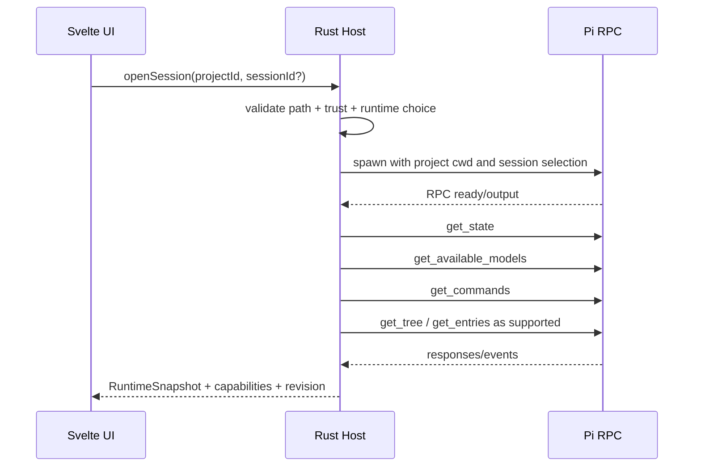

# 04. Интеграция с Pi

## 1. Принцип интеграции

PiUI использует Pi как единственный источник поведения агента. Он не вызывает model providers напрямую и не интерпретирует tools вместо Pi. Основной транспорт — официальный RPC mode:

```text
PiUI Rust host <-> stdin/stdout JSONL <-> pi --mode rpc
```

Каждый запуск привязан к конкретному project `cwd` и, когда это поддержано выбранным способом запуска, к существующей или новой Pi session.

## 2. Что принадлежит Pi, а что PiUI

| Область | Владелец |
|---|---|
| provider authentication и model requests | Pi |
| agent loop, tools, compaction, steering queue | Pi |
| Pi extensions и их backend lifecycle | Pi |
| session entries и ветвление | Pi session format/API |
| project/session navigation GUI | PiUI |
| process lifecycle, recovery, diagnostics | PiUI host |
| визуальный timeline и composer | PiUI |
| project registry и UI drafts | PiUI SQLite |
| generic file-reference UX | PiUI adapter, затем Pi prompt/tools |
| PiUI-specific extension surfaces | PiUI Extension SDK |

Никакой PiUI feature не должен становиться вторым каноническим представлением agent state.

### Global extension configuration

PiUI не парсит и не записывает Pi `settings.json`. Extensions settings вызывает короткий typed host adapter, который в offline mode импортирует upstream `SettingsManager` и `DefaultPackageManager`, пропускает установку отсутствующих packages и использует те же setters, что `pi config`. В UI проецируются только global user resources; filesystem paths и package source strings не пересекают IPC. Toggle применяется к будущим runtime starts. Project-local resources остаются вне этого surface и требуют отдельного trusted-project flow.

## 3. Protocol framing

### 3.1 Требования codec

- одна JSON-команда на строку, завершается LF (`0x0A`);
- один JSON-response/event на LF-framed строку stdout;
- CR перед LF допускается только если это подтверждено fixture; codec не использует универсальное Unicode `lines()` поведение;
- пустые строки игнорируются с diagnostic counter;
- frame больше конфигурируемого лимита, например 32 MiB, останавливает runtime как protocol violation;
- невалидный UTF-8 и JSON не подменяются replacement characters без записи причины;
- stderr не смешивается со stdout;
- при EOF неполный frame фиксируется отдельно;
- parser fuzz-тестируется на chunk boundaries.

### 3.2 Correlation

PiUI оборачивает RPC-вызовы внутренним `commandId`, даже если конкретный Pi request/response уже имеет собственный ID. Это нужно для:

- timeout/cancellation;
- связывания UI action с response;
- диагностики без логирования payload;
- повторного snapshot после WebView reload.

Неизвестный event type сохраняется как `runtime.unknown` и не роняет процесс. Это обеспечивает forward compatibility.

## 4. Startup handshake



Порядок probes должен быть tolerant: отсутствие одной команды не отменяет базовый чат, если `prompt` и state доступны.

## 5. Маппинг базовых возможностей

Точные payloads берутся из текущей Pi RPC schema и фиксируются contract fixtures. Таблица задаёт продуктовый смысл, а не заменяет upstream docs.

| Pi capability/command | PiUI действие | Fallback |
|---|---|---|
| `prompt` | отправить новый user turn | заблокировать composer с diagnostic error |
| `steer` | вмешаться в текущий turn | поставить follow-up, если steer недоступен |
| `follow_up` | добавить следующий turn в очередь | локальный draft, пока текущий turn не завершён |
| `abort` | Stop | terminate runtime только после timeout и предупреждения |
| `get_state` | runtime/session snapshot | read-only JSONL snapshot + reconnect |
| `get_available_models` | model picker | текущая модель + ссылка в settings/diagnostics |
| model switch command | смена модели | недоступное действие с причиной |
| thinking level commands | thinking picker | скрыть picker, не эмулировать prompt text |
| queue mode commands | Steer/Follow-up semantics | фиксированный безопасный режим |
| `new_session` | новый чат | новый process/bootstrap path |
| `switch_session` | открыть существующую session в process | новый process с session selector |
| `fork` / `clone` | создать ветку/копию | скрыть advanced action |
| `get_entries` | page timeline | read-only scanner для history, RPC для live state |
| `get_tree` | показать дерево | read-only tree без navigation action |
| set session name | Rename | UI alias в cache только как временный fallback, явно маркированный |
| export | экспорт transcript | host-side generic export только если output идентичен/явно другой |
| `get_commands` | slash autocomplete | PiUI core commands + найденные extension commands |
| Extension UI Protocol | dialogs/status/widgets | generic native surfaces |

## 6. Message/event normalization

PiUI не рендерит upstream JSON напрямую. Adapter преобразует его в стабильные внутренние события; raw source остаётся только в Pi JSONL/host и не пересекает WebView IPC:

```ts
type SessionDelta =
  | { kind: 'turn.started'; turnId: string }
  | { kind: 'message.started'; block: TimelineBlock }
  | { kind: 'message.text.delta'; blockId: string; text: string }
  | { kind: 'message.thinking.delta'; blockId: string; text: string }
  | { kind: 'tool.started'; blockId: string; tool: ToolInvocation }
  | { kind: 'tool.updated'; blockId: string; safeSummary?: string }
  | { kind: 'tool.completed'; blockId: string; toolName: string; isError: boolean; safeSummary?: string }
  | { kind: 'entry.appended'; blockId: string; entryKind: string; text?: string }
  | { kind: 'turn.completed'; turnId: string; stopReason?: string }
  | { kind: 'runtime.error'; code: string; recoverable: boolean };
```

Правила:

- порядок событий сохраняется внутри одного runtime;
- host присваивает monotonically increasing `revision`;
- UI применяет delta только к ожидаемой revision либо запрашивает snapshot;
- duplicate event после reconnect должен быть idempotent по entry/block ID;
- persisted projection v2 знает Pi v3 `user`, `assistant`, `thinking`, `toolCall`, `toolResult`, `bashExecution`, `custom_message` и `compaction`;
- tool call/result коррелируются host-side, tool-only assistant entry не создаёт пустое Pi message;
- tool result никогда не исполняется как HTML;
- Markdown превращается в allowlisted AST nodes и никогда не использует raw `{@html}`;
- неизвестные entries отображаются compact generic compatibility disclosure без raw payload;
- live blocks и persisted blocks используют один renderer; после turn host rescan заменяет завершённые ephemeral blocks.

## 7. Streaming и очередь

### Composer modes

Пользователь видит явную семантику:

- **Send** в Ready — обычный `prompt`;
- **Steer** во время Running — сообщение направляется текущему turn;
- **Queue next** — follow-up после текущего turn;
- **Stop** — `abort`.

Enter не должен незаметно менять семантику в зависимости от timing. Рекомендуемый default:

- Enter отправляет `prompt` в Ready;
- во время Running Enter ставит follow-up;
- отдельная кнопка/shortcut выполняет Steer;
- tooltip и queue badge показывают выбранный режим.

Настройка queue mode синхронизируется через Pi RPC, если capability доступна.

### Abort escalation

1. отправить `abort`;
2. ждать подтверждение/состояние в пределах timeout;
3. показать «Agent does not respond»;
4. разрешить `Force stop runtime`;
5. завершить process tree;
6. перечитать JSONL до последней полной entry и предложить reopen.

Force stop не должен автоматически повторять prompt.

## 8. Модели и thinking level

Model picker:

- загружается из `get_available_models`, а не из hardcoded registry;
- показывает provider/model ID и доступные признаки, которые реально вернул Pi;
- поддерживает search и recent models;
- текущая модель отмечается даже если исчезла из списка;
- ошибка provider/auth отображается рядом, не блокируя просмотр истории;
- переключение выполняется до отправки следующего prompt и подтверждается state/event.

Thinking picker:

- строится из capabilities/current state;
- не обещает уровни, которых нет у выбранной модели/runtime;
- скрывается, если Pi не сообщает управляемый thinking level;
- значение сохраняется Pi, а не только UI preference.

## 9. Sessions

### 9.1 Обнаружение

Для списка PiUI читает session files через отдельный read-only scanner. Это нужно, чтобы не запускать Pi для каждой строки sidebar. Scanner извлекает:

- session identifier/path;
- project/cwd metadata;
- session name;
- created/updated time;
- первая user text preview;
- последняя complete entry;
- branch/tree summary;
- runtime/model metadata, если присутствует;
- parse health.

PiUI не придумывает новый session ID и не переименовывает файл для сортировки.

### 9.2 Открытие

Предпочтительный путь — документированный Pi startup/session selector или RPC `switch_session`. До реализации обязательно проверить, создаёт ли bare RPC startup пустую session entry/file. Если создаёт, host должен использовать launch option/bridge, исключающий ghost sessions.

### 9.3 Создание

`New chat` в системной группе Chats сразу открывает пустой composer; runtime в host-owned neutral CWD запускается лениво при первом Send. Contextual project chat аналогично запускает Pi в выбранном project cwd только при Send. Открытие и быстрое переключение history sessions не создаёт agent process: UI переиспользует bounded display-safe provider/model cache. На первом запуске пользователь может явно выбрать `Load available models…`; этот action активирует текущую session через тот же typed runtime adapter, а не отдельный catalog subprocess. В обоих случаях Pi остаётся единственным writer: empty session может быть in-memory до первого assistant response. Session появляется в sidebar только после появления устойчивого Pi JSONL/file, а не по optimistic fake ID.

### 9.4 Rename

Переименование идёт через Pi command. До подтверждения UI показывает pending state. Локальный display alias не должен выдавать себя за Pi session name; допускается только как временный internal workaround и удаляется после upstream support.

### 9.5 Tree, fork и clone

- `get_tree` используется для чтения branch graph;
- `fork`/`clone` вызываются через Pi и после ответа scanner обновляет список;
- PiUI не меняет `parentId` в JSONL;
- переход на произвольную старую ветвь включается только при наличии документированной capability;
- до этого tree panel read-only с действиями, которые Pi реально поддерживает.

### 9.6 Trash

При неактивной сессии host перемещает весь session file в системную корзину. При активной:

1. предупреждает о running state;
2. abort/stop runtime;
3. закрывает file handles;
4. перемещает файл в корзину;
5. удаляет только rebuildable index rows.

PiUI не реализует permanent delete в основном UX 1.0.

## 10. Стандартный Pi Extension UI Protocol

Pi RPC передаёт часть `ctx.ui`-взаимодействий. PiUI маппит их так:

| Extension request/effect | PiUI renderer |
|---|---|
| select | searchable native modal/listbox |
| confirm | modal с точным текстом и безопасным default |
| input | single-line dialog |
| editor | multi-line dialog с monospaced option |
| notify | toast + notification center |
| status | runtime/session status strip |
| widget | стандартный RPC: безопасные text lines; PiUI SDK: отдельные validated UI nodes |
| title | session/window title hint, не полный контроль OS title без policy |
| editor text | composer draft update с visible source indicator |

Требования:

- каждый request имеет ID, timeout policy и cancel response;
- modal очередь принадлежит конкретному runtime;
- закрытие окна/сессии отвечает cancellation, а не оставляет Pi ждать навсегда;
- extension name/source видимы пользователю;
- rich/unknown payload имеет fallback;
- request не может открыть произвольный URL/path без host permission.

### Неподдерживаемая TUI-паритетность

RPC не означает полную поддержку всех TUI customizations. PiUI 1.0 не эмулирует через догадки:

- `ctx.ui.custom()`;
- custom header/footer;
- замену TUI editor;
- TUI themes;
- прямое управление terminal cells.

Для них используется PiUI Extension SDK, описанный отдельно.

## 11. Slash commands

Autocomplete объединяет:

1. PiUI-owned commands: `/new`, `/open`, `/settings`, `/extensions`, `/diagnostics`;
2. команды из `get_commands`;
3. declarative PiUI commands из enabled extension manifests.

Namespace и collision rules:

- PiUI core commands зарезервированы;
- backend extension command сохраняет имя Pi;
- UI-only command рекомендуется объявлять как `extensionId.command` и может иметь label;
- collision не разрешается порядком установки: UI показывает qualified choices;
- built-in TUI commands, которых нет в RPC, не должны подделываться как Pi commands.

## 12. Attachments

### 12.1 Изображения

Изображения — единственный attachment type, который PiUI может передавать через image-aware RPC payload без дополнительной tool convention.

Flow:

1. пользователь выбирает/вставляет/drop изображение;
2. host проверяет MIME по содержимому и размер;
3. создаёт безопасный preview URL;
4. при отправке кодирует в формат, который ожидает текущий Pi RPC;
5. сохраняет provenance reference в PiUI metadata, но не дублирует base64 в SQLite;
6. timeline отображает thumbnail и open preview;
7. если модель не поддерживает image input, Send блокируется с точным объяснением или attachment удаляется пользователем.

Нужны лимиты количества, индивидуального и суммарного размера.

### 12.2 Файл внутри проекта

По умолчанию PiUI прикладывает **структурированную ссылку на относительный путь**, а не читает весь файл в prompt:

```text
Attachment: project://src/lib/parser.ts
Resolved path: <project root>/src/lib/parser.ts
```

Фактический prompt encoding должен быть стабильным и документированным, например human-readable fenced attachment references. Pi/tools решают, когда читать файл. UI показывает, что это path reference, а не загрузка содержимого модели.

### 12.3 Внешний файл

Пользователь выбирает один из режимов:

- **Reference original:** абсолютный путь передаётся как controlled file reference; он может перестать существовать.
- **Copy to managed attachments:** host копирует файл в app-managed storage, считает hash и хранит provenance. Он не помещает файл в repository без отдельного действия.

Никакого автоматического копирования в project root.

### 12.4 PDF и office-документы

PiUI показывает имя/type/size и передаёт path reference. Он не обещает встроенное понимание PDF/DOCX. Обработку выполняет Pi tool/extension/skill. Preview может быть отдельным расширением.

### 12.5 Drag-and-drop текста и директорий

- выделенный текст вставляется в composer;
- директория превращается в path reference только после подтверждения;
- рекурсивное прикладывание содержимого директории запрещено по умолчанию;
- symlink resolution выполняется host и проверяется path policy.

## 13. Authentication и provider setup

Pi владеет auth. PiUI не должен разбирать `auth.json` ради собственного provider client.

MVP варианты в порядке предпочтения:

1. официальный headless auth API, если появится;
2. controlled interactive Pi subprocess в dedicated terminal-like modal для `/login`;
3. инструкции по запуску `pi` в системном терминале и автоматическое обнаружение обновлённого auth state;
4. API key environment/config flow только через официально поддержанный Pi механизм.

Dedicated auth subprocess:

- не является общим terminal emulator;
- запускается только для allowlisted auth action;
- отображает stdin/stdout интерактивно;
- не записывает transcript в обычный log;
- после завершения запускает capability/model refresh.

До spike нельзя обещать бесшовный OAuth GUI.

## 14. Settings mapping

PiUI settings делятся на:

- **Pi-owned:** runtime config, models/providers, queue/thinking settings, extension/package behavior;
- **PiUI-owned:** layout, fonts, notifications, project registry, runtime executable choice, performance, UI extensions;
- **Derived:** фактические capabilities и resolved paths.

Pi-owned settings изменяются только через официальный API/CLI или атомарный config adapter, документированный Pi. Frontend не редактирует произвольный JSON текст. При отсутствии headless API показывается read-only state + controlled action.

## 15. История и совместимость CLI ↔ PiUI

Обязательные round-trip tests:

1. создать session в CLI, продолжить в PiUI, снова открыть в CLI;
2. создать в PiUI, branch/fork в CLI, увидеть дерево в PiUI;
3. выполнить backend extension command в обоих интерфейсах;
4. отключить PiUI custom renderer и прочитать custom entry generic card;
5. compaction/history entries не меняют смысл после UI indexing;
6. Unicode, large tool output, image entries и interrupted turn сохраняются.

PiUI никогда не «исправляет» upstream JSONL без отдельной recovery copy и явного пользователя.

## 16. Recovery

После crash или protocol error:

- runtime slot помечается Failed;
- UI прекращает optimistic streaming;
- scanner читает session до последней полной строки;
- незавершённые блоки маркируются Interrupted, а не Complete;
- пользователь может открыть diagnostics, Reopen runtime или оставить history read-only;
- Reopen не повторяет последнюю user message;
- если Pi при reopen добавляет system/session events, они принимаются как authoritative.

## 17. Обязательные upstream/bridge gaps

До public 1.0 необходимо либо получить официальную Pi capability, либо реализовать минимальный bridge extension с versioning для:

| Gap | Почему нужен | Допустимый временный fallback |
|---|---|---|
| явный open existing session без ghost session | чистая история и sidebar | подтверждённый CLI launch selector |
| базовая RPC-команда graceful shutdown | сохранность и отсутствие orphan processes; `ctx.shutdown()` существует внутри Pi extension context, но не как самостоятельная RPC-команда | bridge command на `ctx.shutdown()`; иначе EOF + timeout + process group termination |
| navigate to arbitrary tree node | полный branch UX | read-only tree + fork/clone only |
| headless provider login/status | нормальный settings flow | controlled interactive auth subprocess |
| richer attachment descriptors | типизированные file references | stable textual path convention |
| capability/version endpoint | forward compatibility | probe matrix + executable version |
| full extension UI parity | TUI custom views не передаются | PiUI SDK + generic fallback |

Bridge не должен переопределять agent loop. Его задача — открыть узкие недостающие операции через официальные Pi extension/SDK primitives.

## 18. Acceptance criteria интеграции

- RPC codec проходит fragmented-frame/fuzz fixtures и не делит по Unicode separators.
- Реальная сессия round-trip совместима с CLI.
- Model list и thinking не hardcoded.
- Standard Extension UI requests не зависают при закрытии окна.
- Images передаются и отображаются; generic files честно обозначены как references.
- Tree actions включаются только по capabilities.
- Force stop завершает process tree на Windows/Linux.
- Crash recovery не повторяет prompt и не пишет JSONL.
- Unknown RPC event не ломает UI.
- auth flow не раскрывает secrets в logs/frontend state.
